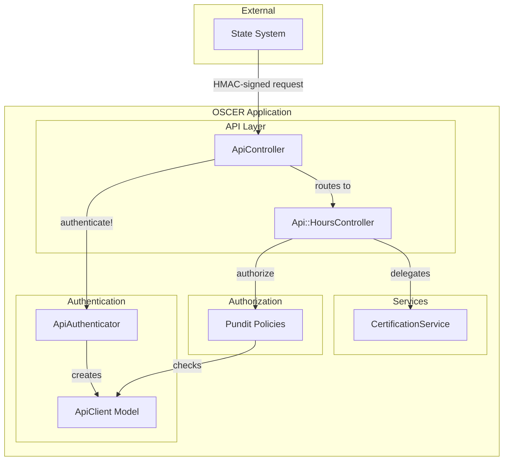
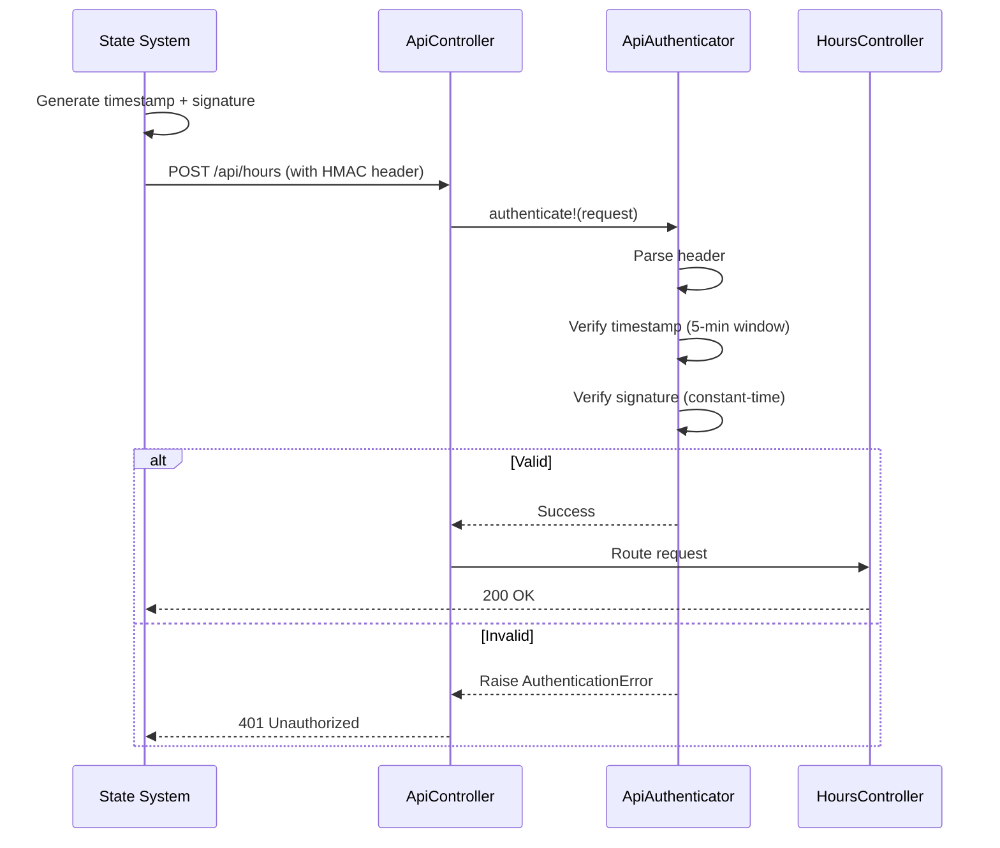

# API Security (HMAC Authentication)

## Problem

The Hours API accepts certification data from external state systems via machine-to-machine communication. Without authentication, any client with network access could submit fraudulent data, corrupting compliance records.

## Approach

1. **HMAC-SHA256 Signature Verification** — Each request includes a timestamp and cryptographic signature generated from a shared secret. The server verifies the signature before processing.
2. **Replay Attack Prevention** — Timestamps are validated within a 5-minute window to prevent captured requests from being reused.
3. **Constant-Time Comparison** — Signature verification uses `ActiveSupport::SecurityUtils.secure_compare` to prevent timing attacks.
4. **Pundit Integration** — Authenticated API clients are represented as `ApiClient` objects, enabling policy-based authorization alongside existing user types.

## C4 Component Diagram



## Key Interfaces

### Request Format

```
POST /api/hours
Authorization: HMAC ts={unix_timestamp},sig={base64_signature}
Content-Type: application/json
```

### Signature Generation

| Component     | Value                                      |
| ------------- | ------------------------------------------ |
| Algorithm     | HMAC-SHA256                                |
| Message       | `{timestamp}{request_body}` (concatenated) |
| Encoding      | Base64 (strict)                            |
| Secret Source | `ENV["API_SECRET_KEY"]`                    |

### ApiAuthenticator Service

| Method                    | Purpose                                                       |
| ------------------------- | ------------------------------------------------------------- |
| `authenticate!(request)`  | Validates header, timestamp, and signature; raises on failure |
| `sign(timestamp:, body:)` | Generates signature (for testing/client examples)             |

**Error Types**:

- `MissingCredentials` — No header or invalid format
- `ExpiredTimestamp` — Outside 5-minute window
- `InvalidSignature` — Signature doesn't match

### ApiClient Model

Lightweight object representing an authenticated API caller for Pundit:

| Method          | Returns |
| --------------- | ------- |
| `state_system?` | `true`  |
| `staff?`        | `false` |
| `member?`       | `false` |

### Controller Flow

1. `before_action` calls `ApiAuthenticator.new.authenticate!(request)`
2. On success: sets `@current_api_client = ApiClient.new`
3. On failure: returns `401 Unauthorized` with error message
4. `pundit_user` returns `@current_api_client` for policy checks

### Error Response Format

```json
{
  "errors": ["Signature verification failed"]
}
```

## Architecture Decision Records

### ADR-001: HMAC-SHA256 over JWT/OAuth

**Context**: Need to authenticate state system API requests without user sessions.  
**Decision**: Use HMAC-SHA256 symmetric key signatures.  
**Rationale**: Simpler than OAuth (no token management), no external dependencies. JWT adds unnecessary complexity for single trusted client. The SDK's `CognitoAdapter` already demonstrates this pattern.  
**Consequences**: Must securely share and rotate the secret key out-of-band.

### ADR-002: Timestamp-Based Replay Prevention

**Context**: Signed requests could be captured and replayed.  
**Decision**: Include Unix timestamp in signature; reject requests outside 5-minute window.  
**Rationale**: Standard approach that balances security with clock drift tolerance. No server-side nonce storage required.  
**Consequences**: Requires synchronized clocks between client and server (NTP).

### ADR-003: ApiClient for Pundit Authorization

**Context**: Existing Pundit policies expect a `user` object with role methods (`staff?`, `member?`).  
**Decision**: Create `ApiClient` class implementing the same interface with `state_system? = true`.  
**Rationale**: Enables reuse of existing policy infrastructure without special-casing API requests.  
**Consequences**: Policies must handle `state_system?` check for API-accessible resources.

### ADR-004: Secret Key via Environment Variable

**Context**: The HMAC secret key must be available to the application but not in source control.  
**Decision**: Load from `ENV["API_SECRET_KEY"]` with `fetch` to fail fast if missing.  
**Rationale**: Standard twelve-factor approach; works with all deployment platforms.  
**Consequences**: Requires secure environment variable management in production (e.g., AWS Secrets Manager, Vault).

## Authentication Flow



## Client Requirements

State systems must:

1. **Generate timestamp** — Current Unix epoch seconds
2. **Build message** — Concatenate: `{timestamp}{json_body}` (no separator)
3. **Sign message** — HMAC-SHA256 with shared secret, Base64-encode result
4. **Set header** — `Authorization: HMAC ts={timestamp},sig={signature}`
5. **Send within 5 minutes** — Requests outside window are rejected

### Example (Ruby)

```ruby
timestamp = Time.now.to_i
body = { member_id: "123", hours: 80 }.to_json

message = "#{timestamp}#{body}"
signature = Base64.strict_encode64(
  OpenSSL::HMAC.digest("SHA256", ENV["API_SECRET_KEY"], message)
)

# Request
POST /api/hours
Authorization: HMAC ts=#{timestamp},sig=#{signature}
Content-Type: application/json

#{body}
```

## Constraints

- Single shared secret per environment (no per-client keys initially)
- 5-minute clock skew tolerance (adjustable via constant)
- Secret key minimum 32 bytes for security
- HTTPS required in production (signatures don't encrypt payload)

## Future Considerations

- **Per-client keys**: Support multiple API clients with individual secrets and audit trails
- **Key rotation**: Implement grace period supporting old and new keys simultaneously
- **Rate limiting**: Add per-client request throttling to prevent abuse
- **Request logging**: Audit log of all API requests with client identification
