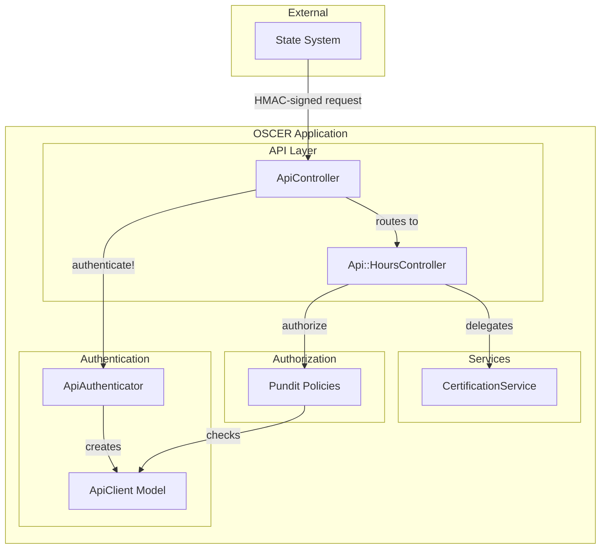
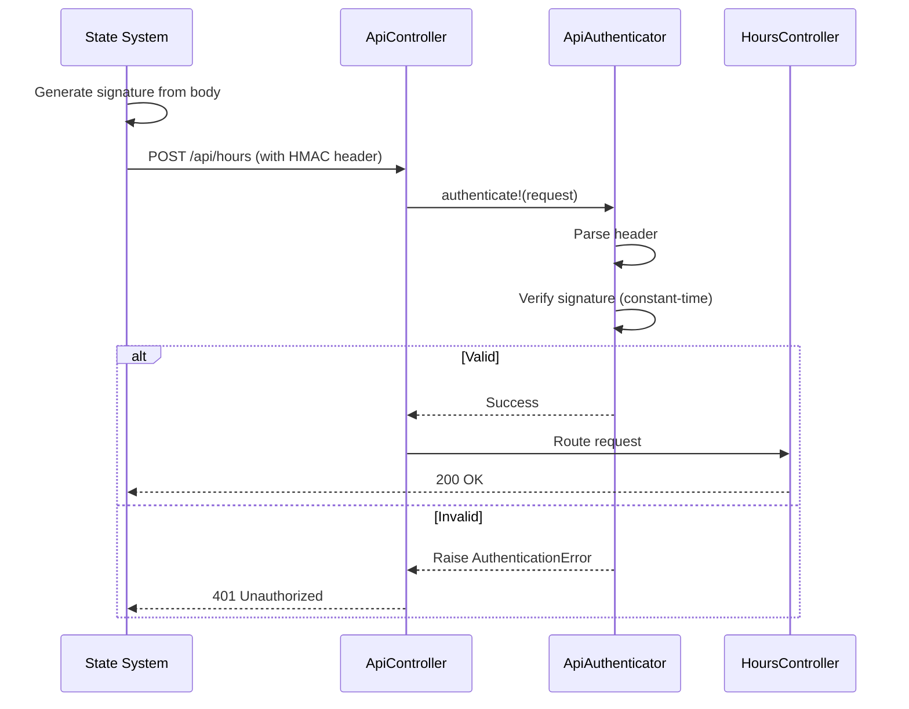

# API Security (HMAC Authentication)

## Problem

The Hours API accepts certification data from external state systems via machine-to-machine communication. Without authentication, any client with network access could submit fraudulent data, corrupting compliance records.

## Approach

1. **HMAC-SHA256 Signature Verification** — Each request includes a cryptographic signature generated from a shared secret. The server verifies the signature before processing.
2. **Constant-Time Comparison** — Signature verification uses `ActiveSupport::SecurityUtils.secure_compare` to prevent timing attacks (zero-cost defense-in-depth).
3. **Pundit Integration** — Authenticated API clients are represented as `ApiClient` objects, enabling policy-based authorization alongside existing user types.

> **Note**: Replay attack prevention (timestamp validation) was considered but deemed unnecessary for this idempotent data sync over TLS. Can be added if state security requirements mandate it.

## C4 Component Diagram



## Key Interfaces

### Request Format

```
POST /api/hours
Authorization: HMAC sig={base64_signature}
Content-Type: application/json
```

### Signature Generation

| Component     | Value                   |
| ------------- | ----------------------- |
| Algorithm     | HMAC-SHA256             |
| Message       | Request body (raw JSON) |
| Encoding      | Base64 (strict)         |
| Secret Source | `ENV["API_SECRET_KEY"]` |

### ApiAuthenticator Service

| Method                   | Purpose                                           |
| ------------------------ | ------------------------------------------------- |
| `authenticate!(request)` | Validates header and signature; raises on failure |
| `sign(body:)`            | Generates signature (for testing/client examples) |

**Error Types**:

- `MissingCredentials` — No header or invalid format
- `InvalidSignature` — Signature doesn't match

### ApiClient Model

Lightweight object representing an authenticated API caller for Pundit:

| Method          | Returns |
| --------------- | ------- |
| `state_system?` | `true`  |
| `staff?`        | `false` |
| `member?`       | `false` |

### Controller Flow

1. `before_action` calls `ApiAuthenticator.new.authenticate!(request)`
2. On success: sets `@current_api_client = ApiClient.new`
3. On failure: returns `401 Unauthorized` with error message
4. `pundit_user` returns `@current_api_client` for policy checks

### Error Response Format

```json
{
  "errors": ["Signature verification failed"]
}
```

## Decisions

### HMAC-SHA256 over JWT/OAuth

Use symmetric key signatures instead of OAuth or JWT. Simpler than OAuth (no token management), no external dependencies. JWT adds unnecessary complexity for a single trusted client. The SDK's `CognitoAdapter` already demonstrates this pattern. Tradeoff: must securely share and rotate the secret key out-of-band.

### No replay prevention for idempotent sync

Replay attack prevention (timestamps) omitted because: (1) TLS protects data in transit, (2) this API performs idempotent data sync—replaying the same certification data has no harmful effect, (3) adds complexity without security benefit for this use case. Can be added later if state security requirements mandate it.

### ApiClient for Pundit authorization

Create `ApiClient` class implementing the same interface as `User` with `state_system? = true`. Enables reuse of existing policy infrastructure without special-casing API requests. Tradeoff: policies must handle `state_system?` check for API-accessible resources.

### Secret key via environment variable

Load from `ENV["API_SECRET_KEY"]` with `fetch` to fail fast if missing. Standard twelve-factor approach; works with all deployment platforms. Tradeoff: requires secure environment variable management in production (e.g., AWS Secrets Manager, Vault).

## Authentication Flow



## Client Requirements

State systems must:

1. **Build request body** — JSON payload with certification data
2. **Sign body** — HMAC-SHA256 with shared secret, Base64-encode result
3. **Set header** — `Authorization: HMAC sig={signature}`
4. **Use TLS** — HTTPS required in all environments

### Example (Ruby)

```ruby
body = { member_id: "123", hours: 80 }.to_json

signature = Base64.strict_encode64(
  OpenSSL::HMAC.digest("SHA256", ENV["API_SECRET_KEY"], body)
)

# Request
POST /api/hours
Authorization: HMAC sig=#{signature}
Content-Type: application/json

#{body}
```

## Constraints

- Single shared secret per environment (no per-client keys initially)
- Secret key minimum 32 bytes for security
- HTTPS required (TLS provides transport security; signatures authenticate the client)

## Future Considerations

- **Replay prevention**: Add timestamp validation if state security requirements mandate it
- **Per-client keys**: Support multiple API clients with individual secrets and audit trails
- **Key rotation**: Implement grace period supporting old and new keys simultaneously
- **Rate limiting**: Add per-client request throttling to prevent abuse
- **Request logging**: Audit log of all API requests with client identification
