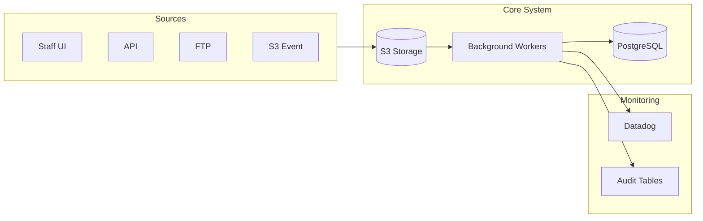

# Enterprise Batch Upload Architecture

## Overview

This directory contains the C4 architecture documentation for the enterprise-grade batch upload system. The architecture supports processing millions of records from multiple sources (UI, API, FTP, S3) with unified business logic and comprehensive monitoring.

## Documentation Structure

| Document                             | C4 Level | Description                                          |
| ------------------------------------ | -------- | ---------------------------------------------------- |
| [c4-context.md](./c4-context.md)     | Level 1  | System context - external actors and systems         |
| [c4-container.md](./c4-container.md) | Level 2  | Containers - deployable units and their interactions |
| [c4-component.md](./c4-component.md) | Level 3  | Components - internal structure of containers        |
| [c4-decisions.md](./c4-decisions.md) | ADRs     | Key architectural decisions and rationale            |

## Quick Reference

### Architecture at a Glance

### Key Design Principles

1. **S3-First Storage**: All uploads go to S3 first, then are processed asynchronously
2. **Streaming Processing**: Files are streamed line-by-line, never fully loaded into memory
3. **Chunk Parallelism**: Large files are split into chunks processed in parallel
4. **Unified Logic**: All sources use the same `UnifiedRecordProcessor`
5. **Aggregated Auditing**: Audit logs are aggregated; only errors are stored individually

### Scale Targets

| Metric             | Target                 |
| ------------------ | ---------------------- |
| Records per file   | Millions               |
| Concurrent uploads | 10+                    |
| Processing rate    | 10,000+ records/minute |
| Memory per worker  | <500MB                 |

## Reading Order

For new readers, we recommend:

1. **Start with Context** ([c4-context.md](./c4-context.md)) - Understand who uses the system and what external systems are involved
2. **Then Containers** ([c4-container.md](./c4-container.md)) - See the major deployable units
3. **Then Components** ([c4-component.md](./c4-component.md)) - Dive into internal structure
4. **Finally Decisions** ([c4-decisions.md](./c4-decisions.md)) - Understand why we made these choices

## Diagrams

All diagrams in this documentation use [Mermaid](https://mermaid.js.org/) syntax and render automatically in GitHub/GitLab. For local viewing, use:

- VS Code with Mermaid extension
- Any Markdown preview with Mermaid support

## Changelog

| Date       | Author            | Change                   |
| ---------- | ----------------- | ------------------------ |
| 2025-01-07 | Architecture Team | Initial C4 documentation |
