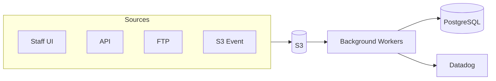
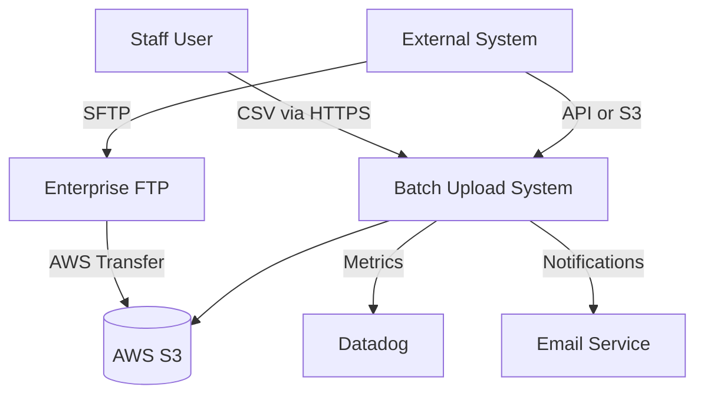
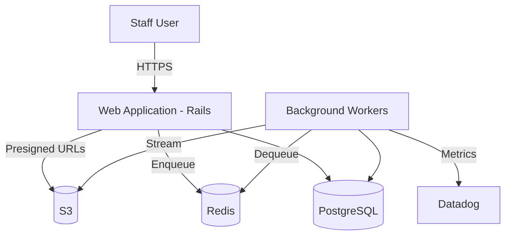
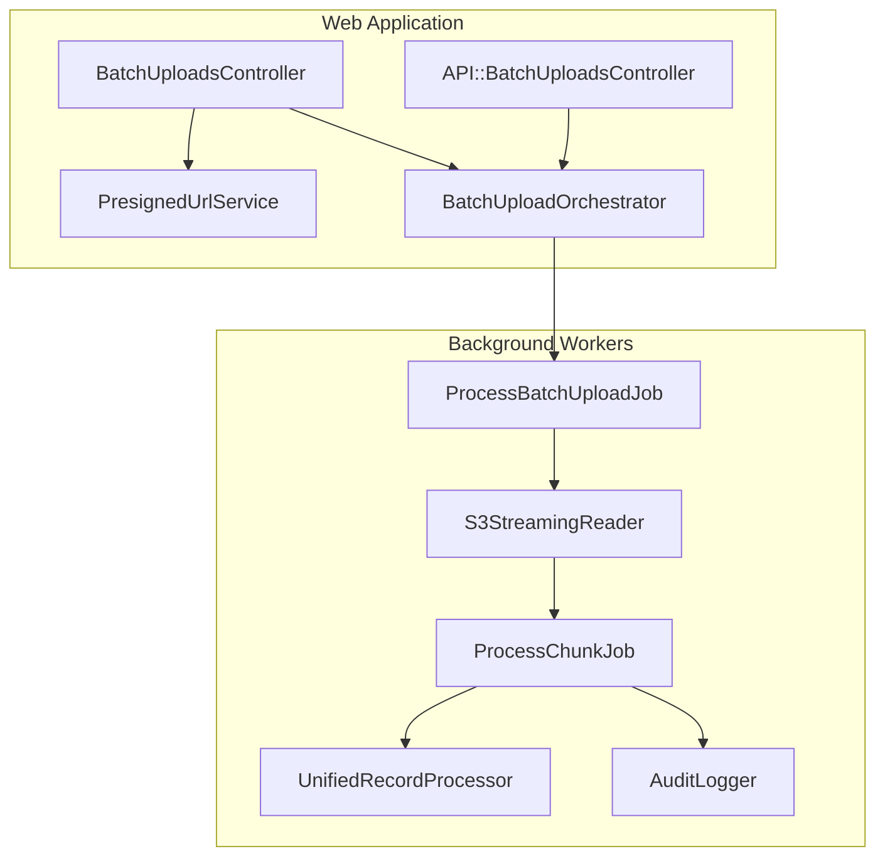
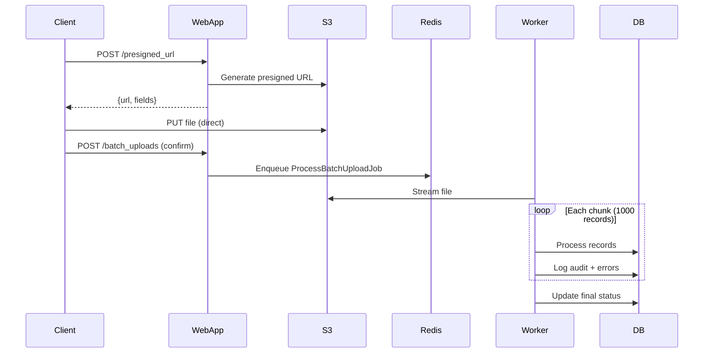

# Batch Upload System

## Problem

OSCER needs to process large batch files containing potentially hundreds of thousands of member records. Files arrive via multiple sources (UI, API, FTP, S3) and must be processed reliably with full auditability while avoiding memory exhaustion and timeout issues.

## Approach

1. **S3-first storage**: All uploads go to S3 first (UI uses presigned URLs for direct upload)
2. **Streaming processing**: Files are streamed line-by-line, never fully loaded into memory
3. **Chunk parallelism**: Large files split into 1,000-record chunks processed in parallel
4. **Unified logic**: Single `UnifiedRecordProcessor` for all sources (UI, API, FTP, S3)
5. **Aggregated auditing**: Audit at chunk level; only store individual failed records



**Scale Targets**: Millions of records per file | 10+ concurrent uploads | 10,000+ records/minute | <500MB memory per worker

---

## C4 Context Diagram

> Level 1: External actors and systems



| Actor/System    | Interaction                                                  |
| --------------- | ------------------------------------------------------------ |
| Staff User      | Uploads via web UI, monitors status, downloads error reports |
| External System | API calls, direct S3 upload, or FTP deposit                  |
| AWS S3          | Primary storage; presigned URLs for direct upload            |
| Datadog         | Metrics, traces, alerting                                    |
| Enterprise FTP  | Legacy integration via AWS Transfer Family                   |

---

## C4 Container Diagram

> Level 2: Deployable units



| Container          | Technology      | Responsibilities                                       |
| ------------------ | --------------- | ------------------------------------------------------ |
| Web Application    | Rails 7         | HTTP handling, presigned URL generation, API endpoints |
| Background Workers | Sidekiq/GoodJob | Streaming, chunk processing, audit logging             |
| PostgreSQL         | PostgreSQL 14+  | Persistent storage, job queue (GoodJob)                |
| Redis              | Redis 7         | Job queue (Sidekiq), rate limiting, caching            |

### Database Schema

```sql
-- Main upload tracking
batch_uploads (
    id,
    status,              -- pending, processing, completed, failed
    source_type,         -- ui, api, ftp, s3_event
    filename,
    s3_key,
    total_records,
    processed_records,
    succeeded_records,
    failed_records,
    started_at,
    completed_at
)

-- Aggregated audit (one row per chunk, NOT per record)
batch_upload_audit_logs (
    id,
    batch_upload_id,
    event_type,          -- chunk_started, chunk_completed
    chunk_number,
    succeeded_count,
    failed_count,
    duration_ms
)

-- Failed records only (for debugging/retry)
batch_upload_errors (
    id,
    batch_upload_id,
    row_number,
    error_code,          -- VAL_001, DUP_001, BIZ_001, etc.
    error_message,
    row_data             -- JSON of original row for retry
)
```

---

## C4 Component Diagram

> Level 3: Internal components



### Key Components

| Component                 | Responsibility                                            |
| ------------------------- | --------------------------------------------------------- |
| `PresignedUrlService`     | Generates S3 presigned URLs for direct browser upload     |
| `BatchUploadOrchestrator` | Entry point for all sources; creates record, enqueues job |
| `S3StreamingReader`       | Streams S3 objects without loading entire file            |
| `UnifiedRecordProcessor`  | Single business logic processor for ALL sources           |
| `AuditLogger`             | Writes chunk-level audit logs; stores only failed records |

### Key Interfaces

```ruby
class BatchUploadOrchestrator
  def initiate(source_type:, s3_key:, metadata: {})
    # 1. Create BatchUpload record
    # 2. Enqueue ProcessBatchUploadJob
    # 3. Return batch upload for status tracking
  end
end

class S3StreamingReader
  def each_chunk(s3_key, chunk_size: 1000, &block)
    # Stream S3 object, parse CSV incrementally, yield chunks
  end
end

class UnifiedRecordProcessor
  def process(record, context)
    # 1. Validate schema → 2. Check duplicates → 3. Apply business rules
    # 4. Transform → 5. Persist → 6. Trigger business process
  end
end
```

### Upload Flow



---

## Architecture Decision Records

### ADR-001: S3 Presigned URLs for Direct Upload

**Context**: Large CSV files (100s of MB) cause memory pressure and timeouts when uploaded through Rails.

**Decision**: Use S3 presigned URLs for browsers to upload directly to S3.

**Rationale**: Rails resources freed; no timeout issues; supports up to 5GB files.

**Consequences**: Requires CORS config on S3; additional client-side complexity.

---

### ADR-002: Streaming File Processing

**Context**: Files may contain millions of records; loading entire files into memory is not feasible.

**Decision**: Stream S3 objects line-by-line without loading entire file.

**Rationale**: Constant ~50MB memory vs ~2GB for 1M rows; faster time to first record; graceful failure.

**Consequences**: Cannot "look ahead" in file; more complex error recovery.

---

### ADR-003: Chunk-Based Parallel Processing

**Context**: Sequential processing of millions of records takes too long.

**Decision**: Split stream into 1,000-record chunks processed in parallel via separate jobs.

**Rationale**: Near-linear scaling with worker count; individual chunk failures don't block others.

**Consequences**: Chunk completion order not guaranteed; requires aggregation logic.

---

### ADR-004: Aggregated Audit Logging

**Context**: Per-record audit logging would create 1M+ rows per upload, causing database bloat.

**Decision**: Store audit logs at chunk level; only store individual records that fail.

**Rationale**: 1,000 audit rows vs 1,000,000 for 1M records; dashboard queries remain fast.

**Consequences**: Cannot audit individual successful records; compliance logging goes to APM.

---

### ADR-005: Unified Business Logic Across Sources

**Context**: Data arrives via UI, API, FTP, or S3 events; each must apply identical business rules.

**Decision**: Single `UnifiedRecordProcessor` service used by all sources.

**Rationale**: Bug fixes apply everywhere; consistent validation; one code path to test.

**Consequences**: Must design for lowest common denominator across sources.

---

### ADR-006: Dashboard Metrics Aggregation

**Context**: Dashboard must remain responsive with uploads containing millions of records.

**Decision**: Dashboard shows aggregated metrics only; no record-level browsing.

**Rationale**: Queries remain fast at any scale; simpler UI.

**Consequences**: Users must export errors for detailed review.

---

### ADR-007: Categorized Error Retry Strategy

**Context**: Different error types require different handling.

**Decision**: Categorize errors and apply appropriate retry/skip behavior.

| Category             | Action       | Retry  |
| -------------------- | ------------ | ------ |
| Validation (`VAL_*`) | Log and skip | No     |
| Duplicate (`DUP_*`)  | Log and skip | No     |
| Database (`DB_*`)    | Retry chunk  | 3x     |
| S3 (`S3_*`)          | Retry job    | 5x     |
| Unknown (`UNK_*`)    | Fail batch   | Manual |

**Consequences**: Transient errors self-heal; permanent errors don't block processing.

---

### ADR-008: APM Integration

**Context**: Need visibility into processing performance and errors.

**Decision**: Send custom metrics to Datadog; also store in internal tables for compliance.

**Rationale**: Real-time visibility; historical trending; automated alerting.

**Consequences**: Additional infrastructure cost; must maintain Datadog dashboards.

---

## Error Handling

| Error Type        | Handling                               | Retry  |
| ----------------- | -------------------------------------- | ------ |
| Schema Validation | Log to `batch_upload_errors`, continue | No     |
| Business Rule     | Log to `batch_upload_errors`, continue | No     |
| Duplicate Record  | Log as duplicate, skip                 | No     |
| Database Error    | Retry chunk with backoff               | 3x     |
| S3 Error          | Retry job with backoff                 | 5x     |
| Unknown           | Fail batch, log stack trace            | Manual |

## Constraints

- All external access via HTTPS
- S3 access via IAM roles (no static credentials)
- FTP via SFTP with key-based authentication
- Staff access requires authentication and authorization

## Future Considerations

- **Azure Blob Storage**: Equivalent presigned URL mechanism for Azure deployments
- **Dead Letter Queue**: For failed records requiring manual intervention
- **Real-time Progress**: WebSocket updates for upload progress
- **Retry UI**: Allow staff to retry failed records from dashboard
