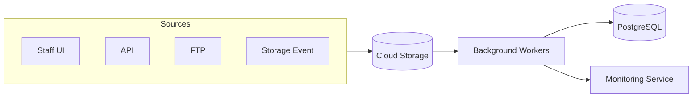
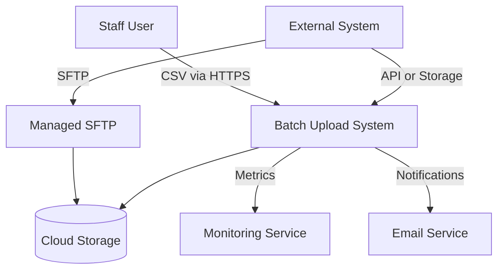
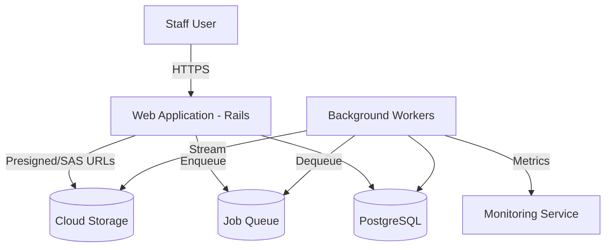
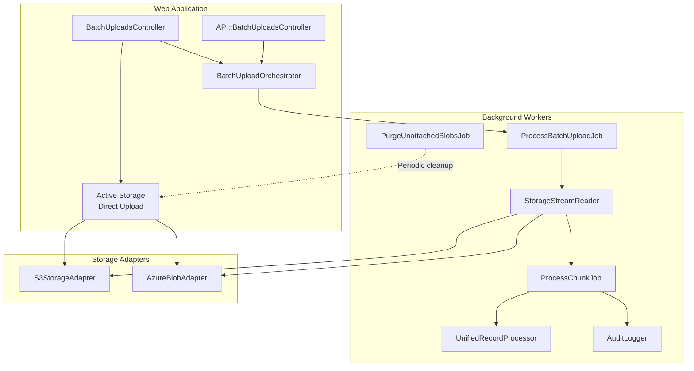
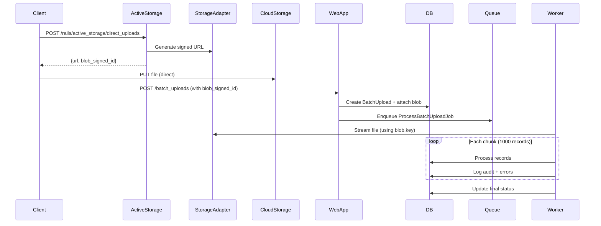

# Batch Upload System

## Problem

OSCER needs to process large batch files containing potentially hundreds of thousands of member records. Files arrive via multiple sources (UI, API, FTP, cloud storage events) and must be processed reliably with full auditability while avoiding memory exhaustion and timeout issues.

## Approach

1. **Cloud storage-first**: All uploads go to cloud storage first (UI uses presigned/SAS URLs for direct upload)
2. **Streaming processing**: Files are streamed line-by-line, never fully loaded into memory
3. **Chunk parallelism**: Large files split into 1,000-record chunks processed in parallel
4. **Unified logic**: Single `UnifiedRecordProcessor` for all sources (UI, API, FTP, storage events)
5. **Aggregated auditing**: Audit at chunk level; only store individual failed records
6. **Cloud-agnostic design**: Adapter pattern for storage providers (AWS S3, Azure Blob Storage)



**Scale Targets**: Millions of records per file | 10+ concurrent uploads | 10,000+ records/minute | <500MB memory per worker

---

## C4 Context Diagram

> Level 1: External actors and systems



| Actor/System       | Interaction                                                          |
| ------------------ | -------------------------------------------------------------------- |
| Staff User         | Uploads via web UI, monitors status, downloads error reports         |
| External System    | API calls, direct storage upload, or FTP deposit                     |
| Cloud Storage      | Primary storage; presigned/SAS URLs for direct upload                |
| Monitoring Service | Metrics, traces, alerting (e.g., Datadog, Azure Monitor, CloudWatch) |
| Managed SFTP       | Legacy integration (AWS Transfer Family or Azure SFTP)               |

---

## C4 Container Diagram

> Level 2: Deployable units



| Container          | Technology       | Responsibilities                                        |
| ------------------ | ---------------- | ------------------------------------------------------- |
| Web Application    | Rails 7          | HTTP handling, signed URL generation, API endpoints     |
| Background Workers | Sidekiq/GoodJob  | Streaming, chunk processing, audit logging              |
| PostgreSQL         | PostgreSQL 14+   | Persistent storage, job queue (GoodJob)                 |
| Job Queue          | Redis/PostgreSQL | Job queue (Sidekiq uses Redis, GoodJob uses PostgreSQL) |

### Cloud Provider Mapping

| Function       | AWS               | Azure                   |
| -------------- | ----------------- | ----------------------- |
| Object Storage | S3                | Blob Storage            |
| Signed URLs    | Presigned URLs    | SAS Tokens              |
| Storage Events | S3 Event → Lambda | Blob Trigger → Function |
| Managed SFTP   | Transfer Family   | Azure SFTP              |
| Monitoring     | CloudWatch        | Azure Monitor           |

### Database Schema

```sql
-- Main upload tracking
batch_uploads (
    id,
    status,              -- pending, processing, completed, failed
    source_type,         -- ui, api, ftp, storage_event
    filename,
    storage_key,         -- cloud-agnostic key/path
    total_records,
    processed_records,
    succeeded_records,
    failed_records,
    started_at,
    completed_at
)

-- Aggregated audit (one row per chunk, NOT per record)
batch_upload_audit_logs (
    id,
    batch_upload_id,
    event_type,          -- chunk_started, chunk_completed
    chunk_number,
    succeeded_count,
    failed_count,
    duration_ms
)

-- Failed records only (for debugging/retry)
batch_upload_errors (
    id,
    batch_upload_id,
    row_number,
    error_code,          -- VAL_001, DUP_001, BIZ_001, etc.
    error_message,
    row_data             -- JSON of original row for retry
)
```

---

## C4 Component Diagram

> Level 3: Internal components



### Key Components

| Component                   | Responsibility                                                                  |
| --------------------------- | ------------------------------------------------------------------------------- |
| `Active Storage`            | Rails built-in: Generates presigned URLs, creates blob records for attachments |
| `BatchUploadOrchestrator`   | Entry point for all sources; creates record, enqueues job                      |
| `StorageStreamReader`       | Streams objects from cloud storage without loading entire file                 |
| `UnifiedRecordProcessor`    | Single business logic processor for ALL sources                                |
| `AuditLogger`               | Writes chunk-level audit logs; stores only failed records                      |
| `PurgeUnattachedBlobsJob`   | Periodic cleanup of orphaned blobs from abandoned uploads                      |

### Storage Adapter Interface

Application code uses a provider-agnostic interface. Adapters implement the specifics for each cloud provider.

```ruby
# Abstract interface - application code uses this
class StorageAdapter
  def generate_signed_upload_url(key:, content_type:, expires_in:)
    raise NotImplementedError
  end

  def stream_object(key:, &block)
    raise NotImplementedError
  end

  def object_exists?(key:)
    raise NotImplementedError
  end

  def delete_object(key:)
    raise NotImplementedError
  end
end

# AWS implementation
class S3StorageAdapter < StorageAdapter
  def generate_signed_upload_url(key:, content_type:, expires_in:)
    # Uses AWS SDK presigned_url
  end

  def stream_object(key:, &block)
    # Uses AWS SDK get_object with streaming
  end
end

# Azure implementation
class AzureBlobAdapter < StorageAdapter
  def generate_signed_upload_url(key:, content_type:, expires_in:)
    # Uses Azure SDK generate_sas_token
  end

  def stream_object(key:, &block)
    # Uses Azure SDK download_blob with streaming
  end
end
```

### Service Layer (Cloud-Agnostic)

```ruby
# Active Storage handles presigned URLs automatically
# No custom SignedUrlService needed - Rails provides this via:
# POST /rails/active_storage/direct_uploads

class StorageStreamReader
  def initialize(storage_adapter: Rails.configuration.storage_adapter)
    @storage = storage_adapter
  end

  def each_chunk(storage_key, chunk_size: 1000, &block)
    buffer = []
    @storage.stream_object(key: storage_key) do |line|
      buffer << parse_csv_line(line)
      if buffer.size >= chunk_size
        yield buffer
        buffer = []
      end
    end
    yield buffer if buffer.any?
  end
end

class BatchUploadOrchestrator
  def initiate(source_type:, storage_key:, metadata: {})
    # 1. Create BatchUpload record
    # 2. Enqueue ProcessBatchUploadJob
    # 3. Return batch upload for status tracking
    # Note: For UI uploads with Active Storage, storage_key is batch_upload.file.blob.key
  end
end

class UnifiedRecordProcessor
  def process(record, context)
    # 1. Validate schema → 2. Check duplicates → 3. Apply business rules
    # 4. Transform → 5. Persist → 6. Trigger business process
  end
end

class PurgeUnattachedBlobsJob < ApplicationJob
  def perform
    # Clean up blobs uploaded but never attached (abandoned uploads)
    ActiveStorage::Blob.unattached
      .where('created_at < ?', 24.hours.ago)
      .find_each(&:purge)
  end
end
```

### Configuration

```ruby
# config/application.rb or environment-specific config
Rails.configuration.storage_adapter = case ENV["CLOUD_PROVIDER"]
  when "aws"
    S3StorageAdapter.new(bucket: ENV["STORAGE_BUCKET"])
  when "azure"
    AzureBlobAdapter.new(container: ENV["STORAGE_CONTAINER"])
  else
    raise "Unknown CLOUD_PROVIDER: #{ENV['CLOUD_PROVIDER']}"
  end
```

### Upload Flow (Active Storage)



**Note**: Active Storage handles presigned URL generation automatically via built-in `/rails/active_storage/direct_uploads` endpoint. No custom `SignedUrlService` needed.

---

## Decisions

### Direct upload implementation approach

**Decision**: Use Active Storage Direct Upload for browser uploads (standard Rails pattern).

**Context**: Two approaches were evaluated for direct browser-to-S3 uploads:
1. **Custom implementation**: Custom Stimulus controller, presigned URL endpoint, manual storage key management
2. **Active Storage Direct Upload**: Rails built-in direct upload functionality

**Rationale**: Active Storage provides the same functionality (direct browser→S3 upload, bypassing Rails memory) with 85% less code to maintain. For multi-state deployments where different IT teams maintain OSCER, Rails conventions reduce knowledge transfer and maintenance burden. See [Direct Upload Approach Comparison](./direct-upload-approach-comparison.md) for detailed analysis.

**Implementation notes**:
- Active Storage handles presigned URL generation via `/rails/active_storage/direct_uploads`
- Creates `ActiveStorage::Blob` records (2 additional database rows per upload - negligible overhead)
- Requires periodic cleanup job for orphaned blobs (files uploaded but never attached)
- `SignedUrlService` and custom presigned URL endpoints not needed
- Blob keys used for streaming: `batch_upload.file.blob.key` instead of custom `storage_key`

### Signed URLs for direct upload

Use signed URLs (AWS presigned URLs / Azure SAS tokens) for browsers to upload directly to cloud storage, bypassing Rails entirely. Large CSV files (100s of MB) cause memory pressure and timeouts when streamed through Rails. This frees Rails resources, avoids timeout issues, and supports up to 5GB files. Tradeoff: requires CORS config on storage.

### Cloud-agnostic adapter pattern

Abstract storage operations behind a `StorageAdapter` interface with implementations for each cloud provider. OSCER must support both AWS and Azure deployments. Application code remains unchanged regardless of cloud provider; only configuration differs. Tradeoff: must maintain multiple adapter implementations; lowest common denominator features only.

### Streaming file processing

Stream objects line-by-line without loading entire file into memory. Files may contain millions of records; loading entire files is not feasible. This uses constant ~50MB memory vs ~2GB for 1M rows, with faster time to first record. Tradeoff: cannot "look ahead" in file; more complex error recovery.

### Chunk-based parallel processing

Split stream into 1,000-record chunks processed in parallel via separate jobs. Sequential processing of millions of records takes too long. This provides near-linear scaling with worker count; individual chunk failures don't block others. Tradeoff: chunk completion order not guaranteed; requires aggregation logic.

### Aggregated audit logging

Store audit logs at chunk level; only store individual records that fail. Per-record audit logging would create 1M+ rows per upload, causing database bloat. This results in 1,000 audit rows vs 1,000,000 for 1M records; dashboard queries remain fast. Tradeoff: cannot audit individual successful records; compliance logging goes to monitoring service.

### Unified business logic across sources

Single `UnifiedRecordProcessor` service used by all sources (UI, API, FTP, storage events). Data arrives via multiple paths but must apply identical business rules. Bug fixes apply everywhere; consistent validation; one code path to test. Tradeoff: must design for lowest common denominator across sources.

### Dashboard metrics aggregation

Dashboard shows aggregated metrics only; no record-level browsing. Dashboard must remain responsive with uploads containing millions of records. Queries remain fast at any scale with simpler UI. Tradeoff: users must export errors for detailed review.

### Categorized error retry strategy

Categorize errors and apply appropriate retry/skip behavior. Different error types require different handling:

| Category             | Action       | Retry  |
| -------------------- | ------------ | ------ |
| Validation (`VAL_*`) | Log and skip | No     |
| Duplicate (`DUP_*`)  | Log and skip | No     |
| Database (`DB_*`)    | Retry chunk  | 3x     |
| Storage (`STG_*`)    | Retry job    | 5x     |
| Unknown (`UNK_*`)    | Fail batch   | Manual |

Tradeoff: transient errors self-heal; permanent errors don't block processing.

### Monitoring service integration

Send custom metrics to external monitoring service; also store in internal tables for compliance. This provides real-time visibility, historical trending, and automated alerting. Tradeoff: additional infrastructure cost; must maintain monitoring dashboards.

---

## Error Handling

| Error Type        | Handling                               | Retry  |
| ----------------- | -------------------------------------- | ------ |
| Schema Validation | Log to `batch_upload_errors`, continue | No     |
| Business Rule     | Log to `batch_upload_errors`, continue | No     |
| Duplicate Record  | Log as duplicate, skip                 | No     |
| Database Error    | Retry chunk with backoff               | 3x     |
| Storage Error     | Retry job with backoff                 | 5x     |
| Unknown           | Fail batch, log stack trace            | Manual |

## Constraints

- All external access via HTTPS
- Storage access via cloud-native IAM (AWS IAM roles, Azure Managed Identity)
- FTP via SFTP with key-based authentication
- Staff access requires authentication and authorization

## Future Considerations

- **Dead Letter Queue**: For failed records requiring manual intervention
- **Real-time Progress**: WebSocket updates for upload progress
- **Retry UI**: Allow staff to retry failed records from dashboard
- **Additional Cloud Providers**: GCP Cloud Storage adapter if needed
