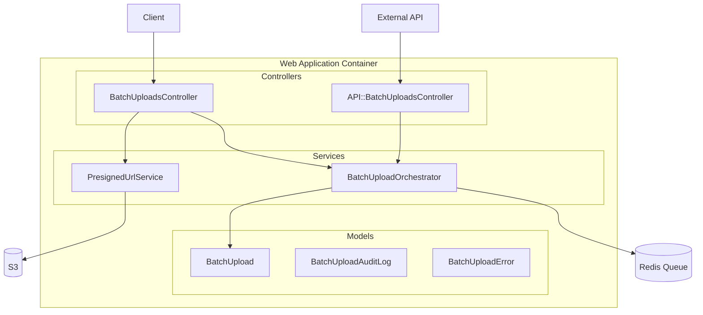
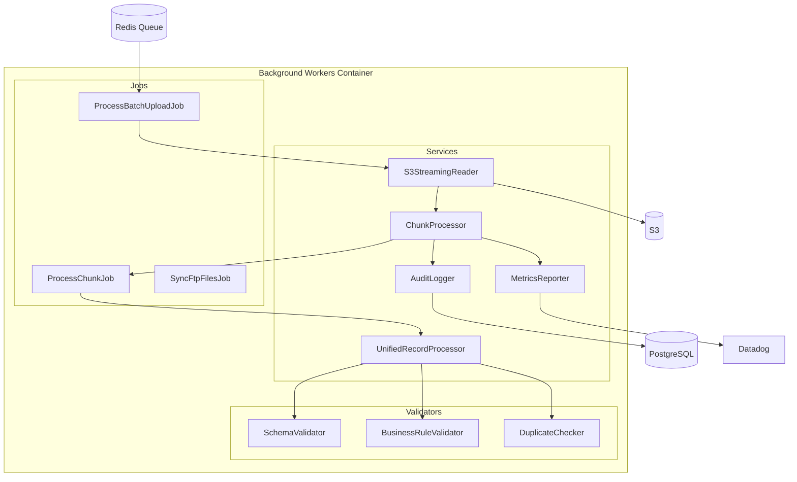
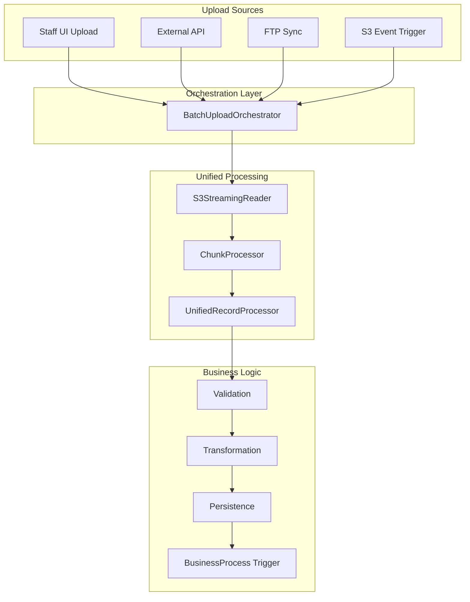
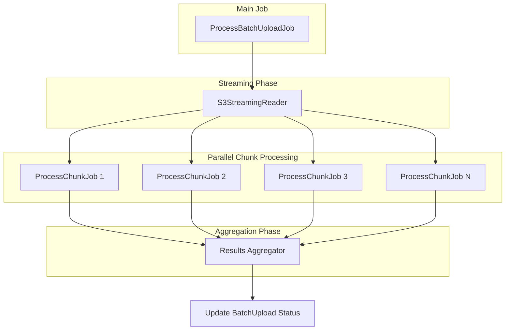

# C4 Level 3: Component Diagram

## Batch Upload System - Component Architecture

This document describes the internal components within the Web Application and Background Workers containers.

## Web Application Components



## Background Worker Components



## Component Descriptions

### Controllers

| Component                       | Responsibility                                                                 |
| ------------------------------- | ------------------------------------------------------------------------------ |
| **BatchUploadsController**      | Handles staff UI requests for file uploads, status checks, and dashboard views |
| **API::BatchUploadsController** | RESTful API for external systems to submit batch uploads programmatically      |

### Services (Web Application)

| Component                   | Responsibility                                                                                 |
| --------------------------- | ---------------------------------------------------------------------------------------------- |
| **PresignedUrlService**     | Generates S3 presigned URLs for direct browser uploads, bypassing the Rails server             |
| **BatchUploadOrchestrator** | Central entry point for all upload sources; creates BatchUpload record and enqueues processing |

### Jobs

| Component                 | Responsibility                                                       |
| ------------------------- | -------------------------------------------------------------------- |
| **ProcessBatchUploadJob** | Main job that orchestrates file streaming and chunk distribution     |
| **ProcessChunkJob**       | Processes a single chunk of records; can run in parallel             |
| **SyncFtpFilesJob**       | Scheduled job that checks for new FTP files and initiates processing |

### Services (Background Workers)

| Component                  | Responsibility                                                          |
| -------------------------- | ----------------------------------------------------------------------- |
| **S3StreamingReader**      | Streams S3 objects without loading entire file into memory              |
| **ChunkProcessor**         | Splits stream into configurable chunks, coordinates parallel processing |
| **UnifiedRecordProcessor** | Single business logic processor used by ALL sources (UI, API, FTP, S3)  |
| **AuditLogger**            | Writes aggregated audit entries to `batch_upload_audit_logs` table      |
| **MetricsReporter**        | Sends custom metrics to Datadog APM                                     |

### Validators

| Component                 | Responsibility                                          |
| ------------------------- | ------------------------------------------------------- |
| **SchemaValidator**       | Validates CSV structure, required columns, data types   |
| **BusinessRuleValidator** | Applies business rules (date ranges, value constraints) |
| **DuplicateChecker**      | Checks for duplicate records (idempotency)              |

## Unified Record Processing Flow

All upload sources converge to the same processing logic:



## Key Component Interfaces

### BatchUploadOrchestrator

```ruby
class BatchUploadOrchestrator
  # Unified entry point for all upload sources
  # @param source_type [Symbol] :ui, :api, :ftp, :s3_event
  # @param s3_key [String] S3 object key
  # @param metadata [Hash] Source-specific metadata
  # @return [BatchUpload] Created batch upload record
  def initiate(source_type:, s3_key:, metadata: {})
    # 1. Create BatchUpload record
    # 2. Enqueue ProcessBatchUploadJob
    # 3. Return batch upload for status tracking
  end
end
```

### S3StreamingReader

```ruby
class S3StreamingReader
  # Streams S3 object in chunks without loading entire file
  # @param s3_key [String] S3 object key
  # @param chunk_size [Integer] Number of records per chunk (default: 1000)
  # @yield [Array<Hash>] Chunk of parsed records
  def each_chunk(s3_key, chunk_size: 1000)
    # Uses S3 GetObject with streaming response
    # Parses CSV incrementally
    # Yields chunks as they're ready
  end
end
```

### UnifiedRecordProcessor

```ruby
class UnifiedRecordProcessor
  # Processes a single record regardless of source
  # @param record [Hash] Parsed record data
  # @param context [ProcessingContext] Batch context
  # @return [ProcessingResult] Success or failure with details
  def process(record, context)
    # 1. Validate schema
    # 2. Check for duplicates
    # 3. Apply business rules
    # 4. Transform data
    # 5. Persist record
    # 6. Trigger business process if needed
  end
end
```

### AuditLogger

```ruby
class AuditLogger
  # Logs aggregated chunk processing results
  # Does NOT log individual records (for scale)
  def log_chunk_processed(batch_upload_id:, chunk_number:,
                          succeeded:, failed:, duration_ms:)
    BatchUploadAuditLog.create!(
      batch_upload_id: batch_upload_id,
      event_type: 'chunk_processed',
      chunk_number: chunk_number,
      succeeded_count: succeeded,
      failed_count: failed,
      duration_ms: duration_ms
    )
  end

  # Only logs individual records that FAILED
  def log_error(batch_upload_id:, row_number:, error_code:,
                error_message:, row_data:)
    BatchUploadError.create!(
      batch_upload_id: batch_upload_id,
      row_number: row_number,
      error_code: error_code,
      error_message: error_message,
      row_data: row_data
    )
  end
end
```

## Parallel Processing Strategy



## Error Handling Strategy

| Error Type                  | Handling                                          | Retry    |
| --------------------------- | ------------------------------------------------- | -------- |
| **Schema Validation**       | Log to `batch_upload_errors`, continue processing | No       |
| **Business Rule Violation** | Log to `batch_upload_errors`, continue processing | No       |
| **Duplicate Record**        | Log as duplicate, skip record                     | No       |
| **Database Error**          | Retry chunk with exponential backoff              | Yes (3x) |
| **S3 Error**                | Retry job with exponential backoff                | Yes (5x) |
| **Unknown Error**           | Fail batch, log full stack trace                  | Manual   |

## Related Documents

- [C4 Context Diagram](./c4-context.md) - System context
- [C4 Container Diagram](./c4-container.md) - Container architecture
- [Architecture Decisions](./c4-decisions.md) - Key technical decisions
