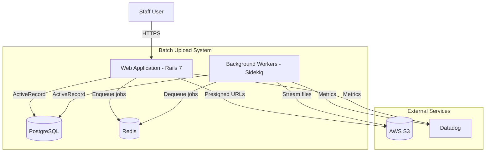
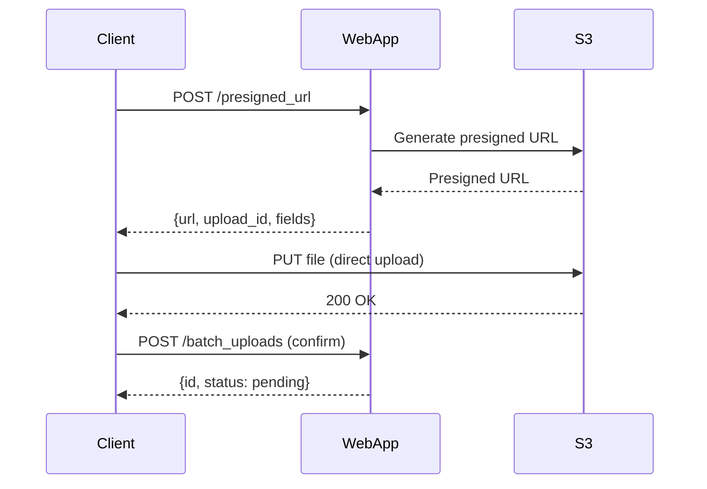
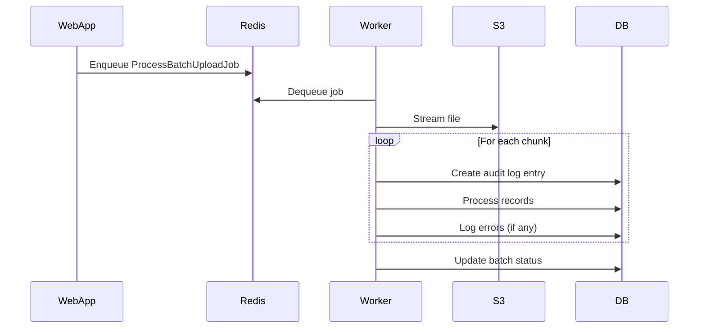
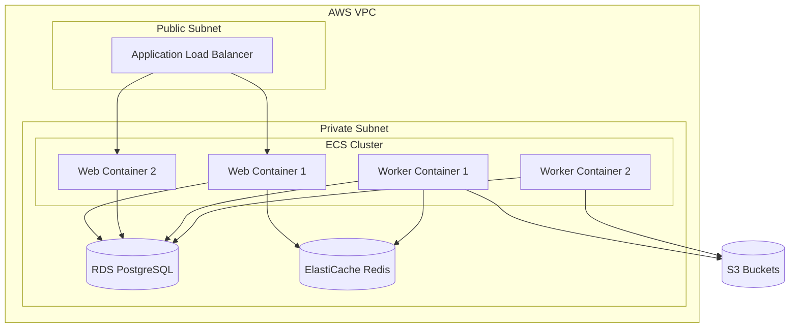

# C4 Level 2: Container Diagram

## Batch Upload System - Container Architecture

This document describes the containers (deployable units) that make up the Batch Upload System and their interactions.

## Container Diagram



## Containers

### Web Application (Rails)

| Attribute | Value |
|-----------|-------|
| **Technology** | Ruby on Rails 7 |
| **Responsibilities** | HTTP request handling, UI rendering, API endpoints, presigned URL generation |
| **Scaling** | Horizontal (multiple Puma workers) |

**Key Endpoints:**
- `POST /staff/batch_uploads/presigned_url` - Generate S3 presigned URL for direct upload
- `POST /staff/batch_uploads` - Register upload and enqueue processing
- `GET /staff/batch_uploads/:id` - View upload status and metrics
- `POST /api/v1/batch_uploads` - External API for automated uploads

### Background Workers

| Attribute | Value |
|-----------|-------|
| **Technology** | Sidekiq or GoodJob |
| **Responsibilities** | Streaming file processing, chunk processing, audit logging, error handling |
| **Scaling** | Horizontal (multiple worker processes/pods) |

**Key Jobs:**
- `ProcessBatchUploadJob` - Orchestrates the overall processing
- `ProcessChunkJob` - Processes a chunk of records
- `SyncFtpFilesJob` - Syncs files from FTP to S3 (scheduled)

### PostgreSQL Database

| Attribute | Value |
|-----------|-------|
| **Technology** | PostgreSQL 14+ |
| **Responsibilities** | Persistent storage for all application data |
| **Scaling** | Vertical + Read replicas |

**Key Tables for Batch Upload:**

```sql
-- Main batch upload tracking
batch_uploads (
    id, status, source_type, filename, s3_key,
    total_records, processed_records, succeeded_records, failed_records,
    started_at, completed_at, created_at
)

-- Aggregated audit events (not per-record)
batch_upload_audit_logs (
    id, batch_upload_id, event_type, chunk_number,
    records_in_chunk, succeeded_count, failed_count,
    duration_ms, metadata, created_at
)

-- Failed records only (for debugging/retry)
batch_upload_errors (
    id, batch_upload_id, row_number, error_code,
    error_message, row_data, created_at
)
```

### Redis (Cache/Queue)

| Attribute | Value |
|-----------|-------|
| **Technology** | Redis 7 |
| **Responsibilities** | Job queue, rate limiting, caching |
| **Scaling** | Redis Cluster or ElastiCache |

**Usage:**
- Job queue for Sidekiq/GoodJob
- Rate limiting for API endpoints
- Caching of dashboard metrics

### AWS S3 (External)

| Attribute | Value |
|-----------|-------|
| **Technology** | AWS S3 |
| **Responsibilities** | File storage for uploads |
| **Buckets** | `raw-uploads/`, `processed/`, `errors/` prefixes |

**Lifecycle Policies:**
- Raw uploads: Move to Glacier after 90 days
- Error exports: Delete after 30 days
- Processed files: Archive after processing

### Datadog (External)

| Attribute | Value |
|-----------|-------|
| **Technology** | Datadog APM |
| **Responsibilities** | Metrics, traces, alerting |

**Custom Metrics:**
- `batch_upload.records.processed` (counter)
- `batch_upload.records.failed` (counter)
- `batch_upload.processing.duration` (histogram)
- `batch_upload.chunk.size` (gauge)

## Communication Patterns

### Synchronous (Request/Response)



### Asynchronous (Job Queue)



## Deployment Topology



## Related Documents

- [C4 Context Diagram](./c4-context.md) - System context
- [C4 Component Diagram](./c4-component.md) - Detailed component breakdown
- [Architecture Decisions](./c4-decisions.md) - Key technical decisions

