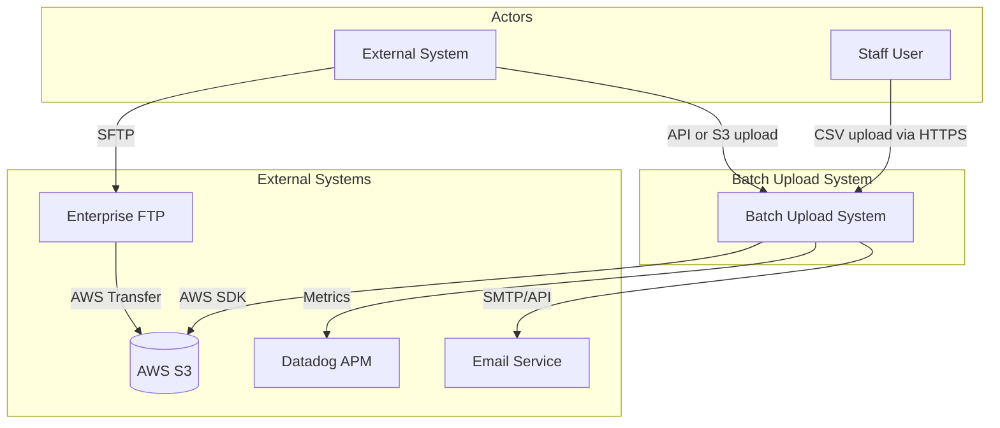
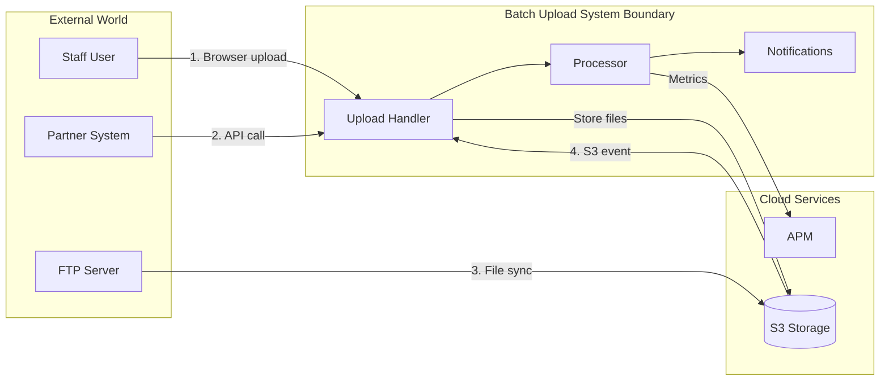

# C4 Level 1: System Context Diagram

## Batch Upload System - Enterprise Architecture

This document describes the system context for the enterprise batch upload capability, showing how the Batch Upload System interacts with external actors and systems.

## Context Diagram

## Actors

| Actor | Description | Interaction |
|-------|-------------|-------------|
| **Staff User** | Eligibility workers, system administrators, and data migration teams who upload bulk data | Uploads files via web UI, monitors processing status, downloads error reports |
| **External System** | State agencies, partner systems, or automated processes that send data | Calls API endpoints, uploads directly to S3, or deposits files via FTP |

## External Systems

| System | Purpose | Integration Method |
|--------|---------|-------------------|
| **AWS S3** | Primary storage for uploaded files (raw and processed) | AWS SDK, presigned URLs for direct upload |
| **APM Provider** | Monitoring, alerting, and performance tracking | Agent instrumentation, custom metrics API |
| **Enterprise FTP** | Legacy integration point for partners without API capability | AWS Transfer Family syncs to S3 |
| **Email Service** | Member notifications triggered by business process outcomes | Via NotificationsEventListener |

## Data Flow Summary

## Key Characteristics

### Scale Requirements
- **Volume**: Millions of records per file
- **Frequency**: Multiple uploads per day during enrollment periods
- **Concurrency**: Multiple simultaneous uploads from different sources

### Quality Attributes
- **Reliability**: Must process all records or provide clear error reporting
- **Observability**: Full visibility into processing status and performance
- **Auditability**: Complete audit trail for compliance requirements
- **Resilience**: Graceful handling of failures with retry capability

### Security Boundaries
- All external access via HTTPS
- S3 access via IAM roles (no static credentials)
- FTP via SFTP with key-based authentication
- Staff access requires authentication and authorization

## Related Documents

- [C4 Container Diagram](./c4-container.md) - Internal containers and their interactions
- [C4 Component Diagram](./c4-component.md) - Detailed component breakdown
- [Architecture Decisions](./c4-decisions.md) - Key technical decisions

