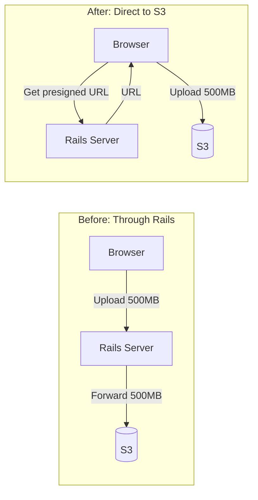
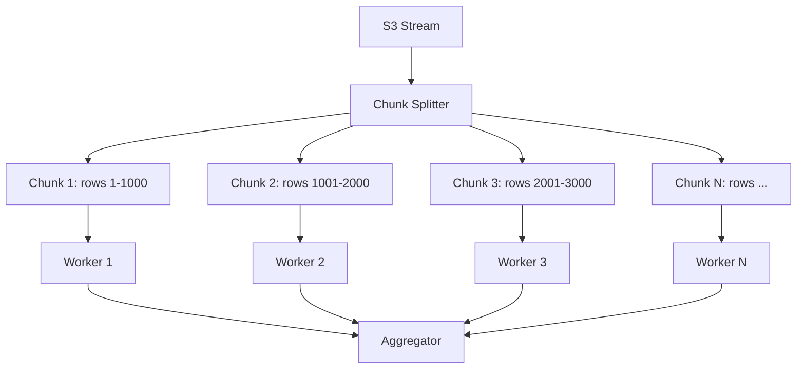
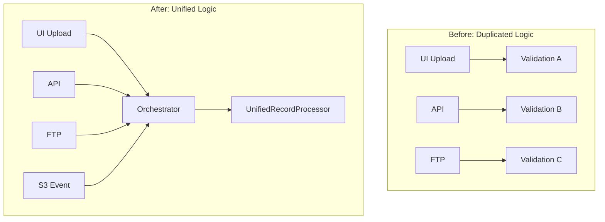

# Architecture Decisions

## Batch Upload System - Key Technical Decisions

This document records the significant architectural decisions made for the enterprise batch upload system.

---

## ADR-001: S3 Presigned URLs for Direct Upload

### Context
Staff users need to upload CSV files that can be hundreds of megabytes or larger. The current implementation uploads files through the Rails server, which creates memory pressure and request timeouts.

### Decision
**Use S3 presigned URLs to allow browsers to upload directly to S3, bypassing the Rails server.**

### Rationale



| Approach | Memory Usage | Request Time | Max File Size |
|----------|--------------|--------------|---------------|
| Through Rails | High (buffers file) | Long (double transfer) | Limited by timeout |
| Direct to S3 | Minimal | Fast (single transfer) | 5GB (S3 limit) |

### Consequences
- Positive: Rails server resources freed for processing
- Positive: No timeout issues for large files
- Positive: Leverages S3's global infrastructure
- Negative: Additional client-side complexity
- Negative: Requires CORS configuration on S3 bucket

---

## ADR-002: Streaming File Processing

### Context
Files may contain millions of records. Loading entire files into memory is not feasible.

### Decision
**Use streaming to read S3 objects line-by-line without loading the entire file into memory.**

### Rationale

```ruby
# Before: Load entire file (will crash on large files)
csv_data = CSV.read(file.path, headers: true)  # Loads ALL rows into memory
csv_data.each { |row| process(row) }

# After: Stream from S3 (constant memory usage)
s3_client.get_object(bucket: bucket, key: key) do |chunk|
  buffer += chunk
  while (line = buffer.slice!(/.*\n/))
    yield CSV.parse_line(line, headers: @headers)
  end
end
```

| Metric | Load All | Streaming |
|--------|----------|-----------|
| Memory for 1M rows | ~2GB | ~50MB |
| Time to first record | 30+ seconds | <1 second |
| Failure mode | OOM crash | Graceful |

### Consequences
- Positive: Constant memory usage regardless of file size
- Positive: Can process arbitrarily large files
- Positive: Faster time to first processed record
- Negative: Cannot easily "look ahead" in file
- Negative: More complex error recovery

---

## ADR-003: Chunk-Based Parallel Processing

### Context
Processing millions of records sequentially would take too long. We need parallelism while maintaining order for error reporting.

### Decision
**Split the file stream into chunks of 1,000 records and process chunks in parallel using separate background jobs.**

### Rationale



| Chunk Size | Pros | Cons |
|------------|------|------|
| 100 | Maximum parallelism | Job queue overhead |
| 1,000 | Good balance | Recommended |
| 10,000 | Fewer jobs | Worker memory pressure |

### Consequences
- Positive: Near-linear scaling with worker count
- Positive: Individual chunk failures don't block others
- Positive: Progress can be tracked at chunk level
- Negative: Chunk completion order not guaranteed
- Negative: Need aggregation logic for final status

---

## ADR-004: Aggregated Audit Logging (Not Per-Record)

### Context
With millions of records, storing audit information for each record would create database bloat and performance issues.

### Decision
**Store aggregated audit logs at the chunk level, and only store individual records that fail.**

### Rationale

| Approach | Rows (1M record upload) | Storage |
|----------|-------------------------|---------|
| Per-record audit | 1,000,000 rows | ~500MB |
| Per-chunk audit (1K chunks) | 1,000 rows | ~500KB |
| Errors only (1% failure) | 10,000 rows | ~5MB |

### Schema Design

```sql
-- Aggregated: One row per chunk (1000 rows for 1M records)
batch_upload_audit_logs (
    batch_upload_id, event_type, chunk_number,
    records_in_chunk, succeeded_count, failed_count,
    duration_ms, created_at
)

-- Errors only: Only failed records stored
batch_upload_errors (
    batch_upload_id, row_number, error_code,
    error_message, row_data, created_at
)
```

### Consequences
- Positive: Database size remains manageable
- Positive: Dashboard queries remain fast
- Positive: Failed records can still be debugged/retried
- Negative: Cannot audit individual successful records
- Negative: Compliance may require additional logging (to APM)

---

## ADR-005: Unified Business Logic Across Sources

### Context
Data can arrive via UI upload, API, FTP, or direct S3 upload. Each source should apply identical business rules.

### Decision
**Create a single `UnifiedRecordProcessor` service that all sources use, ensuring consistent validation and business logic.**

### Rationale



### Consequences
- Positive: Bug fixes apply to all sources
- Positive: Easier testing (one code path)
- Positive: Consistent error messages
- Negative: Must design for lowest common denominator
- Negative: Source-specific customization is harder

---

## ADR-006: Dashboard Metrics Aggregation

### Context
The dashboard must remain responsive even with uploads containing millions of records.

### Decision
**Dashboard shows aggregated metrics only; no record-level browsing in the UI.**

### What the Dashboard Shows

| Metric | Source | Update Frequency |
|--------|--------|------------------|
| Upload status | `batch_uploads.status` | Real-time |
| Progress % | `processed_chunks / total_chunks` | Per chunk |
| Success count | `SUM(succeeded_count)` from audit logs | Per chunk |
| Error count | `COUNT(*)` from errors table | Per chunk |
| Processing rate | Calculated from audit timestamps | Per chunk |
| Error breakdown | `GROUP BY error_code` | On demand |

### What the Dashboard Does NOT Show

- Individual record details (too many)
- Full success list (unnecessary)
- Per-record timing (not stored)

### Consequences
- Positive: Dashboard remains fast with any upload size
- Positive: Simpler UI implementation
- Negative: Users must export errors for detailed review
- Negative: Cannot search within successful records

---

## ADR-007: Error Retry Strategy

### Context
Different error types require different handling strategies.

### Decision
**Categorize errors and apply appropriate retry/skip behavior:**

| Error Category | Code | Action | Retry |
|----------------|------|--------|-------|
| Validation | `VAL_*` | Log and skip | No |
| Duplicate | `DUP_001` | Log and skip | No |
| Business Rule | `BIZ_*` | Log and skip | No |
| Database | `DB_*` | Retry chunk | 3x |
| S3 | `S3_*` | Retry job | 5x |
| Unknown | `UNK_*` | Fail batch | Manual |

### Retry Backoff

```ruby
# Exponential backoff for transient errors
retry_intervals = [1.minute, 5.minutes, 15.minutes, 1.hour, 4.hours]
```

### Consequences
- Positive: Transient errors self-heal
- Positive: Permanent errors don't block processing
- Negative: May process partial files on failure
- Negative: Need manual intervention for unknown errors

---

## ADR-008: APM Integration Strategy

### Context
We need visibility into batch processing performance and errors for operations and debugging.

### Decision
**Send custom metrics to Datadog and also store in internal tables for compliance.**

### Metrics Sent to APM

```ruby
# Custom metrics
StatsD.increment('batch_upload.records.processed', tags: ['status:success'])
StatsD.increment('batch_upload.records.failed', tags: ['error_code:VAL_001'])
StatsD.histogram('batch_upload.chunk.duration_ms', duration)
StatsD.gauge('batch_upload.queue.depth', pending_jobs)

# Traces
Datadog::Tracing.trace('batch_upload.process_chunk') do |span|
  span.set_tag('chunk_number', chunk_number)
  span.set_tag('record_count', records.size)
  # ... processing
end
```

### Alerting Rules

| Metric | Threshold | Action |
|--------|-----------|--------|
| Error rate > 10% | Warning | Slack notification |
| Error rate > 50% | Critical | PagerDuty |
| Queue depth > 1000 | Warning | Scale workers |
| Processing time > 1hr | Warning | Investigate |

### Consequences
- Positive: Real-time visibility into processing
- Positive: Historical trending and analysis
- Positive: Automated alerting
- Negative: Additional infrastructure cost
- Negative: Must maintain Datadog dashboards

---

## Summary of Key Decisions

| Decision | Choice | Primary Benefit |
|----------|--------|-----------------|
| Upload method | S3 presigned URLs | Offload from Rails |
| File reading | Streaming | Constant memory |
| Parallelism | Chunk-based jobs | Horizontal scaling |
| Audit logging | Aggregated + errors only | Database efficiency |
| Business logic | Unified processor | Consistency |
| Dashboard | Aggregated metrics | Performance |
| Errors | Categorized retry | Resilience |
| Monitoring | APM + internal tables | Compliance + visibility |

## Related Documents

- [C4 Context Diagram](./c4-context.md) - System context
- [C4 Container Diagram](./c4-container.md) - Container architecture
- [C4 Component Diagram](./c4-component.md) - Component details

