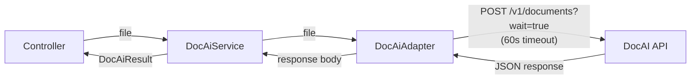
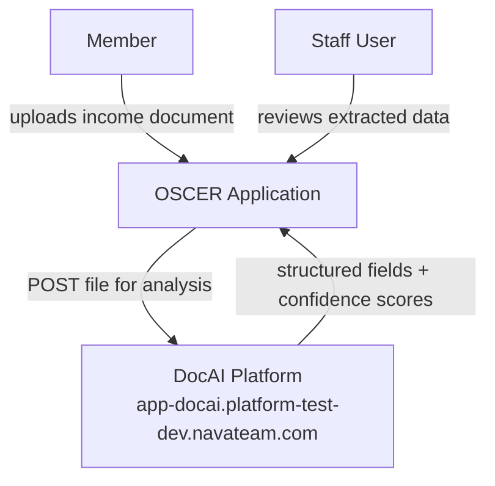
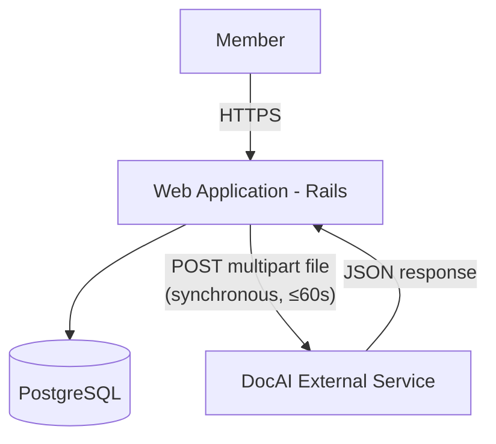
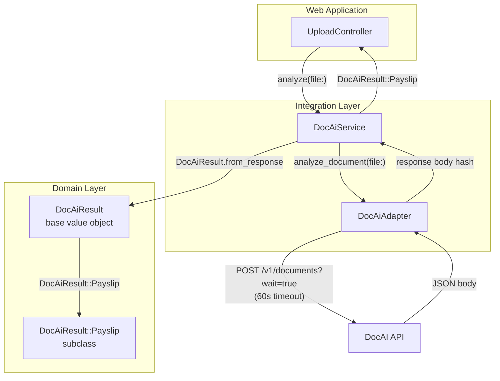

# DocAI Integration

## Problem

OSCER members are required to submit income verification documents (e.g., pay stubs) as part of their certification and exemption workflows. Staff currently review these documents manually, which is time-consuming, error-prone, and creates processing delays.

Integrating with the NavaPBC DocAI service enables:

1. **Realtime document validation** — When a member uploads a pay stub, OSCER confirms in realtime — within the upload request — that the document is a recognized Payslip before accepting it, providing immediate feedback and preventing invalid submissions from entering the review queue
2. **Automated data extraction** — Structured fields (gross pay, pay period dates, YTD totals, employer details) are extracted from uploaded documents without staff intervention
3. **Faster determinations** — Pre-populated form data reduces member burden and accelerates staff review
4. **Consistent parsing** — Machine-extracted fields apply uniform rules regardless of document formatting variation

## Approach

A thin adapter + service + value object pattern integrates DocAI into existing OSCER workflows without coupling business logic to the external API:

- **`DocAiAdapter`** — Handles the HTTP boundary: POSTs a file to DocAI via multipart upload and returns the raw response body
- **`DocAiService`** — Orchestrates the call: invokes the adapter, maps the response to a typed value object, and raises `ProcessingError` for failed jobs
- **`DocAiResult` / `DocAiResult::Payslip`** — Immutable value objects representing the API response; the base class holds the response envelope and a factory method; subclasses expose typed, snake_case accessors per document class



**Processing model**: The `wait=true` parameter causes DocAI to block until processing completes, returning a single synchronous response within the upload request. No polling or webhook handling is required. If DocAI does not respond within 60 seconds, Faraday raises a `TimeoutError` and the service returns an error to the controller.

---

## C4 Context Diagram

> Level 1: External actors and systems



| Actor/System   | Interaction                                                                    |
|----------------|--------------------------------------------------------------------------------|
| Member         | Uploads income document (pay stub) through OSCER UI                           |
| Staff User     | Reviews pre-populated fields extracted from member documents                   |
| OSCER          | Sends uploaded file to DocAI; receives structured field data                   |
| DocAI Platform | Analyzes document; returns matched document class and extracted field values   |

---

## C4 Container Diagram

> Level 2: Deployable units



| Container           | Technology     | Responsibilities                                                       |
|---------------------|----------------|------------------------------------------------------------------------|
| Web Application     | Rails 7.2      | HTTP handling, file receipt, synchronous DocAI validation per request  |
| PostgreSQL          | PostgreSQL 14+ | Persistent storage                                                     |
| DocAI External Service | NavaPBC DocAI | Document classification and field extraction                          |

---

## C4 Component Diagram

> Level 3: Internal components



### Key Components

| Component           | Responsibility                                                                      |
|---------------------|-------------------------------------------------------------------------------------|
| `DocAiAdapter`      | POSTs file via Faraday multipart; maps HTTP errors to typed exceptions              |
| `DocAiService`      | Invokes adapter; builds result value object; raises `ProcessingError` on failure    |
| `DocAiResult`       | Base value object: response envelope, generic field accessors, subclass factory     |
| `DocAiResult::Payslip` | Payslip-specific typed accessors; delegates to `field_value` on base class      |

---

## API Interface

### Endpoint

| Property       | Value                                                              |
|----------------|--------------------------------------------------------------------|
| URL            | `https://app-docai.platform-test-dev.navateam.com/v1/documents`   |
| Method         | `POST`                                                             |
| Query param    | `wait=true`                                                        |
| Content-Type   | `multipart/form-data`                                              |
| Authentication | None (unauthenticated — see Future Considerations)                 |

### Request

```
POST /v1/documents?wait=true
Content-Type: multipart/form-data

file=<binary file contents>
```

### Success Response (HTTP 200 — Payslip)

```json
{
  "job_id": "d773fa8f-3cc7-47d8-be78-4125c190c290",
  "status": "completed",
  "createdAt": "2026-02-23T18:26:50.830294+00:00",
  "completedAt": "2026-02-23T18:27:29.434195+00:00",
  "totalProcessingTimeSeconds": 38.6,
  "matchedDocumentClass": "Payslip",
  "message": "Document processed successfully",
  "fields": {
    "payperiodstartdate":      { "confidence": 0.91, "value": "2017-07-10" },
    "payperiodenddate":        { "confidence": 0.92, "value": "2017-07-23" },
    "paydate":                 { "confidence": 0.23, "value": "2017-08-04" },
    "currentgrosspay":         { "confidence": 0.93, "value": 1627.74 },
    "currentnetpay":           { "confidence": 0.87, "value": 1040.23 },
    "currenttotaldeductions":  { "confidence": 0.92, "value": 226.83 },
    "ytdgrosspay":             { "confidence": 0.88, "value": 28707.21 },
    "ytdnetpay":               { "confidence": 0.87, "value": 18396.25 },
    "ytdfederaltax":           { "confidence": 0.27, "value": 3319.78 },
    "ytdstatetax":             { "confidence": 0.02, "value": 1126 },
    "ytdtotaldeductions":      { "confidence": 0.93, "value": 3782.22 },
    "regularhourlyrate":       { "confidence": 0.93, "value": 20.346846 },
    "currency":                { "confidence": 0.90, "value": "USD" },
    "federalfilingstatus":     { "confidence": 0.89, "value": "Single" },
    "statefilingstatus":       { "confidence": 0.86, "value": "Single" },
    "payrollnumber":           { "confidence": 0.88, "value": "000000002214873" },
    "employeenumber":          { "confidence": 0.93, "value": "000000000" },
    "employeename.firstname":  { "confidence": 0.88, "value": "Jane" },
    "employeename.lastname":   { "confidence": 0.88, "value": "Doe" },
    "employeeaddress.line1":   { "confidence": 0.92, "value": "123 Franklin St" },
    "employeeaddress.city":    { "confidence": 0.86, "value": "CHAPEL HILL" },
    "employeeaddress.state":   { "confidence": 0.91, "value": "NC" },
    "employeeaddress.zipcode": { "confidence": 0.91, "value": "27517" },
    "companyaddress.line1":    { "confidence": 0.82, "value": "103 South Building" },
    "companyaddress.city":     { "confidence": 0.91, "value": "Chapel Hill" },
    "companyaddress.state":    { "confidence": 0.93, "value": "NC" },
    "companyaddress.zipcode":  { "confidence": 0.93, "value": "27599-9100" },
    "isgrosspayvali":          { "confidence": 0.87, "value": true }
  }
}
```

### Failed Job Response (HTTP 200)

A job may complete with HTTP 200 but indicate a processing failure via `status: "failed"`:

```json
{
  "job_id": "a4187dd2-8ccd-4e6f-b7a7-164092e49eca",
  "status": "failed",
  "createdAt": "2026-02-23T23:37:40.608528+00:00",
  "error": "Handler handler failed: '>' not supported between instances of 'int' and 'ConfigDefaults'",
  "additionalInfo": "'>' not supported between instances of 'int' and 'ConfigDefaults'"
}
```

### HTTP-Level Error Response

```json
{ "detail": "There was an error parsing the body" }
```

### Field Reference (Payslip)

> **Note**: Response field names are **lowercased and concatenated** even though the official schema uses PascalCase (e.g., `payperiodstartdate` maps to `PayPeriodStartDate`). Dot-notation compound fields like `EmployeeName.FirstName` become `employeename.firstname` in the response.

| API Field Key                 | Ruby Accessor                    | Type    |
|-------------------------------|----------------------------------|---------|
| `payperiodstartdate`          | `pay_period_start_date`          | String  |
| `payperiodenddate`            | `pay_period_end_date`            | String  |
| `paydate`                     | `pay_date`                       | String  |
| `currentgrosspay`             | `current_gross_pay`              | Numeric |
| `currentnetpay`               | `current_net_pay`                | Numeric |
| `currenttotaldeductions`      | `current_total_deductions`       | Numeric |
| `ytdgrosspay`                 | `ytd_gross_pay`                  | Numeric |
| `ytdnetpay`                   | `ytd_net_pay`                    | Numeric |
| `ytdfederaltax`               | `ytd_federal_tax`                | Numeric |
| `ytdstatetax`                 | `ytd_state_tax`                  | Numeric |
| `ytdtotaldeductions`          | `ytd_total_deductions`           | Numeric |
| `regularhourlyrate`           | `regular_hourly_rate`            | Numeric |
| `holidayhourlyrate`           | `holiday_hourly_rate`            | Numeric |
| `currency`                    | `currency`                       | String  |
| `federalfilingstatus`         | `federal_filing_status`          | String  |
| `statefilingstatus`           | `state_filing_status`            | String  |
| `payrollnumber`               | `payroll_number`                 | String  |
| `employeenumber`              | `employee_number`                | String  |
| `employeename.firstname`      | `employee_first_name`            | String  |
| `employeename.middlename`     | `employee_middle_name`           | String  |
| `employeename.lastname`       | `employee_last_name`             | String  |
| `employeename.suffixname`     | `employee_suffix_name`           | String  |
| `employeeaddress.line1`       | `employee_address_line1`         | String  |
| `employeeaddress.line2`       | `employee_address_line2`         | String  |
| `employeeaddress.city`        | `employee_address_city`          | String  |
| `employeeaddress.state`       | `employee_address_state`         | String  |
| `employeeaddress.zipcode`     | `employee_address_zipcode`       | String  |
| `companyaddress.line1`        | `company_address_line1`          | String  |
| `companyaddress.line2`        | `company_address_line2`          | String  |
| `companyaddress.city`         | `company_address_city`           | String  |
| `companyaddress.state`        | `company_address_state`          | String  |
| `companyaddress.zipcode`      | `company_address_zipcode`        | String  |
| `isgrosspayvali`              | `gross_pay_valid?`               | Boolean |
| `isytdgrosspayhighest`        | `ytd_gross_pay_highest?`         | Boolean |
| `arefieldnamessufficient`     | `field_names_sufficient?`        | Boolean |

---

## Error Handling

| Scenario                   | HTTP Status | Body                         | Handling                                                                                        |
|----------------------------|-------------|------------------------------|-------------------------------------------------------------------------------------------------|
| Bad request / parse failure | 4xx        | `{"detail": "..."}`          | `DocAiAdapter#handle_error` → raises `ApiError` with detail msg                                 |
| Server error               | 5xx         | —                            | `BaseAdapter#handle_server_error` → raises `ServerError`                                        |
| Network failure            | —           | —                            | `BaseAdapter#handle_connection_error` → raises `ApiError`                                       |
| Request timeout (> 60s)    | —           | —                            | Faraday raises `TimeoutError` → caught as `ApiError` → `handle_integration_error` returns `nil` |
| DocAI processing failed    | 200         | `{"status":"failed",...}`    | `DocAiService` checks `result.failed?` → raises `ProcessingError`                               |
| Graceful degradation       | any         | —                            | `handle_integration_error` logs warning and returns `nil`                                       |

---

## Key Interfaces

### DocAiAdapter

Extends `DataIntegration::BaseAdapter`. No auth headers — endpoint is currently unauthenticated.

```ruby
# app/adapters/doc_ai_adapter.rb
class DocAiAdapter < DataIntegration::BaseAdapter
  def analyze_document(file:)
    with_error_handling do
      @connection.post("v1/documents") do |req|
        req.params["wait"] = true
        req.body = { file: Faraday::FilePart.new(file, "application/octet-stream") }
      end
    end
  end

  def handle_error(response)
    detail = response.body.is_a?(Hash) ? response.body["detail"] : nil
    raise ApiError, detail || "DocAI error: #{response.status}"
  end

  private

  def default_connection
    Faraday.new(url: Rails.application.config.doc_ai[:api_host]) do |f|
      f.request :multipart
      f.request :url_encoded
      f.response :json
      f.adapter Faraday.default_adapter
      f.options.open_timeout = 10
      f.options.timeout      = Rails.application.config.doc_ai[:timeout_seconds]
    end
  end
end
```

### DocAiService

Extends `DataIntegration::BaseService`.

```ruby
# app/services/doc_ai_service.rb
class DocAiService < DataIntegration::BaseService
  class ProcessingError < StandardError; end

  def initialize(adapter: DocAiAdapter.new)
    super(adapter: adapter)
  end

  def analyze(file:)
    response = @adapter.analyze_document(file: file)
    result = DocAiResult.from_response(response)
    raise ProcessingError, result.error if result.failed?
    result
  rescue DocAiAdapter::ApiError, ProcessingError => e
    handle_integration_error(e)
  end
end
```

### DocAiResult (Base Value Object)

Holds the response envelope, generic field accessors, and the subclass factory. Extends `Strata::ValueObject`.

```ruby
# app/models/doc_ai_result.rb
class DocAiResult < Strata::ValueObject
  include Strata::Attributes

  # Response envelope
  strata_attribute :job_id, :string
  strata_attribute :status, :string
  strata_attribute :matched_document_class, :string
  strata_attribute :message, :string
  strata_attribute :created_at, :datetime
  strata_attribute :completed_at, :datetime
  strata_attribute :total_processing_time_seconds, :float
  strata_attribute :error, :string           # present when status == "failed"
  strata_attribute :additional_info, :string # present when status == "failed"

  # Raw fields hash — preserves all confidence + value pairs from the API
  strata_attribute :fields, :immutable_value_object

  DOCUMENT_CLASS_MAP = {
    "Payslip" => "DocAiResult::Payslip"
  }.freeze

  # Factory: returns the appropriate subclass based on matchedDocumentClass.
  # Falls back to base DocAiResult for unknown document types.
  def self.from_response(response)
    klass = DOCUMENT_CLASS_MAP.fetch(response["matchedDocumentClass"], "DocAiResult").constantize
    klass.build(response)
  end

  def self.build(response)
    new(
      job_id:                        response["job_id"],
      status:                        response["status"],
      matched_document_class:        response["matchedDocumentClass"],
      message:                       response["message"],
      created_at:                    response["createdAt"],
      completed_at:                  response["completedAt"],
      total_processing_time_seconds: response["totalProcessingTimeSeconds"],
      error:                         response["error"],
      additional_info:               response["additionalInfo"],
      fields:                        response["fields"] || {}
    )
  end

  def completed? = status == "completed"
  def failed?    = status == "failed"

  # Generic accessor for any field by its API key
  def field_value(api_key)      = fields.dig(api_key.to_s, "value")
  def field_confidence(api_key) = fields.dig(api_key.to_s, "confidence")
end
```

### DocAiResult::Payslip (Subclass Value Object)

Exposes every Payslip schema field as an idiomatic Ruby snake_case method by delegating to `field_value` on the base class.

```ruby
# app/models/doc_ai_result/payslip.rb
class DocAiResult::Payslip < DocAiResult
  # --- Pay period ---
  def pay_period_start_date    = field_value("payperiodstartdate")
  def pay_period_end_date      = field_value("payperiodenddate")
  def pay_date                 = field_value("paydate")

  # --- Current period pay ---
  def current_gross_pay        = field_value("currentgrosspay")
  def current_net_pay          = field_value("currentnetpay")
  def current_total_deductions = field_value("currenttotaldeductions")

  # --- Year-to-date ---
  def ytd_gross_pay            = field_value("ytdgrosspay")
  def ytd_net_pay              = field_value("ytdnetpay")
  def ytd_federal_tax          = field_value("ytdfederaltax")
  def ytd_state_tax            = field_value("ytdstatetax")
  def ytd_city_tax             = field_value("ytdcitytax")
  def ytd_total_deductions     = field_value("ytdtotaldeductions")

  # --- Rates ---
  def regular_hourly_rate      = field_value("regularhourlyrate")
  def holiday_hourly_rate      = field_value("holidayhourlyrate")

  # --- Filing status ---
  def federal_filing_status    = field_value("federalfilingstatus")
  def state_filing_status      = field_value("statefilingstatus")

  # --- Identifiers ---
  def employee_number          = field_value("employeenumber")
  def payroll_number           = field_value("payrollnumber")
  def currency                 = field_value("currency")

  # --- Employee name ---
  def employee_first_name      = field_value("employeename.firstname")
  def employee_middle_name     = field_value("employeename.middlename")
  def employee_last_name       = field_value("employeename.lastname")
  def employee_suffix_name     = field_value("employeename.suffixname")

  # --- Employee address ---
  def employee_address_line1   = field_value("employeeaddress.line1")
  def employee_address_line2   = field_value("employeeaddress.line2")
  def employee_address_city    = field_value("employeeaddress.city")
  def employee_address_state   = field_value("employeeaddress.state")
  def employee_address_zipcode = field_value("employeeaddress.zipcode")

  # --- Company address ---
  def company_address_line1    = field_value("companyaddress.line1")
  def company_address_line2    = field_value("companyaddress.line2")
  def company_address_city     = field_value("companyaddress.city")
  def company_address_state    = field_value("companyaddress.state")
  def company_address_zipcode  = field_value("companyaddress.zipcode")

  # --- Validation flags ---
  def gross_pay_valid?        = field_value("isgrosspayvali") == true
  def ytd_gross_pay_highest?  = field_value("isytdgrosspayhighest") == true
  def field_names_sufficient? = field_value("arefieldnamessufficient") == true
end
```

### Extending for New Document Types

Adding support for W2 or 1099 requires only two steps:

1. Create `DocAiResult::W2 < DocAiResult` with W2-specific accessors
2. Add `"W2" => "DocAiResult::W2"` to `DOCUMENT_CLASS_MAP` in `DocAiResult`

---

## Files to Create

| File | Purpose |
|------|---------|
| `app/adapters/doc_ai_adapter.rb` | Extends `DataIntegration::BaseAdapter`; POSTs file via Faraday multipart |
| `app/services/doc_ai_service.rb` | Extends `DataIntegration::BaseService`; accepts file, returns `DocAiResult` |
| `app/models/doc_ai_result.rb` | Base `Strata::ValueObject`; envelope fields, generic accessors, subclass factory |
| `app/models/doc_ai_result/payslip.rb` | `DocAiResult::Payslip` subclass; all Payslip snake_case field accessors |
| `config/initializers/doc_ai.rb` | App config for env vars |
| `spec/adapters/doc_ai_adapter_spec.rb` | Adapter tests (WebMock stubs) |
| `spec/services/doc_ai_service_spec.rb` | Service tests |
| `spec/models/doc_ai_result_spec.rb` | Base value object tests |
| `spec/models/doc_ai_result/payslip_spec.rb` | Payslip accessor tests |

```
app/models/
  doc_ai_result.rb
  doc_ai_result/
    payslip.rb
spec/models/
  doc_ai_result_spec.rb
  doc_ai_result/
    payslip_spec.rb
```

## Files to Modify

| File | Change |
|------|--------|
| `Gemfile` | Add `faraday-multipart` if not already present |
| `local.env.example` | Add `DOC_AI_API_HOST` |

---

## Configuration

```ruby
# config/initializers/doc_ai.rb
Rails.application.config.doc_ai = {
  api_host:        ENV.fetch("DOC_AI_API_HOST"),
  timeout_seconds: ENV.fetch("DOC_AI_TIMEOUT_SECONDS", "60").to_i
}
```

```bash
# local.env.example
DOC_AI_API_HOST=https://app-docai.platform-test-dev.navateam.com
DOC_AI_TIMEOUT_SECONDS=60
```

| Variable                  | Purpose                                              | Required |
|---------------------------|------------------------------------------------------|----------|
| `DOC_AI_API_HOST`         | DocAI base URL (per environment)                     | Yes      |
| `DOC_AI_TIMEOUT_SECONDS`  | Max seconds to wait for a DocAI response (default: 60) | No     |

> **Web server timeout**: Because DocAI validation runs on the web request thread and may take up to 60 seconds, Puma and any rack-timeout middleware (e.g., `Rack::Timeout`) must be configured to allow requests longer than 60 seconds for the upload endpoint. A recommended minimum is 75 seconds to provide headroom above the Faraday timeout.

---

## Decisions

### Synchronous `wait=true` with a 60-second timeout

**Decision**: Use the `wait=true` query parameter to block until DocAI completes processing, with a Faraday read timeout of 60 seconds (`open_timeout: 10s`).

**Rationale**: Document validation is user-facing and must complete within the upload request/response cycle. When a member submits a pay stub, OSCER must immediately confirm whether the document is a valid Payslip — background processing would require polling or WebSockets, adding significant complexity with no benefit. Using `wait=true` keeps the flow simple: the controller calls the service, the service calls the adapter, and the result is returned synchronously to the member. DocAI typically responds in ~38 seconds; the 60-second timeout provides headroom for upload latency and variable processing times while bounding the request to a known maximum.

**Tradeoff**: A web request thread is held for up to 60 seconds per upload. Puma and any rack-timeout middleware must be configured with a limit above 60 seconds (see Configuration). Under high concurrent upload load, this may exhaust Puma threads; consider a dedicated thread pool or route-level concurrency controls for the upload endpoint if this becomes a bottleneck.

### Subclass-per-document-class value objects

**Decision**: Model each document type (Payslip, W2, 1099, etc.) as a subclass of `DocAiResult` rather than a single generic class.

**Rationale**: Typed subclasses provide compile-time method name discovery, make callers self-documenting, and allow document-type-specific validation. The factory method on the base class centralizes dispatch, keeping the service layer unaware of document type specifics.

**Tradeoff**: Adding a new document type requires a new subclass and a `DOCUMENT_CLASS_MAP` entry. Callers that need to handle multiple document types generically can use the base class `field_value`/`field_confidence` accessors.

### Graceful degradation on integration errors

**Decision**: `handle_integration_error` logs a warning and returns `nil` rather than propagating the exception to the caller.

**Rationale**: Consistent with the `DataIntegration::BaseService` pattern used by `VeteranDisabilityService`. Document analysis is an enhancement to existing workflows; failure should not block certification or exemption processing.

**Tradeoff**: Callers must handle `nil` returns explicitly and must not assume a result is always present.

---

## Future Considerations

### Authentication / Security

The DocAI endpoint currently has **no authentication**. Once the security model is defined, the adapter will need to be updated to include the appropriate credentials. The `DataIntegration::BaseAdapter` hook system (`before_request`) is the appropriate place to inject auth headers:

```ruby
# Example — implementation TBD once auth is defined
before_request :set_auth_header

def set_auth_header
  # @connection.headers["Authorization"] = "Bearer #{...}"
end
```

Possible approaches (to be confirmed with the DocAI team):

| Approach         | Notes                                               |
|------------------|-----------------------------------------------------|
| API key header   | Simplest; rotate via env var                        |
| OAuth bearer token | Requires token management (see `VaTokenManager`) |
| mTLS             | Strong mutual auth; requires certificate management |

### Additional Document Classes

Only `Payslip` is supported in the initial implementation. Future document types (W-2, 1099, bank statements) follow the same pattern:

1. Create `DocAiResult::<ClassName> < DocAiResult`
2. Add entry to `DocAiResult::DOCUMENT_CLASS_MAP`
3. Add accessor specs to `spec/models/doc_ai_result/<class_name>_spec.rb`

### Confidence Score Thresholds

Each field includes a `confidence` score (0–1). A future enhancement could surface low-confidence fields to staff for manual review rather than treating all extracted values as authoritative. Confidence thresholds would live in configuration or the value object layer, not the adapter.

### Asynchronous Processing

If DocAI adds support for asynchronous job submission (submit → poll or webhook), the adapter can be extended to support it. The service layer interface (`analyze(file:) → DocAiResult`) would remain unchanged.
