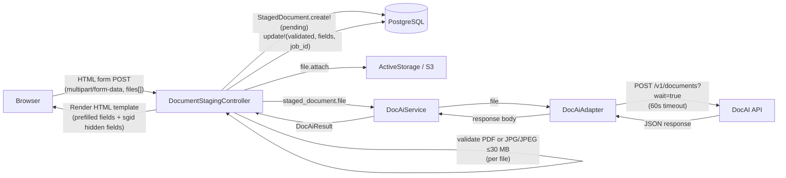
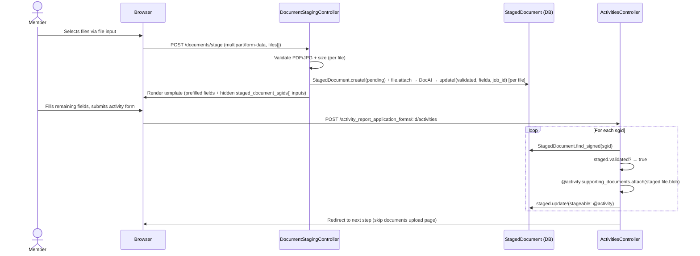
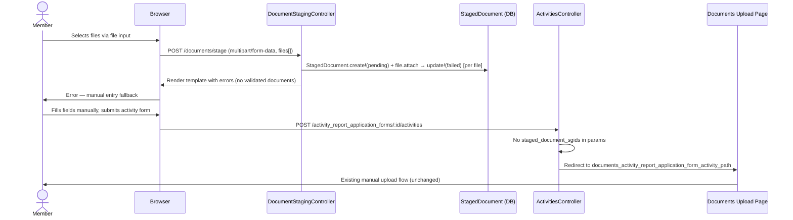
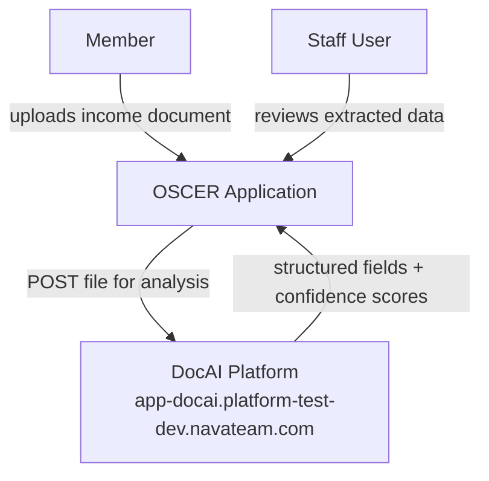
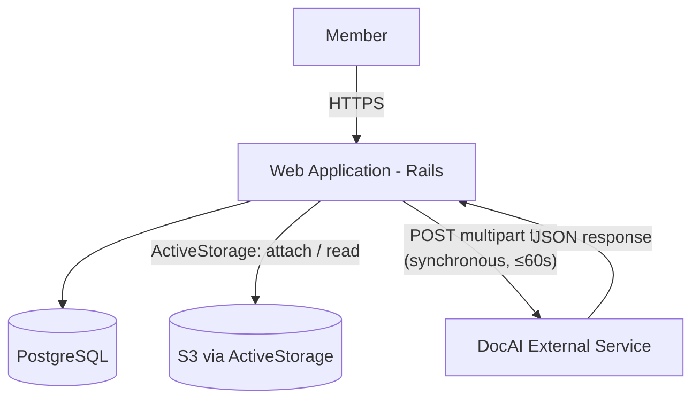
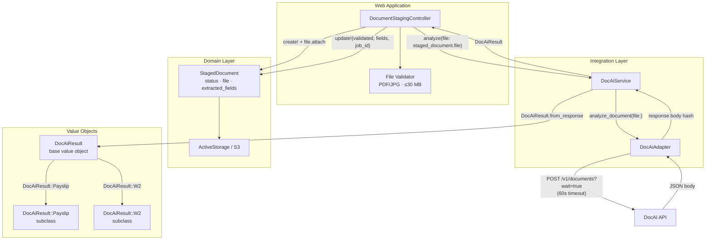

# DocAI Integration

## Problem

OSCER members are required to submit income verification documents (e.g., pay stubs) as part of their certification and exemption workflows. Staff currently review these documents manually, which is time-consuming, error-prone, and creates processing delays.

Integrating with the NavaPBC DocAI service enables:

1. **Realtime document validation** — When a member uploads a pay stub, OSCER confirms in realtime — within the upload request — that the document is a recognized Payslip before accepting it, providing immediate feedback and preventing invalid submissions from entering the review queue
2. **Automated data extraction** — Structured fields (gross pay, pay period dates, YTD totals, employer details) are extracted from uploaded documents without staff intervention
3. **Faster determinations** — Pre-populated form data reduces member burden and accelerates staff review
4. **Consistent parsing** — Machine-extracted fields apply uniform rules regardless of document formatting variation

## Approach

A thin adapter + service + value object pattern integrates DocAI into existing OSCER workflows without coupling business logic to the external API:

- **`DocumentStagingController`** — Accepts one or more file uploads from the browser via a standard HTML form POST, validates content type (PDF or JPG/JPEG) and size (≤30 MB) per file, creates a `StagedDocument` record per file, attaches each uploaded file via ActiveStorage, delegates to `DocAiService`, updates each record's status and extracted fields, and renders a template containing prefilled fields and hidden `staged_document_sgid` fields for each validated document
- **`StagedDocument`** — ActiveRecord model that owns the uploaded file (via `has_one_attached :file`) and tracks DocAI validation state, the full raw API response (including confidence scores), and the `job_id`. Retained permanently as an audit record.`belongs_to :stageable, polymorphic: true` links the document to whatever parent model consumes it (e.g., `Activity`, `Exemption`)
- **`DocAiAdapter`** — Handles the HTTP boundary: POSTs a file to DocAI via multipart upload and returns the raw response body
- **`DocAiService`** — Orchestrates the call: invokes the adapter, maps the response to a typed value object, logs the DocAI `job_id`, and raises `ProcessingError` for failed jobs
- **`DocAiResult` / `DocAiResult::Payslip` / `DocAiResult::W2`** — Immutable value objects representing the API response; the base class holds the response envelope and a factory method; subclasses expose typed, snake_case accessors per document class



**Processing model**: The `wait=true` parameter causes DocAI to block until processing completes, returning a single synchronous response within the upload request. No polling or webhook handling is required. If DocAI does not respond within 60 seconds, Faraday raises a `TimeoutError` and the service returns an error to the controller.

---

## User Interaction Flow

> End-to-end sequence from file selection to form prefill

```mermaid
sequenceDiagram
    actor Member
    participant Browser
    participant Controller as DocumentStagingController
    participant DB as StagedDocument (DB)
    participant DocAI as DocAiService

    Member->>Browser: Selects one or more files via file input
    Browser->>Controller: POST /documents/stage (multipart/form-data, files[])

    loop For each uploaded file
        Controller->>Controller: Validate content type (PDF or JPG/JPEG) + size (≤30 MB)
        alt Validation fails
            note right of Controller: Record skipped; error collected
        end
        Controller->>DB: StagedDocument.create!(status: :pending)
        Controller->>DB: staged_document.file.attach(file)
        Controller->>DocAI: analyze(file: staged_document.file)
        alt DocAI returns recognised income document (Payslip or W2)
            Controller->>DB: update!(status: :validated, extracted_fields, job_id)
        else Unrecognised document type
            Controller->>DB: update!(status: :rejected)
        else DocAI unavailable
            Controller->>DB: update!(status: :failed)
        end
    end

    Controller->>Browser: Render template (prefilled fields + sgid hidden fields per validated doc, errors for others)
    Browser->>Member: Shows prefilled form / validation errors
```

| Step | Notes |
|------|-------|
| File selection | The file input includes the `multiple` attribute; the member may select one or more files at once |
| StagedDocument creation | A `StagedDocument` record is created with `status: :pending` before DocAI is called; the file is attached via ActiveStorage (which handles S3 transparently) |
| Income document check | `SUPPORTED_RESULT_CLASSES.any? { \|klass\| result.is_a?(klass) }` — both Payslip and W2 are accepted; any other matched class is rejected at this step |
| Status update | All outcomes update the `StagedDocument` status (`validated`, `rejected`, or `failed`) — the record is retained permanently as an audit trail |
| UI prefill | Prefilled fields and `staged_document_sgid` hidden inputs are embedded in the rendered HTML template; the full DocAI response — including per-field confidence scores — is persisted in the `extracted_fields` JSONB column for staff review |

---

## Activity Attachment Flow

> How validated `StagedDocument`(s) get attached to an `Activity` record and how the manual upload step is bypassed

After `DocumentStagingController` validates each file with DocAI, each `StagedDocument` record holds the file via ActiveStorage and has `status: :validated`. This section describes how the staged documents are connected to an `Activity` record.

### 1. `DocumentStagingController` renders hidden `staged_document_sgids` fields

After processing all uploaded files, the controller renders a template. For each validated document, the template embeds a hidden input containing the document's signed global ID (`sgid`) — an HMAC-signed, time-limited token (1 hour expiry) that the browser can pass back without exposing the raw record UUID. Multiple validated documents produce multiple hidden fields:

```html
<input type="hidden" name="activity[staged_document_sgids][]" value="sgid_1">
<input type="hidden" name="activity[staged_document_sgids][]" value="sgid_2">
```

The `sgid` cannot be forged or replayed after expiry. The template also renders prefilled activity form fields extracted from each validated document.

### 2. `ActivitiesController#create` attaches blobs and skips the upload step

When `params[:activity][:staged_document_sgids]` is present, the controller iterates over the array, resolves each `StagedDocument` via `find_signed`, attaches its blob directly to the activity (no S3 copy is made — the same blob is shared), marks each staged document as consumed, and redirects to the next step, bypassing the `documents` upload page:

```ruby
if (sgids = activity_params[:staged_document_sgids]).present?
  sgids.each do |sgid|
    staged = StagedDocument.find_signed(sgid)
    next unless staged&.validated?

    @activity.supporting_documents.attach(staged.file.blob)
    staged.update!(stageable: @activity)
  end
  redirect_to activity_report_application_form_path(@activity_report_application_form),
              notice: t(".created_with_document")
else
  redirect_to documents_activity_report_application_form_activity_path(
                @activity_report_application_form, @activity)
end
```

`staged_document_sgids` (array) must be added to the permitted params list in `ActivitiesController`. When an `sgid` is expired or the record is not validated, that entry is skipped gracefully — other valid documents in the same submission are still attached. The polymorphic `stageable` association is set to the `@activity`, linking the `StagedDocument` to whatever parent model consumes it.

When no `sgids` are present — because DocAI was unavailable, the member has not yet uploaded files, or all uploads failed — the existing redirect to the `documents` upload page is preserved unchanged. Degradation is graceful; the manual upload path remains fully functional.

### End-to-End Sequence Diagram

#### Happy path (DocAI available, files are valid income documents)



#### Fallback path (DocAI unavailable)



### Design Decisions

**`sgid` as the hand-off token** — A signed global ID is tamper-proof and time-limited (1 hour). A raw UUID would require an explicit authorization check to prevent IDOR (member A passing member B's staged_document UUID). The `sgid` approach eliminates this attack surface without a DB membership query. `GlobalID::Locator.locate_signed` resolves directly to the `StagedDocument` record with one method call.

**Blob sharing, not blob copying** — `staged.file.blob` returns the existing `ActiveStorage::Blob`. Attaching it to `Activity.supporting_documents` creates a new `active_storage_attachments` row pointing at the same S3 object — no storage copy is made. Both the `StagedDocument` and the `Activity` reference the same physical file.

**`StagedDocument` retained as audit record** — Unlike a staging copy that would be deleted after use, `StagedDocument` rows are retained permanently. The polymorphic `stageable` association is set when the blob is transferred to a parent model, marking the record as consumed. Since `StagedDocument` records are never purged, the blob is safe from premature deletion even after it is attached to the parent.

**Graceful degradation preserved** — When `staged_document_sgids` is absent, the existing `documents` upload page is still reachable, maintaining the current flow as a fallback with no changes to `ActivityReportApplicationFormsController`.

**No changes to `ActivityReportApplicationFormsController`** — The flow change lives entirely in `ActivitiesController#create`. The multi-step form orchestration layer is unaffected.

**Server-rendered prefill** — `DocumentStagingController` renders a template rather than returning JSON. Prefilled fields and sgids are embedded in the HTML, eliminating the need for a client-side JS upload controller.

**Multiple sgids as array** — Each validated file produces its own `StagedDocument` and sgid. The activity form accepts `staged_document_sgids[]` (array). `ActivitiesController#create` iterates, skipping expired or non-validated entries.

---

## C4 Context Diagram

> Level 1: External actors and systems



| Actor/System   | Interaction                                                                    |
|----------------|--------------------------------------------------------------------------------|
| Member         | Uploads income document (pay stub) through OSCER UI                           |
| Staff User     | Reviews pre-populated fields extracted from member documents                   |
| OSCER          | Sends uploaded file to DocAI; receives structured field data                   |
| DocAI Platform | Analyzes document; returns matched document class and extracted field values   |

---

## C4 Container Diagram

> Level 2: Deployable units



| Container              | Technology     | Responsibilities                                                                                  |
|------------------------|----------------|---------------------------------------------------------------------------------------------------|
| Web Application        | Rails 7.2      | HTTP handling, file validation, `StagedDocument` lifecycle, DocAI delegation, UI prefill          |
| PostgreSQL             | PostgreSQL 14+ | Persistent storage including `staged_documents` table                                             |
| S3 (via ActiveStorage) | AWS S3         | Durable file storage; bucket configuration managed by ActiveStorage (no custom S3 operations)     |
| DocAI External Service | NavaPBC DocAI  | Document classification and field extraction                                                      |

---

## C4 Component Diagram

> Level 3: Internal components



### Key Components

| Component                    | Responsibility                                                                                                              |
|------------------------------|-----------------------------------------------------------------------------------------------------------------------------|
| `DocumentStagingController`  | Validates uploads (PDF or JPG/JPEG, ≤30 MB per file), creates `StagedDocument` per file, calls `DocAiService`, updates status/fields, renders template with prefilled fields and hidden sgid inputs |
| File Validator               | Enforces PDF or JPG/JPEG content type and ≤30 MB size limit before any DB or DocAI operations                              |
| `StagedDocument`             | ActiveRecord model: owns uploaded file via `has_one_attached :file`; tracks DocAI validation status, full raw API response (with confidence scores) in `extracted_fields` JSONB, `job_id`, `user_id`, and polymorphic `stageable` parent |
| `DocAiAdapter`               | POSTs file via Faraday multipart; maps HTTP errors to typed exceptions                                                      |
| `DocAiService`               | Invokes adapter; builds result value object; logs `job_id`; raises `ProcessingError` on failure                            |
| `DocAiResult`                | Base value object: response envelope, `FieldValue` accessor, self-registration factory                                      |
| `DocAiResult::FieldValue`    | Immutable struct wrapping `value` + `confidence`; exposes `low_confidence?` predicate                                       |
| `DocAiResult::Payslip`       | Payslip subclass; self-registers via `register "Payslip"`; typed `field_for` accessors per field                           |
| `DocAiResult::W2`            | W2 subclass; self-registers via `register "W2"`; typed `field_for` accessors for all W2 fields                             |

---

## API Interface

### Endpoint

| Property       | Value                                                              |
|----------------|--------------------------------------------------------------------|
| URL            | `https://app-docai.platform-test-dev.navateam.com/v1/documents`   |
| Method         | `POST`                                                             |
| Query param    | `wait=true`                                                        |
| Content-Type   | `multipart/form-data`                                              |
| Authentication | None (unauthenticated — see Future Considerations)                 |

### Request

```
POST /v1/documents?wait=true
Content-Type: multipart/form-data

file=<binary file contents>
```

### Success Response (HTTP 200 — Payslip)

```json
{
  "job_id": "d773fa8f-3cc7-47d8-be78-4125c190c290",
  "status": "completed",
  "createdAt": "2026-02-23T18:26:50.830294+00:00",
  "completedAt": "2026-02-23T18:27:29.434195+00:00",
  "totalProcessingTimeSeconds": 38.6,
  "matchedDocumentClass": "Payslip",
  "message": "Document processed successfully",
  "fields": {
    "payperiodstartdate":      { "confidence": 0.91, "value": "2017-07-10" },
    "payperiodenddate":        { "confidence": 0.92, "value": "2017-07-23" },
    "paydate":                 { "confidence": 0.23, "value": "2017-08-04" },
    "currentgrosspay":         { "confidence": 0.93, "value": 1627.74 },
    "currentnetpay":           { "confidence": 0.87, "value": 1040.23 },
    "currenttotaldeductions":  { "confidence": 0.92, "value": 226.83 },
    "ytdgrosspay":             { "confidence": 0.88, "value": 28707.21 },
    "ytdnetpay":               { "confidence": 0.87, "value": 18396.25 },
    "ytdfederaltax":           { "confidence": 0.27, "value": 3319.78 },
    "ytdstatetax":             { "confidence": 0.02, "value": 1126 },
    "ytdtotaldeductions":      { "confidence": 0.93, "value": 3782.22 },
    "regularhourlyrate":       { "confidence": 0.93, "value": 20.346846 },
    "currency":                { "confidence": 0.90, "value": "USD" },
    "federalfilingstatus":     { "confidence": 0.89, "value": "Single" },
    "statefilingstatus":       { "confidence": 0.86, "value": "Single" },
    "payrollnumber":           { "confidence": 0.88, "value": "000000002214873" },
    "employeenumber":          { "confidence": 0.93, "value": "000000000" },
    "employeename.firstname":  { "confidence": 0.88, "value": "Jane" },
    "employeename.lastname":   { "confidence": 0.88, "value": "Doe" },
    "employeeaddress.line1":   { "confidence": 0.92, "value": "123 Franklin St" },
    "employeeaddress.city":    { "confidence": 0.86, "value": "CHAPEL HILL" },
    "employeeaddress.state":   { "confidence": 0.91, "value": "NC" },
    "employeeaddress.zipcode": { "confidence": 0.91, "value": "27517" },
    "companyaddress.line1":    { "confidence": 0.82, "value": "103 South Building" },
    "companyaddress.city":     { "confidence": 0.91, "value": "Chapel Hill" },
    "companyaddress.state":    { "confidence": 0.93, "value": "NC" },
    "companyaddress.zipcode":  { "confidence": 0.93, "value": "27599-9100" },
    "isgrosspayvali":          { "confidence": 0.87, "value": true }
  }
}
```

### Success Response (HTTP 200 — W2)

```json
{
  "job_id": "e8b21c94-5d4f-48a9-bc91-37d6f4a09c11",
  "status": "completed",
  "createdAt": "2026-02-23T20:14:12.105843+00:00",
  "completedAt": "2026-02-23T20:14:51.882017+00:00",
  "totalProcessingTimeSeconds": 39.8,
  "matchedDocumentClass": "W2",
  "message": "Document processed successfully",
  "fields": {
    "employerInfo.employerAddress":               { "confidence": 0.89, "value": "103 South Building, Chapel Hill, NC 27599" },
    "employerInfo.controlNumber":                 { "confidence": 0.85, "value": "000042" },
    "employerInfo.employerName":                  { "confidence": 0.92, "value": "University of North Carolina" },
    "employerInfo.ein":                           { "confidence": 0.94, "value": "56-6001393" },
    "employerInfo.employerZipCode":               { "confidence": 0.91, "value": "27599" },
    "filingInfo.ombNumber":                       { "confidence": 0.88, "value": "1545-0008" },
    "filingInfo.verificationCode":                { "confidence": 0.76, "value": "A1B2C3" },
    "other":                                      { "confidence": 0.70, "value": null },
    "federalTaxInfo.federalIncomeTax":            { "confidence": 0.93, "value": 3319.78 },
    "federalTaxInfo.allocatedTips":               { "confidence": 0.81, "value": 0 },
    "federalTaxInfo.socialSecurityTax":           { "confidence": 0.92, "value": 1982.44 },
    "federalTaxInfo.medicareTax":                 { "confidence": 0.91, "value": 463.61 },
    "employeeGeneralInfo.employeeNameSuffix":     { "confidence": 0.72, "value": null },
    "employeeGeneralInfo.employeeAddress":        { "confidence": 0.90, "value": "123 Franklin St, Chapel Hill, NC 27517" },
    "employeeGeneralInfo.employeeLastName":       { "confidence": 0.93, "value": "Doe" },
    "employeeGeneralInfo.employeeZipCode":        { "confidence": 0.91, "value": "27517" },
    "employeeGeneralInfo.firstName":              { "confidence": 0.93, "value": "Jane" },
    "employeeGeneralInfo.ssn":                    { "confidence": 0.88, "value": "***-**-1234" },
    "federalWageInfo.socialSecurityTips":         { "confidence": 0.83, "value": 0 },
    "federalWageInfo.wagesTipsOtherCompensation": { "confidence": 0.94, "value": 31964.00 },
    "federalWageInfo.medicareWagesTips":          { "confidence": 0.93, "value": 31964.00 },
    "federalWageInfo.socialSecurityWages":        { "confidence": 0.93, "value": 31964.00 },
    "nonqualifiedPlansIncom":                     { "confidence": 0.79, "value": 0 }
  }
}
```

### Failed Job Response (HTTP 200)

A job may complete with HTTP 200 but indicate a processing failure via `status: "failed"`:

```json
{
  "job_id": "a4187dd2-8ccd-4e6f-b7a7-164092e49eca",
  "status": "failed",
  "createdAt": "2026-02-23T23:37:40.608528+00:00",
  "error": "Handler handler failed: '>' not supported between instances of 'int' and 'ConfigDefaults'",
  "additionalInfo": "'>' not supported between instances of 'int' and 'ConfigDefaults'"
}
```

### HTTP-Level Error Response

```json
{ "detail": "There was an error parsing the body" }
```

### Field Reference (Payslip)

> **Note**: Response field names are **lowercased and concatenated** even though the official schema uses PascalCase (e.g., `payperiodstartdate` maps to `PayPeriodStartDate`). Dot-notation compound fields like `EmployeeName.FirstName` become `employeename.firstname` in the response.
>
> All data accessors return a `DocAiResult::FieldValue` wrapping the value and confidence score. Boolean validation flag accessors (`gross_pay_valid?` etc.) return `true`/`false` directly.

| API Field Key                 | Ruby Accessor                    | Value type inside `FieldValue` |
|-------------------------------|----------------------------------|---------|
| `payperiodstartdate`          | `pay_period_start_date`          | String  |
| `payperiodenddate`            | `pay_period_end_date`            | String  |
| `paydate`                     | `pay_date`                       | String  |
| `currentgrosspay`             | `current_gross_pay`              | Numeric |
| `currentnetpay`               | `current_net_pay`                | Numeric |
| `currenttotaldeductions`      | `current_total_deductions`       | Numeric |
| `ytdgrosspay`                 | `ytd_gross_pay`                  | Numeric |
| `ytdnetpay`                   | `ytd_net_pay`                    | Numeric |
| `ytdfederaltax`               | `ytd_federal_tax`                | Numeric |
| `ytdstatetax`                 | `ytd_state_tax`                  | Numeric |
| `ytdtotaldeductions`          | `ytd_total_deductions`           | Numeric |
| `regularhourlyrate`           | `regular_hourly_rate`            | Numeric |
| `holidayhourlyrate`           | `holiday_hourly_rate`            | Numeric |
| `currency`                    | `currency`                       | String  |
| `federalfilingstatus`         | `federal_filing_status`          | String  |
| `statefilingstatus`           | `state_filing_status`            | String  |
| `payrollnumber`               | `payroll_number`                 | String  |
| `employeenumber`              | `employee_number`                | String  |
| `employeename.firstname`      | `employee_first_name`            | String  |
| `employeename.middlename`     | `employee_middle_name`           | String  |
| `employeename.lastname`       | `employee_last_name`             | String  |
| `employeename.suffixname`     | `employee_suffix_name`           | String  |
| `employeeaddress.line1`       | `employee_address_line1`         | String  |
| `employeeaddress.line2`       | `employee_address_line2`         | String  |
| `employeeaddress.city`        | `employee_address_city`          | String  |
| `employeeaddress.state`       | `employee_address_state`         | String  |
| `employeeaddress.zipcode`     | `employee_address_zipcode`       | String  |
| `companyaddress.line1`        | `company_address_line1`          | String  |
| `companyaddress.line2`        | `company_address_line2`          | String  |
| `companyaddress.city`         | `company_address_city`           | String  |
| `companyaddress.state`        | `company_address_state`          | String  |
| `companyaddress.zipcode`      | `company_address_zipcode`        | String  |
| `isgrosspayvali`              | `gross_pay_valid?`               | Boolean |
| `isytdgrosspayhighest`        | `ytd_gross_pay_highest?`         | Boolean |
| `arefieldnamessufficient`     | `field_names_sufficient?`        | Boolean |

---

### Field Reference (W2)

> **Note**: W2 response field names use dot-notation groups (e.g., `employerInfo.employerName`). All accessors return a `DocAiResult::FieldValue`.
>
> `nonqualifiedPlansIncom` is a DocAI typo (truncated key). The Ruby accessor uses the correct spelling; `field_for` is called with the literal API key.

| API Field Key                                | Ruby Accessor                   | Group         | Value type inside `FieldValue` |
|----------------------------------------------|---------------------------------|---------------|--------------------------------|
| `employerInfo.employerAddress`               | `employer_address`              | Employer Info | String  |
| `employerInfo.controlNumber`                 | `employer_control_number`       | Employer Info | String  |
| `employerInfo.employerName`                  | `employer_name`                 | Employer Info | String  |
| `employerInfo.ein`                           | `employer_ein`                  | Employer Info | String  |
| `employerInfo.employerZipCode`               | `employer_zip_code`             | Employer Info | String  |
| `filingInfo.ombNumber`                       | `omb_number`                    | Filing Info   | String  |
| `filingInfo.verificationCode`                | `verification_code`             | Filing Info   | String  |
| `other`                                      | `other`                         | Other         | String  |
| `federalTaxInfo.federalIncomeTax`            | `federal_income_tax`            | Federal Tax   | Numeric |
| `federalTaxInfo.allocatedTips`               | `allocated_tips`                | Federal Tax   | Numeric |
| `federalTaxInfo.socialSecurityTax`           | `social_security_tax`           | Federal Tax   | Numeric |
| `federalTaxInfo.medicareTax`                 | `medicare_tax`                  | Federal Tax   | Numeric |
| `employeeGeneralInfo.employeeNameSuffix`     | `employee_name_suffix`          | Employee Info | String  |
| `employeeGeneralInfo.employeeAddress`        | `employee_address`              | Employee Info | String  |
| `employeeGeneralInfo.employeeLastName`       | `employee_last_name`            | Employee Info | String  |
| `employeeGeneralInfo.employeeZipCode`        | `employee_zip_code`             | Employee Info | String  |
| `employeeGeneralInfo.firstName`              | `employee_first_name`           | Employee Info | String  |
| `employeeGeneralInfo.ssn`                    | `employee_ssn`                  | Employee Info | String  |
| `federalWageInfo.socialSecurityTips`         | `social_security_tips`          | Federal Wages | Numeric |
| `federalWageInfo.wagesTipsOtherCompensation` | `wages_tips_other_compensation` | Federal Wages | Numeric |
| `federalWageInfo.medicareWagesTips`          | `medicare_wages_tips`           | Federal Wages | Numeric |
| `federalWageInfo.socialSecurityWages`        | `social_security_wages`         | Federal Wages | Numeric |
| `nonqualifiedPlansIncom`                     | `nonqualified_plans_income`     | Other         | Numeric |

---

## Error Handling

| Scenario                   | HTTP Status | Body                         | Handling                                                                                                             |
|----------------------------|-------------|------------------------------|----------------------------------------------------------------------------------------------------------------------|
| Bad request / parse failure | 4xx        | `{"detail": "..."}`          | `DocAiAdapter#handle_error` → raises `ApiError` with detail msg                                                      |
| Server error               | 5xx         | —                            | `BaseAdapter#handle_server_error` → raises `ServerError`                                                             |
| Network failure            | —           | —                            | `BaseAdapter#handle_connection_error` → raises `ApiError`                                                            |
| Request timeout (> 60s)    | —           | —                            | Faraday raises `TimeoutError` → caught as `ApiError` → `handle_integration_error` returns `nil`                      |
| DocAI processing failed    | 200         | `{"status":"failed",...}`    | `DocAiService` checks `result.failed?` → raises `ProcessingError`                                                    |
| Graceful degradation       | any         | —                            | `handle_integration_error` logs warning and returns `nil`; controller updates `StagedDocument` to `status: :failed`  |
| Document not a recognised income type | 200 | `{"matchedDocumentClass":"..."}` | Controller checks `SUPPORTED_RESULT_CLASSES.any?`; updates `StagedDocument` to `status: :rejected`; returns error in rendered template |

---

## Key Interfaces

### StagedDocument

Intermediate ActiveRecord model that owns an uploaded file and tracks its DocAI validation lifecycle. Retained permanently as an audit record. `belongs_to :user` records who uploaded the file; `belongs_to :stageable, polymorphic: true` links the document to whatever parent model consumes it (e.g., `Activity`, `Exemption`). The `extracted_fields` JSONB column stores the full raw DocAI `fields` response — including per-field confidence scores — so no data is lost at persistence time.

```ruby
# db/migrate/<timestamp>_create_staged_documents.rb
create_table :staged_documents, id: :uuid do |t|
  t.references :user,              type: :uuid, null: false, foreign_key: true
  t.references :stageable,         polymorphic: true, type: :uuid  # set when consumed by a parent model
  t.string     :status,            null: false, default: "pending"
  t.string     :doc_ai_job_id
  t.string     :doc_ai_matched_class
  t.jsonb      :extracted_fields,  null: false, default: {}
  t.datetime   :validated_at
  t.timestamps
end

add_index :staged_documents, :status
add_index :staged_documents, :doc_ai_job_id
```

```ruby
# app/models/staged_document.rb
class StagedDocument < ApplicationRecord
  belongs_to :user
  belongs_to :stageable, polymorphic: true, optional: true

  has_one_attached :file

  enum :status, {
    pending:   "pending",    # file received, DocAI not yet called
    validated: "validated",  # DocAI returned a recognised income document (Payslip or W2)
    rejected:  "rejected",   # DocAI returned unrecognised document type or validation failure
    failed:    "failed"      # DocAI service error (graceful degradation)
  }

  validates :status, presence: true
  validates :file, attached: true
end
```

**Blob sharing:** When a consuming controller calls `@parent.supporting_documents.attach(staged.file.blob)`, it creates a new `active_storage_attachments` row pointing at the same `ActiveStorage::Blob` — no S3 copy is made. Both the `StagedDocument` and the parent model reference the same physical file. Since `StagedDocument` records are never purged, there is no risk of the blob being deleted out from under the parent.

---

### DocumentStagingController

Entry point for all document uploads. Accepts multiple files via a standard HTML form POST, validates content type (PDF or JPG/JPEG) and size per file, creates a `StagedDocument` per file (associated with `current_user`), delegates to `DocAiService`, stores the full raw API response (including confidence scores) in `extracted_fields`, and renders a template with prefilled fields and hidden sgid inputs for each validated document.

```ruby
# app/controllers/document_staging_controller.rb
class DocumentStagingController < ApplicationController
  ALLOWED_CONTENT_TYPES    = %w[application/pdf image/jpeg].freeze
  MAX_FILE_SIZE_BYTES       = 30.megabytes
  SUPPORTED_RESULT_CLASSES = [DocAiResult::Payslip, DocAiResult::W2].freeze

  def create
    authorize :document, :create?

    files = Array(params[:files])
    if files.empty?
      flash.now[:alert] = t(".no_files")
      return render :create, status: :unprocessable_entity
    end

    @results = files.map { |file| process_file(file) }
    render :create  # renders create.html.erb with @results
  end

  private

  def process_file(file)
    unless valid_content_type?(file)
      return { file: file, error: t(".invalid_content_type"), staged_document: nil }
    end
    unless valid_file_size?(file)
      return { file: file, error: t(".file_too_large"), staged_document: nil }
    end

    staged_document = StagedDocument.create!(user: current_user, status: :pending)
    staged_document.file.attach(file)
    result = DocAiService.new.analyze(file: staged_document.file)

    if result.nil?
      staged_document.update!(status: :failed)
      return { file: file, error: t(".analysis_unavailable"), staged_document: staged_document }
    end

    unless SUPPORTED_RESULT_CLASSES.any? { |klass| result.is_a?(klass) }
      staged_document.update!(status: :rejected)
      return { file: file, error: t(".unrecognised_document"), staged_document: staged_document }
    end

    staged_document.update!(
      status:               :validated,
      doc_ai_job_id:        result.job_id,
      doc_ai_matched_class: result.matched_document_class,
      extracted_fields:     result.fields,
      validated_at:         Time.current
    )

    sgid = staged_document.to_sgid(expires_in: 1.hour).to_s
    { file: file, staged_document: staged_document, sgid: sgid, result: result }
  end

  def valid_content_type?(file) = file.content_type.in?(ALLOWED_CONTENT_TYPES)
  def valid_file_size?(file)    = file.size <= MAX_FILE_SIZE_BYTES
end
```

Field serialisation is no longer performed in the controller. The raw DocAI `fields` hash — containing `{ "value": ..., "confidence": ... }` pairs per field — is stored directly in the `extracted_fields` JSONB column. For form prefill, the `DocAiResult` subclasses provide a `to_prefill_fields` method that extracts just the values (see [DocAiResult subclasses](#docairesultpayslip-subclass-value-object)).

The template (`create.html.erb`) iterates over `@results`:
- For validated docs: renders prefilled fields (via `result.to_prefill_fields`) and a hidden `staged_document_sgids[]` input per doc
- For rejected/failed docs: renders an inline error message

> **Double-submit prevention**: The file upload form uses `data: { turbo_submits_with: t(".submitting") }` on the submit button (or equivalent `data-disable-with` attribute for non-Turbo forms) to disable the button after first click. Because DocAI processing takes ~38 seconds per file, the member must select all files at once before submitting — the button remains disabled until the response is rendered, preventing duplicate submissions.

> **Authorization**: `authorize :document, :create?` is called at the top of `#create` to enforce member authentication before any file processing. A corresponding `DocumentPolicy` must be created.

---

### DocAiAdapter

Extends `DataIntegration::BaseAdapter`. No auth headers — endpoint is currently unauthenticated.

The `analyze_document` method accepts an `ActiveStorage::Attached::One` object. Since `Faraday::UploadIO` requires a file path or IO object (not an ActiveStorage attachment), the adapter opens the blob as a `Tempfile` via `file.blob.open`, which streams the file from S3 to a local tempfile for the duration of the block.

```ruby
# app/adapters/doc_ai_adapter.rb
class DocAiAdapter < DataIntegration::BaseAdapter
  def analyze_document(file:)
    file.blob.open do |tempfile|
      with_error_handling do
        @connection.post("v1/documents") do |req|
          req.params["wait"] = true
          req.body = { file: Faraday::Multipart::FilePart.new(tempfile, file.content_type, file.filename.to_s) }
        end
      end
    end
  end

  def handle_error(response)
    detail = response.body.is_a?(Hash) ? response.body["detail"] : nil
    raise ApiError, detail || "DocAI error: #{response.status}"
  end

  private

  def default_connection
    Faraday.new(url: Rails.application.config.doc_ai[:api_host]) do |f|
      f.request :multipart
      f.request :url_encoded
      f.response :json
      f.adapter Faraday.default_adapter
      f.options.open_timeout = 10
      f.options.timeout      = Rails.application.config.doc_ai[:timeout_seconds]
    end
  end
end
```

### DocAiService

Extends `DataIntegration::BaseService`.

```ruby
# app/services/doc_ai_service.rb
class DocAiService < DataIntegration::BaseService
  class ProcessingError < StandardError; end

  def initialize(adapter: DocAiAdapter.new)
    super(adapter: adapter)
  end

  def analyze(file:)
    response = @adapter.analyze_document(file: file)
    result   = DocAiResult.from_response(response)
    raise ProcessingError, result.error if result.failed?

    Rails.logger.info(
      "[DocAiService] job_id=#{result.job_id} status=#{result.status} " \
      "matched_class=#{result.matched_document_class} " \
      "processing_seconds=#{result.total_processing_time_seconds}"
    )
    result
  rescue DocAiAdapter::ApiError, ProcessingError => e
    handle_integration_error(e)
  end
end
```

### DocAiResult::FieldValue

A lightweight struct wrapping the `value` and `confidence` score for a single extracted field. All subclass field accessors return a `FieldValue` (or `nil` if the field was absent from the response).

```ruby
# Defined inside doc_ai_result.rb — no separate file needed
FieldValue = Data.define(:value, :confidence) do
  # true when the model is uncertain; callers may surface these to staff for manual review
  def low_confidence?
    confidence.nil? || confidence < Rails.application.config.doc_ai[:low_confidence_threshold]
  end

  def to_s = value.to_s
end
```

**Usage example:**

```ruby
result = DocAiService.new.analyze(file: uploaded_file)

gross_pay = result.current_gross_pay   # => #<data DocAiResult::FieldValue value=1627.74, confidence=0.93>
gross_pay.value          # => 1627.74
gross_pay.confidence     # => 0.93
gross_pay.low_confidence? # => false

result.pay_date.low_confidence?  # => true  (confidence: 0.23 — flag for staff review)
```

---

### DocAiResult (Base Value Object)

Holds the response envelope, the `FieldValue` accessor, and the self-registration factory. Extends `Strata::ValueObject`.

```ruby
# app/models/doc_ai_result.rb
class DocAiResult < Strata::ValueObject
  include Strata::Attributes

  # Wraps a single extracted field's value and confidence score.
  FieldValue = Data.define(:value, :confidence) do
    def low_confidence?
      confidence.nil? || confidence < Rails.application.config.doc_ai[:low_confidence_threshold]
    end
    def to_s = value.to_s
  end

  # Subclass registry — populated at load time by each subclass calling .register.
  REGISTRY = {}

  # Called by each subclass to associate its DocAI document class name with the Ruby class.
  # Subclass files must be required below the class definition so they register before
  # from_response is called (Rails eager loading handles this in production automatically).
  def self.register(document_class)
    REGISTRY[document_class] = self
  end

  # Response envelope
  strata_attribute :job_id, :string
  strata_attribute :status, :string
  strata_attribute :matched_document_class, :string
  strata_attribute :message, :string
  strata_attribute :created_at, :datetime
  strata_attribute :completed_at, :datetime
  strata_attribute :total_processing_time_seconds, :float
  strata_attribute :error, :string           # present when status == "failed"
  strata_attribute :additional_info, :string # present when status == "failed"

  # Raw fields hash — preserves all confidence + value pairs from the API
  strata_attribute :fields, :immutable_value_object

  # Factory: dispatches to the registered subclass for the given matchedDocumentClass.
  # Falls back to base DocAiResult for unregistered document types.
  def self.from_response(response)
    klass = REGISTRY.fetch(response["matchedDocumentClass"], DocAiResult)
    klass.build(response)
  end

  def self.build(response)
    new(
      job_id:                        response["job_id"],
      status:                        response["status"],
      matched_document_class:        response["matchedDocumentClass"],
      message:                       response["message"],
      created_at:                    response["createdAt"],
      completed_at:                  response["completedAt"],
      total_processing_time_seconds: response["totalProcessingTimeSeconds"],
      error:                         response["error"],
      additional_info:               response["additionalInfo"],
      fields:                        response["fields"] || {}
    )
  end

  def completed? = status == "completed"
  def failed?    = status == "failed"

  # Returns a FieldValue containing both the extracted value and its confidence score.
  # Returns nil if the field was not present in the API response.
  def field_for(api_key)
    raw = fields.dig(api_key.to_s)
    return nil unless raw
    FieldValue.new(value: raw["value"], confidence: raw["confidence"])
  end

  # Subclasses override to return a hash of { field_name: value } for form prefill.
  # Base implementation returns an empty hash.
  def to_prefill_fields = {}

  # Subclass files are required explicitly so their .register calls populate REGISTRY
  # before any call to DocAiResult.from_response.
  require_relative "doc_ai_result/payslip"
  require_relative "doc_ai_result/w2"

  # Freeze the registry after all subclasses have loaded to prevent accidental
  # post-load mutation. Any require_relative for new document types must appear above.
  REGISTRY.freeze

  private_class_method :build
end
```

### DocAiResult::Payslip (Subclass Value Object)

Registers itself with the base class factory and exposes every Payslip schema field as an idiomatic Ruby snake_case method. Each accessor returns a `FieldValue` (or `nil` if the field was absent). Boolean validation flags are predicates that unwrap the value directly. `to_prefill_fields` returns a flat hash of values for form prefill — this is the only place field-to-form mapping is defined.

```ruby
# app/models/doc_ai_result/payslip.rb
class DocAiResult::Payslip < DocAiResult
  register "Payslip"

  # --- Pay period ---
  def pay_period_start_date    = field_for("payperiodstartdate")
  def pay_period_end_date      = field_for("payperiodenddate")
  def pay_date                 = field_for("paydate")

  # --- Current period pay ---
  def current_gross_pay        = field_for("currentgrosspay")
  def current_net_pay          = field_for("currentnetpay")
  def current_total_deductions = field_for("currenttotaldeductions")

  # --- Year-to-date ---
  def ytd_gross_pay            = field_for("ytdgrosspay")
  def ytd_net_pay              = field_for("ytdnetpay")
  def ytd_federal_tax          = field_for("ytdfederaltax")
  def ytd_state_tax            = field_for("ytdstatetax")
  def ytd_city_tax             = field_for("ytdcitytax")
  def ytd_total_deductions     = field_for("ytdtotaldeductions")

  # --- Rates ---
  def regular_hourly_rate      = field_for("regularhourlyrate")
  def holiday_hourly_rate      = field_for("holidayhourlyrate")

  # --- Filing status ---
  def federal_filing_status    = field_for("federalfilingstatus")
  def state_filing_status      = field_for("statefilingstatus")

  # --- Identifiers ---
  def employee_number          = field_for("employeenumber")
  def payroll_number           = field_for("payrollnumber")
  def currency                 = field_for("currency")

  # --- Employee name ---
  def employee_first_name      = field_for("employeename.firstname")
  def employee_middle_name     = field_for("employeename.middlename")
  def employee_last_name       = field_for("employeename.lastname")
  def employee_suffix_name     = field_for("employeename.suffixname")

  # --- Employee address ---
  def employee_address_line1   = field_for("employeeaddress.line1")
  def employee_address_line2   = field_for("employeeaddress.line2")
  def employee_address_city    = field_for("employeeaddress.city")
  def employee_address_state   = field_for("employeeaddress.state")
  def employee_address_zipcode = field_for("employeeaddress.zipcode")

  # --- Company address ---
  def company_address_line1    = field_for("companyaddress.line1")
  def company_address_line2    = field_for("companyaddress.line2")
  def company_address_city     = field_for("companyaddress.city")
  def company_address_state    = field_for("companyaddress.state")
  def company_address_zipcode  = field_for("companyaddress.zipcode")

  # --- Validation flags (boolean predicates — unwrap value directly) ---
  def gross_pay_valid?        = field_for("isgrosspayvali")&.value == true
  def ytd_gross_pay_highest?  = field_for("isytdgrosspayhighest")&.value == true
  def field_names_sufficient? = field_for("arefieldnamessufficient")&.value == true

  # Returns a flat hash of { field_name: value } for form prefill.
  # Confidence scores are not included — they are available in the persisted extracted_fields JSONB.
  def to_prefill_fields
    {
      pay_period_start_date:    pay_period_start_date&.value,
      pay_period_end_date:      pay_period_end_date&.value,
      pay_date:                 pay_date&.value,
      current_gross_pay:        current_gross_pay&.value,
      current_net_pay:          current_net_pay&.value,
      current_total_deductions: current_total_deductions&.value,
      ytd_gross_pay:            ytd_gross_pay&.value,
      ytd_net_pay:              ytd_net_pay&.value,
      employee_first_name:      employee_first_name&.value,
      employee_last_name:       employee_last_name&.value,
      employee_address_line1:   employee_address_line1&.value,
      employee_address_city:    employee_address_city&.value,
      employee_address_state:   employee_address_state&.value,
      employee_address_zipcode: employee_address_zipcode&.value
    }
  end
end
```

### DocAiResult::W2 (Subclass Value Object)

Registers itself with the base class factory and exposes all W2 schema fields as idiomatic Ruby snake_case methods grouped by document section. Each accessor returns a `FieldValue` (or `nil` if the field was absent).

> `nonqualifiedPlansIncom` is a DocAI typo (truncated key). The Ruby accessor uses the correct spelling; `field_for` is called with the literal API key.

```ruby
# app/models/doc_ai_result/w2.rb
class DocAiResult::W2 < DocAiResult
  register "W2"

  # --- Employer Info ---
  def employer_address        = field_for("employerInfo.employerAddress")
  def employer_control_number = field_for("employerInfo.controlNumber")
  def employer_name           = field_for("employerInfo.employerName")
  def employer_ein            = field_for("employerInfo.ein")
  def employer_zip_code       = field_for("employerInfo.employerZipCode")

  # --- Filing Info ---
  def omb_number              = field_for("filingInfo.ombNumber")
  def verification_code       = field_for("filingInfo.verificationCode")

  # --- Employee Info ---
  def employee_name_suffix    = field_for("employeeGeneralInfo.employeeNameSuffix")
  def employee_address        = field_for("employeeGeneralInfo.employeeAddress")
  def employee_last_name      = field_for("employeeGeneralInfo.employeeLastName")
  def employee_zip_code       = field_for("employeeGeneralInfo.employeeZipCode")
  def employee_first_name     = field_for("employeeGeneralInfo.firstName")
  def employee_ssn            = field_for("employeeGeneralInfo.ssn")

  # --- Federal Tax ---
  def federal_income_tax      = field_for("federalTaxInfo.federalIncomeTax")
  def allocated_tips          = field_for("federalTaxInfo.allocatedTips")
  def social_security_tax     = field_for("federalTaxInfo.socialSecurityTax")
  def medicare_tax            = field_for("federalTaxInfo.medicareTax")

  # --- Federal Wages ---
  def social_security_tips          = field_for("federalWageInfo.socialSecurityTips")
  def wages_tips_other_compensation = field_for("federalWageInfo.wagesTipsOtherCompensation")
  def medicare_wages_tips           = field_for("federalWageInfo.medicareWagesTips")
  def social_security_wages         = field_for("federalWageInfo.socialSecurityWages")

  # --- Other ---
  def other                         = field_for("other")
  def nonqualified_plans_income     = field_for("nonqualifiedPlansIncom")  # DocAI typo — literal key

  # Returns a flat hash of { field_name: value } for form prefill.
  def to_prefill_fields
    {
      employer_name:                 employer_name&.value,
      employer_ein:                  employer_ein&.value,
      employer_address:              employer_address&.value,
      employee_first_name:           employee_first_name&.value,
      employee_last_name:            employee_last_name&.value,
      employee_address:              employee_address&.value,
      wages_tips_other_compensation: wages_tips_other_compensation&.value,
      federal_income_tax:            federal_income_tax&.value,
      social_security_wages:         social_security_wages&.value,
      social_security_tax:           social_security_tax&.value,
      medicare_wages_tips:           medicare_wages_tips&.value,
      medicare_tax:                  medicare_tax&.value
    }
  end
end
```

### Extending for New Document Types

Adding support for a new document type (1099, bank statement, etc.) requires creating the subclass, calling `register`, and implementing `to_prefill_fields`. No changes to `DocAiResult` or `DocumentStagingController` are needed.

```ruby
# app/models/doc_ai_result/bank_statement.rb
class DocAiResult::BankStatement < DocAiResult
  register "BankStatement"

  def account_holder_name = field_for("accountHolderName")
  def account_number      = field_for("accountNumber")
  def statement_date      = field_for("statementDate")
  def closing_balance     = field_for("closingBalance")
  # ...

  def to_prefill_fields
    {
      account_holder_name: account_holder_name&.value,
      statement_date:      statement_date&.value,
      closing_balance:     closing_balance&.value
    }
  end
end
```

Add `require_relative "doc_ai_result/bank_statement"` inside the `DocAiResult` class body (before `REGISTRY.freeze`) alongside the existing requires.

---

## Files to Create

| File | Purpose |
|------|---------|
| `app/models/staged_document.rb` | `StagedDocument` model — status enum, `has_one_attached :file`, `extracted_fields` JSONB |
| `db/migrate/<timestamp>_create_staged_documents.rb` | Migration for `staged_documents` table (uuid pk, status, doc_ai_job_id, extracted_fields, activity_id) |
| `app/controllers/document_staging_controller.rb` | Validates uploads (PDF or JPG/JPEG, ≤30 MB per file); creates `StagedDocument` per file; attaches files; orchestrates DocAI; renders template with prefilled fields and sgids |
| `app/views/document_staging/create.html.erb` | Template rendered after multi-file upload; prefilled fields and hidden `staged_document_sgids[]` inputs per validated doc; inline errors for rejected/failed docs |
| `app/adapters/doc_ai_adapter.rb` | Extends `DataIntegration::BaseAdapter`; POSTs file via Faraday multipart |
| `app/services/doc_ai_service.rb` | Extends `DataIntegration::BaseService`; accepts ActiveStorage attachment, returns `DocAiResult` |
| `app/models/doc_ai_result.rb` | Base `Strata::ValueObject`; envelope fields, generic accessors, subclass factory |
| `app/models/doc_ai_result/payslip.rb` | `DocAiResult::Payslip` subclass; all Payslip snake_case field accessors |
| `app/models/doc_ai_result/w2.rb` | `DocAiResult::W2` subclass; all W2 snake_case field accessors grouped by section |
| `config/initializers/doc_ai.rb` | App config for env vars including `low_confidence_threshold` |
| `app/policies/document_policy.rb` | Pundit policy for `authorize :document, :create?` in `DocumentStagingController` |
| `spec/models/staged_document_spec.rb` | Model validations and enum tests |
| `spec/controllers/document_staging_controller_spec.rb` | Controller tests: file validation, multi-file `StagedDocument` lifecycle, DocAI delegation, template rendering |
| `spec/adapters/doc_ai_adapter_spec.rb` | Adapter tests (WebMock stubs) |
| `spec/services/doc_ai_service_spec.rb` | Service tests |
| `spec/models/doc_ai_result_spec.rb` | Base value object tests |
| `spec/models/doc_ai_result/payslip_spec.rb` | Payslip accessor tests |
| `spec/models/doc_ai_result/w2_spec.rb` | W2 accessor tests |

```
app/models/
  staged_document.rb
  doc_ai_result.rb
  doc_ai_result/
    payslip.rb
    w2.rb
app/views/document_staging/
  create.html.erb
spec/models/
  staged_document_spec.rb
  doc_ai_result_spec.rb
  doc_ai_result/
    payslip_spec.rb
    w2_spec.rb
```

## Files to Modify

| File | Change |
|------|--------|
| `Gemfile` | Add `faraday-multipart` if not already present |
| `local.env.example` | Add `DOC_AI_API_HOST`, `DOC_AI_TIMEOUT_SECONDS`, `DOC_AI_LOW_CONFIDENCE_THRESHOLD` |
| `config/routes.rb` | Add `POST /documents/stage` route for `DocumentStagingController#create` |
| `app/controllers/activities_controller.rb` | Accept `staged_document_sgids` (array) in permitted params; iterate via `find_signed`, attach blobs, set polymorphic `stageable`, and skip upload redirect when any are present |

---

## Route

```ruby
# config/routes.rb (inside localized block)
resource :document_staging, only: [:create], controller: "document_staging"
```

This generates `POST /document_staging` → `DocumentStagingController#create`. The route is placed inside the `localized` block so it participates in locale-scoped routing via `route_translator`.

---

## Configuration

```ruby
# config/initializers/doc_ai.rb
Rails.application.config.doc_ai = {
  api_host:                 ENV.fetch("DOC_AI_API_HOST"),
  timeout_seconds:          ENV.fetch("DOC_AI_TIMEOUT_SECONDS", "60").to_i,
  low_confidence_threshold: ENV.fetch("DOC_AI_LOW_CONFIDENCE_THRESHOLD", "0.7").to_f
}
```

```bash
# local.env.example
DOC_AI_API_HOST=https://app-docai.platform-test-dev.navateam.com
DOC_AI_TIMEOUT_SECONDS=60
DOC_AI_LOW_CONFIDENCE_THRESHOLD=0.7
```

| Variable                          | Purpose                                                      | Required |
|-----------------------------------|--------------------------------------------------------------|----------|
| `DOC_AI_API_HOST`                 | DocAI base URL (per environment)                             | Yes      |
| `DOC_AI_TIMEOUT_SECONDS`          | Max seconds to wait for a DocAI response (default: 60)       | No       |
| `DOC_AI_LOW_CONFIDENCE_THRESHOLD` | Minimum confidence score before `low_confidence?` returns `true` (default: 0.7) | No |

> **Web server timeout**: Because DocAI validation runs on the web request thread and may take up to 60 seconds, Puma and any rack-timeout middleware (e.g., `Rack::Timeout`) must be configured to allow requests longer than 60 seconds for the upload endpoint. A recommended minimum is 75 seconds to provide headroom above the Faraday timeout.

---

## Decisions

### Synchronous `wait=true` with a 60-second timeout

**Decision**: Use the `wait=true` query parameter to block until DocAI completes processing, with a Faraday read timeout of 60 seconds (`open_timeout: 10s`).

**Rationale**: Document validation is user-facing and must complete within the upload request/response cycle. When a member submits a pay stub, OSCER must immediately confirm whether the document is a valid Payslip — background processing would require polling or WebSockets, adding significant complexity with no benefit. Using `wait=true` keeps the flow simple: the controller calls the service, the service calls the adapter, and the result is returned synchronously to the member. DocAI typically responds in ~38 seconds; the 60-second timeout provides headroom for upload latency and variable processing times while bounding the request to a known maximum.

**Tradeoff**: A web request thread is held for up to 60 seconds per upload. Puma and any rack-timeout middleware must be configured with a limit above 60 seconds (see Configuration). Under high concurrent upload load, this may exhaust Puma threads; consider a dedicated thread pool or route-level concurrency controls for the upload endpoint if this becomes a bottleneck.

### Subclass-per-document-class value objects with self-registration

**Decision**: Model each document type (Payslip, W2, 1099, etc.) as a subclass of `DocAiResult`. Each subclass self-registers via `register "ClassName"`, populating a `REGISTRY` hash on the base class at load time. The factory method dispatches using `REGISTRY` rather than a statically-maintained map.

**Rationale**: Typed subclasses provide method-name discoverability, make callers self-documenting, and allow document-type-specific validation. Self-registration keeps the base class closed to modification: adding a new document type requires only creating its subclass and calling `register` — `DocAiResult` itself does not need to change.

**Tradeoff**: Subclass files must be required (via `require_relative` at the bottom of `doc_ai_result.rb`) so their `register` calls execute before `from_response` is invoked. Rails eager loading handles this automatically in production; in development/test, the explicit requires guarantee consistent behaviour regardless of autoload order.

### Confidence as a first-class concept — in-memory via `FieldValue`, persisted via raw JSONB

**Decision**: All field accessors on `DocAiResult` subclasses return a `DocAiResult::FieldValue` struct — a `Data.define` value object wrapping `value` and `confidence` together — rather than raw values. A `low_confidence?` predicate (threshold: 0.7) is built into the struct. The full raw DocAI `fields` hash (containing `{ "value": ..., "confidence": ... }` per field) is stored as-is in the `StagedDocument#extracted_fields` JSONB column, preserving confidence scores at rest for staff review and audit.

**Rationale**: Confidence scores are part of every field the API returns. Exposing them as a paired struct rather than a separate accessor call makes it impossible for callers to accidentally use an extracted value without having access to its reliability signal. Storing the raw response in JSONB — rather than a stripped-down values-only hash — ensures no data is lost at persistence time. Staff can review low-confidence fields, and developers can debug extraction issues, without replaying the DocAI call. The `to_prefill_fields` method on each subclass provides a clean values-only hash for form rendering.

**Tradeoff**: Callers that previously compared `result.current_gross_pay == 1627.74` now compare `result.current_gross_pay.value == 1627.74`. Boolean validation flag accessors (`gross_pay_valid?` etc.) remain plain predicates by unwrapping the value directly, since confidence on a flag is not semantically meaningful to callers. The JSONB column stores more data per row than a values-only approach, but the overhead is negligible relative to the S3 blob.

### `StagedDocument` as audit record with full response retention

**Decision**: Create a `StagedDocument` ActiveRecord model that owns the uploaded file via `has_one_attached :file`, belongs to a `user`, and tracks the full DocAI validation lifecycle (status, `job_id`, `matched_class`, `extracted_fields`, `validated_at`). The `extracted_fields` JSONB column stores the complete raw DocAI `fields` response — including per-field confidence scores — not a stripped-down subset. A polymorphic `belongs_to :stageable` links the document to whatever parent model consumes it. Records are retained permanently; they are never purged.

**Rationale**: Unlike the previous staging copy (deleted after promotion), `StagedDocument` rows serve as a permanent audit trail. Storing the full API response preserves confidence scores alongside extracted values, enabling staff to review low-confidence fields and developers to debug extraction issues without replaying the DocAI call. The `user_id` foreign key enables per-member audit queries (e.g., failure rates, upload history). The polymorphic `stageable` association allows the same staging mechanism to serve multiple consuming models (Activity, Exemption, etc.) without schema changes. ActiveStorage handles S3 bucket configuration transparently, eliminating the dual-bucket abstraction and the associated orphan-object risk.

**Tradeoff**: `staged_documents` rows accumulate over time. For high-volume deployments, a periodic archival or soft-delete strategy may be desirable — but this is an operational concern, not an architectural one. The table schema is designed to support it.

### Blob sharing, not blob copying

**Decision**: When a consuming controller attaches a validated document to a parent model, it calls `@parent.supporting_documents.attach(staged.file.blob)` — passing the existing `ActiveStorage::Blob` object rather than re-uploading the file.

**Rationale**: Attaching a blob creates a new `active_storage_attachments` row pointing at the same `active_storage_blobs` record and the same S3 object. No data is duplicated in storage. Since `StagedDocument` records are never purged, the blob is safe from premature deletion even after it is shared with a parent model.

**Tradeoff**: The `StagedDocument.file` attachment and the parent's attachment reference the same S3 object. Purging one attachment would affect the other. The retention policy (never purge `StagedDocument`) prevents this; any future purge logic must be aware of the sharing.

### `sgid` over raw UUID for the hand-off token

**Decision**: `DocumentStagingController` returns `staged_document.to_sgid(expires_in: 1.hour).to_s` as the hand-off token. Consuming controllers resolve it with `StagedDocument.find_signed(sgid)` and set the polymorphic `stageable` association to their parent model.

**Rationale**: A raw UUID would allow IDOR — a member could substitute another member's `staged_document_id` in the form params and attach a document they did not upload. The `sgid` is HMAC-signed, so it cannot be forged or tampered with. The 1-hour expiry prevents stale hidden fields from attaching old documents. `GlobalID::Locator.locate_signed` resolves the token in one call with no manual authorization check needed. Because `StagedDocument` uses a polymorphic `stageable` association rather than a fixed `activity_id`, the same SGID mechanism works for any consuming model — no purpose scope is needed.

**Tradeoff**: If the member's session takes longer than 1 hour between file selection and form submission, the `sgid` will have expired. `find_signed` returns `nil`, and the consuming controller falls back to the existing documents upload page — consistent with the graceful degradation behavior for DocAI unavailability.

### `DocAiService` receives an ActiveStorage attachment, not a raw file

**Decision**: The controller passes `staged_document.file` (an `ActiveStorage::Attached::One` object) to `DocAiService`, after attaching the upload to the `StagedDocument`. The adapter opens the blob as a `Tempfile` via `file.blob.open` and passes the IO to `Faraday::Multipart::FilePart` for the multipart POST.

**Rationale**: Using the ActiveStorage attachment as the input ensures the service always works with the stored copy of the file, not a transient HTTP upload object that may be garbage collected. `blob.open` streams the file from S3 to a local tempfile for the duration of the block, providing a standard IO object that Faraday's multipart middleware can consume.

**Tradeoff**: `blob.open` downloads the file from S3 to a local tempfile, adding latency proportional to file size. For files up to 30 MB this is acceptable within the 60-second timeout budget. Test doubles must provide a blob-like object that responds to `.open { |io| }`, `.content_type`, and `.filename`.

### Graceful degradation on integration errors

**Decision**: `handle_integration_error` logs a warning and returns `nil` rather than propagating the exception to the caller.

**Rationale**: Consistent with the `DataIntegration::BaseService` pattern used by `VeteranDisabilityService`. Document analysis is an enhancement to existing workflows; failure should not block certification or exemption processing.

**Tradeoff**: Callers must handle `nil` returns explicitly and must not assume a result is always present.

---

## Future Considerations

### Authentication / Security

The DocAI endpoint currently has **no authentication**. Once the security model is defined, the adapter will need to be updated to include the appropriate credentials. The `DataIntegration::BaseAdapter` hook system (`before_request`) is the appropriate place to inject auth headers:

```ruby
# Example — implementation TBD once auth is defined
before_request :set_auth_header

def set_auth_header
  # @connection.headers["Authorization"] = "Bearer #{...}"
end
```
