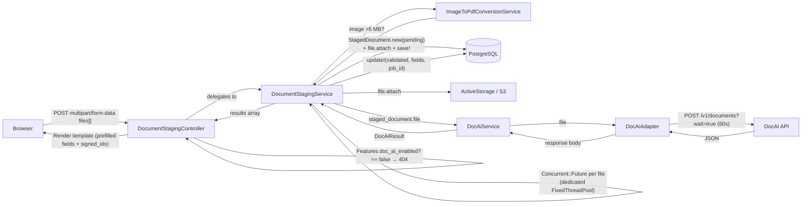

# DocAI Integration

## Problem

OSCER members submit income verification documents (pay stubs) for certification/exemption workflows. Manual staff review is slow and error-prone. DocAI integration enables: realtime document validation, automated field extraction, form prefill, and consistent parsing across PDF, JPEG, PNG, and TIFF files. Confidence-based queue prioritization lets caseworkers focus on submissions that need the most attention. Attribution labels on every activity provide a CMS-auditable trail of how each data point was sourced.

## Architecture

Adapter + service + value object pattern. `wait=true` for synchronous processing (~38s); multiple files processed concurrently via `Concurrent::Future` on a dedicated `FixedThreadPool` (total time ≈ one DocAI call regardless of file count). Feature flag gates the entire flow. Controller delegates to `DocumentStagingService`; images >5MB are converted to PDF before DocAI submission.



## Components

| Component | Responsibility |
|-----------|---------------|
| `DocumentStagingController` | Feature flag guard — returns 404 when `Features.doc_ai_enabled?` is false. Auth (`authorize :document, :create?`), param handling, delegates to `DocumentStagingService#process`. Renders template with prefilled fields and hidden `signed_id` inputs. Controller is responsible only for: auth, param handling, rendering. |
| `DocumentStagingService` | Owns extracted constants: `ALLOWED_CONTENT_TYPES` (`application/pdf`, `image/jpeg`, `image/png`, `image/tiff`), `MAX_FILE_SIZE_BYTES` (30 MB), `MAX_FILE_COUNT` (2), `DOC_AI_THREAD_POOL`, `SUPPORTED_RESULT_CLASSES`. `#process(files:, user:)` validates, dispatches concurrent processing, returns results array. Contains: `process_files_concurrently`, `process_file`, `valid_content_type?`, `valid_file_size?`. Calls `ImageToPdfConversionService` when image file >5MB before DocAI submission. Thread pool creation and lifecycle managed here. Constructor-injected `DocAiService` dependency (testable). `current_user` captured before threading (ActionController helpers not thread-safe). Each Future uses `connection_pool.with_connection`. |
| `ImageToPdfConversionService` | Uses `image_processing` gem (vips backend). `#convert(file)` converts JPEG/PNG/TIFF >5MB to PDF tempfile. Returns original file unchanged if PDF or if image ≤5MB. `IMAGE_SIZE_THRESHOLD = 5.megabytes`. Isolated responsibility: one service, one job. |
| `StagedDocument` | ActiveRecord: `has_one_attached :file`, `belongs_to :user`, `belongs_to :stageable, polymorphic: true`. Status enum: `pending`, `validated`, `rejected`, `failed`. `extracted_fields` JSONB stores full raw DocAI fields response (including confidence scores). `job_id` column. `#average_confidence` returns Float (0.0–1.0) computed as mean of all field confidence values from `extracted_fields`. Retained permanently as audit record. Never purged. |
| `DocAiAdapter` | Extends `DataIntegration::BaseAdapter`. `analyze_document` (sync, `wait=true`), `submit_document` (async POST, no `wait`), `get_job_status` (GET by job ID). Opens blob as `Tempfile` via `file.blob.open` → passes IO to `Faraday::Multipart::FilePart`. |
| `DocAiService` | Extends `DataIntegration::BaseService`. `analyze` (sync), `submit` (async submission), `check_status` (poll job). Builds `DocAiResult` via factory on completion; raises `ProcessingError` on `status: "failed"`; `handle_integration_error` logs warning and returns `nil` (graceful degradation). |
| `DocAiResult` | Base `Strata::ValueObject`. Response envelope, `FieldValue` accessor, self-registration factory (`REGISTRY` hash). Subclass files must be `require_relative`'d before `REGISTRY.freeze`. |
| `DocAiResult::FieldValue` | `Data.define` struct: `value`, `confidence`. `low_confidence?` predicate (threshold: 0.7). All field accessors return `FieldValue` or `nil`. |
| `DocAiResult::Payslip` | Self-registers via `register "Payslip"`. Typed snake_case accessors. Boolean flag accessors unwrap value directly. `to_prefill_fields` returns values-only hash for form rendering. |
| File Validator | Marcel magic-byte detection; `application/pdf`, `image/jpeg`, `image/png`, `image/tiff`; ≤30 MB per file; ≤2 files total. Runs before any DB or DocAI operations. Now lives in `DocumentStagingService`. |

## Feature Flag

Uses existing `Features` module pattern (`config/initializers/feature_flags.rb`):

```ruby
doc_ai: {
  env_var: "FEATURE_DOC_AI",
  default: false,
  description: "Enable DocAI document analysis for income verification"
}
```

**Behavior when disabled**:
- `DocumentStagingController#create` returns 404 (route exists but is gated)
- Members use existing manual document upload flow unchanged
- No DocAI API calls made
- No AI-related UI elements shown (opt-in, disclaimer, etc.)

**Behavior when enabled**:
- Document staging endpoint is accessible
- Member sees opt-in consent and AI disclaimer before upload
- DocAI processes uploaded documents

## Member AI Consent & Disclaimer

**Opt-in/Opt-out**: Before the upload step, member is presented with a choice:
- "Use AI to extract information from your documents" (opt-in → document staging flow)
- "I'll enter my information manually" (opt-out → existing manual upload flow)

**Disclaimer**: When member opts in, display transparency notice:
- AI is used to read and extract information from documents
- AI can make mistakes — member should review extracted values
- Member retains ability to edit all prefilled fields before submission

**Implementation note**: Consent choice does not need persistence — it's a single-page routing decision during the upload flow. The attribution label on the resulting activity provides the audit trail.

## Attribution & Auditing

Five evidence-source statuses provide CMS-auditable tracking of how activity data was sourced:

| Status Label | Meaning | How Determined |
|---|---|---|
| `state_provided` | Data from ex parte / external data sources | Activity type is `ExPartActivity` (no member upload involved) |
| `self_reported` | Member manually entered and uploaded | No `StagedDocument` associated with activity (member opted out of AI or feature flag off) |
| `ai_assisted` | Member uploaded, AI extracted, caseworker reviewed | `StagedDocument` exists with `status: :validated`; all comparable prefill values match activity's submitted values |
| `ai_assisted_with_member_edits` | Member uploaded, AI extracted, member corrected before submission | `StagedDocument` exists with `status: :validated`; one or more prefill values differ from activity's submitted values |
| `ai_rejected_member_override` | DocAI rejected document, member proceeded anyway, caseworker reviews | `StagedDocument` exists with `status: :rejected` and member chose to continue (nice-to-have) |

**Storage**: New `evidence_source` string column on `activities` table (enum on model). Set at activity creation time based on the flow path taken.

**Comparison logic** (for `ai_assisted` vs `ai_assisted_with_member_edits`):
- Rebuild `DocAiResult` from `StagedDocument#extracted_fields` JSONB
- Call `to_prefill_fields` to get the values DocAI would have prefilled
- Compare against the activity's stored attributes (`income`, `name`, `month`, etc.)
- If all mapped fields match → `ai_assisted`; if any differ → `ai_assisted_with_member_edits`
- Implemented as `Activity#determine_evidence_source` or a dedicated service

## Staff Case Worker View

**Location**: `certification_cases#show` → Activity Report accordion → `_staff_activity_report.html.erb` partial

**New columns added to the staff activity report table**:

| Column | Content |
|---|---|
| Evidence Source | Attribution tag rendered as a `usa-tag` (e.g., "AI Assisted", "Self Reported") |
| Confidence | Average confidence score as percentage (e.g., "87.3%"). Only shown for `ai_assisted` or `ai_assisted_with_member_edits` activities. Blank for `self_reported`/`state_provided`. |

**Aggregated confidence score**:
- Computed as mean of all field confidence values from `StagedDocument#extracted_fields`
- Model method: `StagedDocument#average_confidence` → returns Float (0.0–1.0)
- Displayed as percentage in the view

**Caseworker queue prioritization**:
- Staff dashboard task queue (`staff/dashboard/index.html.erb`) extended with confidence-based sorting
- Tasks linked to activities with `ai_assisted` and high confidence → lower priority (quick review)
- Tasks linked to `ai_assisted_with_member_edits`, `ai_rejected_member_override`, or low confidence → higher priority (needs deeper review)
- Configurable threshold via `DOC_AI_LOW_CONFIDENCE_THRESHOLD` (existing env var, default 0.7)

**Association needed**: `Activity has_many :staged_documents, as: :stageable` (inverse of existing polymorphic)

## Activity Attachment Flow

After DocAI validates files, `DocumentStagingController` renders hidden signed ID fields (HMAC-signed, 1-hour expiry via `ActiveRecord::SignedId`):

```html
<input type="hidden" name="activity[staged_document_signed_ids][]" value="signed_id_1">
<input type="hidden" name="activity[staged_document_signed_ids][]" value="signed_id_2">
```

`ActivitiesController#create` iterates signed IDs, resolves via `find_signed`, attaches blob to activity (no S3 copy — same blob shared), marks staged doc consumed, skips documents upload page:

```ruby
if (signed_ids = activity_params[:staged_document_signed_ids]).present?
  signed_ids.each do |sid|
    staged = StagedDocument.find_signed(sid)
    next unless staged&.validated?
    @activity.supporting_documents.attach(staged.file.blob)
    staged.update!(stageable: @activity)
  end
  redirect_to activity_report_application_form_path(@activity_report_application_form),
              notice: t(".created_with_document")
else
  redirect_to documents_activity_report_application_form_activity_path(
                @activity_report_application_form, @activity)
end
```

Permitted params addition:
```ruby
def activity_params
  params.require(:activity).permit(
    :month, :name, :hours, :income, :activity_type, :category,
    staged_document_signed_ids: []
  )
end
```

Expired/non-validated signed IDs are skipped gracefully. Fallback to manual upload page preserved when no signed IDs present.

## API Interface

### Synchronous (wait=true)

| Property | Value |
|----------|-------|
| URL | `/v1/documents` |
| Method | `POST` |
| Query param | `wait=true` |
| Content-Type | `multipart/form-data` |
| Timeout | 60s (open_timeout: 10s) |

### Asynchronous

#### Submit document

| Property | Value |
|----------|-------|
| URL | `/v1/documents` |
| Method | `POST` |
| Query param | _(none)_ |
| Content-Type | `multipart/form-data` |
| Response | `{ "jobId": "...", "status": "not_started" }` |

#### Poll job status

| Property | Value |
|----------|-------|
| URL | `/v1/documents/{job_id}` |
| Method | `GET` |
| Response | Job object with `status`: `processing`, `completed`, or `failed` |

### Async Response Examples

**Not started (POST response)**:
```json
{
  "jobId": "abc-123",
  "status": "not_started"
}
```

**Processing (GET response)**:
```json
{
  "job_id": "abc-123",
  "status": "processing"
}
```

**Completed (GET response)**:
```json
{
  "job_id": "d773fa8f-3cc7-47d8-be78-4125c190c290",
  "status": "completed",
  "matchedDocumentClass": "Payslip",
  "message": "Document processed successfully",
  "totalProcessingTimeSeconds": 38.6,
  "fields": {
    "currentgrosspay": { "confidence": 0.93, "value": 1627.74 }
  }
}
```

> **Note:** The POST response uses `jobId` (camelCase) while the GET response uses `job_id` (snake_case). The adapter returns raw response bodies as-is; the service/result layer handles normalization.

### Success Response (HTTP 200 — Payslip)

```json
{
  "job_id": "d773fa8f-3cc7-47d8-be78-4125c190c290",
  "status": "completed",
  "createdAt": "2026-02-23T18:26:50.830294+00:00",
  "completedAt": "2026-02-23T18:27:29.434195+00:00",
  "totalProcessingTimeSeconds": 38.6,
  "matchedDocumentClass": "Payslip",
  "message": "Document processed successfully",
  "fields": {
    "payperiodstartdate":      { "confidence": 0.91, "value": "2017-07-10" },
    "currentgrosspay":         { "confidence": 0.93, "value": 1627.74 },
    "isGrossPayValid":         { "confidence": 0.87, "value": true }
  }
}
```

### Failed Job Response (HTTP 200)

```json
{
  "job_id": "a4187dd2-8ccd-4e6f-b7a7-164092e49eca",
  "status": "failed",
  "error": "Handler handler failed: '>' not supported between instances of 'int' and 'ConfigDefaults'"
}
```

### HTTP Error Response

```json
{ "detail": "There was an error parsing the body" }
```

## Field Reference — Payslip

> Field names in API responses are **lowercased and concatenated** (e.g., `payperiodstartdate` = `PayPeriodStartDate`). Dot-notation compound fields become `employeename.firstname`. Boolean flag accessors return `true`/`false` directly (not `FieldValue`).

| API Field Key | Ruby Accessor | Type |
|---|---|---|
| `payperiodstartdate` | `pay_period_start_date` | String |
| `payperiodenddate` | `pay_period_end_date` | String |
| `paydate` | `pay_date` | String |
| `currentgrosspay` | `current_gross_pay` | Numeric |
| `currentnetpay` | `current_net_pay` | Numeric |
| `currenttotaldeductions` | `current_total_deductions` | Numeric |
| `ytdgrosspay` | `ytd_gross_pay` | Numeric |
| `ytdnetpay` | `ytd_net_pay` | Numeric |
| `ytdfederaltax` | `ytd_federal_tax` | Numeric |
| `ytdstatetax` | `ytd_state_tax` | Numeric |
| `ytdcitytax` | `ytd_city_tax` | Numeric |
| `ytdtotaldeductions` | `ytd_total_deductions` | Numeric |
| `regularhourlyrate` | `regular_hourly_rate` | Numeric |
| `holidayhourlyrate` | `holiday_hourly_rate` | Numeric |
| `currency` | `currency` | String |
| `federalfilingstatus` | `federal_filing_status` | String |
| `statefilingstatus` | `state_filing_status` | String |
| `payrollnumber` | `payroll_number` | String |
| `employeenumber` | `employee_number` | String |
| `employeename.firstname` | `employee_first_name` | String |
| `employeename.middlename` | `employee_middle_name` | String |
| `employeename.lastname` | `employee_last_name` | String |
| `employeename.suffixname` | `employee_suffix_name` | String |
| `employeeaddress.line1` | `employee_address_line1` | String |
| `employeeaddress.line2` | `employee_address_line2` | String |
| `employeeaddress.city` | `employee_address_city` | String |
| `employeeaddress.state` | `employee_address_state` | String |
| `employeeaddress.zipcode` | `employee_address_zipcode` | String |
| `companyaddress.line1` | `company_address_line1` | String |
| `companyaddress.line2` | `company_address_line2` | String |
| `companyaddress.city` | `company_address_city` | String |
| `companyaddress.state` | `company_address_state` | String |
| `companyaddress.zipcode` | `company_address_zipcode` | String |
| `federaltaxes.itemdescription` | `federal_taxes_description` | String |
| `federaltaxes.ytd` | `federal_taxes_ytd` | Numeric |
| `federaltaxes.period` | `federal_taxes_period` | Numeric |
| `statetaxes.itemdescription` | `state_taxes_description` | String |
| `statetaxes.ytd` | `state_taxes_ytd` | Numeric |
| `statetaxes.period` | `state_taxes_period` | Numeric |
| `citytaxes.itemdescription` | `city_taxes_description` | String |
| `citytaxes.ytd` | `city_taxes_ytd` | Numeric |
| `citytaxes.period` | `city_taxes_period` | Numeric |
| `isGrossPayValid` | `gross_pay_valid?` | Boolean |
| `isYtdGrossPayHighest` | `ytd_gross_pay_highest?` | Boolean |
| `areFieldNamesSufficient` | `field_names_sufficient?` | Boolean |

## Error Handling

| Scenario | HTTP | Handling |
|----------|------|----------|
| Feature flag disabled | — | Controller returns 404; member uses manual upload flow |
| Bad request / parse failure | 4xx | `DocAiAdapter#handle_error` → raises `ApiError` |
| Server error | 5xx | `BaseAdapter#handle_server_error` → raises `ServerError` |
| Network failure | — | `BaseAdapter#handle_connection_error` → raises `ApiError` |
| Request timeout (>60s) | — | Faraday `TimeoutError` → caught as `ApiError` → `handle_integration_error` returns `nil` |
| DocAI processing failed | 200 | `DocAiService` checks `result.failed?` → raises `ProcessingError` |
| Image conversion failure | — | Log warning; proceed with original file (graceful degradation) |
| Graceful degradation | any | `handle_integration_error` logs warning, returns `nil`; service sets `StagedDocument` to `status: :failed` |
| Unrecognised document type | 200 | Service checks `SUPPORTED_RESULT_CLASSES.any?`; sets `status: :rejected`; returns error |

`SUPPORTED_RESULT_CLASSES`: `[DocAiResult::Payslip]`

## Route

```ruby
# config/routes.rb (inside localized block)
resource :document_staging, only: [:create], controller: "document_staging"
# → POST /document_staging → DocumentStagingController#create
```

## Configuration

```ruby
# config/initializers/doc_ai.rb
Rails.application.config.doc_ai = {
  api_host:                 ENV.fetch("DOC_AI_API_HOST"),
  timeout_seconds:          ENV.fetch("DOC_AI_TIMEOUT_SECONDS", "60").to_i,
  low_confidence_threshold: ENV.fetch("DOC_AI_LOW_CONFIDENCE_THRESHOLD", "0.7").to_f,
  thread_pool_size:         ENV.fetch("DOC_AI_THREAD_POOL_SIZE", "4").to_i
}
```

```ruby
# config/initializers/feature_flags.rb (add to FEATURE_FLAGS hash)
doc_ai: {
  env_var: "FEATURE_DOC_AI",
  default: false,
  description: "Enable DocAI document analysis for income verification"
}
```

```bash
# local.env.example
DOC_AI_API_HOST=http://localhost:8000
DOC_AI_TIMEOUT_SECONDS=60
DOC_AI_LOW_CONFIDENCE_THRESHOLD=0.7
DOC_AI_THREAD_POOL_SIZE=4   # default: MAX_FILE_COUNT * 2
FEATURE_DOC_AI=false
```

> **Puma/rack-timeout**: Must allow requests >60s on upload endpoint (recommended: 75s minimum).
> **DB connection pool**: Each concurrent file holds one connection for ~38–60s. With `MAX_FILE_COUNT=2`, up to 2 additional connections per upload request.
> **`image_processing` gem**: Required for `ImageToPdfConversionService`. Uses vips backend (faster than ImageMagick). Already in Gemfile (commented out by default in Rails).

## Files to Create

| File | Purpose |
|------|---------|
| `app/models/staged_document.rb` | Model: status enum, `has_one_attached :file`, `extracted_fields` JSONB, `#average_confidence` |
| `db/migrate/<ts>_create_staged_documents.rb` | Migration: uuid pk, status, doc_ai_job_id, extracted_fields, user_id, stageable polymorphic |
| `app/controllers/document_staging_controller.rb` | See Components table |
| `app/services/document_staging_service.rb` | Extracted controller logic: validation, concurrency, processing orchestration |
| `app/services/image_to_pdf_conversion_service.rb` | Converts JPEG/PNG/TIFF >5MB to PDF via image_processing gem (vips) |
| `app/views/document_staging/create.html.erb` | Prefilled fields + hidden `staged_document_signed_ids[]` inputs + inline errors |
| `app/adapters/doc_ai_adapter.rb` | Extends `DataIntegration::BaseAdapter`; multipart POST |
| `app/services/doc_ai_service.rb` | Extends `DataIntegration::BaseService` |
| `app/models/doc_ai_result.rb` | Base value object + `FieldValue` struct + factory |
| `app/models/doc_ai_result/payslip.rb` | Payslip subclass |
| `config/initializers/doc_ai.rb` | App config |
| `app/policies/document_policy.rb` | Pundit: `authorize :document, :create?` |
| `db/migrate/<ts>_add_evidence_source_to_activities.rb` | Adds `evidence_source` string column to activities |
| `spec/models/staged_document_spec.rb` | Model validations, enum, `#average_confidence` |
| `spec/controllers/document_staging_controller_spec.rb` | Feature flag guard, delegation, error handling |
| `spec/services/document_staging_service_spec.rb` | Validation, concurrency, delegation |
| `spec/services/image_to_pdf_conversion_service_spec.rb` | Conversion tests: threshold, format handling, passthrough |
| `spec/adapters/doc_ai_adapter_spec.rb` | WebMock stubs |
| `spec/services/doc_ai_service_spec.rb` | Service tests |
| `spec/models/doc_ai_result_spec.rb` | Base value object |
| `spec/models/doc_ai_result/payslip_spec.rb` | Payslip accessors |

## Files to Modify

| File | Change |
|------|--------|
| `Gemfile` | Add `faraday-multipart` if not present; uncomment `image_processing` gem |
| `local.env.example` | Add `DOC_AI_API_HOST`, `DOC_AI_TIMEOUT_SECONDS`, `DOC_AI_LOW_CONFIDENCE_THRESHOLD`, `DOC_AI_THREAD_POOL_SIZE`, `FEATURE_DOC_AI` |
| `config/routes.rb` | Add `resource :document_staging` inside localized block |
| `config/initializers/feature_flags.rb` | Add `doc_ai` feature flag entry |
| `app/controllers/activities_controller.rb` | Permit `staged_document_signed_ids: []`; iterate `find_signed`, attach blobs, set `stageable`, skip upload redirect |
| `app/models/activity.rb` | Add `has_many :staged_documents, as: :stageable`; add `evidence_source` enum; add `#determine_evidence_source` |
| `app/models/staged_document.rb` | Add `#average_confidence` method |
| `app/views/activity_report_application_forms/_staff_activity_report.html.erb` | Add Evidence Source and Confidence columns |
| `app/views/staff/dashboard/index.html.erb` | Add confidence-based sort to task queue |

## Key Decisions

- **`wait=true` synchronous**: Realtime validation is required UX; background processing adds polling/WebSocket complexity with no benefit.
- **`Concurrent::Future` on dedicated `FixedThreadPool`**: Sequential processing of N files would take N×38s; concurrent keeps it at ~38s. Dedicated pool isolates DocAI from global concurrent-ruby IO pool (prevents starving ActiveStorage callbacks).
- **`signed_id` not raw UUID**: Prevents IDOR without a DB membership query. 1-hour expiry. `find_signed` returns `nil` on expiry → falls back to manual upload (graceful degradation).
- **Blob sharing not copying**: `attach(staged.file.blob)` creates a new `active_storage_attachments` row pointing at same S3 object. No storage duplication.
- **`StagedDocument` as permanent audit record**: `stageable` polymorphic association set on consumption. Never purged — blob safe from premature deletion.
- **`FieldValue` struct**: Pairs value + confidence so callers cannot ignore confidence. `to_prefill_fields` provides values-only hash for form rendering.
- **Raw JSONB for `extracted_fields`**: Full DocAI fields response stored (not stripped). No data lost at persistence; staff can review low-confidence fields without replaying DocAI.
- **Self-registering subclasses**: `register "ClassName"` in each subclass populates `REGISTRY`. Adding a new document type requires only a new subclass — `DocAiResult` and `DocumentStagingService` need no changes.
- **`DocAiService` receives ActiveStorage attachment**: Works with stored copy (not transient upload object). `blob.open` streams from S3 to tempfile for Faraday upload.
- **Server-rendered prefill**: Controller renders HTML template (not JSON). No client-side JS upload controller needed.
- **Double-submit prevention**: Submit button uses `data-turbo-submits-with` / `data-disable-with` — disabled after first click until response renders (~38s).
- **Authorization**: `authorize :document, :create?` at top of `#create`. Requires `DocumentPolicy`.
- **Graceful degradation**: When `staged_document_signed_ids` absent, existing documents upload page redirect is preserved unchanged. `handle_integration_error` returns `nil` rather than raising.
- **Feature flag via `Features` module**: Reuses proven pattern; ENV-based; default off; no code path changes when disabled.
- **Evidence source on Activity, not StagedDocument**: Attribution describes the *submission flow*, not the document. One activity = one evidence source. Stored as enum for query efficiency.
- **Average confidence**: Simple mean across all fields — intuitive for staff, no weighting complexity. Full per-field confidence preserved in JSONB for drill-down.
- **Image conversion at 5MB**: Matches DocAI API limitation for image files. `image_processing` gem (vips backend) already in Gemfile; faster than ImageMagick.
- **Controller extraction (SRP)**: Controller handles HTTP only; service owns validation, threading, orchestration. Enables testing without controller context.
- **Member opt-in is a routing decision, not persisted consent**: The `evidence_source` label on the resulting activity provides the audit trail. No separate consent record needed.
- **Member override of DocAI rejection (nice-to-have)**: When DocAI rejects a document, member can proceed; `ai_rejected_member_override` label flags it for caseworker manual review.

## Extending for New Document Types

Create subclass, call `register "ClassName"`, implement `to_prefill_fields`. Add `require_relative "doc_ai_result/new_type"` inside `DocAiResult` class body before `REGISTRY.freeze`. No other files change.

## Future Considerations

**Authentication**: DocAI endpoint authentication can be added via `DataIntegration::BaseAdapter`'s `before_request` hook:

```ruby
before_request :set_auth_header
def set_auth_header
  # @connection.headers["Authorization"] = "Bearer #{...}"
end
```
