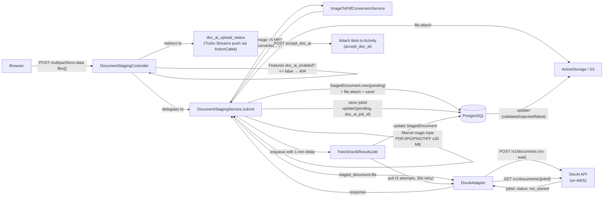

# DocAI Integration

## Problem

OSCER members submit income verification documents (pay stubs) for certification/exemption workflows. Manual staff review is slow and error-prone. DocAI integration enables: realtime document validation, automated field extraction, form prefill, and consistent parsing across PDF, JPEG, PNG, and TIFF files. Confidence-based queue prioritization lets caseworkers focus on submissions that need the most attention. Attribution labels on every activity provide a CMS-auditable trail of how each data point was sourced.

## Architecture

Adapter + service + value object pattern. **Asynchronous processing** via background job polling: submit to DocAI → receive `jobId` → `FetchDocAiResultsJob` polls for results on a retry schedule (max 5 attempts). Feature flag gates the entire flow. Controller delegates to `DocumentStagingService`; images >5MB are converted to PDF before DocAI submission.



## Components

| Component | Responsibility |
|-----------|---------------|
| `DocumentStagingController` | Three actions: `create` (upload), `doc_ai_upload_status` (status page), `lookup` (retrieve existing staged documents by ID). Auth via `StagedDocumentPolicy` (`authorize StagedDocument`), param handling, delegates to `DocumentStagingService#submit`. Redirects to `doc_ai_upload_status` after submission. Controller is responsible only for: auth, param handling, HTTP flow. |
| `DocumentStagingService` | Owns constants: `ALLOWED_CONTENT_TYPES` (`application/pdf`, `image/jpeg`, `image/png`, `image/tiff`), `MAX_FILE_SIZE_BYTES` (30 MB), `MAX_FILE_COUNT` (10), `SUPPORTED_RESULT_CLASSES`. `#submit(files:, user:)` validates files, calls `ImageToPdfConversionService`, submits async to DocAI via `DocAiAdapter#analyze_document_async`, stores `jobId` on `StagedDocument`, enqueues `FetchDocAiResultsJob` with 1-minute initial delay. `#fetch_results(staged_document_ids:)` called by background job: polls `DocAiAdapter#get_document_status`, updates `StagedDocument` status (validated/rejected/failed), returns early if all resolved. Constructor-injected `DocAiService` dependency. |
| `ImageToPdfConversionService` | Uses `image_processing` gem (vips backend). `#convert(file)` converts JPEG/PNG/TIFF >5MB to PDF tempfile. Returns original file unchanged if PDF or if image ≤5MB. `IMAGE_SIZE_THRESHOLD = 5.megabytes`. Logs warning on conversion failure; returns original file (graceful degradation). |
| `StagedDocument` | ActiveRecord: `has_one_attached :file`, `belongs_to :user`, `belongs_to :stageable, polymorphic: true`. Status enum: `pending`, `validated`, `rejected`, `failed`. `doc_ai_job_id` stores the job ID from async submission. `doc_ai_matched_class` stores the matched document class name returned by DocAI (e.g. `"Payslip"`). `extracted_fields` JSONB stores full raw DocAI fields response (including confidence scores) when completed. `validated_at` records when the document reached `validated` status. `#average_confidence` returns Float (0.0–1.0) computed as mean of all field confidence values; `nil` if blank. Once attached to an `Activity` (`stageable` set), retained as part of the audit trail. Unattached rows older than the configured retention are removed by [staged document cleanup](#staged-document-cleanup) (record + ActiveStorage blob). |
| `FetchDocAiResultsJob` | Background job (queued `:default`). `MAX_ATTEMPTS = 5`. Polls `DocAiService#check_status(jobId)` for each pending `StagedDocument`. When completed/failed, calls `update_from_result` to set final status + `extracted_fields`. If still pending after 5 attempts, bulk-updates all remaining docs to `failed`. Re-enqueues itself with 30-second wait between attempts. |
| `DocAiAdapter` | Extends `DataIntegration::BaseAdapter`. `analyze_document_async(file:)` — POST to `/v1/documents` (no `wait` param), returns raw response with `jobId`. `get_document_status(job_id:)` — GET `/v1/documents/{job_id}` with `include_extracted_data=true`, returns full response envelope. Opens blob via `file.blob.open` → wraps in `Faraday::Multipart::FilePart`. Timeout: 60s (configurable). |
| `DocAiService` | Extends `DataIntegration::BaseService`. `analyze_async(file:)` calls adapter, returns raw response hash. `check_status(job_id:)` calls adapter; dispatches on status: returns `DocAiResult` when completed, raises `ProcessingError` on failed, returns raw hash when still processing. `handle_integration_error` logs warning, returns `nil` (graceful degradation). |
| `DocAiResult` | Base `Strata::ValueObject`. Response envelope, `FieldValue` accessor, self-registration factory (`REGISTRY` hash). Subclass files must be `require_relative`'d before `REGISTRY.freeze`. Factory method: `DocAiResult.from_response(response)` dispatches on `matchedDocumentClass`. |
| `DocAiResult::FieldValue` | `Data.define` struct: `value`, `confidence`. `low_confidence?` predicate (threshold: configurable, default 0.7). All field accessors return `FieldValue` or `nil`. |
| `DocAiResult::Payslip` | Self-registers via `register "Payslip"`. ~40 typed snake_case accessors. Boolean flag accessors unwrap value directly (not `FieldValue`). `to_prefill_fields` returns values-only hash for form rendering. |
| File Validator | Marcel magic-byte detection; `application/pdf`, `image/jpeg`, `image/png`, `image/tiff`; ≤30 MB per file; ≤10 files total. Runs in `DocumentStagingService#submit` before any DB or DocAI operations. |

## Feature Flag

Uses existing `Features` module pattern (`config/initializers/feature_flags.rb`):

```ruby
doc_ai: {
  env_var: "FEATURE_DOC_AI",
  default: false,
  description: "Enable DocAI document analysis for income verification"
}
```

**Behavior when disabled**:
- `DocumentStagingController#create` returns 404 (route exists but is gated)
- Members use existing manual document upload flow unchanged
- No DocAI API calls made
- No AI-related UI elements shown (opt-in, disclaimer, etc.)

**Behavior when enabled**:
- Document staging endpoint is accessible
- Member sees opt-in consent and AI disclaimer before upload
- DocAI processes uploaded documents

## Staged document cleanup

Uploads create `StagedDocument` rows before an `Activity` exists; if the member abandons the flow, rows stay unattached (`stageable_type` is `NULL`) and accumulate. A scheduled task removes orphans past a configurable age so the database and object storage do not grow unbounded.

| Setting | Environment variable | Default | Purpose |
|--------|----------------------|---------|---------|
| Enable/disable | `STAGED_DOCUMENT_CLEANUP_ENABLED` | `true` | When `false`, the rake task logs and exits without deleting |
| Retention | `STAGED_DOCUMENT_RETENTION_DAYS` | `7` | Delete unattached documents with `created_at` strictly before _now − N days_ |
| Schedule | `STAGED_DOCUMENT_CLEANUP_SCHEDULE` | `0 2 * * *` | GoodJob cron for `CleanupStagedDocumentsJob` (`config/initializers/good_job.rb`); optional host cron can still run the rake task instead |

Loaded in `config/initializers/doc_ai.rb` as `Rails.application.config.doc_ai` keys: `staged_document_cleanup_enabled`, `staged_document_retention_days`, `staged_document_cleanup_schedule`.

**GoodJob**: `CleanupStagedDocumentsJob` runs on the schedule above (see [background jobs](../../reporting-app/background-jobs.md)). It calls the same logic as the rake task.

**Rake task**: `bundle exec rake doc_ai:cleanup_staged_documents` (manual runs or non–GoodJob cron).

- Deletes rows where `stageable_type IS NULL` and `created_at` is older than the retention window, for **all** statuses (`pending`, `validated`, `rejected`, `failed`).
- For each row: `file.purge` (ActiveStorage blob + storage), then `destroy`.
- Logs a single summary line to stdout and `Rails.logger` with count deleted and approximate bytes freed.
- **Dry run**: `bundle exec rake doc_ai:cleanup_staged_documents -- --dry-run` (the `--` passes `--dry-run` through Rake). Computes the same scope and totals without purging or destroying.

**Cron example** (align with `STAGED_DOCUMENT_CLEANUP_SCHEDULE`):

```cron
0 2 * * * cd /path/to/reporting-app && bundle exec rake doc_ai:cleanup_staged_documents
```

## Member AI Consent & Disclaimer

**Opt-in/Opt-out**: Before the upload step, member is presented with a choice:
- "Use AI to extract information from your documents" (opt-in → document staging flow)
- "I'll enter my information manually" (opt-out → existing manual upload flow)

**Disclaimer**: When member opts in, display transparency notice:
- AI is used to read and extract information from documents
- AI can make mistakes — member should review extracted values
- Member retains ability to edit all prefilled fields before submission

**Implementation note**: Consent choice does not need persistence — it's a single-page routing decision during the upload flow. The attribution label on the resulting activity provides the audit trail.

## Attribution & Auditing

Five evidence-source statuses provide CMS-auditable tracking of how activity data was sourced:

| Status Label | Meaning | How Determined |
|---|---|---|
| `STATE_PROVIDED` | Data from ex parte / external data sources | Activity type is `ExPartActivity` (no member upload involved) |
| `SELF_REPORTED` | Member manually entered and uploaded | No `StagedDocument` associated with activity (member opted out of AI or feature flag off) |
| `AI_ASSISTED` | Member uploaded, AI extracted, member submitted unchanged | `StagedDocument` exists with `status: :validated`; all comparable prefill values match activity's submitted values |
| `AI_ASSISTED_WITH_MEMBER_EDITS` | Member uploaded, AI extracted, member corrected before submission | `StagedDocument` exists with `status: :validated`; one or more prefill values differ from activity's submitted values |
| `AI_REJECTED_MEMBER_OVERRIDE` | DocAI rejected document, member proceeded anyway, caseworker reviews | `StagedDocument` exists with `status: :rejected` and member chose to continue (nice-to-have) |

### Data Model

**Constants**: Defined in `app/models/activity_attributions.rb` as string constants (`SELF_REPORTED`, `AI_ASSISTED`, etc.).

**Storage**: `evidence_source` column on `activities` table — stored as string (no DB-level enum constraint). Set at activity creation time based on flow path.

**Activity model grouping**: `Activity` model defines:
- `AI_SOURCED_EVIDENCE_SOURCES = [AI_ASSISTED, AI_ASSISTED_WITH_MEMBER_EDITS]` — sources where DocAI contributed
- `NON_AI_EVIDENCE_SOURCES = [SELF_REPORTED, AI_REJECTED_MEMBER_OVERRIDE]` — sources with no AI extraction
- Predicates: `ai_sourced?`, `self_reported?`

**Confidence lookup**: `DocAiConfidenceService` provides batch confidence queries:
- `confidence_by_activity_id(activity_ids)` — returns `{ activity_id => avg_confidence }` hash
- `confidence_by_case_id(case_ids)` — averages confidences per case (for task queue)
- Uses `unscoped` to bypass default eager-load of attached files (only `extracted_fields` JSONB needed)

**Comparison logic** (for `AI_ASSISTED` vs `AI_ASSISTED_WITH_MEMBER_EDITS`):
- Rebuild `DocAiResult` from `StagedDocument#extracted_fields` JSONB
- Call `to_prefill_fields` to get values DocAI would have prefilled
- Compare against activity's stored attributes (`income`, `name`, `month`, etc.)
- If all mapped fields match → `AI_ASSISTED`; if any differ → `AI_ASSISTED_WITH_MEMBER_EDITS`

## Staff Case Worker View

**Location**: `certification_cases#show` → Activity Report accordion → `_staff_activity_report.html.erb` partial

**New columns added to the staff activity report table**:

| Column | Content |
|---|---|
| Evidence Source | Attribution tag rendered as a `usa-tag` (e.g., "AI Assisted", "Self Reported") |
| Confidence | Average confidence score as percentage (e.g., "87.3%"). Only shown for `ai_assisted` or `ai_assisted_with_member_edits` activities. Blank for `self_reported`/`state_provided`. |

**Aggregated confidence score**:
- Computed as mean of all field confidence values from `StagedDocument#extracted_fields`
- Model method: `StagedDocument#average_confidence` → returns Float (0.0–1.0)
- Displayed as percentage in the view

**Caseworker queue prioritization**:
- Staff dashboard task queue (`staff/dashboard/index.html.erb`) extended with confidence-based sorting
- Tasks linked to activities with `ai_assisted` and high confidence → lower priority (quick review)
- Tasks linked to `ai_assisted_with_member_edits`, `ai_rejected_member_override`, or low confidence → higher priority (needs deeper review)
- Configurable threshold via `DOC_AI_LOW_CONFIDENCE_THRESHOLD` (existing env var, default 0.7)

**Association needed**: `Activity has_many :staged_documents, as: :stageable` (inverse of existing polymorphic)

## Activity Attachment Flow

After DocAI validates files, `doc_ai_upload_status` renders `_results.html.erb` listing the validated documents. The member confirms and submits a form that POSTs to `activity_report_application_forms/:id/accept_doc_ai` (`ActivityReportApplicationFormsController#accept_doc_ai`), which:

1. Resolves the validated `StagedDocument` records from hidden `staged_document_ids[]` inputs
2. Attaches their blobs to the relevant activity (no S3 copy — same blob shared via `attach(staged.file.blob)`)
3. Sets `stageable` on each `StagedDocument` (marks as consumed; prevents premature cleanup)
4. Redirects to the next step in the activity report flow

Members can also use an "upload more" form (POST back to `document_staging`) to add additional documents before confirming.

## API Interface

### Status Updates — Server-Side Push via Turbo Streams

`DocumentStagingController#doc_ai_upload_status` renders the waiting page. There is no client-side polling.

- The view subscribes to a per-batch ActionCable channel via `turbo_stream_from "document_staging_batch_#{@batch_key}"` (only active while processing).
- A `<turbo-frame id="document_staging_status">` wraps the status content (processing modal or results partial).
- When `FetchDocAiResultsJob` completes, it broadcasts two Turbo Stream updates over WebSocket:
  1. `Turbo::StreamsChannel.broadcast_replace_to("document_staging_batch_#{batch_key}", target: "document_staging_status", partial: "document_staging/results", ...)` — replaces the frame with the results view.
  2. `broadcast_update_to(...)` with target `flash-messages` — renders the upload notification partial.
- No page reload or redirect is needed; the push updates the frame in-place.

### Synchronous (wait=true)

| Property | Value |
|----------|-------|
| URL | `/v1/documents` |
| Method | `POST` |
| Query param | `wait=true` |
| Content-Type | `multipart/form-data` |
| Timeout | 60s (open_timeout: 10s) |

### Asynchronous

#### Submit document

| Property | Value |
|----------|-------|
| URL | `/v1/documents` |
| Method | `POST` |
| Query param | _(none)_ |
| Content-Type | `multipart/form-data` |
| Response | `{ "jobId": "...", "status": "not_started" }` |

#### Poll job status

| Property | Value |
|----------|-------|
| URL | `/v1/documents/{job_id}` |
| Method | `GET` |
| Response | Job object with `status`: `processing`, `completed`, or `failed` |

### Async Response Examples

**Not started (POST response)**:
```json
{
  "jobId": "abc-123",
  "status": "not_started"
}
```

**Processing (GET response)**:
```json
{
  "job_id": "abc-123",
  "status": "processing"
}
```

**Completed (GET response)**:
```json
{
  "job_id": "d773fa8f-3cc7-47d8-be78-4125c190c290",
  "status": "completed",
  "matchedDocumentClass": "Payslip",
  "message": "Document processed successfully",
  "totalProcessingTimeSeconds": 38.6,
  "fields": {
    "currentgrosspay": { "confidence": 0.93, "value": 1627.74 }
  }
}
```

> **Note:** The POST response uses `jobId` (camelCase) while the GET response uses `job_id` (snake_case). The adapter returns raw response bodies as-is; the service/result layer handles normalization.

### Success Response (HTTP 200 — Payslip)

```json
{
  "job_id": "d773fa8f-3cc7-47d8-be78-4125c190c290",
  "status": "completed",
  "createdAt": "2026-02-23T18:26:50.830294+00:00",
  "completedAt": "2026-02-23T18:27:29.434195+00:00",
  "totalProcessingTimeSeconds": 38.6,
  "matchedDocumentClass": "Payslip",
  "message": "Document processed successfully",
  "fields": {
    "payperiodstartdate":      { "confidence": 0.91, "value": "2017-07-10" },
    "currentgrosspay":         { "confidence": 0.93, "value": 1627.74 },
    "isGrossPayValid":         { "confidence": 0.87, "value": true }
  }
}
```

### Failed Job Response (HTTP 200)

```json
{
  "job_id": "a4187dd2-8ccd-4e6f-b7a7-164092e49eca",
  "status": "failed",
  "error": "Handler handler failed: '>' not supported between instances of 'int' and 'ConfigDefaults'"
}
```

### HTTP Error Response

```json
{ "detail": "There was an error parsing the body" }
```

## Field Reference — Payslip

> Field names in API responses are **lowercased and concatenated** (e.g., `payperiodstartdate` = `PayPeriodStartDate`). Dot-notation compound fields become `employeename.firstname`. Boolean flag accessors return `true`/`false` directly (not `FieldValue`).

| API Field Key | Ruby Accessor | Type |
|---|---|---|
| `payperiodstartdate` | `pay_period_start_date` | String |
| `payperiodenddate` | `pay_period_end_date` | String |
| `paydate` | `pay_date` | String |
| `currentgrosspay` | `current_gross_pay` | Numeric |
| `currentnetpay` | `current_net_pay` | Numeric |
| `currenttotaldeductions` | `current_total_deductions` | Numeric |
| `ytdgrosspay` | `ytd_gross_pay` | Numeric |
| `ytdnetpay` | `ytd_net_pay` | Numeric |
| `ytdfederaltax` | `ytd_federal_tax` | Numeric |
| `ytdstatetax` | `ytd_state_tax` | Numeric |
| `ytdcitytax` | `ytd_city_tax` | Numeric |
| `ytdtotaldeductions` | `ytd_total_deductions` | Numeric |
| `regularhourlyrate` | `regular_hourly_rate` | Numeric |
| `holidayhourlyrate` | `holiday_hourly_rate` | Numeric |
| `currency` | `currency` | String |
| `federalfilingstatus` | `federal_filing_status` | String |
| `statefilingstatus` | `state_filing_status` | String |
| `payrollnumber` | `payroll_number` | String |
| `companyname` | `company_name` | String |
| `employeenumber` | `employee_number` | String |
| `employeename.firstname` | `employee_first_name` | String |
| `employeename.middlename` | `employee_middle_name` | String |
| `employeename.lastname` | `employee_last_name` | String |
| `employeename.suffixname` | `employee_suffix_name` | String |
| `employeeaddress.line1` | `employee_address_line1` | String |
| `employeeaddress.line2` | `employee_address_line2` | String |
| `employeeaddress.city` | `employee_address_city` | String |
| `employeeaddress.state` | `employee_address_state` | String |
| `employeeaddress.zipcode` | `employee_address_zipcode` | String |
| `companyaddress.line1` | `company_address_line1` | String |
| `companyaddress.line2` | `company_address_line2` | String |
| `companyaddress.city` | `company_address_city` | String |
| `companyaddress.state` | `company_address_state` | String |
| `companyaddress.zipcode` | `company_address_zipcode` | String |
| `federaltaxes.itemdescription` | `federal_taxes_description` | String |
| `federaltaxes.ytd` | `federal_taxes_ytd` | Numeric |
| `federaltaxes.period` | `federal_taxes_period` | Numeric |
| `statetaxes.itemdescription` | `state_taxes_description` | String |
| `statetaxes.ytd" | `state_taxes_ytd` | Numeric |
| `statetaxes.period` | `state_taxes_period` | Numeric |
| `citytaxes.itemdescription` | `city_taxes_description` | String |
| `citytaxes.ytd` | `city_taxes_ytd` | Numeric |
| `citytaxes.period` | `city_taxes_period` | Numeric |
| `isGrossPayValid` | `gross_pay_valid?` | Boolean |
| `isYtdGrossPayHighest` | `ytd_gross_pay_highest?` | Boolean |
| `areFieldNamesSufficient` | `field_names_sufficient?` | Boolean |

## Infrastructure

DocAI API is built on **AWS infrastructure**. OSCER uses ActiveStorage backed by AWS S3 for file storage. When submitting a document to DocAI:

1. Blob is stored in S3 via ActiveStorage
2. `blob.open` streams from S3 to a local tempfile
3. Tempfile is uploaded to DocAI API via Faraday multipart
4. No direct `aws-sdk-s3` calls in the DocAI path — all access goes through ActiveStorage abstraction

This architecture supports secure, scalable processing without local file copies.

## Separation of Concerns

DocAI is a **pure extraction service**: it reads document fields (payroll, tax, identity) and returns structured data with confidence scores. OSCER's **rules engine** (certification eligibility, exemption screener) is entirely separate and consumes the extracted fields but makes all eligibility decisions independently.

Key boundary: DocAI has **no knowledge** of OSCER's eligibility rules. The service simply extracts and returns data; caseworkers and OSCER's eligibility logic determine program qualification.

## Known Limitations

- **Polling timeout**: Background job makes max 5 attempts after initial 1-minute delay (30s between retries). On exhaustion (~3 minutes total), docs are marked `failed`. No automatic retry after that; manual resubmission required.
- **No authentication**: DocAI endpoint has no auth header implemented; all requests use HTTP only. Future enhancement: `DataIntegration::BaseAdapter#before_request` hook exists to add auth headers.
- **Payslip only**: Only `DocAiResult::Payslip` is registered in `SUPPORTED_RESULT_CLASSES`. W2 and Driver License value objects exist but are not yet wired into `DocumentStagingService`.
- **No real-time push**: Status updates are browser-polled (Turbo Frames HTTP endpoints); no WebSocket, ActionCable, or server push. Polling interval is configurable per view.
- **Silent image conversion fallback**: If `ImageToPdfConversionService` fails to convert an image >5MB, the original file is sent to DocAI anyway. DocAI may reject it. Logs warning only.
- **JPEG/PNG/TIFF >5MB limitation**: DocAI API has trouble with large image files; automatic conversion to PDF happens at 5MB threshold. PDF files upload as-is regardless of size (up to 30MB total).

## Error Handling

| Scenario | HTTP | Handling |
|----------|------|----------|
| Feature flag disabled | — | Controller returns 404; member uses manual upload flow |
| Bad request / parse failure | 4xx | `DocAiAdapter#handle_error` → raises `ApiError` |
| Server error | 5xx | `BaseAdapter#handle_server_error` → raises `ServerError` |
| Network failure | — | `BaseAdapter#handle_connection_error` → raises `ApiError` |
| Request timeout (>60s) | — | Faraday `TimeoutError` → caught as `ApiError` → `handle_integration_error` returns `nil` |
| DocAI processing failed | 200 | `DocAiService` checks `result.failed?` → raises `ProcessingError` |
| Image conversion failure | — | Log warning; proceed with original file (graceful degradation) |
| Graceful degradation | any | `handle_integration_error` logs warning, returns `nil`; service sets `StagedDocument` to `status: :failed` |
| Unrecognised document type | 200 | Service checks `SUPPORTED_RESULT_CLASSES.any?`; sets `status: :rejected`; returns error |

`SUPPORTED_RESULT_CLASSES`: `[DocAiResult::Payslip]`

## Routes

```ruby
# config/routes.rb

# ActivityReportApplicationForm member routes (DocAI entry/exit):
resources :activity_report_application_forms do
  member do
    get  :doc_ai_upload   # → ActivityReportApplicationFormsController#doc_ai_upload
    post :accept_doc_ai   # → ActivityReportApplicationFormsController#accept_doc_ai
  end
end

# Document staging resource (standalone upload + status):
resource :document_staging, only: [:create], controller: "document_staging" do
  get :lookup, on: :collection           # → DocumentStagingController#lookup
  get :doc_ai_upload_status, on: :collection  # → DocumentStagingController#doc_ai_upload_status
end
```

## Configuration

```ruby
# config/initializers/doc_ai.rb
Rails.application.config.doc_ai = {
  api_host:                 ENV.fetch("DOC_AI_API_HOST"),
  timeout_seconds:          ENV.fetch("DOC_AI_TIMEOUT_SECONDS", "60").to_i,
  low_confidence_threshold: ENV.fetch("DOC_AI_LOW_CONFIDENCE_THRESHOLD", "0.7").to_f
}
```

```ruby
# config/initializers/feature_flags.rb (add to FEATURE_FLAGS hash)
doc_ai: {
  env_var: "FEATURE_DOC_AI",
  default: false,
  description: "Enable DocAI document analysis for income verification"
}
```

```bash
# local.env.example
DOC_AI_API_HOST=http://localhost:8000
DOC_AI_TIMEOUT_SECONDS=60
DOC_AI_LOW_CONFIDENCE_THRESHOLD=0.7
FEATURE_DOC_AI=false
```

> **`DOC_AI_API_HOST`**: URL of the DocAI API service (runs on AWS in production). Required; no default.
> **`DOC_AI_TIMEOUT_SECONDS`**: Timeout for individual API calls (both async submit and polling). Default: 60s.
> **`DOC_AI_LOW_CONFIDENCE_THRESHOLD`**: Confidence floor for task queue prioritization. Default: 0.7 (70%).
> **`image_processing` gem**: Required for `ImageToPdfConversionService`. Uses vips backend (faster than ImageMagick). Already in Gemfile (may be commented out by default in Rails).

## Implementation Files

Core DocAI files implemented:

| File | Purpose |
|------|---------|
| `app/models/staged_document.rb` | Status enum (`pending`, `validated`, `rejected`, `failed`), `has_one_attached :file`, `doc_ai_job_id`, `extracted_fields` JSONB, `#average_confidence` |
| `app/controllers/document_staging_controller.rb` | Feature flag gate, auth, delegates to `DocumentStagingService#submit`, redirects to `doc_ai_upload_status` |
| `app/services/document_staging_service.rb` | `submit(files:, user:)` — validates, converts images, submits async, enqueues job. `fetch_results(staged_document_ids:)` — polls for results, updates status |
| `app/jobs/fetch_doc_ai_results_job.rb` | Background job (max 5 attempts, 30s retry), calls `DocumentStagingService#fetch_results` |
| `app/services/image_to_pdf_conversion_service.rb` | Converts JPEG/PNG/TIFF >5MB to PDF via `image_processing` gem (vips backend) |
| `app/adapters/doc_ai_adapter.rb` | Multipart HTTP client. Methods: `analyze_document_async` (POST, no wait), `get_document_status` (GET by jobId) |
| `app/services/doc_ai_service.rb` | `analyze_async` (submit), `check_status` (poll). Builds `DocAiResult` factory on completion |
| `app/models/doc_ai_result.rb` | Base `Strata::ValueObject`, `FieldValue` struct (value + confidence), self-registering factory |
| `app/models/doc_ai_result/payslip.rb` | ~40 typed accessors, `to_prefill_fields` method |
| `app/models/activity_attributions.rb` | String constants: `SELF_REPORTED`, `AI_ASSISTED`, `AI_ASSISTED_WITH_MEMBER_EDITS`, `AI_REJECTED_MEMBER_OVERRIDE`, `STATE_PROVIDED` |
| `app/services/doc_ai_confidence_service.rb` | Batch confidence lookup by activity or case ID |
| `app/models/activity.rb` | `evidence_source` string column, `AI_SOURCED_EVIDENCE_SOURCES` / `NON_AI_EVIDENCE_SOURCES` grouping, `has_many :staged_documents, as: :stageable` |
| `app/policies/staged_document_policy.rb` | Pundit authorization: actions `create?`, `lookup?`, `doc_ai_upload_status?` |
| `config/initializers/doc_ai.rb` | Loads `api_host`, `timeout_seconds`, `low_confidence_threshold` from ENV |
| Gemfile | `faraday-multipart` gem for multipart HTTP uploads |

Related files also modified for integration:

| File | Changes |
|------|---------|
| `app/controllers/activities_controller.rb` | Permit `staged_document_signed_ids: []`, iterate to resolve signed IDs, attach blobs |
| `app/views/tasks/details/_attribution_tag.html.erb` | Renders evidence source icon + label |
| `app/views/tasks/index.html.erb` | Task row highlighting for low confidence (behind `feature_enabled?(:doc_ai)`) |
| `app/helpers/activities_helper.rb` | Icon/color/label mappings for attribution, confidence display helpers |

## Key Decisions

- **Asynchronous submission + background job polling**: Avoids Puma request timeout risk when submitting N files (each ~38–60s upload). Member sees status page that polls `/doc_ai_upload_status` for completion updates. Browser polls via Turbo Frames.
- **Background job max 5 attempts with 30s retry**: After initial 1-minute delay, job retries up to 4 more times (30s between). Total window: ~3 minutes. On exhaustion, docs marked `failed` (no indefinite retry loop).
- **`signed_id` not raw UUID**: Prevents IDOR without a DB membership query. 1-hour expiry. `find_signed` returns `nil` on expiry → falls back to manual upload (graceful degradation).
- **Blob sharing not copying**: `attach(staged.file.blob)` creates a new `active_storage_attachments` row pointing at same S3 object. No storage duplication.
- **`StagedDocument` as permanent audit record**: `stageable` polymorphic association set on consumption. Never purged — blob safe from premature deletion. Full `extracted_fields` JSONB preserved.
- **`FieldValue` struct**: Pairs value + confidence so callers cannot ignore confidence. `to_prefill_fields` provides values-only hash for form rendering. Confidence never stripped.
- **Raw JSONB for `extracted_fields`**: Full DocAI fields response stored (not stripped). No data lost at persistence; staff can review all fields and low-confidence scores without replaying DocAI.
- **Self-registering subclasses**: `register "ClassName"` in each subclass populates `REGISTRY`. Adding a new document type requires only a new subclass — `DocAiResult` and `DocumentStagingService` need no changes.
- **`DocAiService` receives ActiveStorage attachment**: Works with stored copy (not transient upload object). `blob.open` streams from S3 to tempfile for Faraday multipart upload.
- **Turbo Frames polling for status**: Member sees real-time status page updates without WebSocket/ActionCable. Browser polls HTTP endpoint (simple, stateless).
- **Authorization**: `authorize :document, :create?` at top of `#create`. Requires `DocumentPolicy`.
- **Graceful degradation**: Image conversion failure → proceed with original file (may be rejected by DocAI). `handle_integration_error` logs warning, returns `nil`. Missing `staged_document_signed_ids` → fallback to manual documents upload.
- **Feature flag via `Features` module**: Reuses proven pattern; ENV-based; default off; no code path changes when disabled.
- **Evidence source on Activity, not StagedDocument**: Attribution describes the *submission flow*, not the document. One activity = one evidence source. Stored as string column (no DB-level enum constraint).
- **Average confidence**: Simple mean across all fields — intuitive for staff. Full per-field confidence preserved in JSONB for drill-down.
- **Image conversion at 5MB**: Matches DocAI API limitation for JPEG/PNG/TIFF files. `image_processing` gem (vips backend) is faster than ImageMagick.
- **Controller extraction (SRP)**: Controller handles HTTP + auth only; service owns validation, async submission, job enqueueing. Service method is testable without controller context.
- **Member opt-in is a routing decision, not persisted consent**: The `evidence_source` label on the resulting activity provides the audit trail. No separate consent record needed.
- **Member override of DocAI rejection (nice-to-have)**: When DocAI rejects a document, member can proceed; `ai_rejected_member_override` label flags it for caseworker manual review.

## Extending for New Document Types

Create subclass, call `register "ClassName"`, implement `to_prefill_fields`. Add `require_relative "doc_ai_result/new_type"` inside `DocAiResult` class body before `REGISTRY.freeze`. No other files change.

## Future Considerations

**Authentication**: DocAI endpoint authentication can be added via `DataIntegration::BaseAdapter`'s `before_request` hook:

```ruby
before_request :set_auth_header
def set_auth_header
  # @connection.headers["Authorization"] = "Bearer #{...}"
end
```
