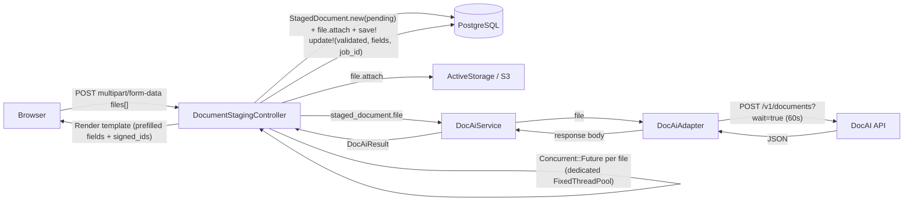

# DocAI Integration

## Problem

OSCER members submit income verification documents (pay stubs) for certification/exemption workflows. Manual staff review is slow and error-prone. DocAI integration enables: realtime document validation, automated field extraction, form prefill, and consistent parsing.

## Architecture

Adapter + service + value object pattern. `wait=true` for synchronous processing (~38s); multiple files processed concurrently via `Concurrent::Future` on a dedicated `FixedThreadPool` (total time ≈ one DocAI call regardless of file count).



## Components

| Component | Responsibility |
|-----------|---------------|
| `DocumentStagingController` | Validates uploads (Marcel magic-byte, PDF/JPG, ≤30 MB, ≤2 files); processes concurrently via `Concurrent::Future` on `DOC_AI_THREAD_POOL`; builds + attaches + saves `StagedDocument` atomically per file; calls `DocAiService`; renders template with prefilled fields and hidden `signed_id` inputs. `current_user` captured before threading (ActionController helpers not thread-safe). Each Future uses `connection_pool.with_connection`. See [`examples/document_staging_controller.rb`](examples/document_staging_controller.rb). |
| `StagedDocument` | ActiveRecord: `has_one_attached :file`, `belongs_to :user`, `belongs_to :stageable, polymorphic: true`. Status enum: `pending`, `validated`, `rejected`, `failed`. `extracted_fields` JSONB stores full raw DocAI fields response (including confidence scores). `job_id` column. Retained permanently as audit record. Never purged. See [`examples/staged_document.rb`](examples/staged_document.rb) and [`examples/staged_document_migration.rb`](examples/staged_document_migration.rb). |
| `DocAiAdapter` | Extends `DataIntegration::BaseAdapter`. No auth headers (currently unauthenticated). `analyze_document` opens blob as `Tempfile` via `file.blob.open` → passes IO to `Faraday::Multipart::FilePart`. See [`examples/doc_ai_adapter.rb`](examples/doc_ai_adapter.rb). |
| `DocAiService` | Extends `DataIntegration::BaseService`. Invokes adapter; builds `DocAiResult` via factory; logs `job_id`; raises `ProcessingError` on `status: "failed"`; `handle_integration_error` logs warning and returns `nil` (graceful degradation). See [`examples/doc_ai_service.rb`](examples/doc_ai_service.rb). |
| `DocAiResult` | Base `Strata::ValueObject`. Response envelope, `FieldValue` accessor, self-registration factory (`REGISTRY` hash). Subclass files must be `require_relative`'d before `REGISTRY.freeze`. See [`examples/doc_ai_result.rb`](examples/doc_ai_result.rb). |
| `DocAiResult::FieldValue` | `Data.define` struct: `value`, `confidence`. `low_confidence?` predicate (threshold: 0.7). All field accessors return `FieldValue` or `nil`. Defined in [`examples/doc_ai_result.rb`](examples/doc_ai_result.rb). |
| `DocAiResult::Payslip` | Self-registers via `register "Payslip"`. Typed snake_case accessors. Boolean flag accessors unwrap value directly. `to_prefill_fields` returns values-only hash for form rendering. See [`examples/doc_ai_result/payslip.rb`](examples/doc_ai_result/payslip.rb). |
| `DocAiResult::W2` | Self-registers via `register "W2"`. Typed snake_case accessors grouped by document section. `nonqualifiedPlansIncom` is a DocAI typo — Ruby accessor uses correct spelling. See [`examples/doc_ai_result/w2.rb`](examples/doc_ai_result/w2.rb). |
| File Validator | Marcel magic-byte detection, PDF or JPG/JPEG only, ≤30 MB per file, ≤2 files total. Runs before any DB or DocAI operations. |

## Activity Attachment Flow

After DocAI validates files, `DocumentStagingController` renders hidden signed ID fields (HMAC-signed, 1-hour expiry via `ActiveRecord::SignedId`):

```html
<input type="hidden" name="activity[staged_document_signed_ids][]" value="signed_id_1">
<input type="hidden" name="activity[staged_document_signed_ids][]" value="signed_id_2">
```

`ActivitiesController#create` iterates signed IDs, resolves via `find_signed`, attaches blob to activity (no S3 copy — same blob shared), marks staged doc consumed, skips documents upload page:

```ruby
if (signed_ids = activity_params[:staged_document_signed_ids]).present?
  signed_ids.each do |sid|
    staged = StagedDocument.find_signed(sid)
    next unless staged&.validated?
    @activity.supporting_documents.attach(staged.file.blob)
    staged.update!(stageable: @activity)
  end
  redirect_to activity_report_application_form_path(@activity_report_application_form),
              notice: t(".created_with_document")
else
  redirect_to documents_activity_report_application_form_activity_path(
                @activity_report_application_form, @activity)
end
```

Permitted params addition:
```ruby
def activity_params
  params.require(:activity).permit(
    :month, :name, :hours, :income, :activity_type, :category,
    staged_document_signed_ids: []
  )
end
```

Expired/non-validated signed IDs are skipped gracefully. Fallback to manual upload page preserved when no signed IDs present.

## API Interface

| Property | Value |
|----------|-------|
| URL | `https://app-docai.platform-test-dev.navateam.com/v1/documents` |
| Method | `POST` |
| Query param | `wait=true` |
| Content-Type | `multipart/form-data` |
| Auth | None (unauthenticated) |
| Timeout | 60s (open_timeout: 10s) |

### Success Response (HTTP 200 — Payslip)

```json
{
  "job_id": "d773fa8f-3cc7-47d8-be78-4125c190c290",
  "status": "completed",
  "createdAt": "2026-02-23T18:26:50.830294+00:00",
  "completedAt": "2026-02-23T18:27:29.434195+00:00",
  "totalProcessingTimeSeconds": 38.6,
  "matchedDocumentClass": "Payslip",
  "message": "Document processed successfully",
  "fields": {
    "payperiodstartdate":      { "confidence": 0.91, "value": "2017-07-10" },
    "currentgrosspay":         { "confidence": 0.93, "value": 1627.74 },
    "isgrosspayvali":          { "confidence": 0.87, "value": true }
  }
}
```

### Success Response (HTTP 200 — W2)

```json
{
  "job_id": "e8b21c94-5d4f-48a9-bc91-37d6f4a09c11",
  "status": "completed",
  "matchedDocumentClass": "W2",
  "fields": {
    "employerInfo.employerName": { "confidence": 0.92, "value": "University of North Carolina" },
    "federalWageInfo.wagesTipsOtherCompensation": { "confidence": 0.94, "value": 31964.00 }
  }
}
```

### Failed Job Response (HTTP 200)

```json
{
  "job_id": "a4187dd2-8ccd-4e6f-b7a7-164092e49eca",
  "status": "failed",
  "error": "Handler handler failed: '>' not supported between instances of 'int' and 'ConfigDefaults'"
}
```

### HTTP Error Response

```json
{ "detail": "There was an error parsing the body" }
```

## Field Reference — Payslip

> Field names in API responses are **lowercased and concatenated** (e.g., `payperiodstartdate` = `PayPeriodStartDate`). Dot-notation compound fields become `employeename.firstname`. Boolean flag accessors return `true`/`false` directly (not `FieldValue`).

| API Field Key | Ruby Accessor | Type |
|---|---|---|
| `payperiodstartdate` | `pay_period_start_date` | String |
| `payperiodenddate` | `pay_period_end_date` | String |
| `paydate` | `pay_date` | String |
| `currentgrosspay` | `current_gross_pay` | Numeric |
| `currentnetpay` | `current_net_pay` | Numeric |
| `currenttotaldeductions` | `current_total_deductions` | Numeric |
| `ytdgrosspay` | `ytd_gross_pay` | Numeric |
| `ytdnetpay` | `ytd_net_pay` | Numeric |
| `ytdfederaltax` | `ytd_federal_tax` | Numeric |
| `ytdstatetax` | `ytd_state_tax` | Numeric |
| `ytdtotaldeductions` | `ytd_total_deductions` | Numeric |
| `regularhourlyrate` | `regular_hourly_rate` | Numeric |
| `holidayhourlyrate` | `holiday_hourly_rate` | Numeric |
| `currency` | `currency` | String |
| `federalfilingstatus` | `federal_filing_status` | String |
| `statefilingstatus` | `state_filing_status` | String |
| `payrollnumber` | `payroll_number` | String |
| `employeenumber` | `employee_number` | String |
| `employeename.firstname` | `employee_first_name` | String |
| `employeename.middlename` | `employee_middle_name` | String |
| `employeename.lastname` | `employee_last_name` | String |
| `employeename.suffixname` | `employee_suffix_name` | String |
| `employeeaddress.line1` | `employee_address_line1` | String |
| `employeeaddress.line2` | `employee_address_line2` | String |
| `employeeaddress.city` | `employee_address_city` | String |
| `employeeaddress.state` | `employee_address_state` | String |
| `employeeaddress.zipcode` | `employee_address_zipcode` | String |
| `companyaddress.line1` | `company_address_line1` | String |
| `companyaddress.line2` | `company_address_line2` | String |
| `companyaddress.city` | `company_address_city` | String |
| `companyaddress.state` | `company_address_state` | String |
| `companyaddress.zipcode` | `company_address_zipcode` | String |
| `isgrosspayvali` | `gross_pay_valid?` | Boolean |
| `isytdgrosspayhighest` | `ytd_gross_pay_highest?` | Boolean |
| `arefieldnamessufficient` | `field_names_sufficient?` | Boolean |

## Field Reference — W2

> `nonqualifiedPlansIncom` is a DocAI typo. Ruby accessor uses correct spelling; `field_for` called with the literal API key.

| API Field Key | Ruby Accessor | Group | Type |
|---|---|---|---|
| `employerInfo.employerAddress` | `employer_address` | Employer | String |
| `employerInfo.controlNumber` | `employer_control_number` | Employer | String |
| `employerInfo.employerName` | `employer_name` | Employer | String |
| `employerInfo.ein` | `employer_ein` | Employer | String |
| `employerInfo.employerZipCode` | `employer_zip_code` | Employer | String |
| `filingInfo.ombNumber` | `omb_number` | Filing | String |
| `filingInfo.verificationCode` | `verification_code` | Filing | String |
| `other` | `other` | Other | String |
| `federalTaxInfo.federalIncomeTax` | `federal_income_tax` | Federal Tax | Numeric |
| `federalTaxInfo.allocatedTips` | `allocated_tips` | Federal Tax | Numeric |
| `federalTaxInfo.socialSecurityTax` | `social_security_tax` | Federal Tax | Numeric |
| `federalTaxInfo.medicareTax` | `medicare_tax` | Federal Tax | Numeric |
| `employeeGeneralInfo.employeeNameSuffix` | `employee_name_suffix` | Employee | String |
| `employeeGeneralInfo.employeeAddress` | `employee_address` | Employee | String |
| `employeeGeneralInfo.employeeLastName` | `employee_last_name` | Employee | String |
| `employeeGeneralInfo.employeeZipCode` | `employee_zip_code` | Employee | String |
| `employeeGeneralInfo.firstName` | `employee_first_name` | Employee | String |
| `employeeGeneralInfo.ssn` | `employee_ssn` | Employee | String |
| `federalWageInfo.socialSecurityTips` | `social_security_tips` | Federal Wages | Numeric |
| `federalWageInfo.wagesTipsOtherCompensation` | `wages_tips_other_compensation` | Federal Wages | Numeric |
| `federalWageInfo.medicareWagesTips` | `medicare_wages_tips` | Federal Wages | Numeric |
| `federalWageInfo.socialSecurityWages` | `social_security_wages` | Federal Wages | Numeric |
| `nonqualifiedPlansIncom` | `nonqualified_plans_income` | Other | Numeric |

## Error Handling

| Scenario | HTTP | Handling |
|----------|------|----------|
| Bad request / parse failure | 4xx | `DocAiAdapter#handle_error` → raises `ApiError` |
| Server error | 5xx | `BaseAdapter#handle_server_error` → raises `ServerError` |
| Network failure | — | `BaseAdapter#handle_connection_error` → raises `ApiError` |
| Request timeout (>60s) | — | Faraday `TimeoutError` → caught as `ApiError` → `handle_integration_error` returns `nil` |
| DocAI processing failed | 200 | `DocAiService` checks `result.failed?` → raises `ProcessingError` |
| Graceful degradation | any | `handle_integration_error` logs warning, returns `nil`; controller sets `StagedDocument` to `status: :failed` |
| Unrecognised document type | 200 | Controller checks `SUPPORTED_RESULT_CLASSES.any?`; sets `status: :rejected`; renders error |

`SUPPORTED_RESULT_CLASSES`: `[DocAiResult::Payslip, DocAiResult::W2]`

## Route

```ruby
# config/routes.rb (inside localized block)
resource :document_staging, only: [:create], controller: "document_staging"
# → POST /document_staging → DocumentStagingController#create
```

## Configuration

```ruby
# config/initializers/doc_ai.rb
Rails.application.config.doc_ai = {
  api_host:                 ENV.fetch("DOC_AI_API_HOST"),
  timeout_seconds:          ENV.fetch("DOC_AI_TIMEOUT_SECONDS", "60").to_i,
  low_confidence_threshold: ENV.fetch("DOC_AI_LOW_CONFIDENCE_THRESHOLD", "0.7").to_f,
  thread_pool_size:         ENV.fetch("DOC_AI_THREAD_POOL_SIZE", "4").to_i
}
```

```bash
# local.env.example
DOC_AI_API_HOST=https://app-docai.platform-test-dev.navateam.com
DOC_AI_TIMEOUT_SECONDS=60
DOC_AI_LOW_CONFIDENCE_THRESHOLD=0.7
DOC_AI_THREAD_POOL_SIZE=4   # default: MAX_FILE_COUNT * 2
```

> **Puma/rack-timeout**: Must allow requests >60s on upload endpoint (recommended: 75s minimum).
> **DB connection pool**: Each concurrent file holds one connection for ~38–60s. With `MAX_FILE_COUNT=2`, up to 2 additional connections per upload request.

## Files to Create

| File | Purpose |
|------|---------|
| `app/models/staged_document.rb` | Model: status enum, `has_one_attached :file`, `extracted_fields` JSONB |
| `db/migrate/<ts>_create_staged_documents.rb` | Migration: uuid pk, status, doc_ai_job_id, extracted_fields, user_id, stageable polymorphic |
| `app/controllers/document_staging_controller.rb` | See Components table |
| `app/views/document_staging/create.html.erb` | Prefilled fields + hidden `staged_document_signed_ids[]` inputs + inline errors |
| `app/adapters/doc_ai_adapter.rb` | Extends `DataIntegration::BaseAdapter`; multipart POST |
| `app/services/doc_ai_service.rb` | Extends `DataIntegration::BaseService` |
| `app/models/doc_ai_result.rb` | Base value object + `FieldValue` struct + factory |
| `app/models/doc_ai_result/payslip.rb` | Payslip subclass |
| `app/models/doc_ai_result/w2.rb` | W2 subclass |
| `config/initializers/doc_ai.rb` | App config |
| `app/policies/document_policy.rb` | Pundit: `authorize :document, :create?` |
| `spec/models/staged_document_spec.rb` | Model validations, enum |
| `spec/controllers/document_staging_controller_spec.rb` | File validation, concurrent processing, lifecycle, error isolation |
| `spec/adapters/doc_ai_adapter_spec.rb` | WebMock stubs |
| `spec/services/doc_ai_service_spec.rb` | Service tests |
| `spec/models/doc_ai_result_spec.rb` | Base value object |
| `spec/models/doc_ai_result/payslip_spec.rb` | Payslip accessors |
| `spec/models/doc_ai_result/w2_spec.rb` | W2 accessors |

## Files to Modify

| File | Change |
|------|--------|
| `Gemfile` | Add `faraday-multipart` if not present |
| `local.env.example` | Add `DOC_AI_API_HOST`, `DOC_AI_TIMEOUT_SECONDS`, `DOC_AI_LOW_CONFIDENCE_THRESHOLD`, `DOC_AI_THREAD_POOL_SIZE` |
| `config/routes.rb` | Add `resource :document_staging` inside localized block |
| `app/controllers/activities_controller.rb` | Permit `staged_document_signed_ids: []`; iterate `find_signed`, attach blobs, set `stageable`, skip upload redirect |

## Key Decisions

- **`wait=true` synchronous**: Realtime validation is required UX; background processing adds polling/WebSocket complexity with no benefit.
- **`Concurrent::Future` on dedicated `FixedThreadPool`**: Sequential processing of N files would take N×38s; concurrent keeps it at ~38s. Dedicated pool isolates DocAI from global concurrent-ruby IO pool (prevents starving ActiveStorage callbacks).
- **`signed_id` not raw UUID**: Prevents IDOR without a DB membership query. 1-hour expiry. `find_signed` returns `nil` on expiry → falls back to manual upload (graceful degradation).
- **Blob sharing not copying**: `attach(staged.file.blob)` creates a new `active_storage_attachments` row pointing at same S3 object. No storage duplication.
- **`StagedDocument` as permanent audit record**: `stageable` polymorphic association set on consumption. Never purged — blob safe from premature deletion.
- **`FieldValue` struct**: Pairs value + confidence so callers cannot ignore confidence. `to_prefill_fields` provides values-only hash for form rendering.
- **Raw JSONB for `extracted_fields`**: Full DocAI fields response stored (not stripped). No data lost at persistence; staff can review low-confidence fields without replaying DocAI.
- **Self-registering subclasses**: `register "ClassName"` in each subclass populates `REGISTRY`. Adding a new document type requires only a new subclass — `DocAiResult` and `DocumentStagingController` need no changes.
- **`DocAiService` receives ActiveStorage attachment**: Works with stored copy (not transient upload object). `blob.open` streams from S3 to tempfile for Faraday upload.
- **Server-rendered prefill**: Controller renders HTML template (not JSON). No client-side JS upload controller needed.
- **Double-submit prevention**: Submit button uses `data-turbo-submits-with` / `data-disable-with` — disabled after first click until response renders (~38s).
- **Authorization**: `authorize :document, :create?` at top of `#create`. Requires `DocumentPolicy`.
- **Graceful degradation**: When `staged_document_signed_ids` absent, existing documents upload page redirect is preserved unchanged. `handle_integration_error` returns `nil` rather than raising.

## Extending for New Document Types

Create subclass, call `register "ClassName"`, implement `to_prefill_fields`. Add `require_relative "doc_ai_result/new_type"` inside `DocAiResult` class body before `REGISTRY.freeze`. No other files change.

See [`examples/doc_ai_result/bank_statement.rb`](examples/doc_ai_result/bank_statement.rb) for annotated example.

## Future Considerations

**Authentication**: DocAI endpoint is currently unauthenticated. Add auth via `DataIntegration::BaseAdapter`'s `before_request` hook:

```ruby
before_request :set_auth_header
def set_auth_header
  # @connection.headers["Authorization"] = "Bearer #{...}"
end
```
