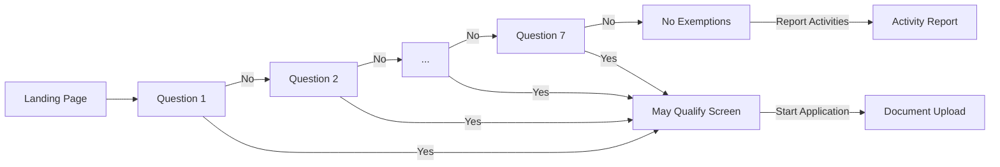
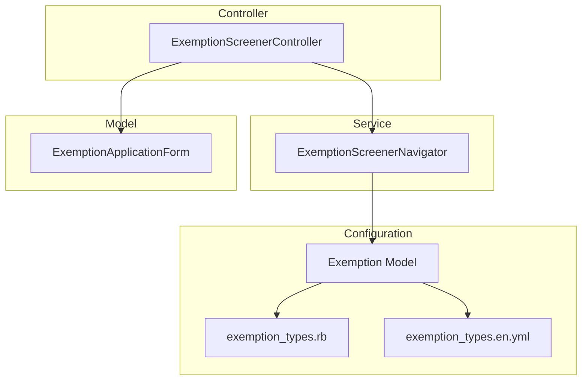

# Exemption Screener V2

## Problem

Members need to determine if they qualify for an exemption from activity reporting. The current single-page screener with 2 exemption types is insufficient and doesn't guide users on documentation requirements before starting an application.

## Approach

1. Multi-step questionnaire: One yes/no question per exemption type, standard Rails pages
2. Stateless flow: No session/database persistence—back navigation via browser history
3. Navigation Logic: Encapsulated in `ExemptionScreenerNavigator` service
4. Configuration-driven: Exemption types in initializer with dynamic `Exemption` model lookups
5. I18n Integration: All content (questions, titles, descriptions) stored in `config/locales/exemption_types.en.yml`
6. Duplicate prevention: Model validation + controller guard + database constraint



---

## C4 Component Diagram

> Level 3: Internal components within the Rails application



### ExemptionScreenerController

| Action               | Purpose                                                  |
| -------------------- | -------------------------------------------------------- |
| `index`              | Displays introductory landing page                       |
| `show`               | Display yes/no question for a specific type              |
| `answer`             | Redirect to `may_qualify` (Yes) or next question (No)    |
| `may_qualify`        | Show exemption details + documentation requirements      |
| `create_application` | Create `ExemptionApplicationForm`, redirect to documents |
| `complete`           | "No exemptions" screen with links to activity report     |

### Exemption Model

The `Exemption` model (`app/models/exemption.rb`) provides a PORO interface to the configuration and translations.

```ruby
class Exemption
  class << self
    def all = Rails.application.config.exemption_types
    def enabled = all.select { |t| t[:enabled] }
    def find(type) = all.find { |t| t[:id] == type.to_sym }

    # Dynamically defined methods for I18n lookups:
    # title_for(type), description_for(type), question_for(type), etc.
    def question_data_for(type)
      {
        "question" => question_for(type),
        "explanation" => explanation_for(type),
        "yes_answer" => yes_answer_for(type)
      }
    end
  end
end
```

### ExemptionScreenerNavigator

Handles the state machine logic for moving between questions.

```ruby
class ExemptionScreenerNavigator
  def next_location(answer:)
    return ExemptionNavigation.new(action: :may_qualify, location: exemption_type) if answer == "yes"

    next_type = Exemption.next_type(exemption_type)
    if next_type.present?
      ExemptionNavigation.new(action: :question, location: next_type)
    else
      ExemptionNavigation.new(action: :complete)
    end
  end
end
```

### Configuration Structure

Types are defined in an initializer, while content is kept in I18n files for better maintainability and localization support.

```ruby
# config/initializers/exemption_types.rb
Rails.application.config.exemption_types = [
  { id: :medical_condition, enabled: true },
  { id: :substance_treatment, enabled: true },
  # ... 5 more
]

# config/locales/exemption_types.en.yml
en:
  exemption_types:
    medical_condition:
      title: "Medically Frail or Special Medical Needs"
      question: "Do you have a current medical condition...?"
      # ...
```

---

## Architecture Decision Records

### ADR-001: Standard Rails Pages Over Hotwire

**Context**: Need to present 7 sequential questions with navigation.

**Decision**: Use standard Rails pages with full page loads.

**Rationale**: No existing Turbo usage; simpler testing (no JS driver); browser back works naturally.

**Consequences**: Brief flash between questions; can migrate to Hotwire later if needed.

---

### ADR-002: Stateless Answer Storage

**Context**: Users can navigate back to previous questions.

**Decision**: No persistence of answers (stateless).

**Rationale**: 7 questions is short; "Yes" exits immediately; no session/database complexity.

**Consequences**: Users re-answer on back; can add session persistence later.

---

### ADR-003: PORO Model for Configuration

**Context**: Need to access 7 exemption types with questions, explanations, documentation requirements.

**Decision**: Use an `Exemption` PORO that reads from an initializer and provides dynamic I18n lookups.

**Rationale**: Clean separation of concerns; easy to test; avoids bloating models with static config.

**Consequences**: Requires deploy to change types; can migrate to database if runtime editing needed.

---

### ADR-004: Navigator Service for Flow Logic

**Context**: The controller was becoming complex with navigation logic.

**Decision**: Extract navigation logic into `ExemptionScreenerNavigator`.

**Rationale**: Keeps controller thin; logic is easily unit-testable; follows DDD principles.

**Consequences**: Clear separation between "what to show" and "where to go".

---

### ADR-005: URL-Based Navigation State

**Context**: Need forward/back navigation through questions.

**Decision**: Encode state in URL (`/question/:type`).

**Rationale**: Browser back works; bookmarkable; no hidden state; server validates against config.

**Consequences**: Invalid types redirect to first question.

---

### ADR-006: Layered Duplicate Prevention

**Context**: Only one exemption application per certification case.

**Decision**: Three layers: controller guard → model validation → database unique index.

**Rationale**: Handles race conditions at database level; clear error messaging.

**Consequences**: Handles all edge cases.

---

## Constraints

- Only one exemption application per certification case
- Requires authenticated member with active certification case
- Must use USWDS components
- WCAG 2.1 AA compliance

## Future Considerations

- **Hotwire**: If UX feedback indicates page transitions are problematic
- **Session persistence**: If users request answer memory
- **Database config**: If non-developers need to edit types
- **Analytics**: Track completion rates, drop-off points
