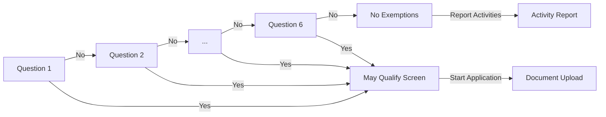
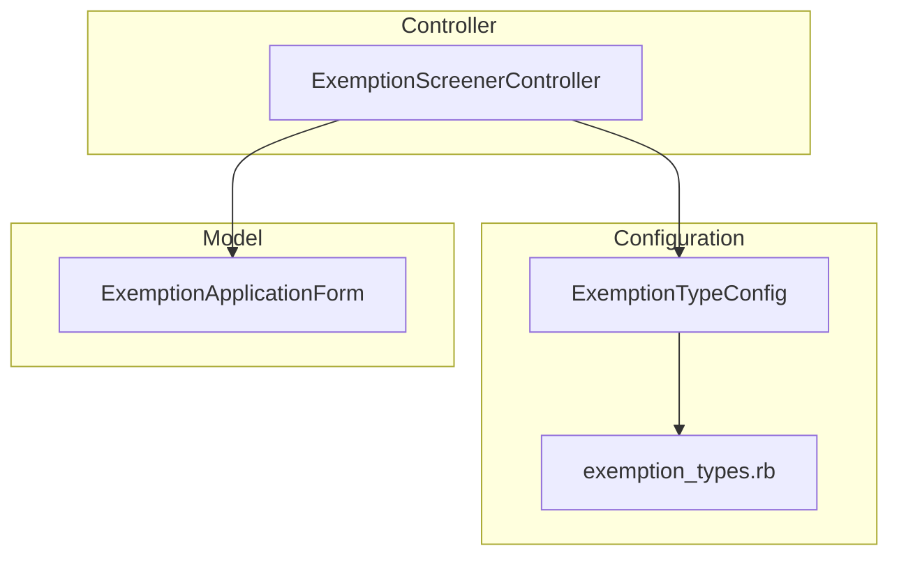

# Exemption Screener V2

## Problem

Members need to determine if they qualify for an exemption from activity reporting. The current single-page screener with 2 exemption types is insufficient for the expanded 6 types and doesn't guide users on documentation requirements before starting an application.

## Approach

1. Multi-step questionnaire: One yes/no question per exemption type (6 total), standard Rails pages
2. Stateless flow: No session/database persistence—back navigation via browser history
3. Configuration-driven: Exemption types in initializer with I18n fallback
4. Duplicate prevention: Model validation + controller guard + database constraint



---

## C4 Component Diagram

> Level 3: Internal components within the Rails application



### ExemptionScreenerController

| Action               | Purpose                                                  |
| -------------------- | -------------------------------------------------------- |
| `show`               | Display yes/no question                                  |
| `answer`             | Redirect to `may_qualify` (Yes) or next question (No)    |
| `may_qualify`        | Show exemption details + documentation requirements      |
| `create_application` | Create `ExemptionApplicationForm`, redirect to documents |
| `complete`           | "No exemptions" screen with links to activity report     |

### ExemptionTypeConfig

```ruby
class ExemptionTypeConfig
  class << self
    def all = Rails.application.config.exemption_types
    def ordered = all.select { |_, v| v[:enabled] }.sort_by { |_, v| v[:order] }
    def find(type) = all[type.to_sym]
    def enum_hash = all.keys.index_with(&:to_s)
    def question_for(type) = I18n.t("exemption_types.#{type}.question", default: all[type.to_sym][:question])
  end
end
```

### Configuration Structure

```ruby
# config/initializers/exemption_types.rb
Rails.application.config.exemption_types = {
  medical_condition: {
    question: "Do you have a serious medical condition?",
    explanation: "You may qualify if...",
    documentation: ["Doctor's letter", "Statement of impact"],
    order: 1,
    enabled: true
  },
  # ... 5 more: substance_use_treatment, incarceration, domestic_violence, caregiver, student
}
```

---

## Architecture Decision Records

### ADR-001: Standard Rails Pages Over Hotwire

**Context**: Need to present 6 sequential questions with navigation.

**Decision**: Use standard Rails pages with full page loads.

**Rationale**: No existing Turbo usage; simpler testing (no JS driver); browser back works naturally.

**Consequences**: Brief flash between questions; can migrate to Hotwire later if needed.

---

### ADR-002: Stateless Answer Storage

**Context**: Users can navigate back to previous questions.

**Decision**: No persistence of answers (stateless).

**Rationale**: 6 questions is short; "Yes" exits immediately; no session/database complexity.

**Consequences**: Users re-answer on back; can add session persistence later.

---

### ADR-003: Initializer-Based Configuration

**Context**: Need to configure 6 exemption types with questions, explanations, documentation requirements.

**Decision**: Define types in `config/initializers/exemption_types.rb` with a PORO accessor class.

**Rationale**: Single source of truth; I18n-ready; version controlled; testable.

**Consequences**: Requires deploy to change; can migrate to database if runtime editing needed.

---

### ADR-004: URL-Based Navigation State

**Context**: Need forward/back navigation through questions.

**Decision**: Encode state in URL (`/question/:type`).

**Rationale**: Browser back works; bookmarkable; no hidden state; server validates against config.

**Consequences**: Invalid types redirect to first question.

---

### ADR-005: Layered Duplicate Prevention

**Context**: Only one exemption application per certification case.

**Decision**: Three layers: controller guard → model validation → database unique index.

**Rationale**: Handles race conditions at database level; clear error messaging.

**Consequences**: Handles all edge cases.

---

## Constraints

- Only one exemption application per certification case
- Requires authenticated member with active certification case
- Must use USWDS components
- WCAG 2.1 AA compliance

## Future Considerations

- **Hotwire**: If UX feedback indicates page transitions are problematic
- **Session persistence**: If users request answer memory
- **Database config**: If non-developers need to edit types
- **Analytics**: Track completion rates, drop-off points
