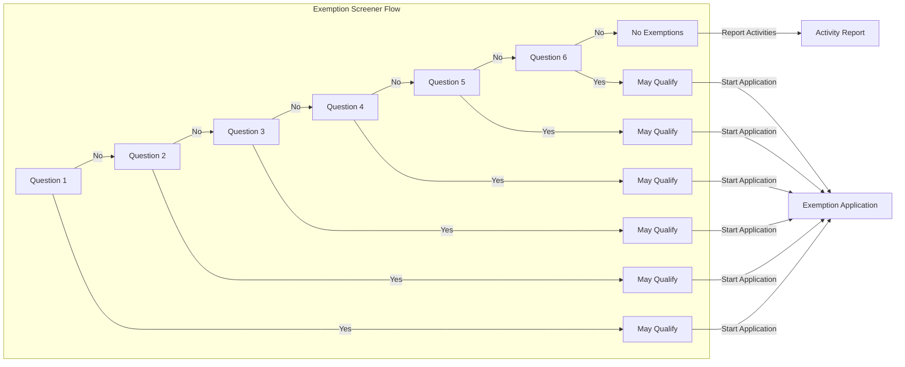
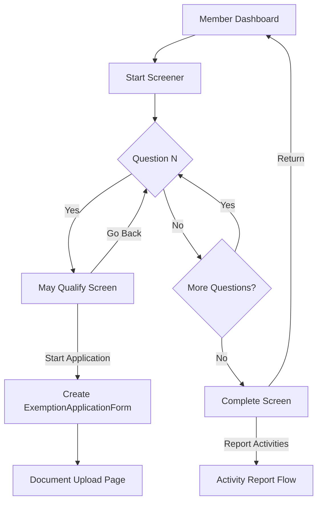
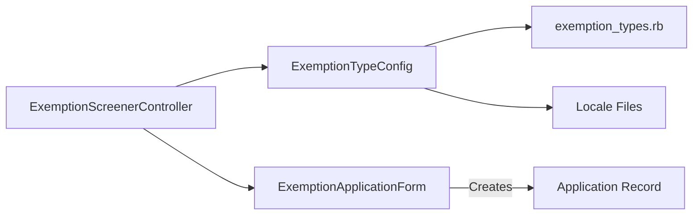

# Exemption Screener V2 - Architecture Documentation

## Overview

The Exemption Screener V2 transforms the exemption application entry point from a single static page to a multi-step questionnaire flow. Users answer one yes/no question per exemption type, with qualifying answers leading to an intermediate screen showing exemption details and documentation requirements before starting the application.

## Problem Statement

Members need to determine if they qualify for an exemption from activity reporting requirements. The current single-page screener with 2 exemption types is insufficient for the expanded 6 exemption types and doesn't provide adequate guidance on documentation requirements before starting an application.

## Solution Summary

A stateless, multi-step questionnaire implemented with standard Rails pages that:

- Presents one yes/no question per exemption type (6 total)
- Shows a "may qualify" intermediate screen with documentation requirements on "Yes" answers
- Supports back navigation via browser history
- Prevents duplicate applications via existing validation
- Uses configuration-driven exemption types for maintainability

## Key Design Principles

| Principle           | Application                                    |
| ------------------- | ---------------------------------------------- |
| **Simplicity**      | Standard Rails pages over Hotwire/SPA patterns |
| **Stateless**       | No session or database persistence of answers  |
| **Accessibility**   | WCAG 2.1 AA compliance, keyboard navigation    |
| **Configurability** | Initializer-based exemption type definitions   |
| **Maintainability** | I18n-ready text with config fallbacks          |

## Exemption Types

1. Medical Condition
2. Substance Use Treatment
3. Incarceration
4. Domestic Violence
5. Caregiver
6. Student

## Documentation Structure

| Document                                    | C4 Level | Purpose                                       |
| ------------------------------------------- | -------- | --------------------------------------------- |
| [Component Diagram](./c4-component.md)      | Level 3  | Internal component structure and interactions |
| [Architecture Decisions](./c4-decisions.md) | Level 4  | Key decisions with context and rationale      |

> **Note**: Context (Level 1) and Container (Level 2) diagrams are omitted as this feature operates entirely within the existing Rails monolith without external system integrations.

## Quick Reference

### User Flow

### Component Interaction

## Technical Constraints

- **Unique Application**: Only one exemption application per certification case (enforced by existing model validation)
- **Authentication**: Requires authenticated member session
- **Certification Context**: Must have an active certification case
- **USWDS Styling**: Must use existing design system components

## Related Documentation

- [Batch Upload Architecture](../batch-upload/README.md) - Example of full C4 documentation for system integrations
- [C4 Architecture Documentation Guide](../../prs/C4-ARCHITECTURE-DOCUMENTATION.md) - PR template explaining C4 adoption

---

## Changelog

| Date       | Author       | Change                           |
| ---------- | ------------ | -------------------------------- |
| 2025-01-08 | Architecture | Initial C4 documentation created |
