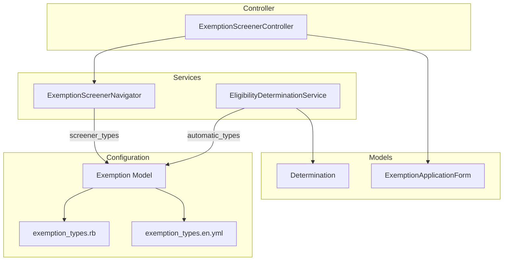
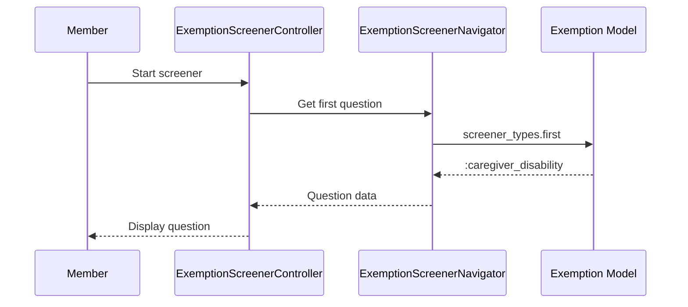
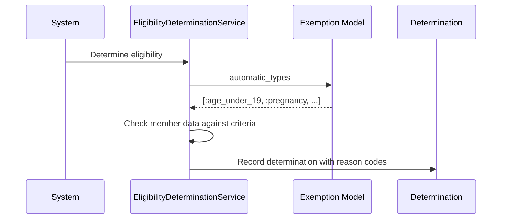

# Proposed: Additional Exemptions Architecture

> **Status**: Proposed  
> **Author**: [Bao Nguyen]  
> **Date**: January 13, 2026

## Summary

This proposal introduces a new category of exemption types that are automatically determined by the system and do not flow through the `ExemptionScreenerNavigator`. These exemption types will replace many of the hardcoded reason codes currently defined in the `Determination` model.

## Problem Statement

Currently, the `Determination` model contains hardcoded reason codes that represent automatic exemptions:

```ruby
# reporting-app/app/models/determination.rb
REASON_CODE_MAPPING = {
  age_under_19: "age_under_19_exempt",
  age_over_65: "age_over_65_exempt",
  is_pregnant: "pregnancy_exempt",
  is_american_indian_or_alaska_native: "american_indian_alaska_native_exempt",
  income_reported_compliant: "income_reported_compliant",
  hours_reported_compliant: "hours_reported_compliant",
  hours_reported_insufficient: "hours_reported_insufficient",
  exemption_request_compliant: "exemption_request_compliant"
}
```

These reason codes mix **automatic exemptions** (age, pregnancy, tribal affiliation) with **compliance outcomes** (hours reported, income reported). This creates several issues:

1. **Lack of separation of concerns**: Exemption types and compliance outcomes are conflated
2. **Maintenance burden**: Adding new automatic exemptions requires modifying the `Determination` model
3. **Inconsistent modeling**: Member-requested exemptions (via screener) and system-determined exemptions are stored differently
4. **No single source of truth**: Exemption definitions are split between `exemption_types.rb` and `determination.rb`
5. **Automatic Exemption Copy**: Any automated exemptions don't have i18n copy available. If displaying these exemptions in the future, we won't have consistent messaging.

## Proposed Solution

### Two Categories of Exemptions

Introduce a `` attribute to exemption types, distinguishing between:

| Category | Description | Flow |
|----------|-------------|------|
| `screener` | Member-initiated exemptions requiring documentation | Multi-step questionnaire via `ExemptionScreenerNavigator` |
| `automatic` | System-determined exemptions based on member data | Automatically applied during eligibility determination |

### Updated Configuration Structure

```ruby
# config/initializers/exemption_types.rb
Rails.application.config.exemption_types = [
  # === Screener Exemptions (existing) ===
  # These flow through ExemptionScreenerNavigator
  {
    id: :caregiver_disability,
    category: :screener,
    enabled: true
  },
  {
    id: :caregiver_child,
    category: :screener,
    enabled: true
  },
  {
    id: :medical_condition,
    category: :screener,
    enabled: true
  },
  {
    id: :substance_treatment,
    category: :screener,
    enabled: true
  },
  {
    id: :incarceration,
    category: :screener,
    enabled: true
  },
  {
    id: :education_and_training,
    category: :screener,
    enabled: true
  },
  {
    id: :received_medical_care,
    category: :screener,
    enabled: true
  },

  # === Automatic Exemptions (new) ===
  # These are determined by the system, not member-requested
  {
    id: :age_under_19,
    category: :automatic,
    enabled: true
  },
  {
    id: :age_over_65,
    category: :automatic,
    enabled: true
  },
  {
    id: :pregnancy,
    category: :automatic,
    enabled: true
  },
  {
    id: :american_indian_alaska_native,
    category: :automatic,
    enabled: true
  },
  {
    id: :federal_disaster_declaration,
    category: :automatic,
    enabled: true
  }
]
```

### Updated Exemption Model

```ruby
# app/models/exemption.rb
class Exemption
  class << self
    # ... existing methods ...

    # Returns only screener exemptions (used by ExemptionScreenerNavigator)
    def screener_types
      enabled.select { |t| t[:category] == :screener }
    end

    # Returns only automatic exemptions (used by determination logic)
    def automatic_types
      enabled.select { |t| t[:category] == :automatic }
    end

    # Returns valid reason codes for Determination validations
    def valid_reason_codes
      automatic_types.map { |t| "#{t[:id]}_exempt" }
    end
  end
end
```

### Updated Determination Model

```ruby
# app/models/determination.rb
class Determination < Strata::Determination
  # Compliance-only reason codes (not exemptions)
  COMPLIANCE_REASONS = %w[
    income_reported_compliant
    hours_reported_compliant
    hours_reported_insufficient
    exemption_request_compliant
  ].freeze

  # Combine automatic exemptions with compliance reasons
  def self.valid_reasons
    Exemption.valid_reason_codes + COMPLIANCE_REASONS
  end

  validates :reasons, presence: true, inclusion: { in: ->(_) { valid_reasons } }
end
```

## C4 Component Diagram (Updated)



## Data Flow

### Screener Exemptions (Unchanged)



### Automatic Exemptions (New)



## Migration Path

### Phase 1: Add Category Attribute

1. Add `category` attribute to existing exemption types in initializer
2. Default all current types to `category: :screener`
3. Update `Exemption` model with new scoping methods
4. No changes to `ExemptionScreenerNavigator` (continues using `enabled` which we'll update to `screener_types`)

### Phase 2: Add Automatic Exemptions

1. Add new automatic exemption type entries to initializer
2. Add I18n translations for new types (titles/descriptions for admin views)
3. Update `Determination` model to use `Exemption.valid_reason_codes`

### Phase 3: Update ExemptionScreenerNavigator

1. Change `Exemption.enabled` references to `Exemption.screener_types`
2. Ensure navigator only iterates over screener exemptions

### Phase 4: Refactor Determination

1. Remove hardcoded `REASON_CODE_MAPPING` for exemptions
2. Keep only compliance-related reason codes
3. Update validation to dynamically pull from `Exemption` model

## Benefits

1. **Single source of truth**: All exemption types defined in one configuration file
2. **Consistent modeling**: Both screener and automatic exemptions use the same structure
3. **Separation of concerns**: Clear distinction between exemptions and compliance outcomes
4. **Extensibility**: New automatic exemptions added via configuration, not code changes
5. **I18n support**: Automatic exemptions can have localized titles/descriptions for admin UIs
6. **Testability**: Exemption categories can be tested independently

## Risks and Mitigations

| Risk | Mitigation |
|------|------------|
| Breaking existing screener flow | Phase 3 is isolated; all changes behind `screener_types` method |
| Invalid determination records | Migration script to verify existing records validate against new schema |
| Performance impact | Memoize `valid_reason_codes` in Exemption model |

## Open Questions

1. Should automatic exemptions have `supporting_documents` translations for admin reference?
2. Should we add an `effective_date` attribute to enable time-based exemption rules?
3. How should we handle exemptions that can be both automatic AND member-requested?

## Related Documents

- [Exemption Screener V2 Architecture](./README.md)
- [Strata::Determination Documentation](link-to-strata-docs)
