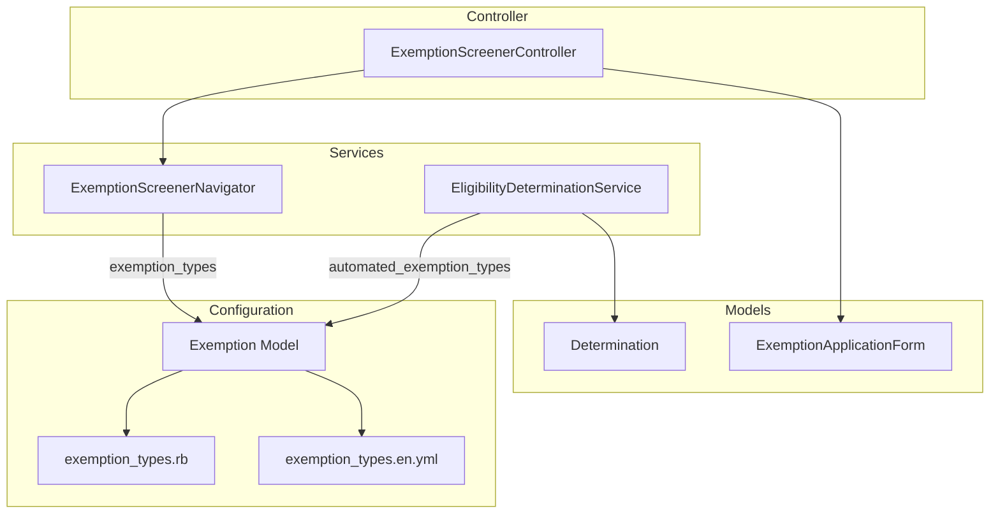

# Proposed: Additional Exemptions Architecture

> **Status**: Proposed  
> **Author**: [Bao Nguyen]  
> **Date**: January 13, 2026

## Summary

This proposal introduces a new configuration for **automated exemptions** that are system-determined and do not flow through the `ExemptionScreenerNavigator`. These exemption types will replace many of the hardcoded reason codes currently defined in the `Determination` model. By separating automated exemptions into their own configuration, we preserve the important ordering of the existing exemption screener flow while providing a single source of truth for all exemption types.

## Problem Statement

Currently, the `Determination` model contains hardcoded reason codes that represent automatic exemptions:

```ruby
# reporting-app/app/models/determination.rb
REASON_CODE_MAPPING = {
  age_under_19: "age_under_19_exempt",
  age_over_65: "age_over_65_exempt",
  is_pregnant: "pregnancy_exempt",
  is_american_indian_or_alaska_native: "american_indian_alaska_native_exempt",
  income_reported_compliant: "income_reported_compliant",
  hours_reported_compliant: "hours_reported_compliant",
  hours_reported_insufficient: "hours_reported_insufficient",
  exemption_request_compliant: "exemption_request_compliant"
}
```

These reason codes mix **automatic exemptions** (age, pregnancy, tribal affiliation) with **compliance outcomes** (hours reported, income reported). This creates several issues:

1. **Lack of separation of concerns**: Exemption types and compliance outcomes are conflated.
2. **Maintenance burden**: Adding new automatic exemptions requires modifying the `Determination` model.
3. **Inconsistent modeling**: Member-requested exemptions (via screener) and system-determined exemptions are stored differently.
4. **No single source of truth**: Exemption definitions are split between `exemption_types.rb` and `determination.rb`.
5. **Missing I18n Copy**: Automated exemptions lack localized copy for titles or descriptions, making it difficult to display them consistently in admin or member views.

## Proposed Solution

### Distinct Exemption Configurations

Instead of modifying the existing `exemption_types` array, we will introduce a new configuration specifically for automated exemptions. This keeps the screener flow distinct and maintains its specific ordering.

| Configuration | Purpose | Flow |
|---------------|---------|------|
| `exemption_types` | Member-initiated exemptions (Screener) | Multi-step questionnaire via `ExemptionScreenerNavigator` |
| `automated_exemption_types` | System-determined exemptions | Automatically applied during eligibility determination |

### Updated Configuration Structure

The screener types remain in their existing array format to preserve order, while automated types are defined in a new hash.

```ruby
# config/initializers/exemption_types.rb

# === Screener Exemptions (Unchanged) ===
# Ordering is preserved for the ExemptionScreenerNavigator
Rails.application.config.exemption_types = [
  { id: :caregiver_disability, enabled: true },
  { id: :caregiver_child, enabled: true },
  { id: :medical_condition, enabled: true },
  { id: :substance_treatment, enabled: true },
  { id: :incarceration, enabled: true },
  { id: :education_and_training, enabled: true },
  { id: :received_medical_care, enabled: true }
]

# === Automated Exemptions (New) ===
# Tracked as a hash for direct lookup
Rails.application.config.automated_exemption_types = {
  age_under_19: { enabled: true },
  age_over_65: { enabled: true },
  pregnancy: { enabled: true },
  american_indian_alaska_native: { enabled: true },
  federal_disaster_declaration: { enabled: true }
}
```

### Updated Exemption Model

The `Exemption` model will be updated to handle both configurations.

```ruby
# app/models/exemption.rb
class Exemption
  class << self
    # Screener Exemptions
    def all = Rails.application.config.exemption_types
    def enabled = all.select { |t| t[:enabled] }
    
    # Automated Exemptions
    def automated = Rails.application.config.automated_exemption_types
    def enabled_automated_ids = automated.select { |_, v| v[:enabled] }.keys

    # Unified lookup for I18n and metadata
    def find(type_id)
      # Check screener types first, then automated
      all.find { |t| t[:id] == type_id.to_sym } || 
        (automated[type_id.to_sym] ? { id: type_id.to_sym }.merge(automated[type_id.to_sym]) : nil)
    end

    # Returns valid reason codes for Determination validations
    def valid_automated_reason_codes
      enabled_automated_ids.map { |id| "#{id}_exempt" }
    end
  end
end
```

### Updated Determination Model

```ruby
# app/models/determination.rb
class Determination < Strata::Determination
  # Compliance-only reason codes (not exemptions)
  COMPLIANCE_REASONS = %w[
    income_reported_compliant
    hours_reported_compliant
    hours_reported_insufficient
    exemption_request_compliant
  ].freeze

  # Combine automated exemptions with compliance reasons
  def self.valid_reasons
    Exemption.valid_automated_reason_codes + COMPLIANCE_REASONS
  end

  validates :reasons, presence: true, inclusion: { in: ->(_) { valid_reasons } }
end
```

## C4 Component Diagram (Updated)



## Data Flow

### Screener Flow (Preserved)

The `ExemptionScreenerNavigator` continues to use `Exemption.enabled`, which still points to the ordered `exemption_types` array.

### Automated Flow (New)

The `EligibilityDeterminationService` (or equivalent logic) will now pull from `Exemption.enabled_automated_ids` to determine which automatic exemptions are available for validation and recording.

## Migration Path

### Phase 1: Initialize New Configuration

1. Add `Rails.application.config.automated_exemption_types` hash to `config/initializers/exemption_types.rb`.
2. Update the `Exemption` model to include methods for accessing automated types.
3. Add corresponding I18n keys for the new automated types in `exemption_types.en.yml`.

### Phase 2: Update Determination Validation

1. Update `Determination.valid_reasons` to include codes generated from `Exemption.valid_automated_reason_codes`.
2. Ensure existing records remain valid.

### Phase 3: Refactor Determination Logic

1. Remove hardcoded `REASON_CODE_MAPPING` in `Determination`.
2. Update any services that record determinations to use the IDs from the new configuration.

## Benefits

1. **Preserves Ordering**: The screener flow remains untouched and its sequential nature is respected.
2. **Clean Separation**: Automated exemptions and screener exemptions are logically separated in configuration.
3. **Single Source of Truth**: All "exemption-like" reasons are managed through the `Exemption` configuration.
4. **I18n Support**: Automatic exemptions now have a standard place for localized copy.

## Risks and Mitigations

| Risk | Mitigation |
|------|------------|
| ID Collisions | Model-level check or test to ensure IDs are unique across both configurations. |
| Breaking existing screener | Automated types are entirely additive to the config; existing methods remain stable. |

## Open Questions

1. Should we prefix ids for automated exemptions to prevent collisions with non-automated exemptions?
2. How do we support exemptions that are both member-applied and automated?

## Related Documents

- [Exemption Screener V2 Architecture](./README.md)
- [Strata::Determination Documentation](link-to-strata-docs)
