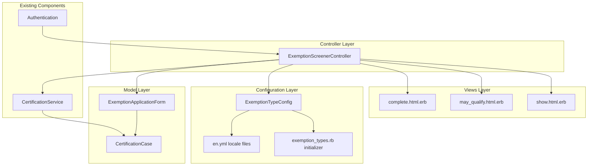
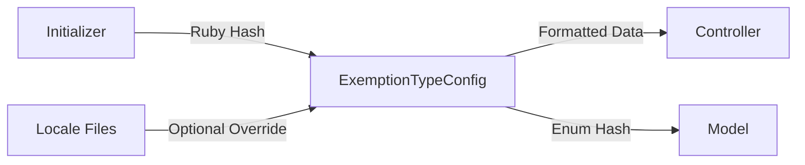
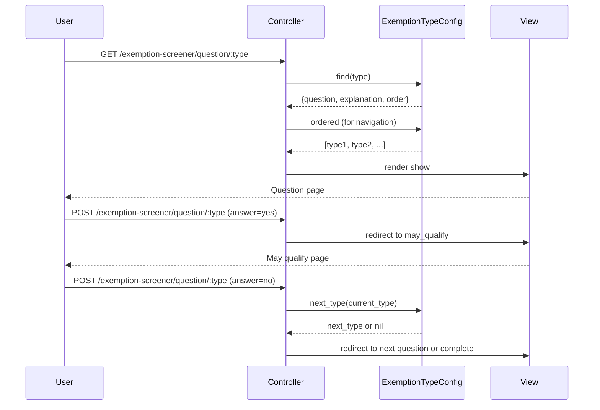
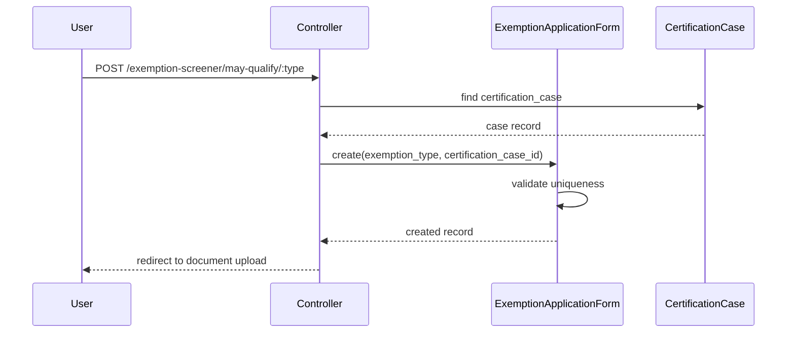
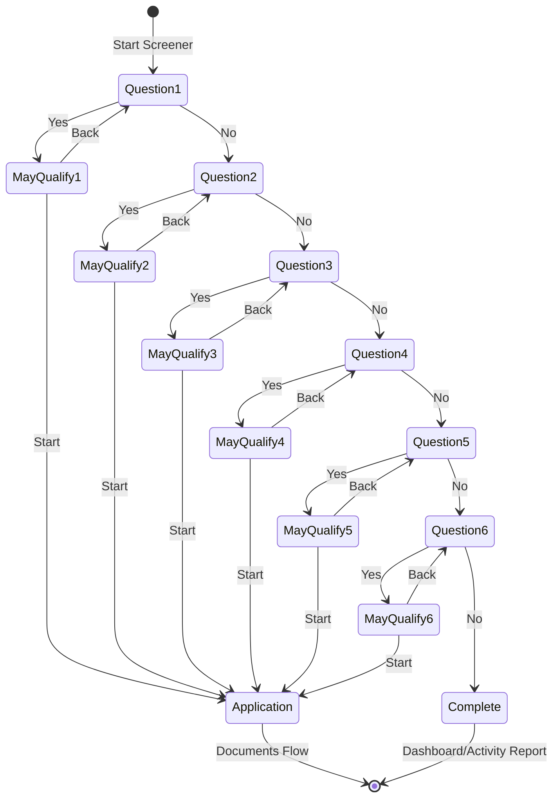

# Exemption Screener V2 - Component Diagram

> **C4 Level 3**: Components within the Rails Application

## Overview

This document describes the internal component structure of the Exemption Screener V2 feature. All components reside within the existing Rails monolith.

## Component Architecture



## Component Descriptions

### Controller Layer

#### ExemptionScreenerController

**Responsibility**: Orchestrates the multi-step questionnaire flow

**Actions**:

| Action | Purpose |
| ------ | ------- |
| `show` | Display a single yes/no question |
| `answer` | Process answer, redirect to may_qualify or next question |
| `may_qualify` | Show exemption details and documentation requirements |
| `create_application` | Create ExemptionApplicationForm, redirect to documents |
| `complete` | Show "no exemptions" screen when all answers are "No" |

**Dependencies**:

- `ExemptionTypeConfig` - Retrieves exemption type configuration
- `CertificationService` - Loads certification context
- `ExemptionApplicationForm` - Creates application records

### Configuration Layer

#### ExemptionTypeConfig

**Responsibility**: Provide access to exemption type definitions with I18n support

**Interface**:

```ruby
ExemptionTypeConfig.all           # All exemption types
ExemptionTypeConfig.ordered       # Types sorted by display order
ExemptionTypeConfig.find(:type)   # Single type configuration
ExemptionTypeConfig.enum_hash     # Hash for Rails enum definition
ExemptionTypeConfig.valid_values  # Array of valid type strings
ExemptionTypeConfig.question_for(:type)  # I18n-aware question text
```

**Data Flow**:



#### exemption_types.rb Initializer

**Responsibility**: Define exemption types, order, and default text

**Structure**:

```ruby
Rails.application.config.exemption_types = {
  type_key: {
    question: "Question text",
    explanation: "Detailed explanation",
    yes_answer: "Affirmative statement",
    documentation: ["Required doc 1", "Required doc 2"],
    order: 1,
    enabled: true
  }
}
```

### Model Layer

#### ExemptionApplicationForm

**Responsibility**: Persist exemption application data

**Key Attributes**:

- `exemption_type` - Enum from ExemptionTypeConfig
- `certification_case_id` - Association to certification case

**Validations**:

- Unique per certification case (prevents duplicates)
- Valid exemption type from configuration

### Views Layer

| View | Purpose |
| ---- | ------- |
| `show.html.erb` | Single question with Yes/No radio buttons |
| `may_qualify.html.erb` | Exemption details, documentation list, Start/Back buttons |
| `complete.html.erb` | No exemptions message, links to activity report or dashboard |

## Data Flow

### Question Navigation Flow



### Application Creation Flow



## Navigation State Machine



## Error Handling

| Scenario | Handling |
| -------- | -------- |
| Invalid exemption type in URL | Redirect to first question |
| Existing application | Redirect to existing application |
| No certification case | Redirect to dashboard with error |
| Application creation failure | Re-render may_qualify with errors |

## Security Considerations

- **Authentication**: All actions require authenticated user
- **Authorization**: User must own the certification case
- **CSRF Protection**: Standard Rails form tokens
- **Input Validation**: Exemption type validated against configuration

