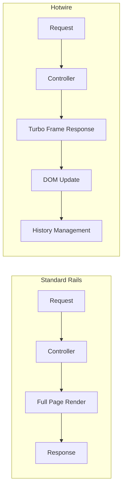
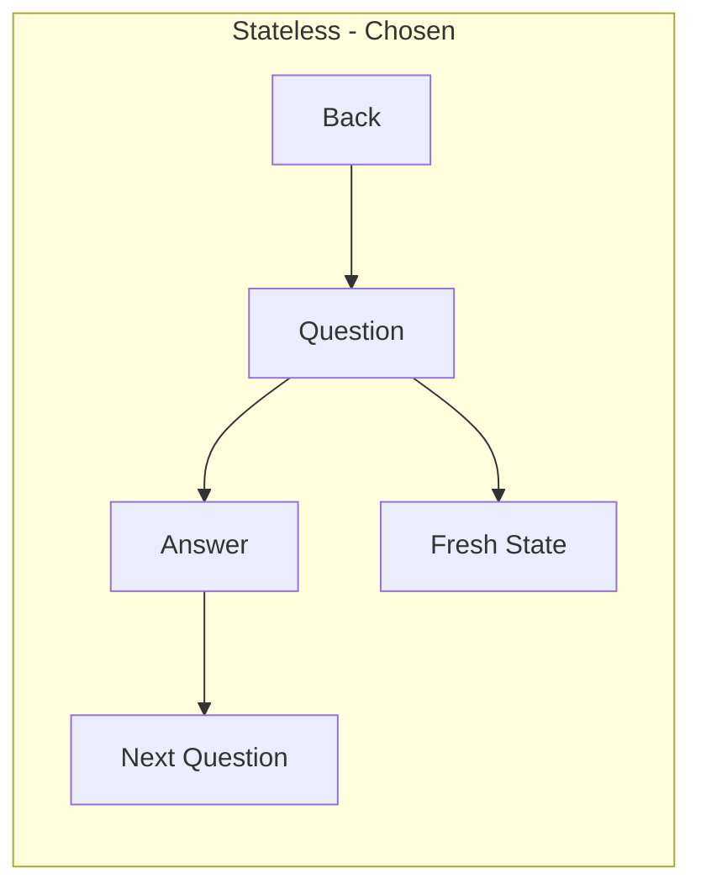
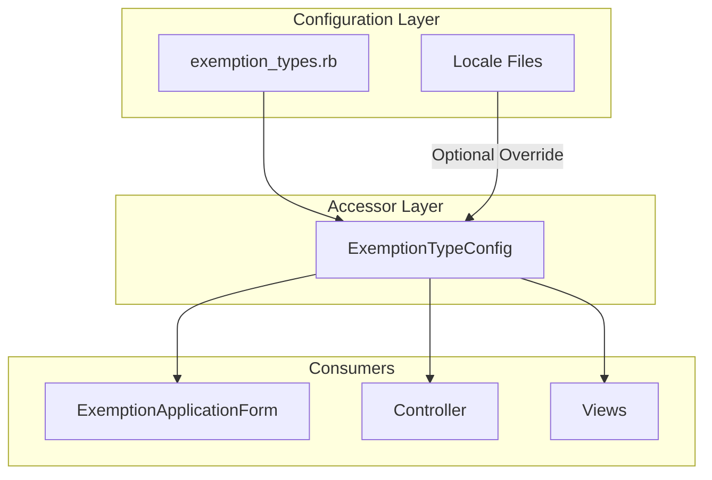
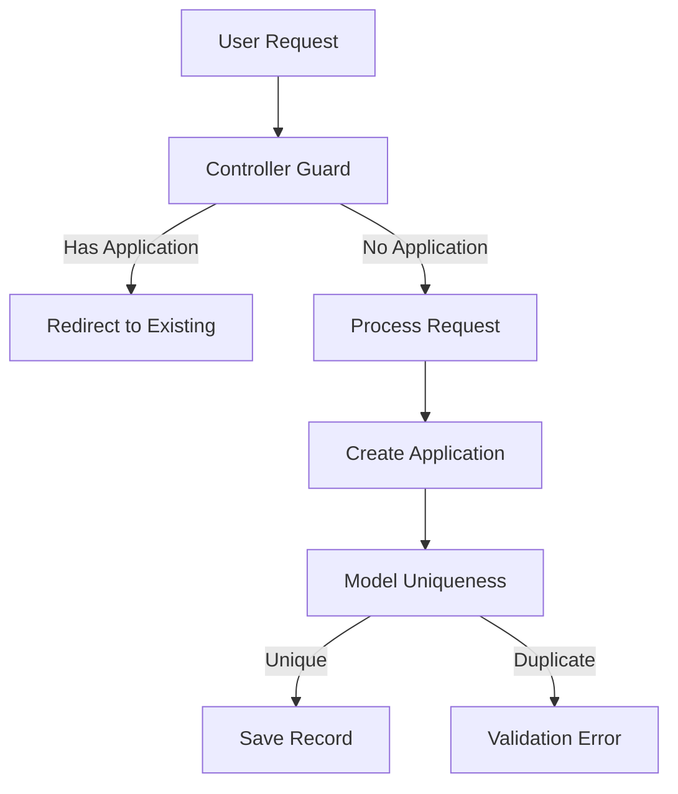

# Exemption Screener V2 - Architecture Decisions

> **C4 Level 4**: Architecture Decision Records (ADRs)

This document captures key architectural decisions for the Exemption Screener V2 feature.

---

## ADR-001: Standard Rails Pages Over Hotwire

### Status

**Accepted**

### Context

The exemption screener needs to present 6 sequential questions with navigation between them. Two implementation approaches were considered:

1. **Standard Rails Pages**: Full page loads for each question
2. **Hotwire/Turbo Frames**: SPA-like experience with partial page updates

### Decision

Use **standard Rails pages** with full page loads for each question.

### Rationale

**Consistency with Codebase**:

- No existing Turbo Frame usage in the application
- Follows established patterns the team understands
- Lower risk of introducing unfamiliar patterns

**Simplicity**:



**Testing**:

- Standard request specs work without JavaScript
- No system specs with JS driver required
- Simpler CI pipeline

**Accessibility**:

- Browser back button works naturally
- No JavaScript dependency for core functionality
- Graceful degradation guaranteed

**UX Impact**:

- For a 6-question flow, the UX difference is minimal
- Each question has a unique, bookmarkable URL
- Brief page flash is acceptable tradeoff

### Consequences

**Positive**:

- Lower implementation risk with tight timeline
- Simpler testing requirements
- Team already familiar with pattern
- Better accessibility out of the box

**Negative**:

- User sees brief flash between questions
- Full HTTP round-trip for each navigation
- Less "modern" feel compared to SPA

**Mitigations**:

- Optimize page load time with minimal assets
- Consider Hotwire for future iterations if UX feedback warrants

---

## ADR-002: Stateless Answer Storage

### Status

**Accepted**

### Context

Users can navigate back to previous questions. Three approaches for handling answer persistence were considered:

| Approach | Storage | Persistence |
| -------- | ------- | ----------- |
| Stateless | None | Answers not remembered |
| Session | Rails session | Browser session lifetime |
| Database | New table | Permanent |

### Decision

Use **stateless approach** with no answer persistence.

### Rationale

**Simplicity**:



- No session management complexity
- No database migrations required
- No state synchronization issues

**User Impact Assessment**:

- 6 questions is short enough to re-answer
- Users going back likely want to reconsider anyway
- "Yes" answers immediately exit to application flow

**Early Exit Handling**:

- If user answers "Yes" and creates application, they're redirected
- Application creation is the terminal action, not answer storage

**Future Flexibility**:

- Can add session persistence later without breaking changes
- Stateless is the safest starting point

### Consequences

**Positive**:

- Simplest implementation
- No storage concerns (session size, database bloat)
- Clean slate allows reconsideration without bias

**Negative**:

- Users may forget previous answers
- Cannot show "You previously answered..." context
- No analytics on answer patterns (pre-completion)

---

## ADR-003: Initializer-Based Configuration

### Status

**Accepted**

### Context

Exemption types need to be configurable. The system needs to support:

- 6 exemption types (expandable)
- Question text, explanations, documentation requirements
- Enable/disable individual types
- Display ordering
- Future I18n support

Three approaches were considered:

| Approach | Location | Editability | I18n Support |
| -------- | -------- | ----------- | ------------ |
| Hardcoded | Model enum | Deploy required | Difficult |
| Initializer | Config file | Deploy required | Built-in |
| Database | Admin table | Runtime | Complex |

### Decision

Use **initializer-based configuration** with a PORO accessor class.

### Rationale

**Architecture**:



**Configuration Structure**:

```ruby
# config/initializers/exemption_types.rb
Rails.application.config.exemption_types = {
  medical_condition: {
    question: "Do you have a serious medical condition?",
    explanation: "You may qualify if you have a documented...",
    yes_answer: "I have a serious medical condition.",
    documentation: [
      "Doctor's letter or medical records",
      "Statement describing how condition affects ability to work"
    ],
    order: 1,
    enabled: true
  },
  # ... additional types
}
```

**Accessor Class Benefits**:

```ruby
# app/models/exemption_type_config.rb
class ExemptionTypeConfig
  class << self
    def all
      Rails.application.config.exemption_types
    end
    
    def ordered
      all.select { |_, v| v[:enabled] }
          .sort_by { |_, v| v[:order] }
    end
    
    def question_for(type)
      # I18n with config fallback
      I18n.t(
        "exemption_types.#{type}.question",
        default: all[type.to_sym][:question]
      )
    end
    
    def enum_hash
      all.keys.index_with(&:to_s)
    end
  end
end
```

**I18n Integration**:

- Default text lives in initializer (always works)
- Locale files can override for translations
- No breakage if translations missing

### Consequences

**Positive**:

- Single source of truth for exemption definitions
- I18n-ready without immediate complexity
- Easy to enable/disable or reorder types
- Testable with configuration overrides
- Version controlled with code

**Negative**:

- Requires deploy to change configuration
- Not editable by non-developers
- Must restart server after config changes (dev)

**Future Path**:

- If runtime editing needed, migrate to database-backed
- Configuration structure provides migration path

---

## ADR-004: URL-Based Navigation State

### Status

**Accepted**

### Context

The screener needs to support:

- Forward navigation through questions
- Back navigation to previous questions
- Direct linking to specific questions (edge case)

### Decision

Use **URL parameters** to encode navigation state.

### Rationale

**URL Structure**:

```
/exemption-screener/question/medical_condition
/exemption-screener/question/substance_use_treatment
/exemption-screener/may-qualify/medical_condition
/exemption-screener/complete
```

**Benefits**:

```mermaid
flowchart LR
    subgraph url [URL-Based State]
        URL[/question/type] --> Controller
        Controller --> Config[Lookup Type]
        Config --> Nav[Calculate Prev/Next]
    end
```

- Browser back button works naturally
- Each state is bookmarkable
- No hidden state to manage
- Server can validate type against configuration

**Navigation Logic**:

```ruby
def previous_exemption_type
  types = ExemptionTypeConfig.ordered.map(&:first)
  current_index = types.index(current_type)
  current_index > 0 ? types[current_index - 1] : nil
end

def next_exemption_type
  types = ExemptionTypeConfig.ordered.map(&:first)
  current_index = types.index(current_type)
  current_index < types.length - 1 ? types[current_index + 1] : nil
end
```

### Consequences

**Positive**:

- RESTful URL design
- Browser history integration
- Shareable/bookmarkable URLs
- Easy to test with request specs

**Negative**:

- Users could manually navigate to any question
- Must validate type exists in configuration

**Mitigations**:

- Invalid types redirect to first question
- Configuration determines valid types

---

## ADR-005: Duplicate Application Prevention

### Status

**Accepted**

### Context

Business rule: Only one exemption application per certification case. Must prevent:

- Accidental duplicate submissions
- Race conditions on create
- Access to screener when application exists

### Decision

Use **model validation + controller guard** for duplicate prevention.

### Rationale

**Layered Defense**:



**Implementation**:

```ruby
# Controller before_action
def check_existing_application
  existing = ExemptionApplicationForm.find_by(
    certification_case_id: @certification_case.id
  )
  redirect_to existing if existing
end

# Model validation
validates :certification_case_id, uniqueness: {
  message: "already has an exemption application"
}
```

**Database Constraint**:

```ruby
# Migration
add_index :exemption_application_forms, :certification_case_id, unique: true
```

### Consequences

**Positive**:

- Three layers of protection (UI, model, database)
- Clear error messaging
- Handles race conditions at database level

**Negative**:

- Slightly more complex than single check
- Must handle redirect gracefully

---

## Decision Summary

| Decision | Choice | Primary Driver |
| -------- | ------ | -------------- |
| Implementation | Standard Rails | Codebase consistency, lower risk |
| Answer Storage | Stateless | Simplicity, timeline |
| Configuration | Initializer + PORO | Maintainability, I18n readiness |
| Navigation | URL-based | Browser integration, RESTful |
| Duplicates | Layered validation | Data integrity |

## Future Considerations

1. **Hotwire Migration**: If UX feedback indicates page transitions are problematic
2. **Session Persistence**: If users request answer memory
3. **Database Configuration**: If non-developers need to edit types
4. **Analytics**: Track completion rates, drop-off points
5. **Conditional Questions**: Show/hide based on user data or previous answers

