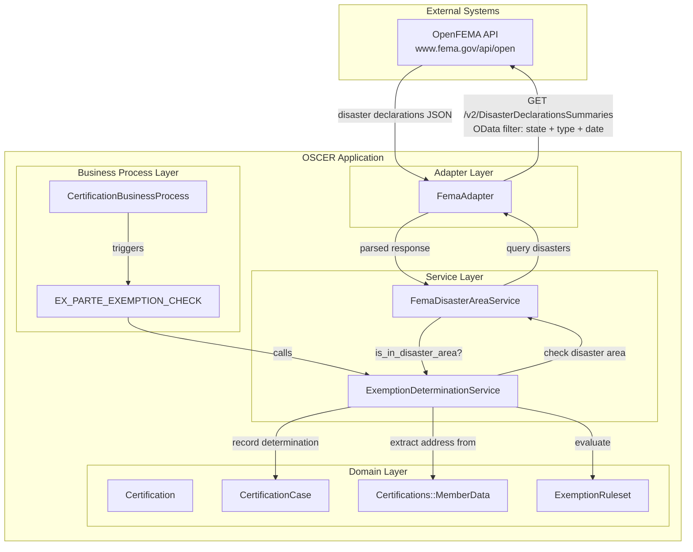

# FEMA Disaster Area Integration (OpenFEMA API)

## Problem

Members living in federally declared disaster areas may qualify for exemptions from Medicaid work requirements. Currently, caseworkers must manually verify whether a member's county falls within an active FEMA disaster declaration — a slow and error-prone process that delays exemption determinations.

Integrating with the FEMA OpenFEMA API enables:

1. **Automated ex-parte exemption checks** — System automatically determines whether a member resides in an active disaster area during the `EX_PARTE_EXEMPTION_CHECK` step, without member intervention
2. **Accurate, real-time data** — Disaster declarations are queried directly from FEMA's authoritative dataset, eliminating manual lookups

## Approach

### OpenFEMA API Overview

The [OpenFEMA API](https://www.fema.gov/about/openfema/api) is a free, public, RESTful API that provides access to FEMA datasets. No authentication, API keys, or registration is required.

| Aspect | Detail |
|--------|--------|
| Base URL | `https://www.fema.gov/api/open` |
| Endpoint | `GET /v2/DisasterDeclarationsSummaries` |
| Auth | None (public API) |
| Rate limiting | No explicit limits documented; recommended to use reasonable request rates |
| Max records | 10,000 per request (paginated via `$skip`) |
| Format | JSON (OData-compatible filtering) |

### Declaration Types That Qualify

| Type Code | Name | Qualifies? |
|-----------|------|------------|
| DR | Major Disaster Declaration | Yes |
| EM | Emergency Declaration | Yes |
| FM | Fire Management | No |
| FS | Fire Suppression | No |

Only **DR** (Major Disaster) and **EM** (Emergency) declarations trigger exemption eligibility, as these represent the most severe disaster classifications with direct impact on residents.

### Time Window Logic

A disaster is considered **active** for a certification period when:

```
incidentBeginDate <= certification_date
AND (incidentEndDate IS NULL OR incidentEndDate >= certification_date)
```

A null `incidentEndDate` indicates an ongoing disaster.

## C4 Component Diagram



## Key Interfaces

### FEMA API Endpoint

| Endpoint | Method | Purpose | Auth |
|----------|--------|---------|------|
| `/v2/DisasterDeclarationsSummaries` | GET | Query active disaster declarations by state, type, and date | None |

### OData Query Construction

The API supports OData `$filter` for server-side filtering. The adapter constructs queries to minimize data transfer:

```
GET /v2/DisasterDeclarationsSummaries?$filter=
  state eq '{state_code}'
  and (declarationType eq 'DR' or declarationType eq 'EM')
  and incidentBeginDate le '{cert_date}'
  and (incidentEndDate eq null or incidentEndDate ge '{cert_date}')
```

**Example** — Active disasters in Oregon as of 2026-03-19:

```
GET /v2/DisasterDeclarationsSummaries?$filter=state eq 'OR' and (declarationType eq 'DR' or declarationType eq 'EM') and incidentBeginDate le '2026-03-19' and (incidentEndDate eq null or incidentEndDate ge '2026-03-19')
```

### Response Format

```json
{
  "DisasterDeclarationsSummaries": [
    {
      "disasterNumber": 4562,
      "state": "OR",
      "declarationType": "DR",
      "declarationDate": "2021-09-01T00:00:00.000Z",
      "declarationTitle": "SEVERE STORMS AND FLOODING",
      "incidentType": "Flood",
      "incidentBeginDate": "2021-08-01T00:00:00.000Z",
      "incidentEndDate": null,
      "designatedArea": "Multnomah (County)",
      "fipsStateCode": "41",
      "fipsCountyCode": "051"
    }
  ],
  "metadata": {
    "skip": 0,
    "top": 1000,
    "count": 1
  }
}
```

### County Matching Strategy

After server-side filtering by state, type, and date, the service matches the member's county against the `designatedArea` field client-side:

1. **Normalize** the `designatedArea` value: strip trailing ` (County)` suffix, case-insensitive comparison
2. **Handle "Statewide"** designations: if any matching declaration has `designatedArea` of `"Statewide"`, the member qualifies regardless of county
3. **Match county name**: compare member's county against normalized `designatedArea`

```ruby
# Matching logic
def matches_county?(designated_area, member_county)
  normalized = designated_area.gsub(/\s*\(County\)\s*$/i, "").strip
  return true if normalized.casecmp("statewide").zero?

  normalized.casecmp(member_county.strip).zero?
end
```

## Sample Code

### FemaAdapter

```ruby
# app/adapters/fema_adapter.rb

class FemaAdapter < DataIntegration::BaseAdapter
  # Queries active disaster declarations for a given state and date
  # @param state [String] two-letter state code (e.g., "OR")
  # @param certification_date [Date] date to check against disaster window
  # @return [Array<Hash>] matching disaster declaration summaries
  def get_disaster_declarations(state:, certification_date:)
    with_error_handling do
      @connection.get("v2/DisasterDeclarationsSummaries") do |req|
        req.params["$filter"] = build_filter(state, certification_date)
      end
    end
  end

  private

  def default_connection
    Faraday.new(url: Rails.application.config.fema[:api_host]) do |f|
      f.request :json
      f.response :json
      f.options.timeout = Rails.application.config.fema[:timeout_seconds]
      f.options.open_timeout = Rails.application.config.fema[:timeout_seconds]
      f.adapter Faraday.default_adapter
    end
  end

  def build_filter(state, date)
    date_str = date.iso8601
    [
      "state eq '#{state}'",
      "(declarationType eq 'DR' or declarationType eq 'EM')",
      "incidentBeginDate le '#{date_str}'",
      "(incidentEndDate eq null or incidentEndDate ge '#{date_str}')"
    ].join(" and ")
  end
end
```

### FemaDisasterAreaService

```ruby
# app/services/fema_disaster_area_service.rb

class FemaDisasterAreaService < DataIntegration::BaseService
  def initialize(adapter: FemaAdapter.new)
    super(adapter: adapter)
  end

  # Checks if a member's county is in an active disaster area
  # @param state [String] two-letter state code
  # @param county [String] county name
  # @param certification_date [Date] date to check
  # @return [Boolean, nil] true if in disaster area, false if not, nil on error
  def in_disaster_area?(state:, county:, certification_date:)
    return nil if state.blank? || county.blank? || certification_date.blank?

    response = @adapter.get_disaster_declarations(
      state: state,
      certification_date: certification_date
    )

    declarations = response["DisasterDeclarationsSummaries"] || []
    declarations.any? { |d| matches_county?(d["designatedArea"], county) }
  rescue DataIntegration::BaseAdapter::ApiError => e
    handle_integration_error(e)
  end

  private

  def matches_county?(designated_area, member_county)
    return false if designated_area.blank?

    normalized = designated_area.gsub(/\s*\(County\)\s*$/i, "").strip
    return true if normalized.casecmp("statewide").zero?

    normalized.casecmp(member_county.strip).zero?
  end
end
```

### MemberData Changes

```ruby
# app/models/certifications/member_data.rb (proposed additions)

# Add to existing attributes:
attribute :residential_address, :string   # Street address (mapped from upstream "address" field)
attribute :county, :string                # County name (mapped from upstream "county" field)
attribute :state, :string                 # Two-letter state code
attribute :zip_code, :string              # ZIP code (mapped from upstream "zip" field)
```

The upstream `UnifiedRecordProcessor` already maps these fields from source records but they are not currently captured by `Certifications::MemberData`:

```ruby
# app/services/unified_record_processor.rb (existing, lines ~129-131)
"address" => record["address"],
"county" => record["county"],
"zip" => record["zip_code"],
```

### ExemptionDeterminationService Changes

```ruby
# app/services/exemption_determination_service.rb (proposed additions)

# In evaluate_exemption_eligibility, add:
disaster_area_status = extract_disaster_area_status(certification)

# In engine.set_facts, add:
is_in_disaster_area: disaster_area_status

# New private method:
def extract_disaster_area_status(certification)
  return nil unless Features.fema_disaster_area_enabled?
  return nil unless certification.member_data

  member = certification.member_data
  return nil if member.state.blank? || member.county.blank?

  certification_date = extract_evaluation_date(certification)
  return nil if certification_date.blank?

  FemaDisasterAreaService.new.in_disaster_area?(
    state: member.state,
    county: member.county,
    certification_date: certification_date
  )
end
```

### ExemptionRuleset Changes

```ruby
# app/models/rules/exemption_ruleset.rb (proposed additions)

def is_in_disaster_area(is_in_disaster_area)
  return if is_in_disaster_area.nil?

  is_in_disaster_area
end

# Update eligible_for_exemption signature:
def eligible_for_exemption(age_under_19, age_over_65, is_pregnant,
                           is_american_indian_or_alaska_native,
                           is_veteran_with_disability,
                           is_in_disaster_area)  # NEW
  facts = [age_under_19, age_over_65, is_pregnant,
           is_american_indian_or_alaska_native, is_veteran_with_disability,
           is_in_disaster_area]
  return if facts.all?(&:nil?)

  facts.any?
end
```

## Integration Points

### 1. ExemptionDeterminationService

The primary integration point. During `EX_PARTE_EXEMPTION_CHECK`, the service extracts the member's state and county from `Certifications::MemberData`, then calls `FemaDisasterAreaService` to check for active disaster declarations.

### 2. ExemptionRuleset

A new `is_in_disaster_area` predicate is added to the ruleset, following the same pattern as `is_veteran_with_disability`. The `eligible_for_exemption` rule is updated to include it in the OR evaluation.

### 3. Certifications::MemberData

New attributes (`residential_address`, `county`, `state`, `zip_code`) capture location data that the upstream `UnifiedRecordProcessor` already sends but the value object does not currently store.

### 4. Feature Flag

The integration is gated behind a `FEATURE_FEMA_DISASTER_AREA` feature flag, following the existing pattern in `config/initializers/feature_flags.rb`.

## Decisions

### Graceful Degradation on FEMA API Failures

**Decision**: Fail open when the FEMA API is unavailable — treat as "unable to determine" rather than "not in disaster area."

**Rationale**:
- Members should not be disadvantaged by external system issues
- The FEMA API is public and generally available, but has no documented SLA
- Manual verification paths remain available via exemption application form
- Returning `nil` allows the rules engine to skip the fact without affecting other exemption checks

**Tradeoff**: Some members in disaster areas may not receive automatic exemption if the API is down, requiring manual review.

### Server-Side Filtering, Client-Side County Matching

**Decision**: Use OData `$filter` for state, declaration type, and date range server-side; match county client-side.

**Rationale**:
- Server-side filters on state + type + date dramatically reduce the result set (typically < 50 records per state)
- The `designatedArea` field has inconsistent formatting (e.g., `"Multnomah (County)"`, `"Statewide"`) that requires normalization logic better handled in application code
- Client-side matching enables handling of "Statewide" designations cleanly

### County Name Matching (Not FIPS Code)

**Decision**: Match on county name rather than FIPS county code.

**Rationale**:
- The upstream data source provides county name, not FIPS code
- FIPS code matching would require maintaining a county-to-FIPS mapping table
- Name matching with normalization (strip suffix, case-insensitive) is sufficient for the vast majority of cases

**Tradeoff**: Edge cases may exist where county names differ slightly between FEMA and upstream data (e.g., "St. Louis" vs "Saint Louis"). These can be addressed with a normalization lookup if they arise in practice.

### Ex-Parte Automation Only (No Screener Flow Initially)

**Decision**: Implement FEMA disaster area checking in the ex-parte automation path only, not in the member-facing exemption screener.

**Rationale**:
- Ex-parte checks are fully automated — no member interaction needed
- The screener flow would require collecting address/county from the member, adding UI complexity
- Ex-parte covers the primary use case: automatically exempting members in disaster areas
- Screener integration can be added later if needed

## Environment Configuration

### Required Environment Variables

| Variable | Purpose | Default |
|----------|---------|---------|
| `FEMA_API_HOST` | OpenFEMA API base URL | `https://www.fema.gov/api/open` |
| `FEMA_TIMEOUT_SECONDS` | Request timeout in seconds | `10` |
| `FEATURE_FEMA_DISASTER_AREA` | Feature flag to enable/disable | `false` |

### Configuration Initializer

```ruby
# config/initializers/fema.rb

Rails.application.config.fema = {
  api_host: ENV.fetch("FEMA_API_HOST", "https://www.fema.gov/api/open"),
  timeout_seconds: ENV.fetch("FEMA_TIMEOUT_SECONDS", 10).to_i
}.freeze
```

### Feature Flag Registration

```ruby
# config/initializers/feature_flags.rb (addition to FEATURE_FLAGS hash)

fema_disaster_area: {
  env_var: "FEATURE_FEMA_DISASTER_AREA",
  default: false,
  description: "Enable FEMA disaster area checks for ex-parte exemption determination"
}
```

## Rate Limiting and Caching

The OpenFEMA API has no documented rate limits, but responsible usage is expected:

- **Timeout**: Configurable via `FEMA_TIMEOUT_SECONDS` (default 10s), applied to both connection and read timeouts
- **Optional caching**: Disaster declarations change infrequently. A Rails cache layer can be added if volume warrants it:

```ruby
# Potential future caching in FemaDisasterAreaService
def in_disaster_area?(state:, county:, certification_date:)
  cache_key = "fema/disasters/#{state}/#{certification_date}"

  declarations = Rails.cache.fetch(cache_key, expires_in: 24.hours) do
    @adapter.get_disaster_declarations(state: state, certification_date: certification_date)
  end

  # ... county matching
end
```

Caching is **not included in the initial implementation** — it can be added if monitoring shows the need.

## Constraints

- **County name matching**: The `designatedArea` field format is not fully standardized. Most entries follow `"{County Name} (County)"` but edge cases may require additional normalization
- **Address data dependency**: FEMA check requires `state` and `county` on `MemberData`. If upstream data is missing these fields, the check is skipped (returns `nil`)
- **No authentication**: While convenient, the public API has no SLA guarantees. Monitor availability and consider fallback strategies if reliability becomes an issue
- **Statewide declarations**: When a disaster is declared statewide, all members in that state qualify. This is correct behavior but may result in a large number of automatic exemptions during major disasters
- **No FIPS-based matching**: Relying on county name matching means potential mismatches for counties with non-standard naming. If this becomes an issue, a FIPS lookup table can be introduced

## References

- [OpenFEMA API Documentation](https://www.fema.gov/about/openfema/api)
- [DisasterDeclarationsSummaries Dataset](https://www.fema.gov/openfema-data-page/disaster-declarations-summaries-v2)
- [OpenFEMA API Data Fields](https://www.fema.gov/api/open/v2/DisasterDeclarationsSummaries)
- [VA Eligibility Integration Spec](../va-eligibility-integration/va-eligibility-integration.md) (sibling integration for structural reference)
