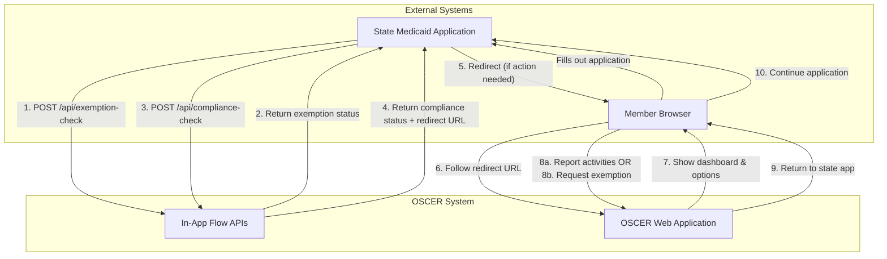
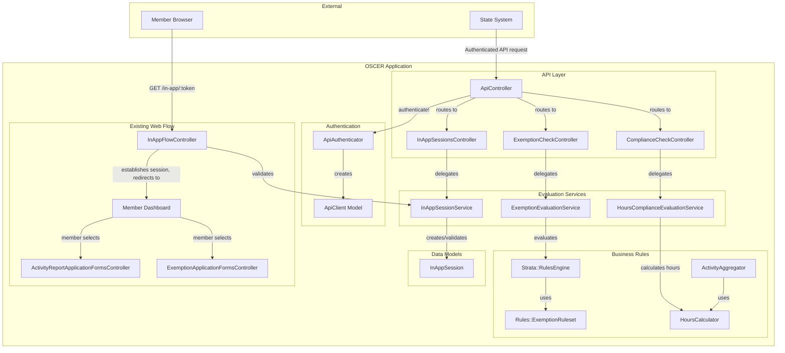
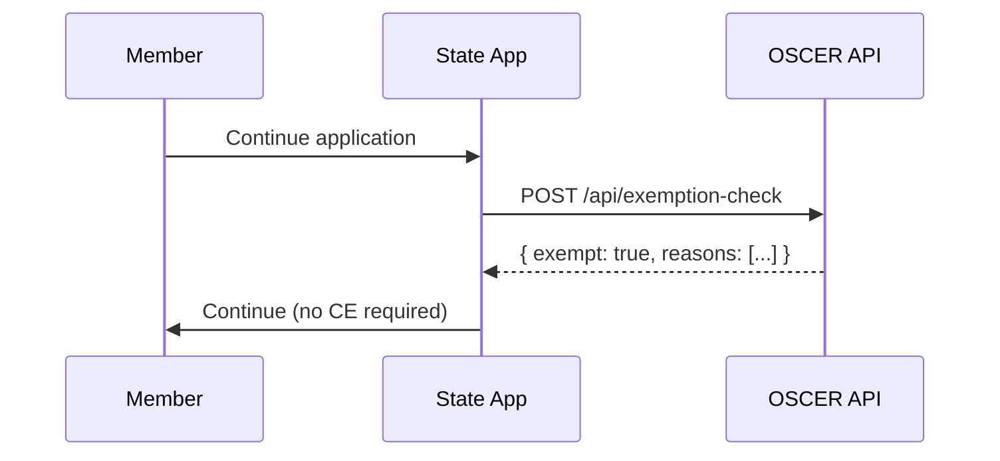
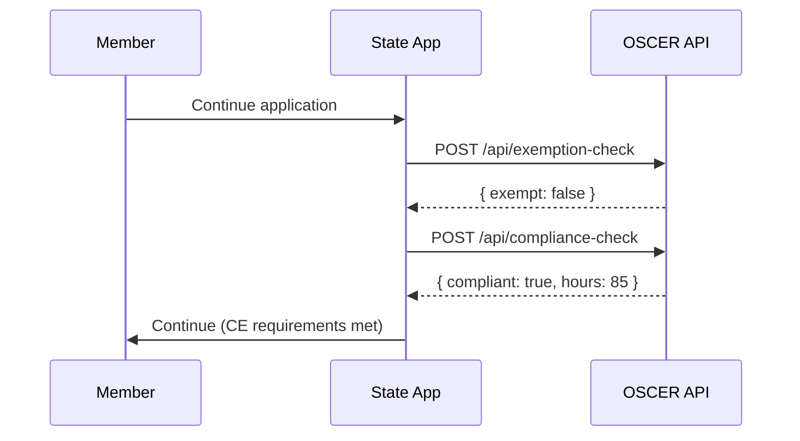
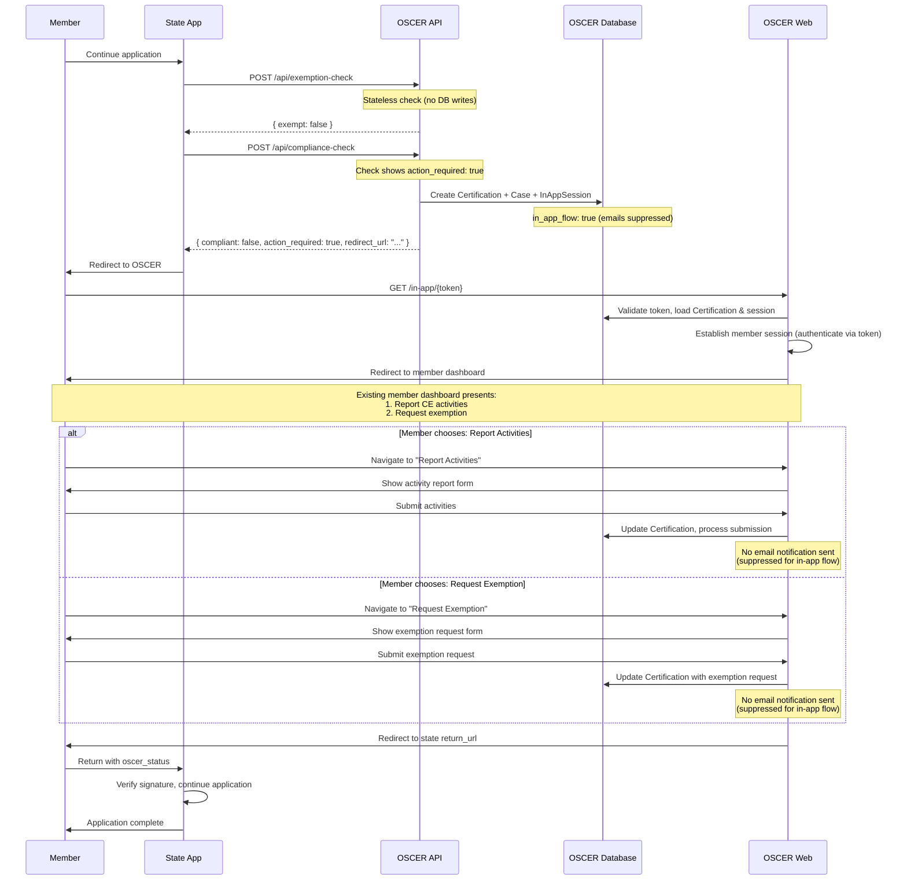

# In-App Medicaid OSCER Flow
> **[ON HOLD]** - Awaiting state validation
>
> This in-app Medicaid flow feature is currently **not being built** until we receive concrete use case validation from state partners. 
>
> **Why we're pausing:**
> - Policy research indicates most state applications are not dynamic enough to support real-time API integrations during application submission
> - States have expressed interest in modular components (rules engine, data connections)
> - The core value proposition may be better served through a headless rules engine approach that integrates with existing state workflows
>
> **What we're doing instead:**
> - Continuing conversations with state partners to understand their application processes and integration capabilities
> - Exploring headless/API-only rules engine options that don't require routing applicants to OSCER's UI
> - Focusing on higher value epics and the renewal process, where states have expressed more immediate need for support
>
> This brief is preserved as documentation of the research and design thinking, and may be revisited if state partners express explicit demand for this workflow.
## Table of Contents
1. [Problem](#problem)
2. [Approach](#approach)
3. [Architecture Diagrams](#c4-system-context-diagram)
4. [API Interfaces](#key-interfaces)
5. [Data Models](#data-model)
6. [Integration with Existing Services](#integration-with-existing-services)
7. [Architectural Decision Records](#decisions)
8. [Implementation Phases](#implementation-phases)
9. [Appendices](#appendix-openapi-specification-excerpt)

## Problem

The current OSCER model for community engagement (CE) reporting follows a
batch-oriented, post-application flow:

1. State sends member data after Medicaid application is complete
2. OSCER checks for exemptions and compliance
3. Member receives notification to return later if action is needed

This "come back later" pattern creates member friction, leads to drop-off, and
results in coverage loss. Research from Code for America and CBPP shows that
collecting CE information at application time significantly reduces coverage
loss - administrative burden, not actual ineligibility, causes most coverage
losses under work requirements.

**The core problem:** States need a way to integrate CE checks directly into
their Medicaid application flow, so members can complete reporting during
initial application rather than returning later.

## Approach

Enable real-time, in-application integration with OSCER through two new API
endpoints:

1. **Exemption Check API** - Stateless, synchronous endpoint that evaluates
   member eligibility for CE exemptions. Returns exemption status and reason
codes immediately. **No database writes.**

2. **Compliance Check API** - Synchronous endpoint that evaluates member's ex
   parte activity data against CE requirements. Returns compliance status and,
if action is needed, creates a Certification/Case and returns a redirect URL
for in-app reporting. **Database writes only when `action_required: true`.**

3. **In-App Session Management** - Token-based redirect mechanism that allows
   members to seamlessly transition from state application to OSCER's member
dashboard where they can choose to report activities or request an exemption,
then return to state application with updated status. **All automated OSCER
notifications suppressed for in-app flow - state handles all member communication.**

This approach:
- **Truly stateless** - Zero database writes for compliant/exempt members
- **On-demand record creation** - Certification/Case created only when member needs to take action
- **Certification-based sessions** - In-app members are authenticated via their Certification, not User records. No OSCER accounts are created for transient in-app members. (See [ADR-007](#adr-007-certification-based-session-authentication))
- **Reuses existing business logic** from exemption rules and activity aggregation
- **Maintains state ownership** of the member experience and all communication
- **Does not replace batch flow** - states can continue using batch processing alongside real-time APIs
- **Minimizes member friction** through one-time tokens and seamless redirects
- **Suppresses all OSCER notifications** for in-app flow - state handles all member communication throughout certification lifecycle

---

## C4 System Context Diagram

> Level 1: How OSCER integrates with state systems for in-app flow



---

## C4 Component Diagram

> Level 3: Internal components within the OSCER Rails application



---

## Key Interfaces

### API Authentication

API endpoints require authentication per the [API Security
ADR](/docs/architecture/api-security/api-security.md). State systems must
include authentication credentials in API requests.

---

### Exemption Check API

**Endpoint:** `POST /api/exemption-check`

**Purpose:** Evaluate if member qualifies for CE exemption based on demographic data.

**Implementation:** Calls `ExemptionEvaluationService.evaluate()` which wraps the existing `Rules::ExemptionRuleset` and `Strata::RulesEngine`.

**Database Behavior:** Stateless - no database writes. Pure calculation based on rules engine.

**Request:**
```json
{
  "member_data": {
    "date_of_birth": "2010-05-15",
    "pregnancy_status": false,
    "race_ethnicity": "hispanic"
  },
  "evaluation_date": "2026-01-16"
}
```

**Response (Exempt):**
```json
{
  "exempt": true,
  "exemption_reasons": [
    {
      "code": "age_under_19_exempt",
      "description": "Member is under 19 years old",
      "i18n_key": "exemption_types.age_under_19.title"
    }
  ],
  "evaluated_at": "2026-01-16T10:30:00Z"
}
```

**Response (Not Exempt):**
```json
{
  "exempt": false,
  "exemption_reasons": [],
  "evaluated_at": "2026-01-16T10:30:00Z"
}
```

| Status Code | Meaning |
|-------------|---------|
| 200         | Successful evaluation |
| 400         | Invalid request body |
| 401         | Authentication failed |
| 422         | Validation error |

---

### Compliance Check API

**Endpoint:** `POST /api/compliance-check`

**Purpose:** Evaluate if member's ex parte activities meet CE requirements.
Returns compliance status and redirect URL if action needed.

**Implementation:** Calls `HoursComplianceEvaluationService.evaluate()` which uses the `HoursCalculator` for stateless hours aggregation.

**Database Behavior:**
- **Stateless when compliant/exempt** - No database writes, pure calculation
- **Creates records when action required** - When `action_required: true`, creates:
  1. **Certification** - Contains member demographic data (first_name, last_name, date_of_birth, state_member_id, email, phone) and certification requirements
  2. **ExParteActivity** records - One record per activity in the `activities` array, linked via `member_id` (consistent with existing batch flow)
  3. **CertificationOrigin** - Marks source as API with `in_app_flow: true` to suppress notifications
  4. **InAppSession** - Links to Certification for redirect flow and status tracking
  5. **CertificationCase** - Created automatically when `CertificationCreated` event triggers the business process

**Request:**
```json
{
  "member_data": {
    "state_member_id": "STATE-12345",
    "first_name": "Jane",
    "last_name": "Smith",
    "date_of_birth": "1985-06-15",
    "email": "jane.smith@example.com",
    "phone": "555-123-4567",
    "activities": [
      {
        "type": "hourly",
        "category": "employment",
        "hours": 60,
        "period_start": "2025-12-01",
        "period_end": "2025-12-31",
        "employer": "Acme Corp",
        "verification_status": "verified"
      }
    ],
    "payroll_accounts": []
  },
  "certification_requirements": {
    "certification_date": "2026-01-16",
    "months_that_can_be_certified": ["2025-12-01"],
    "number_of_months_to_certify": 1,
    "target_hours": 80
  },
  "state_session_id": "abc123"
}
```

**Response (Compliant):**
```json
{
  "compliant": true,
  "total_hours": 85,
  "target_hours": 80,
  "hours_by_category": {
    "employment": 85
  },
  "hours_by_source": {
    "ex_parte": 85
  },
  "action_required": false,
  "evaluated_at": "2026-01-16T10:30:00Z"
}
```

**Response (Action Required):**
```json
{
  "compliant": false,
  "total_hours": 60,
  "target_hours": 80,
  "hours_needed": 20,
  "hours_by_category": {
    "employment": 60
  },
  "hours_by_source": {
    "ex_parte": 60
  },
  "action_required": true,
  "redirect_url": "https://oscer.example.com/in-app/tk_a1b2c3d4e5f6",
  "redirect_expires_at": "2026-01-16T11:00:00Z",
  "oscer_session_id": "550e8400-e29b-41d4-a716-446655440000",
  "evaluated_at": "2026-01-16T10:30:00Z"
}
```

**Idempotency:**

If a compliance check is called for a member who already has an active in-app
session (not yet completed), the API returns the existing session rather than
creating a new Certification:

- Existing `InAppSession` found by `state_identifier` + `state_session_id` (not expired, not completed)
- Returns same `redirect_url` and `oscer_session_id`
- No duplicate records created

If the previous session has expired or completed, a new Certification and
session are created.

---

### In-App Session Flow

**Token URL Format:** `https://oscer.example.com/in-app/{token}`

**Token Properties:**
- Generated using Rails `has_secure_token` (cryptographically secure random string)
- Stored in `InAppSession.token` column
- One-time use (invalidated after redemption via `token_consumed_at`)
- 30-minute expiration window
- Validated via database lookup (not stateless verification)

**Flow Steps:**
1. Member clicks redirect link from state application
2. `InAppFlowController` validates token and establishes member session
3. Member redirected to existing member dashboard
4. Dashboard shows member status and presents options:
   - **Report CE Activities**: Navigate to activity reporting flow
   - **Request Exemption**: Navigate to manual exemption request form
5. Member completes chosen path
6. OSCER redirects back to state with signed status parameters

**Return URL Configuration:**

During API onboarding, states configure a **return URL pattern** (e.g., `https://state.gov/medicaid/continue`) in their OSCER state configuration. This base URL is stored in OSCER's state configuration, not in individual session records.

**Return URL Parameters:**

When member completes their submission, OSCER dynamically builds the return URL by:
1. Looking up the state's configured return URL pattern via `state_identifier`
2. Appending signed query parameters
3. Generating a fresh HMAC signature using the current state secret

Example return URL:
```
https://state.gov/medicaid/continue?
  session=abc123&
  oscer_status=activities_submitted&
  oscer_session_id=sess_xyz789&
  signature=hmac_signature
```

| Parameter | Description |
|-----------|-------------|
| session | Original state session ID (from `InAppSession.state_session_id`) |
| oscer_status | Submission status: `activities_submitted`, `exemption_requested` |
| oscer_session_id | OSCER session ID for status polling and audit tracking |
| signature | HMAC signature for verification (generated fresh) |

**Signature Generation and Verification:**

Return URL signatures use HMAC-SHA256. States provide their signing secret during API onboarding (same secret used for API authentication).

Signature generation (OSCER):
```ruby
# Look up state configuration and get current secret
state_config = StateConfiguration.find_by!(identifier: session.state_identifier)
message = "#{oscer_session_id}:#{oscer_status}"
signature = OpenSSL::HMAC.hexdigest('SHA256', state_config.current_secret, message)
```

State verification (pseudocode):
```python
expected = hmac_sha256(secret, f"{oscer_session_id}:{oscer_status}")
if not constant_time_compare(expected, signature):
    reject_request()
```

States MUST use constant-time comparison to prevent timing attacks.

**Secret Rotation:** Because signatures are generated fresh on-demand (not stored), states can rotate their secrets without invalidating existing in-progress sessions. The next redirect will automatically use the new secret.

**Status Values:**
- `activities_submitted` - Member reported CE activities, pending caseworker review
- `exemption_requested` - Member submitted exemption request, pending caseworker review

**Note**: These statuses reflect what the member submitted, not the final determination.
Caseworker review happens asynchronously within OSCER. States should implement one of:
1. **Polling API** (future) - `GET /api/in-app-sessions/{oscer_session_id}/status` to query certification status using the session ID
2. **Webhook callbacks** (future enhancement) - Receive notifications when determinations complete
3. **Manual process** - Caseworker updates state system directly

The `oscer_session_id` returned in both the compliance-check response and the return URL enables states to track and query the certification status. See "Future Considerations" for detailed API specifications.

Members only reach this flow when action is required. Automatic exemptions and
compliance are determined during the API check phase before redirection.

**Member Authentication (Session-Based, No User Record):**

In-app flow members are authenticated via session context rather than User records:

1. `InAppFlowController` validates the one-time token
2. Stores `certification_id` and `in_app_session_id` in the Rails session
3. Clears any existing Devise session to prevent conflicts
4. Redirects to the member dashboard

Member controllers include the `InAppAuthentication` concern which:
- Checks for `session[:in_app_certification_id]`
- If present, loads the Certification directly as the authentication context
- If absent, falls back to standard Devise `authenticate_user!`
- Overrides `pundit_user` to return the Certification for Pundit authorization

**Key Integration Points:**

| Concern | Solution |
|---------|----------|
| Pundit authorization | `pundit_user` returns Certification for in-app sessions |
| Form `user_id` fields | Set to `nil` for in-app submissions (nullable in schema) |
| View `current_user` references | Use safe navigation or `member_first_name` helper |
| Return flow | `redirect_to_state_app(status:)` builds signed return URL |

**Controllers Requiring Modification:**
- `DashboardController`
- `ActivityReportApplicationFormsController`
- `ExemptionApplicationFormsController`

**Benefits:**
- No User records created for transient in-app members
- Members scoped to their specific Certification
- No Cognito integration required for in-app flow
- Clear separation from normal user authentication flows

**Trade-off:** Members cannot return to OSCER later without a new token from
the state application.

---

### Service Interfaces

**ExemptionEvaluationService:**
```ruby
class ExemptionEvaluationService
  # Stateless exemption evaluation using existing rules engine
  # @param member_data [Hash] DOB, pregnancy_status, race_ethnicity
  # @param evaluation_date [Date] Date to evaluate exemptions
  # @return [ExemptionEvaluationResult] exempt?, reasons, evaluated_at
  def self.evaluate(member_data:, evaluation_date:)
end
```

**HoursComplianceEvaluationService:**
```ruby
class HoursComplianceEvaluationService
  # Stateless hours compliance evaluation using HoursCalculator
  # @param member_data [Hash] activities, payroll_accounts
  # @param certification_requirements [Hash] dates, target_hours
  # @return [HoursComplianceEvaluationResult] compliant?, hours_data, action_required?
  def self.evaluate(member_data:, certification_requirements:)
end
```

**InAppSessionService:**
```ruby
class InAppSessionService
  # @param state_identifier [String] State system identifier
  # @param state_session_id [String] State's session ID for tracking
  # @param certification [Certification] The certification created for this session
  # @return [InAppSession] Session with token and oscer_session_id
  def self.create_session(state_identifier:, state_session_id:, certification:)

  # @param token [String] Session token
  # @return [InAppSession, nil] Valid session or nil
  def self.validate_and_consume_token(token)

  # @param session [InAppSession] Completed session
  # @param status [String] Final status (activities_submitted, exemption_requested)
  # @return [String] Signed return URL with status and oscer_session_id
  # Looks up state configuration via session.state_identifier to get return URL pattern
  # Generates fresh HMAC signature using current state secret
  def self.build_return_url(session, status:)
end
```

**HoursCalculator:**
```ruby
class HoursCalculator
  # Pure calculation service that works with any enumerable of activity-like objects
  # (ActiveRecord models, OpenStructs, Hashes, etc.)

  # @param activities [Enumerable] Collection of activity objects with hours/category
  # @return [Float] Total hours across all activities
  def self.calculate_total_hours(activities)

  # @param activities [Enumerable] Collection of activity objects
  # @return [Hash] Hours grouped by category { "employment" => 60.0, "training" => 20.0 }
  def self.calculate_hours_by_category(activities)

  # @param activity [Object] Activity with period_start, period_end, hours
  # @return [Hash] Allocated hours by month { Date(2025-12-01) => 40.0, Date(2026-01-01) => 20.0 }
  # Proportionally allocates activity hours across months based on days
  def self.allocate_activity_by_month(activity)

  # @param activities [Enumerable] Collection of activities
  # @return [Hash] Summary with total, by_category, and activity identifiers
  def self.summarize_hours(activities)
end
```

---

## Data Model

### InAppSession

Tracks state-to-OSCER-to-state redirect flows.

```ruby
# db/migrate/YYYYMMDDHHMMSS_create_in_app_sessions.rb
create_table :in_app_sessions, id: :uuid do |t|
  t.string :state_identifier, null: false
  t.string :state_session_id, null: false
  t.string :token, null: false
  t.references :certification, type: :uuid, foreign_key: true, null: true
  t.datetime :token_consumed_at
  t.datetime :expires_at, null: false
  t.datetime :completed_at
  t.timestamps

  t.index :token, unique: true
  t.index [:state_identifier, :state_session_id], unique: true
  t.index :expires_at
  t.index :token_consumed_at
  t.index :completed_at
end
```

**Note:** Return URLs are not stored in the session. Instead, they are dynamically generated when needed by looking up the state's configured return URL pattern (set during API onboarding) and appending fresh HMAC-signed parameters. This ensures:
1. **No redundancy** - Return URL can be reconstructed from `state_identifier` + state configuration
2. **Secret rotation resilience** - Signatures are always generated using the current state secret, never stale stored signatures
3. **Security best practice** - HMAC signatures are generated fresh on-demand

**Session State (derived from timestamps):**
- **Pending**: `token_consumed_at` is null and not expired
- **Active**: `token_consumed_at` present, `completed_at` null, and not expired
- **Completed**: `completed_at` present
- **Expired**: `expires_at` < current time

---

### StateConfiguration

Stores per-state configuration for API integration, including return URL patterns and authentication secrets. This is configured once during state API onboarding.

```ruby
# Existing table (conceptual - actual schema may vary)
# Key fields for in-app flow:
class StateConfiguration
  # Attributes:
  # - identifier: string (e.g., "STATE_MEDICAID_AGENCY")
  # - return_url_pattern: string (e.g., "https://state.gov/medicaid/continue")
  # - current_secret: encrypted string (for HMAC signing and API authentication)
end
```

**Usage:**
```ruby
# During return URL generation
state_config = StateConfiguration.find_by!(identifier: session.state_identifier)
base_url = state_config.return_url_pattern
# Append query parameters and generate fresh HMAC signature
```

---

### CertificationOrigin (Updated)

Existing model extended with `in_app_flow` flag to track API-originated
certifications that require notification suppression.

```ruby
# db/migrate/YYYYMMDDHHMMSS_add_in_app_flow_to_certification_origins.rb
class AddInAppFlowToCertificationOrigins < ActiveRecord::Migration[7.1]
  def change
    add_column :certification_origins, :in_app_flow, :boolean, default: false, null: false
    add_index :certification_origins, :in_app_flow
  end
end
```

**Purpose:**
- Distinguishes in-app flow certifications from batch/manual certifications
- Enables notification suppression for API checks
- Allows querying: "How many certifications came from in-app flow?"

**Usage:**
```ruby
# During certification creation for in-app flow
CertificationOrigin.create!(
  certification_id: certification.id,
  source_type: "api",
  in_app_flow: true  # Suppresses automated notifications
)

# In NotificationsEventListener
def handle_determined_exempt(event)
  certification = Certification.find(event.data[:certification_id])
  return if certification.certification_origin&.in_app_flow? # Skip if in-app flow
  MemberMailer.exempt_email(certification).deliver_later
end
```

---

## Integration with Existing Services

The in-app flow APIs reuse existing business logic to ensure consistency between batch and API flows.

### Exemption Evaluation Integration

**Existing Service:** `ExemptionDeterminationService` (called at `EX_PARTE_EXEMPTION_CHECK_STEP`)
- Orchestrates evaluation + saves determination + publishes events

**New Service:** `ExemptionEvaluationService`
- Stateless evaluation only, returns result

**Integration Pattern:**
```ruby
# Existing batch flow (with database writes + events)
ExemptionDeterminationService.determine(kase)
  → Extract member data from Certification
  → Evaluate using Strata::RulesEngine + Rules::ExemptionRuleset
  → Save determination to database
  → Publish domain events

# New in-app flow (stateless evaluation)
ExemptionEvaluationService.evaluate(member_data:, evaluation_date:)
  → Use same Rules::ExemptionRuleset + Strata::RulesEngine
  → Return result WITHOUT database writes
  → No events published
```

**Shared Components:**
- `Rules::ExemptionRuleset` - Contains all exemption rules (age, pregnancy, race/ethnicity)
- `Strata::RulesEngine` - Evaluates rules and returns facts
- `Determination::REASON_CODE_MAPPING` - Translates rule outputs to reason codes

**Result:** Both flows use identical exemption logic, guaranteeing consistent determinations.

### Hours Compliance Evaluation Integration

**Existing Services:**
- `ActivityAggregator` concern - Database-coupled hours aggregation
- `HoursComplianceDeterminationService` - Orchestrates evaluation + saves determination + publishes events

**New Services:**
- `HoursCalculator` - Pure calculation service (no DB dependencies)
- `HoursComplianceEvaluationService` - Stateless evaluation only, returns result

**New Architecture:**
1. **Extract `HoursCalculator`** - Pure calculation service
   - Works with any enumerable (ActiveRecord, Hashes, OpenStructs)
   - Contains all hours calculation algorithms
   - No database dependencies

2. **Refactor existing services** to use `HoursCalculator`
   ```ruby
   # ActivityAggregator (refactored)
   def summarize_hours(activities)
     HoursCalculator.summarize_hours(activities)  # Delegate to calculator
   end
   ```

3. **New `HoursComplianceEvaluationService`** uses `HoursCalculator`
   ```ruby
   HoursComplianceEvaluationService.evaluate(member_data:, certification_requirements:)
     → Parse API data into activity objects (Hashes or OpenStructs)
     → Use HoursCalculator.calculate_total_hours(activities)
     → Use HoursCalculator.calculate_hours_by_category(activities)
     → Compare against target hours
     → Return result (stateless if compliant)
     → Create Certification only if action_required: true
   ```

**Shared Components:**
- `HoursCalculator` - Pure calculation logic (total hours, by category, monthly allocation)
- Activity data structures - Work with any object responding to `hours`, `category`, `period_start`, `period_end`

**Flow Comparison:**
```
Batch Flow:
  Certification created → Business process starts
    → ExemptionDeterminationService (uses DB Certification)
    → HoursComplianceDeterminationService (fetches DB activities via ActivityAggregator)
    → ActivityAggregator uses HoursCalculator
    → Save determination
    → Send notifications

In-App Flow (stateless path):
  API request with member_data
    → ExemptionEvaluationService (uses same Rules::ExemptionRuleset)
    → HoursComplianceEvaluationService (uses same HoursCalculator)
    → Return result
    → No DB writes, no notifications

In-App Flow (action required path):
  API request with member_data
    → ExemptionEvaluationService → not exempt
    → HoursComplianceEvaluationService → not compliant
    → Create Certification with in_app_flow: true
    → Business process starts (notifications suppressed)
    → Member redirected to dashboard
    → Member submits activities/exemption request
    → Caseworker reviews (standard business process)
```

**Result:** Both flows use identical hours calculation logic from `HoursCalculator`, guaranteeing consistent compliance determinations.

### Why This Approach Ensures Consistency

1. **Single Source of Truth:** `Rules::ExemptionRuleset` and `HoursCalculator` contain all business logic
2. **Stateless Wrappers:** New API services are thin wrappers around existing logic
3. **No Logic Duplication:** Batch and API flows converge on the same rules engine and calculator
4. **Testable:** Pure calculation services can be unit tested independently
5. **Maintainable:** Business rule changes update both flows automatically

---

## Decisions

### ADR-001: REST over GraphQL for Initial Implementation

**Context:** API clients may have different data requirements. GraphQL allows flexible field selection, while REST provides simpler, fixed-schema responses.

**Decision:** Implement REST endpoints initially. Consider GraphQL as future enhancement.

**Rationale:**
1. REST aligns with existing `/api/certifications` pattern
2. Lower integration complexity for states (familiar pattern)
3. Clear, focused endpoints match the two distinct operations
4. GraphQL adds implementation and integration complexity without clear benefit for two simple endpoints

**Consequences:** States may receive slightly more data than needed. Can add
GraphQL later if demand justifies complexity.

---

### ADR-002: Separate Exemption and Compliance Endpoints

**Context:** The in-app flow requires two distinct checks (exemption eligibility and hours compliance). These could be combined into a single API call or separated into dedicated endpoints. States will call these sequentially: always check exemption first, then check compliance if not exempt.

**Decision:** Implement two separate endpoints (`/api/exemption-check` and `/api/compliance-check`).

**Rationale:**

**Primary: Data Minimization and Privacy**
- Exemption check requires only demographic data (DOB, pregnancy status, race/ethnicity)
- Compliance check requires full PII (name, email, phone) plus activity data
- Members who are automatically exempt (e.g., under 19 years old, pregnant) never need compliance checking
- For exempt members, separate endpoints avoid transmitting unnecessary sensitive PII
- Aligns with privacy best practices: only collect data needed for the decision being made

**Secondary Benefits:**
1. **Clear separation of concerns** - Mirrors business process steps (check exemption → check compliance)
2. **Simpler error handling** - Narrower error surface per endpoint. Exemption check errors (422) indicate issues with 3 demographic fields (DOB, pregnancy, ethnicity). Compliance check errors indicate issues with member data, activities array, or certification requirements (~15+ fields). Easier for state developers to debug and fix.

**Network Latency Trade-off:**
- Separate calls add one extra round-trip
- Acceptable cost given privacy benefit for exempt members
- Members are already waiting during application flow

**Alternatives Considered:**
- **Combined endpoint** - Simpler orchestration, one round-trip, but requires sending full PII even for exempt members. Rejected due to privacy concerns.
- **Future enhancement** - Combined `/api/member-check` endpoint could be added for states that prefer convenience over data minimization

**Consequences:**
- States make two sequential network calls for non-exempt members
- States must orchestrate the two-step flow
- Can add combined endpoint as future enhancement if demand justifies it

---

### ADR-003: Stateless Checks with On-Demand Certification Creation

**Context:** Need to decide when to create Certification/Case records and whether audit logging is required.

**Decision:**
1. Check APIs are stateless when member is **compliant or exempt** (no database writes)
2. Certification/Case created **only when action is required** (member needs to report activities or request manual exemption)
3. No separate audit logging tables needed (check calls are not audited)

**Rationale:**
1. **Performance** - Zero database writes for compliant/exempt members
2. **Data integrity** - Certification table only contains members who actually entered the reporting flow
3. **Simplicity** - No audit tables to maintain, no orphan records, no cleanup jobs needed
4. **Clear semantics** - Certification = "member enrolled in reporting process", not "API check was run"
5. **On-demand creation** - Only create records when member commits to taking action

**Consequences:**
- No audit trail for check API calls (acceptable per requirements)
- Certification/Case created during compliance check when `action_required: true`
- InAppSession provides tracking for redirect flows
- Requires notification suppression for API-originated certifications (see ADR-006)

---

### ADR-004: Token-Based Member Redirect (No SSO)

**Context:** Members redirected from state applications need seamless authentication to OSCER without creating passwords or going through login flows. Options include SSO integration or token-based authentication.

**Decision:** Use one-time, signed tokens for redirect authentication.

**Rationale:**
1. SSO requires per-state identity provider integration (complex)
2. Tokens provide seamless experience without password
3. Token includes encrypted context (no session lookup needed)
4. Short expiration (30 min) limits exposure
5. One-time use prevents replay attacks
6. Can add SSO as enhancement if states request it

**Consequences:** Members don't have persistent OSCER accounts from in-app
flow. Must implement token security carefully.

---

### ADR-005: Graceful Degradation to Batch Flow

**Context:** OSCER API unavailability or timeouts during state Medicaid applications could block members from completing their applications, causing coverage loss.

**Decision:** API provides health indicators; states implement fallback to batch mode.

**Rationale:**
1. OSCER unavailability should not block Medicaid applications
2. States already support batch flow
3. States should implement reasonable timeout thresholds for API calls
4. Health endpoint enables proactive monitoring
5. Response headers indicate fallback eligibility

**Consequences:** States must implement timeout handling and fallback logic.
States should configure reasonable timeouts based on their UX requirements and
fall back to batch flow if the API is unavailable or slow. Documentation should
include general timeout guidance once performance baselines are established.

---

### ADR-006: Notification Suppression for In-App Flow

**Context:** When a Certification is created for in-app flow, the business process automatically triggers and publishes events throughout the certification lifecycle (initial determination, member submission, caseworker review, final approval/denial) that normally send email notifications to members. Members in the in-app flow are completing their state Medicaid application and expect communication from the state, not OSCER.

**Decision:** Suppress ALL automated email notifications for in-app flow certifications throughout their entire lifecycle by tracking an `in_app_flow` flag in `CertificationOrigin`. The state application is responsible for all member communication.

**Rationale:**
1. **Single source of communication** - Members expect all communication from the state during their application process
2. **State ownership** - State application controls the member relationship and communication during application flow
3. **Member experience** - Avoid confusing emails from OSCER when members are in the state's application
4. **Simplified model** - State handles notifications for initial check, submission confirmation, approval, denial, and any follow-ups
5. **No OSCER accounts** - Members redirected via tokens don't have traditional OSCER accounts, so state is the appropriate communication channel

**Implementation:**
```ruby
# Migration
add_column :certification_origins, :in_app_flow, :boolean, default: false, null: false

# NotificationsEventListener - suppress ALL events for in-app flow
def handle_exempt(event)
  certification = Certification.find(event.data[:certification_id])
  return if certification.certification_origin&.in_app_flow?
  MemberMailer.exempt_email(certification).deliver_later
end

def handle_compliant(event)
  certification = Certification.find(event.data[:certification_id])
  return if certification.certification_origin&.in_app_flow?
  MemberMailer.compliant_email(certification).deliver_later
end

def handle_action_required(event)
  certification = Certification.find(event.data[:certification_id])
  return if certification.certification_origin&.in_app_flow?
  MemberMailer.action_required_email(certification).deliver_later
end

def handle_insufficient_hours(event)
  certification = Certification.find(event.data[:certification_id])
  return if certification.certification_origin&.in_app_flow?
  MemberMailer.insufficient_hours_email(certification).deliver_later
end

def handle_activity_report_approved(event)
  certification = Certification.find(event.data[:certification_id])
  return if certification.certification_origin&.in_app_flow?
  MemberMailer.approval_email(certification).deliver_later
end

def handle_activity_report_denied(event)
  certification = Certification.find(event.data[:certification_id])
  return if certification.certification_origin&.in_app_flow?
  MemberMailer.denial_email(certification).deliver_later
end

# Apply to all notification event handlers
```

**Consequences:**
- Adds `in_app_flow` boolean column to `certification_origins` table
- Requires modification of ALL event handlers in `NotificationsEventListener` that send member emails
- OSCER never sends notifications to members for in-app flow certifications
- State must implement their own notification system for:
  - Submission confirmation when member reports activities/requests exemption
  - Approval/denial notifications after caseworker review
  - Any follow-up actions required
- State receives immediate status via return URL parameters when member completes in-app session (e.g., `activities_submitted`, `exemption_requested`)
- For final determination outcomes after caseworker review, states will need:
  - Future enhancement: Webhook callbacks (see Future Considerations)
  - Or: Polling API to check certification status
  - Or: Manual caseworker communication with state system

---

### ADR-007: Certification-Based Session Authentication

**Context:** Members redirected from state applications to OSCER need to be authenticated to access the member dashboard and submit activities or exemption requests. The standard OSCER authentication flow uses Devise with Cognito, which creates User records and requires email/password or identity provider login.

**Decision:** Use the **Certification** object as the authentication context for in-app flow sessions instead of creating User records.

**How it works:**
1. When a member is redirected via the one-time token, `InAppFlowController` validates the token and stores `certification_id` and `in_app_session_id` in the Rails session
2. Member controllers include an `InAppAuthentication` concern that checks for `session[:in_app_certification_id]`
3. If present, the Certification is loaded directly as the authentication context
4. `pundit_user` returns the Certification for Pundit authorization, scoping member access to their specific certification data
5. Form submissions set `user_id` to `nil` (nullable in schema) for in-app submissions

**Rationale:**
1. **No transient accounts** - Members completing one-time in-app flows don't need permanent OSCER accounts. Creating User records would leave orphaned accounts that are never used again.
2. **Simplified integration** - No Cognito/identity provider integration required for in-app flow. Token validation is sufficient.
3. **Precise scoping** - Members are naturally scoped to their specific Certification. They can only view and modify data related to their certification.
4. **Clear separation** - In-app flow authentication is completely separate from standard user authentication, avoiding conflicts and complexity.
5. **Privacy** - No additional PII (email/password) collected beyond what's needed for the certification.

**Trade-offs:**
- Members cannot return to OSCER later without obtaining a new token from the state application
- If a member needs to resume an incomplete submission, the state must re-initiate the flow (see "Save and resume progress" in Future Considerations)
- Controllers and views need to handle both authentication contexts (User vs Certification)

**Consequences:**
- `InAppAuthentication` concern must be included in member-facing controllers
- Views using `current_user` must use safe navigation or helper methods
- Pundit policies must accept Certification as the user context
- Form models with `user_id` fields must allow nil values for in-app submissions

---

## Constraints

- **API authentication:** Handled per API Security ADR
- **Token expiration:** In-app session tokens expire after 30 minutes
- **One-time tokens:** Tokens are invalidated after first use
- **Return URL configuration:** Return URL patterns configured per-state during API onboarding, stored in state configuration (not in session records)
- **Dynamic URL generation:** Return URLs built on-demand with fresh HMAC signatures using current state secret
- **HTTPS required:** All endpoints require TLS
- **No PII in tokens:** Tokens contain only opaque identifiers, not member data
- **Stateless checks:** Exemption and compliance check APIs do not persist data when member is compliant/exempt
- **On-demand certification creation:** Certification/Case created only when `action_required: true`
- **Notification suppression:** ALL automated OSCER emails suppressed for in-app flow certifications throughout their entire lifecycle (via `in_app_flow` flag). State handles all member communication.
- **WCAG 2.1 AA:** In-app flow UI must meet accessibility requirements
- **USWDS components:** Use existing USWDS design system for UI

---

## Future Considerations

### Near-Term Enhancements

- **Combined check endpoint:** Single `/api/member-check` endpoint that runs both exemption and compliance checks in one call. Trades data minimization for simpler orchestration (see ADR-002). States that prefer convenience over privacy can opt to use this endpoint, while privacy-conscious states use the two-step flow.
- **Webhook callbacks:** State provides callback URL to receive async status updates after caseworker review (approval/denial). Critical for states to notify members of final determination outcomes.
- **Status polling API:** `GET /api/in-app-sessions/{oscer_session_id}/status` - States query using the `oscer_session_id` received in compliance-check response. Returns current certification status and determination outcomes after caseworker review.
- **Batch check API:** Evaluate multiple members in single request
- **Save and resume progress:** Allow members to save partial activity reports and return later via state application
  - Add `partial_form_data` jsonb field to `InAppSession` to store in-progress submissions
  - State app can re-initiate flow with existing session (new token linked to same session)
  - Extend session expiration (e.g., 24-48 hours for saved progress vs 30 minutes for active session)
  - Member dashboard shows "Resume in-progress submission" option
  - Reduces member drop-off from time constraints or missing information

### Medium-Term Enhancements

- **GraphQL endpoint:** If states request flexible field selection

### Long-Term Considerations

- **Real-time status polling:** WebSocket or Server-Sent Events for live updates
- **Audit API:** States can query session history and completion metrics

---

## Sequence Diagrams

### Happy Path: Member Exempt



### Happy Path: Member Compliant via Ex Parte



### Full Flow: Member Needs to Report



---

## Error Response Format

All error responses follow the existing API error format:

```json
{
  "errors": [
    {
      "field": "member_data.date_of_birth",
      "error": "blank",
      "message": "Date of birth is required"
    }
  ]
}
```

| HTTP Status | Condition |
|-------------|-----------|
| 400 | Malformed request body |
| 401 | Authentication failed |
| 403 | Valid authentication but unauthorized state |
| 404 | Resource not found (e.g., invalid token) |
| 410 | Token expired or already used |
| 422 | Validation error in request data |
| 500 | Internal server error |
| 503 | Service temporarily unavailable |

---

## Implementation Phases

### Phase 1: Core APIs

1. **Extract HoursCalculator Service**
   - Create `HoursCalculator` service with pure calculation methods
   - Extract calculation logic from `ActivityAggregator` concern
   - Methods work with any enumerable (ActiveRecord, Hashes, OpenStructs)
   - For ActiveRecord collections, convert to array first: `HoursCalculator.calculate_total_hours(activities.to_a)`
   - Key methods:
     - `calculate_total_hours(activities)`
     - `calculate_hours_by_category(activities)`
     - `allocate_activity_by_month(activity)`
     - `summarize_hours(activities)`
   - Refactor `ActivityAggregator` to use `HoursCalculator` internally:
     ```ruby
     def summarize_hours(activities)
       HoursCalculator.summarize_hours(activities.to_a)
     end
     ```
   - Unit tests for all calculation methods

2. **Create Stateless Evaluation Services**
   - Create `ExemptionEvaluationService` (wraps `Rules::ExemptionRuleset` + `Strata::RulesEngine`)
   - Create `HoursComplianceEvaluationService` (uses `HoursCalculator` for stateless hours aggregation)
   - Ensure no database writes in evaluation logic when member is compliant/exempt
   - Unit tests for both services

3. **Implement API Controllers**
   - `Api::ExemptionCheckController` (delegates to `ExemptionEvaluationService`, returns exemption result)
   - `Api::ComplianceCheckController` (delegates to `HoursComplianceEvaluationService`, creates Certification when action required)
   - Integration tests

4. **On-Demand Certification Creation**
   - Implement logic in `ComplianceCheckController` to create Certification only when `action_required: true`
   - Generate unique case numbers for in-app certifications (e.g., `INAPP-{timestamp}-{random}`)

5. **Documentation**
   - OpenAPI specification
   - API request/response examples

### Phase 2: Notification Suppression & Redirect Flow

1. **Add in_app_flow Flag**
   - Migration: Add `in_app_flow` boolean to `certification_origins`
   - Update `Certifications::CreationService` to accept `in_app_flow` parameter
   - Set `in_app_flow: true` when creating certifications for API checks

2. **Suppress ALL Automated Notifications**
   - Update ALL event handlers in `NotificationsEventListener` that send member emails:
     - `handle_exempt` - Initial exemption determination
     - `handle_compliant` - Initial hours met
     - `handle_action_required` - Action required
     - `handle_insufficient_hours` - Insufficient hours
     - `handle_activity_report_approved` - Caseworker approval
     - `handle_activity_report_denied` - Caseworker denial
   - Add guard to each handler: `return if certification.certification_origin&.in_app_flow?`
   - Unit tests to verify no emails sent for in-app flow throughout entire certification lifecycle

3. **InAppSession Management**
   - Create `InAppSession` model and migrations
   - Implement `InAppSessionService` (token generation/validation)
   - Link InAppSession to Certification
   - Token expiration (30 minutes)

4. **In-App Web Flow**
   - Create `InAppFlowController` for token validation and session establishment
   - Validate token, consume session
   - Establish authenticated member session (token-based authentication)
   - Redirect to existing member dashboard
   - Member uses existing dashboard to choose:
     - Report activities (existing activity report flow)
     - Request exemption (existing exemption request flow)
   - Build return URL signing and verification

5. **End-to-End Testing**
   - Test: Exempt member (no DB writes)
   - Test: Compliant member (no DB writes)
   - Test: Action required → Certification created → member completes → redirect with status → verify no emails sent at any point

### Phase 3: Demo and Documentation

1. Build mock state application for demo
2. Create demo scenarios (exempt, compliant, action required)
3. Write state integration guide
4. Prepare Demo Day 5 presentation

---

## Appendix: OpenAPI Specification (Excerpt)

```yaml
# Note: API authentication is defined separately per API Security ADR
# This spec focuses on request/response schemas for the in-app flow endpoints

paths:
  /api/exemption-check:
    post:
      summary: Check member exemption status
      tags: [In-App Flow]
      requestBody:
        required: true
        content:
          application/json:
            schema:
              $ref: '#/components/schemas/ExemptionCheckRequest'
      responses:
        '200':
          description: Exemption evaluation result
          content:
            application/json:
              schema:
                $ref: '#/components/schemas/ExemptionCheckResponse'
        '401':
          $ref: '#/components/responses/Unauthorized'
        '422':
          $ref: '#/components/responses/ValidationError'

  /api/compliance-check:
    post:
      summary: Check member compliance status
      tags: [In-App Flow]
      requestBody:
        required: true
        content:
          application/json:
            schema:
              $ref: '#/components/schemas/ComplianceCheckRequest'
      responses:
        '200':
          description: Compliance evaluation result
          content:
            application/json:
              schema:
                $ref: '#/components/schemas/ComplianceCheckResponse'
        '401':
          $ref: '#/components/responses/Unauthorized'
        '422':
          $ref: '#/components/responses/ValidationError'

components:
  schemas:
    ExemptionCheckRequest:
      type: object
      required: [member_data]
      properties:
        member_data:
          type: object
          properties:
            date_of_birth:
              type: string
              format: date
            pregnancy_status:
              type: boolean
            race_ethnicity:
              type: string
        evaluation_date:
          type: string
          format: date

    ExemptionCheckResponse:
      type: object
      properties:
        exempt:
          type: boolean
        exemption_reasons:
          type: array
          items:
            type: object
            properties:
              code:
                type: string
              description:
                type: string
        evaluated_at:
          type: string
          format: date-time

    ComplianceCheckRequest:
      type: object
      required: [member_data, certification_requirements, state_session_id]
      properties:
        member_data:
          $ref: '#/components/schemas/CertificationMemberData'
        certification_requirements:
          type: object
          properties:
            certification_date:
              type: string
              format: date
            months_that_can_be_certified:
              type: array
              items:
                type: string
                format: date
            number_of_months_to_certify:
              type: integer
            target_hours:
              type: integer
        state_session_id:
          type: string
          description: State's session identifier used to track this application session. Will be included in return URL parameters.

    ComplianceCheckResponse:
      type: object
      properties:
        compliant:
          type: boolean
        total_hours:
          type: number
        target_hours:
          type: integer
        hours_needed:
          type: number
        hours_by_category:
          type: object
        hours_by_source:
          type: object
        action_required:
          type: boolean
        redirect_url:
          type: string
          format: uri
        redirect_expires_at:
          type: string
          format: date-time
        oscer_session_id:
          type: string
          format: uuid
        evaluated_at:
          type: string
          format: date-time

    CertificationMemberData:
      type: object
      required: [state_member_id, first_name, last_name, date_of_birth, activities]
      properties:
        state_member_id:
          type: string
          description: State's unique member identifier
        first_name:
          type: string
        last_name:
          type: string
        date_of_birth:
          type: string
          format: date
        email:
          type: string
          format: email
        phone:
          type: string
        activities:
          type: array
          description: Ex parte activities to be persisted as ExParteActivity records
          items:
            type: object
            required: [type, category, hours, period_start, period_end]
            properties:
              type:
                type: string
                enum: [hourly, salaried]
              category:
                type: string
                enum: [employment, education, training, volunteer]
              hours:
                type: number
              period_start:
                type: string
                format: date
              period_end:
                type: string
                format: date
              employer:
                type: string
              verification_status:
                type: string
                enum: [verified, unverified, pending]
        payroll_accounts:
          type: array
          description: Payroll account information (if available)
          items:
            type: object
```
