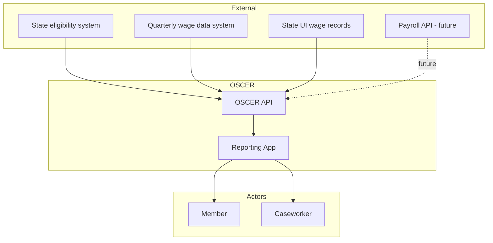
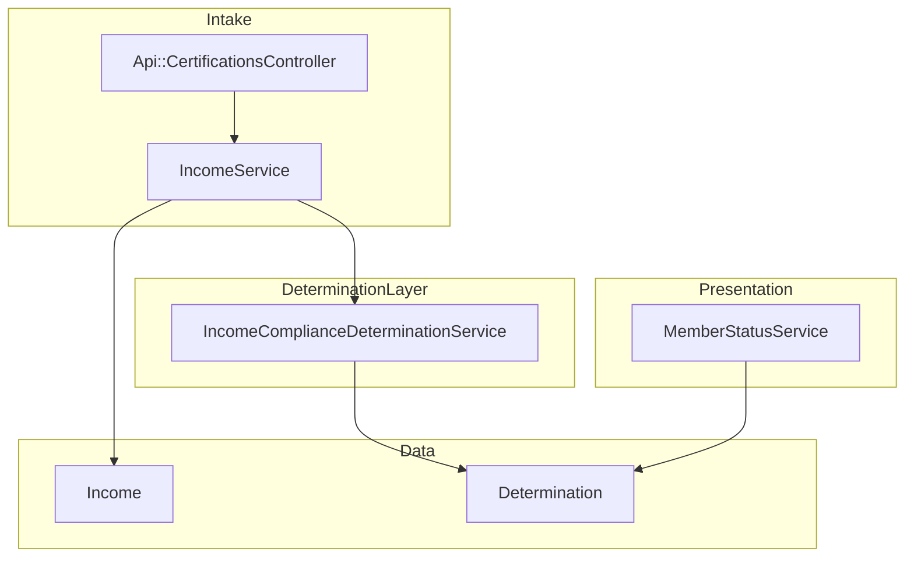

# Automated CE Income Verification

## Problem

Community engagement requirements (CER) under H.R. 1 require Medicaid members to demonstrate participation in qualifying activities—80 hours per month or **$580 per month** of employment, education, community service, or work programs—to maintain eligibility. OSCER already supports automated compliance using **hours** data from state sources (Issue #43). When a state has **income** data about a member (e.g., wage information from application or wage data systems), OSCER cannot currently accept or use it. Members whose employment is already documented through income records may still be required to manually self-report, creating unnecessary burden. States that want to send income data to OSCER have no path to do so today.

---

## Approach

1. Extend OSCER’s external data intake to accept **income** data via API (batch later), reusing the intake model established for hours.
2. Use accepted income data to produce automated CE compliance determinations against a configurable threshold (default $580/month).
3. Support multiple income source types (QWD, state UI wage records, payroll APIs) with source attribution.
4. Aggregate income, compare to threshold, and produce determination records consistent with the hours epic (`decision_method = automated`, auditable reason codes).
5. Surface income-based attribution in staff case view and member-facing status.

---

## Compliance recalculation (open cases)

When [`IncomeService#create_entry`](../../../reporting-app/app/services/income_service.rb) persists a new `Income` row with **`recalculate_income_compliance: true`** (the default), OSCER looks up the member’s **open** [`CertificationCase`](../../../reporting-app/app/models/certification_case.rb) and runs [`IncomeComplianceDeterminationService.calculate`](../../../reporting-app/app/services/income_compliance_determination_service.rb) for that case’s certification. That records an automated **income-based** determination without publishing CE workflow events; when the outcome is compliant, the case is **closed** (same as hours silent recalculation). `CertificationCase#record_income_compliance` accepts **`close_on_compliant`** for future opt-out if product changes.

During **certification creation**, [`Certifications::CreationService`](../../../reporting-app/app/services/certifications/creation_service.rb) passes **`recalculate_income_compliance: false`** so intake does not run this path before the case exists (or risk attributing rows to the wrong open case). The combined ex parte CE step after `CertificationCreated` still uses aggregated income for the initial assessment.

---

## C4 Context Diagram

> Level 1: System and external actors



OSCER does not pull or query external systems. States or their systems **send** income data to OSCER.

---

## C4 Component Diagram

> Level 3: Internal components



---

## Data Model Decision (ADR)

### Extend existing schema vs. parallel structure

**Context:** The existing data model was built for hours (`ExParteActivity`: `hours`, `category`, `period_start`, `period_end`). Income has a different field set (`gross_income`, `pay_period`, `source`).

**Options considered:**

| Option                        | Description                                                | Pros                                                     | Cons                                            |
| ----------------------------- | ---------------------------------------------------------- | -------------------------------------------------------- | ----------------------------------------------- |
| **A: Extend ExParteActivity** | Add `gross_income`, nullable `hours`; `type` discriminator | Single table, shared source attribution, simpler queries | Schema drift, mixed semantics, nullable columns |
| **B: Parallel Income**        | New `incomes` table with income-specific columns  | Clear separation, type-safe, independent evolution       | Duplicate patterns, two aggregation paths       |
| **C: Polymorphic activity**   | Generic `ex_parte_verification` with `verifiable_type`     | Single aggregation, flexible                             | Complex, over-engineered for two types          |

**Decision:** **Option B – Parallel `Income` table.**

**Rationale:**

- Income semantics differ: dollar amounts, pay period granularity, source cadence (quarterly vs. near real-time).
- Keeps `ExParteActivity` focused on hours and avoids nullable or overloaded columns.
- Mirrors existing patterns (e.g., `CertificationBatchUpload` vs. hours batch) and allows independent rules (e.g., data freshness by source type).
- Determination logic can aggregate hours and income separately, then apply CER rules.

**Tradeoff:** Two intake paths and aggregation logic. Mitigated by reusing controller, service, and job patterns from the hours epic.

---

## API Design

### Request Schema (nested in `POST /api/certifications`)

Extend `member_data.activities` to accept `type: "income"` activities, aligning with the existing hours pattern:

```json
{
  "member_id": "M12345",
  "case_number": "C-001",
  "certification_requirements": {
    "certification_date": "2025-01-15",
    "certification_type": "new_application",
    "lookback_period": 1,
    "number_of_months_to_certify": 1,
    "due_period_days": 30
  },
  "member_data": {
    "name": { "first": "John", "last": "Doe" },
    "account_email": "john@example.com",
    "activities": [
      {
        "type": "income",
        "category": "employment",
        "gross_income": 620.0,
        "period_start": "2025-01-01",
        "period_end": "2025-01-31",
        "source": "api",
        "reported_at": "2025-02-15T10:00:00Z",
        "employer": "Acme Corp"
      }
    ]
  }
}
```

### Income Activity Field Specifications

| Field        | Type   | Required | Validation                               | Description             |
| ------------ | ------ | -------- | ---------------------------------------- | ----------------------- |
| type         | string | Yes      | `"income"`                               | Activity type           |
| category     | string | Yes      | employment, community_service, education | CER category            |
| gross_income | number | Yes      | > 0, decimal                             | Gross income for period |
| period_start | string | Yes      | ISO 8601 date                            | Pay period start        |
| period_end   | string | Yes      | ISO 8601, >= period_start                | Pay period end          |
| source       | string | Yes      | enum (see below)                         | Data source type        |
| reported_at  | string | No       | ISO 8601 datetime                        | When data was reported  |
| employer     | string | No       | —                                        | Organization name       |

### Source Types (MVP)

| Value                 | Description               |
| --------------------- | ------------------------- |
| `quarterly_wage_data` | QWD from state systems    |
| `api`                 | Direct API submission     |
| `batch_upload`        | Batch/CSV upload (future) |

Future: `state_ui_wage_records`, `payroll_api_argyle`, `payroll_api_truv`, etc.

---

## Income Model (Proposed)

```ruby
# db/migrate/YYYYMMDD_create_incomes.rb
create_table :incomes, id: :uuid do |t|
  t.string :member_id, null: false
  t.uuid :certification_id
  t.string :category, null: false
  t.decimal :gross_income, precision: 10, scale: 2, null: false
  t.date :period_start, null: false
  t.date :period_end, null: false
  t.string :source_type, null: false
  t.uuid :source_id
  t.datetime :reported_at, null: false
  t.jsonb :metadata, default: {}
  t.timestamps
end
```

- `source_type`: currently `"api"` for certification API income activities; other values when additional intakes are implemented
- `source_id`: batch upload ID or external reference
- **Data governance:** Append-only in normal intake flows. Updates or deletes are exceptional (e.g., corrections, backfills) and must be recorded in an audit log. See [Audit trail over hard immutability](#audit-trail-over-hard-immutability) below.

---

## Compliance Logic

### Threshold

- Configurable monthly income threshold (default: **$580**)
- Environment: `CE_INCOME_THRESHOLD_MONTHLY=580`

### Aggregation

1. Sum `gross_income` from all `Income` records within certification lookback.
2. Include approved manual income activities (if present).
3. Compare total to threshold.

### Outcomes

| Total Income | Outcome                              |
| ------------ | ------------------------------------ |
| >= $580      | `compliant`                          |
| < $580       | `awaiting_report` or `not_compliant` |

### Determination Data Structure

The **canonical contract** for income-based CE payloads (and the nested income branch inside combined ex parte CE) is **`Determinations::IncomeBasedDeterminationData`** in the reporting app: it validates aggregates from `IncomeComplianceDeterminationService` and produces the hash persisted on `Determination#determination_data`. Example serialized shape (values mirror what the value object emits; `calculated_at` is ISO 8601 at write time):

```json
{
  "calculation_type": "income_based",
  "total_income": 620.0,
  "target_income": 580.0,
  "income_by_source": { "income": 620.0, "activity": 0.0 },
  "period_start": "2025-01-01",
  "period_end": "2025-01-31",
  "income_ids": ["uuid1"],
  "calculation_method": "automated_income_intake",
  "calculated_at": "2025-02-15T14:30:00Z"
}
```

Hours-only and combined CE use **`Determinations::HoursBasedDeterminationData`** and **`Determinations::CECombinedDeterminationData`** respectively; see `Determination` model comments for legacy vs CE scope.

---

## Business Process Integration

Mirror hours: income is saved **before** certification creation, and the business process runs at the ex-parte CE check step.

**Flow:**

1. API receives `member_data.activities` with `type: "income"`.
2. Create `Income` records (before certification).
3. Create certification → triggers business process.
4. At `EX_PARTE_COMMUNITY_ENGAGEMENT_CHECK_STEP`, `CertificationBusinessProcess` invokes `CommunityEngagementCheckService.determine(kase)`.
   - Aggregates hours via `HoursComplianceDeterminationService.aggregate_hours_for_certification` and income via `IncomeComplianceDeterminationService.aggregate_income_for_certification`.
   - `CertificationCase#record_ce_combined_assessment` persists **one** automated determination with `calculation_type` matching `Determination::CALCULATION_TYPE_CE_COMBINED` (`ce_combined`; nested hours/income payloads and `satisfied_by`). Member is compliant if **either** track meets its threshold. Historical rows may still use `Determination::CALCULATION_TYPE_CE_COMBINED_LEGACY` (`ex_parte_ce_combined`).
   - Publishes generic community-engagement Strata events: `DeterminedCommunityEngagementMet` (either track passes), `DeterminedCommunityEngagementInsufficient` (both fail but some ex parte hours; payload includes `hours_data` and `income_data`), `DeterminedCommunityEngagementActionRequired` (both fail and no ex parte hours). `CertificationBusinessProcess` transitions map these to `end` or `report_activities`.
   - Other flows (e.g. hours-only paths elsewhere) may still use `DeterminedHoursMet` / `DeterminedHoursInsufficient`; see `NotificationsEventListener`.
5. For existing certifications: `CalculateComplianceJob` (or equivalent) may call `IncomeComplianceDeterminationService.calculate(certification_id)` for silent income-only recalculation (no workflow events) when new income arrives.

**Testing / QE:** `spec/services/community_engagement_check_service_spec.rb` runs **real** `CommunityEngagementCheckService.determine` with factories (primary integration coverage for the combined CE step). `spec/models/determinations/determinations_ce_determination_data_contract_spec.rb` locks the serialized `determination_data` contract for `hours_based`, `income_based`, and `ce_combined`. Many specs (e.g. `certification_case_spec`, `certification_business_process_spec`) **stub** `CommunityEngagementCheckService.determine` on `CertificationCreated` so bootstrap does not persist an accidental compliant CE determination or send mail. Combined CE income uses `aggregate_income_for_certification`; **`member_reported_income_total` is stubbed to `0` until OSCER-405**, so only ex-parte-sourced income counts toward the threshold today. For ops triage, log/monitor **`DeterminedCommunityEngagementMet`**, **`DeterminedCommunityEngagementInsufficient`**, and **`DeterminedCommunityEngagementActionRequired`** alongside legacy `DeterminedHours*` where applicable.

---

## Decisions

### Parallel Income table

Use a dedicated `incomes` table instead of extending `ExParteActivity`. Keeps semantics clear and supports future income-specific rules (e.g., freshness by source). Tradeoff: two intake paths; mitigated by shared patterns.

### Income nested in member_data.activities

Accept `type: "income"` in the same `member_data.activities` array used for hours. Matches API shape and existing `MemberData::Activity` with `ACTIVITY_TYPES = %w[hourly income]`. Tradeoff: mixed types in one array; handled by filtering on `type` in the controller.

### Configurable threshold

Use `CE_INCOME_THRESHOLD_MONTHLY` (default 580) so states can adjust. Tradeoff: configuration surface; required for state flexibility.

### Source attribution on every record

Store `source_type` and `source_id` on each `Income` for audit. Tradeoff: redundant source data; required for traceability.

### Audit trail over hard immutability

Use an **audit trail** to satisfy the business requirement for traceable, trustworthy income data instead of enforcing strict immutability (e.g., DB triggers or model hooks that block updates/deletes).

**Rationale:** Strict immutability is difficult to enforce reliably (triggers and hooks can be bypassed; raw SQL, console, or other services may change data). It also blocks legitimate cases: corrections after a bad load, transient states (e.g., pending verification), merges, backfills, or compliance-driven updates. The business need is **traceability**—who changed what, when, and why—plus **origin metadata** (source_type, source_id, reported_at). An audit log provides both and accommodates edge cases.

**Approach:** Record all create/update/delete events for `Income` in an audit store (e.g., `income_audit` or a generic audit table): old/new values, `changed_at`, `changed_by` (user or system), optional reason/context, and origin fields at time of event. Normal flows are append-only (create only); any update or delete goes through a defined process and is always audited. Optionally, model-level guards (e.g., `before_update` / `before_destroy` that raise or log) may be used as defense-in-depth; the primary guarantee is the audit log.

**Tradeoff:** Policy-based "do not update in normal flows" instead of technical enforcement. Mitigated by audit, code review, and optional model guards.

### No income-to-hours conversion (out of scope)

Do not convert income to hours (e.g., income / federal min wage). CER allows either hours or income; income path is independent. Tradeoff: none for this scope.

---

## Constraints

- OSCER does not pull or query external systems; states send data to OSCER.
- Income data is **append-only in normal flows**; updates or deletes are exceptional and must be fully audited (see [Audit trail over hard immutability](#audit-trail-over-hard-immutability)). No silent changes.
- Determinations are versioned (new record on recalculation).
- Source attribution is required for all income records.
- API authentication matches hours API (API key or HMAC).

---

## Future Considerations

- Batch intake for income (CSV or bulk API).
- Multiple sources for the same reporting period (e.g., QWD + payroll API).
- Data freshness rules by source (QWD lag vs. near real-time payroll).
- Additional source types: `state_ui_wage_records`, `payroll_api_argyle`, `payroll_api_truv`, `payroll_api_steady_iq`.
- Combined hours + income aggregation (member meets threshold via mix).

---
