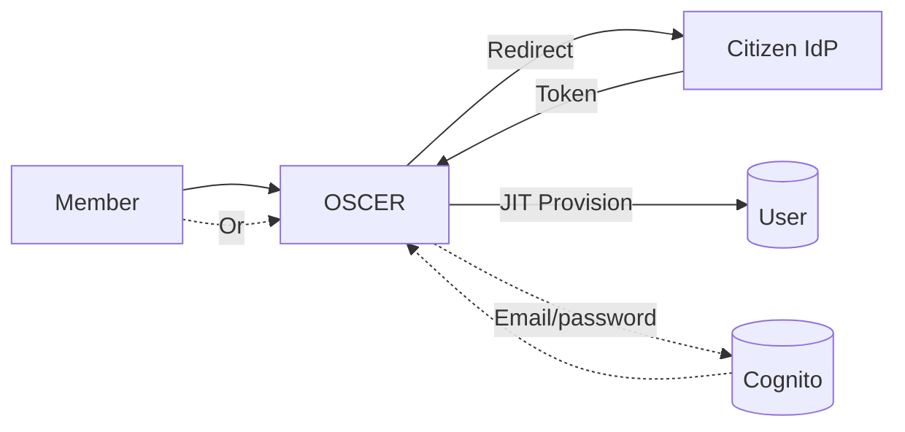
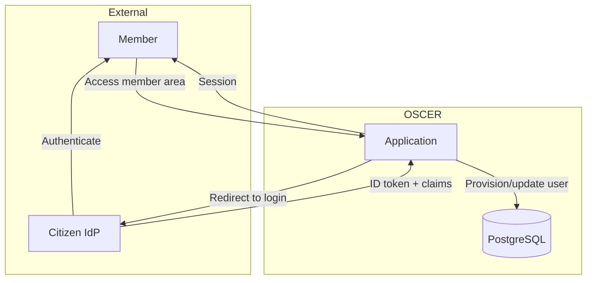
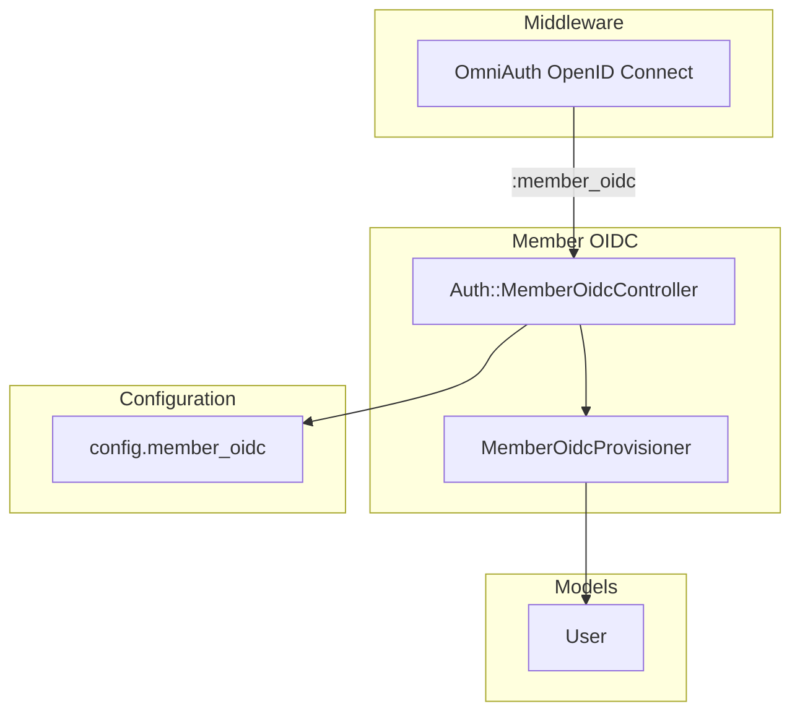
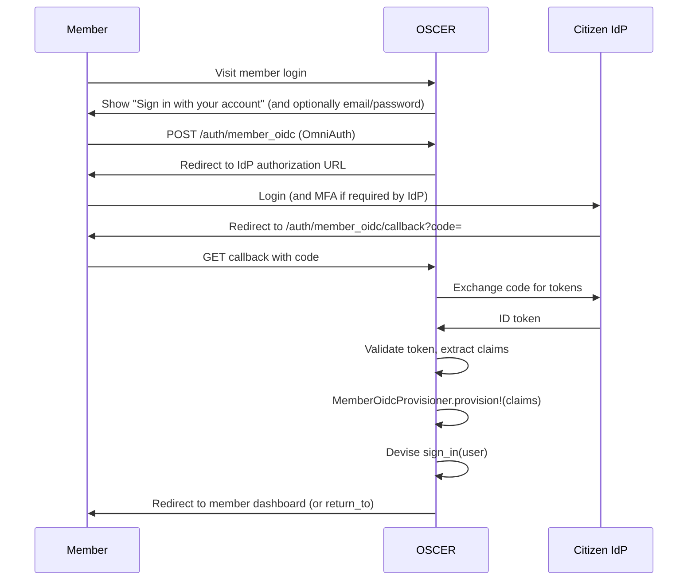
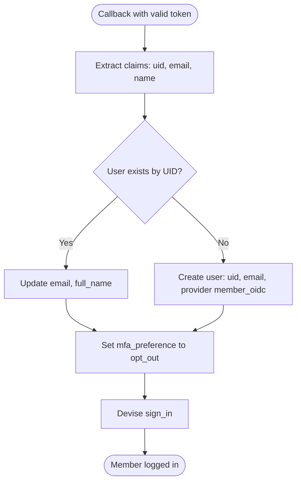

# Member OIDC (Single Sign-On)

## Problem

Members (citizens) need to sign in to OSCER to access their certifications and report activities. Some states provide a citizen identity provider (IdP)—e.g. a state portal or federated identity—that members already use for other government services. OSCER should allow members to sign in via that IdP when the state configures it, without state-specific names in code or config. When no citizen IdP is configured, members continue using app-managed credentials (e.g. Cognito email/password).

## Approach

1. **OIDC redirect flow** — OSCER acts as an OIDC Relying Party. Member clicks "Sign in with your account"; app redirects to the configured citizen IdP; IdP authenticates and redirects back with an authorization code; app exchanges code for tokens and provisions the user.
2. **Configuration-driven** — All IdP-specific values (issuer URL, client id/secret, claim names) come from `MEMBER_OIDC_*` environment variables. No state or IdP names in the repo.
3. **Just-In-Time provisioning** — Member user records are created on first successful OIDC login. Find by IdP UID; sync email and name from claims. No role mapping (members are non-staff).
4. **Optional alongside Cognito** — Member OIDC can be the only member auth, or offered alongside email/password (Cognito). Login page shows both options when both are enabled.



---

## Relation to Staff OIDC and Cognito

| Flow           | Doc / component        | Purpose                                      |
|----------------|------------------------|----------------------------------------------|
| **Staff OIDC** | [staff-sso.md](./staff-sso.md) | Staff sign-in via state staff IdP; role from groups |
| **Member OIDC**| This doc               | Member sign-in via state citizen IdP; no role |
| **Member Cognito** | AuthService, CognitoAdapter | Member email/password when OIDC not used or as second option |

Staff and member OIDC share OmniAuth, Devise, and the User model but use separate providers (`:sso` vs `:member_oidc`), config, and provisioners.

**Two independent enable flags:** `SSO_ENABLED` (staff) and `MEMBER_OIDC_ENABLED` (member). Each can be on or off independently. See [staff-sso.md — Feature flags](./staff-sso.md#feature-flags-staff-sso-vs-member-oidc) for the full configuration matrix.

---

## Login flow and MFA bypass

### When to show the member login screen vs redirect to IdP

- **Member OIDC and Cognito both available:** Show the member login page with both "Sign in with your account" (OIDC) and email/password (Cognito). User chooses one.
- **Member OIDC only (Cognito not offered for members):** Bypass the email/password form. When an unauthenticated member visits the member sign-in URL, redirect directly to the member OIDC flow (e.g. `/member_oidc/login`, which POSTs to OmniAuth and then redirects to the citizen IdP). Optionally show a minimal "Redirecting to sign in..." page that auto-submits the form. Result: member never sees the standard email/password login screen.
- **Cognito only:** Show the standard member login page (email/password only).

So when `MEMBER_OIDC_ENABLED` is true and member OIDC is the only configured member auth, the app should redirect to the OIDC flow and bypass the member login screen. When both OIDC and Cognito are offered, show the login screen with both options.

### MFA bypass for member OIDC users

Members who sign in via the citizen IdP (OIDC) do not use the app’s own multi-factor auth (e.g. Cognito software token). The IdP is responsible for MFA. To avoid forcing them through the app’s MFA preference page or a Cognito MFA challenge:

- **On provisioning:** When creating or updating a user from member OIDC callback, set `user.mfa_preference = "opt_out"` (or leave it set if already present). Same pattern as staff SSO (`StaffUserProvisioner` sets `mfa_preference ||= "opt_out"` for SSO users).
- **After sign-in:** `after_sign_in_path_for(user)` will not redirect to `users_mfa_preference_path` when `mfa_preference` is already set (e.g. `opt_out`), so member OIDC users go straight to their return path or dashboard.

Implement this in `MemberOidcProvisioner` so every member OIDC user has `mfa_preference` set and bypasses app-managed MFA.

---

## C4 Context Diagram

> Level 1: System and external actors (member flow only)



---

## C4 Component Diagram

> Level 3: Internal components for member OIDC



---

## Key Interfaces

### Member OIDC configuration

Generic naming only (no state or IdP names in code or config):

```ruby
# config (e.g. initializer)
Rails.application.config.member_oidc = {
  enabled: ENV.fetch("MEMBER_OIDC_ENABLED", "false") == "true",
  claims: {
    email: ENV.fetch("MEMBER_OIDC_CLAIM_EMAIL", "email"),
    name: ENV.fetch("MEMBER_OIDC_CLAIM_NAME", "name"),
    unique_id: ENV.fetch("MEMBER_OIDC_CLAIM_UID", "sub")
  }
}.freeze
```

**Environment variables (when MEMBER_OIDC_ENABLED=true):**

| Variable                   | Purpose                          |
| -------------------------- | -------------------------------- |
| `MEMBER_OIDC_ISSUER_URL`   | IdP issuer (discovery or base URL) |
| `MEMBER_OIDC_CLIENT_ID`    | OIDC client ID                   |
| `MEMBER_OIDC_CLIENT_SECRET`| OIDC client secret               |
| `MEMBER_OIDC_SCOPES`       | Optional; default `openid profile email` |
| `MEMBER_OIDC_CLAIM_EMAIL`  | Claim key for email (default `email`) |
| `MEMBER_OIDC_CLAIM_NAME`   | Claim key for name (default `name`) |
| `MEMBER_OIDC_CLAIM_UID`   | Claim key for unique id (default `sub`) |
| `MEMBER_OIDC_INTERNAL_HOST` | Optional; override host for server-to-IdP calls (e.g. Docker), same pattern as staff `SSO_INTERNAL_HOST` |

Redirect URI is built from the same host/port/HTTPS logic as staff (e.g. `build_oidc_redirect_uri("/auth/member_oidc/callback")` using `APP_HOST`, `APP_PORT`, `DISABLE_HTTPS`). For local HTTP IdPs (e.g. Keycloak), use the same discovery-off and manual endpoint pattern as staff; optional issuer verification workaround in development applies when issuer URL is `http://`.

### MemberOidcProvisioner

| Method             | Purpose                                                                 |
| ------------------ | ----------------------------------------------------------------------- |
| `provision!(claims)` | Find or create User by UID (from IdP); set `provider: "member_oidc"`; sync `email`, `full_name`; no staff role |

**Claims input:** `{ uid:, email:, name: }` (from IdP token via configured claim keys).

**Behavior:**

- Find user by `uid` (IdP unique identifier). If not found, create new user with `uid`, `email`, `provider: "member_oidc"`.
- On every login: update `email` and `full_name` from claims.
- **Set `mfa_preference` to `opt_out`** so member OIDC users bypass the app’s MFA preference page and Cognito MFA; the IdP handles MFA.
- Members have no `role` (or a fixed member role if the app uses it); no RoleMapper.

---

## Authentication Flow



---

## User Provisioning Flow



---

## Decisions

### OIDC over SAML

Use OpenID Connect for member IdP integration. OIDC is the standard for citizen and state portals. Tradeoff: SAML-only IdPs are out of scope for initial rollout.

### Generic naming only

All code and config use generic names: `MEMBER_OIDC_*`, `member_oidc`, `Auth::MemberOidcController`, `MemberOidcProvisioner`. No state or citizen IdP names in the repo. Tradeoff: deployment documentation specifies which env values to set for each state's citizen IdP.

### Configuration-driven IdP settings

Issuer, client credentials, and claim names come from environment variables. Same codebase works for any OIDC-compliant citizen IdP. Tradeoff: per-deployment configuration and documentation.

### Just-In-Time provisioning

Create member user records on first successful OIDC login. No pre-seeding. Tradeoff: matching by IdP UID; email changes handled via UID.

### Match members by IdP UID, not email

Use the IdP's unique identifier (`sub` or configured claim) as the stable key. Email may change; UID is stable. Tradeoff: if the IdP issues a new UID for the same person, OSCER treats them as a new user.

### No role mapping for members

Members do not receive staff roles from the citizen IdP. Provisioner only sets identity attributes (uid, email, name) and `provider: "member_oidc"`. Tradeoff: authorization for member actions is separate (e.g. resource ownership, not role).

### MFA bypass for member OIDC users

Members who sign in via OIDC do not use the app’s MFA (e.g. Cognito TOTP). The citizen IdP handles MFA. The provisioner sets `mfa_preference` to `opt_out` so the app does not redirect them to the MFA preference page or a Cognito MFA challenge after sign-in. Tradeoff: app does not enforce a second factor for these users; reliance on IdP MFA policy.

### Member auth: Cognito and/or Member OIDC

Member authentication can be Cognito-only, Member OIDC-only, or both. When both are enabled, the login page offers both options. Tradeoff: two code paths and two configs when both are used.

---

## Local Development with Keycloak

Use a Keycloak realm as a mock citizen IdP (can share Keycloak with staff SSO; use a different realm):

```bash
MEMBER_OIDC_ENABLED=true
MEMBER_OIDC_ISSUER_URL=http://localhost:8080/realms/citizen
MEMBER_OIDC_CLIENT_ID=oscer-member
MEMBER_OIDC_CLIENT_SECRET=oscer-member-secret
# Redirect URI: http://localhost:3000/auth/member_oidc/callback
```

---

## Logout Behavior

| Option        | Description                                  | Default |
| ------------- | -------------------------------------------- | ------- |
| Local logout  | End OSCER session only; IdP session persists | Yes     |
| Single logout | End OSCER session and trigger IdP logout     | Optional, per IdP config |

---

## Error Handling

| Error         | Cause                      | User experience |
| ------------- | -------------------------- | ---------------- |
| InvalidToken  | Signature invalid/expired  | "Authentication failed. Please try again." |
| InvalidState  | CSRF                       | "Session expired. Please try again." |
| MissingClaims | Required claims not in token | "Login configuration error. Contact support." |

On failure, redirect to the member sign-in path (e.g. `new_user_session_path`) with an alert so the member can retry or use email/password if offered; same pattern as staff SSO redirecting to a sensible landing after failure.

---

## Constraints

- OIDC only (no SAML in initial scope).
- One citizen IdP per deployment for the member OIDC flow.
- MFA and password policy are the IdP's responsibility.
- No staff role or group claims used for members.

---

## Future Considerations

- SAML adapter for legacy citizen IdPs.
- Multiple citizen IdPs (e.g. state portal + Login.gov).
- Session refresh / silent re-auth.
- Audit logging for member OIDC events.
- IdP-initiated login.

---

## Related Documents

- [OIDC Authentication (Staff and Member)](./staff-sso.md) — Combined view of staff and member OIDC, shared decisions, and C4.
- [Member SSO Implementation Stories](./member-sso-stories.md) — Implementation stories and reuse checklist.
- **Infrastructure:** For deployment and citizen IdP setup (redirect URIs, client registration), see `docs/infra/` (e.g. identity-provider.md, environment-variables-and-secrets.md) where applicable.
