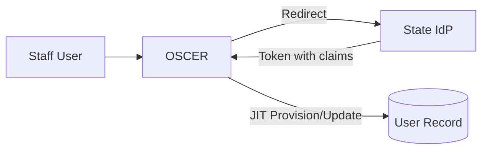
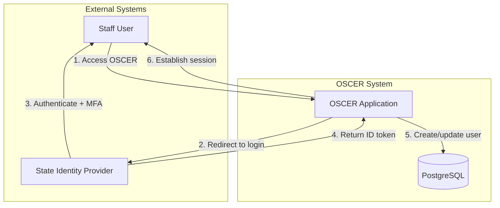
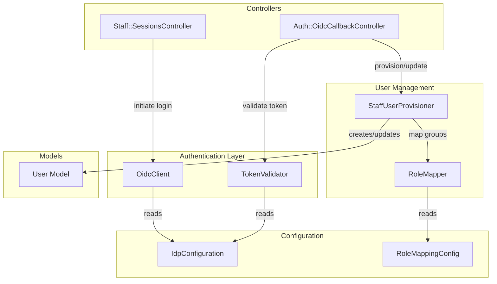
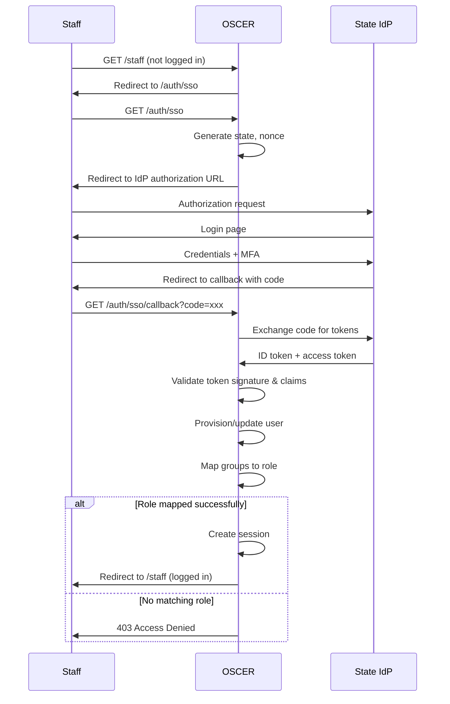
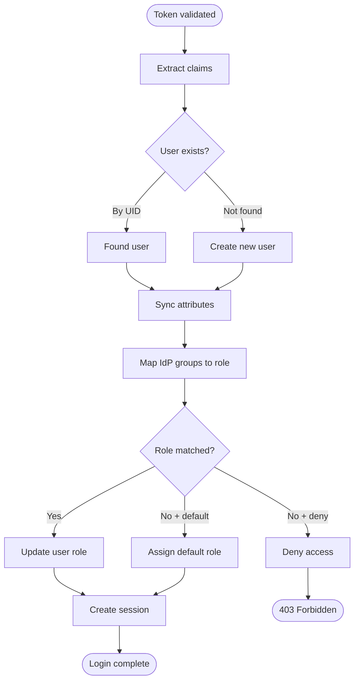

# Staff Single Sign-On (OIDC)

## Problem

Staff currently manage separate OSCER credentials, creating friction and security burden. States have existing identity providers (Azure Entra ID, IBM ISVA, AWS) that already handle authentication and MFA. OSCER needs to accept authentication from any state's identity provider while maintaining user records for audit trails and role-based access control.

## Approach

1. **OIDC Client Integration** — OSCER acts as an OIDC Relying Party, redirecting staff to their state's identity provider and validating returned tokens.
2. **Configuration-Driven Multi-IdP** — Each deployment configures its IdP settings (issuer, client credentials, claim mappings) without code changes.
3. **Just-In-Time User Provisioning** — Staff accounts are created automatically on first successful SSO login, mapped to OSCER roles via IdP group claims.
4. **Attribute Sync on Login** — User profile (name, email, role) is refreshed from IdP claims on every login, keeping OSCER in sync with state systems.



---

## C4 Context Diagram

> Level 1: System and external actors



### Identity Provider Mapping

| Function        | Azure Entra ID      | IBM ISVA           | AWS Cognito         |
| --------------- | ------------------- | ------------------ | ------------------- |
| Protocol        | OIDC                | OIDC               | OIDC                |
| Group claims    | `groups`            | `groups`           | `cognito:groups`    |
| MFA             | Conditional Access  | Access Policy      | User Pool MFA       |
| Admin console   | Azure Portal        | ISVA Admin Console | Cognito Console     |

---

## C4 Component Diagram

> Level 3: Internal components within OSCER



---

## Key Interfaces

### IdpConfiguration

Provider-agnostic configuration loaded from environment/credentials:

```ruby
# config/initializers/sso.rb
Rails.application.config.sso = {
  enabled: ENV.fetch("SSO_ENABLED", "false") == "true",
  issuer: ENV["SSO_ISSUER_URL"],
  client_id: ENV["SSO_CLIENT_ID"],
  client_secret: ENV["SSO_CLIENT_SECRET"],
  redirect_uri: ENV["SSO_REDIRECT_URI"],
  scopes: %w[openid profile email groups],
  claims: {
    email: ENV.fetch("SSO_CLAIM_EMAIL", "email"),
    name: ENV.fetch("SSO_CLAIM_NAME", "name"),
    groups: ENV.fetch("SSO_CLAIM_GROUPS", "groups"),
    unique_id: ENV.fetch("SSO_CLAIM_UID", "sub")
  }
}
```

### OidcClient Service

| Method                     | Purpose                                      |
| -------------------------- | -------------------------------------------- |
| `authorization_url`        | Generate redirect URL to IdP                 |
| `exchange_code(code)`      | Exchange authorization code for tokens       |
| `validate_token(id_token)` | Verify signature, issuer, audience, expiry   |
| `extract_claims(id_token)` | Parse user attributes from validated token   |

### StaffUserProvisioner Service

| Method                   | Purpose                                          |
| ------------------------ | ------------------------------------------------ |
| `provision!(claims)`     | Find or create user, update attributes, set role |
| `find_by_uid(uid)`       | Lookup user by IdP unique identifier             |
| `sync_attributes(user, claims)` | Update name, email from IdP claims        |

### RoleMapper Service

| Method                   | Purpose                                      |
| ------------------------ | -------------------------------------------- |
| `map_groups_to_role(groups)` | Return OSCER role based on IdP groups    |
| `default_role`           | Role for users with no matching groups       |
| `deny_if_no_match?`      | Whether to deny access if no role matches    |

### Role Mapping Configuration

```yaml
# config/sso_role_mapping.yml
role_mappings:
  admin:
    - "OSCER-Admin"
    - "CE-Administrators"
  caseworker:
    - "OSCER-Caseworker"
    - "OSCER-Staff"
    - "CE-Staff"

# Users with no matching group
no_match_behavior: deny  # or: assign_default
default_role: null       # only used if no_match_behavior: assign_default
```

---

## Authentication Flow



---

## User Provisioning Flow



### Provisioning Rules

| Scenario | Behavior |
| -------- | -------- |
| First login, matching group | Create user with mapped role |
| First login, no matching group | Deny access (configurable) |
| Subsequent login, same group | Update attributes, keep role |
| Subsequent login, different group | Update attributes AND role |
| Email changed in IdP | Match by UID, update email |
| User removed from IdP groups | Deny access on next attempt |

---

## Decisions

### OIDC over SAML

Use OpenID Connect instead of SAML 2.0. OIDC is modern, JSON-based, easier to implement in Ruby, and supported by all target IdPs (Azure, IBM ISVA, AWS Cognito). SAML adds XML complexity and requires additional libraries. Tradeoff: some legacy state systems may only support SAML (defer to future phase).

### Configuration-driven IdP settings

All IdP-specific values (issuer URL, client ID, claim names) are loaded from environment variables and config files, not code. This allows deploying the same OSCER codebase to different states with different IdPs. Tradeoff: requires careful configuration management and documentation per deployment.

### Just-In-Time user provisioning

Create OSCER user records on first successful SSO login instead of pre-seeding. Reduces coordination with state IT—they only manage IdP group membership. User records exist for audit trails and association with case activity. Tradeoff: user lookup by UID required; email changes must be handled gracefully.

### Match users by IdP UID, not email

Use the IdP's unique identifier (`sub` claim) as the primary key for user matching. Email addresses can change; UIDs are immutable. Tradeoff: if a user is recreated in the IdP with a new UID, OSCER sees them as a new user.

### Role sync on every login

Refresh user role from IdP group claims on each login, not just first login. If state IT changes someone's group membership, the change takes effect on next OSCER login. Tradeoff: brief window where cached role may be stale; user must re-login to get updated permissions.

### Deny access for no matching role

By default, users whose IdP groups don't match any OSCER role mapping are denied access entirely (403). This prevents accidental access grants. Configurable to assign a default role instead for less restrictive deployments. Tradeoff: tight coordination required with state IT on group structure.

### Preserve existing Cognito authentication

Staff SSO is additive—the existing Cognito-based member authentication remains unchanged. Staff portal gets SSO; member portal keeps current login. This isolates risk and simplifies rollout. Tradeoff: two authentication systems to maintain long-term.

### Keycloak for local development and demos

Use Keycloak in Docker for local development and demo presentations instead of building a custom mock IdP. Keycloak is a production-grade OIDC provider that's well-documented, standards-compliant, and easily configured. Pre-seeded realm exports allow consistent test data across environments. Tradeoff: ~500MB Docker image, but avoids maintaining custom mock code and ensures real OIDC compliance.

---

## Local Development with Keycloak

For local development and demos, use Keycloak as a mock IdP:

```yaml
# docker-compose.yml
services:
  keycloak:
    image: quay.io/keycloak/keycloak:23.0
    command: start-dev --import-realm
    environment:
      KEYCLOAK_ADMIN: admin
      KEYCLOAK_ADMIN_PASSWORD: admin
    ports:
      - "8080:8080"
    volumes:
      - ./keycloak/oscer-realm.json:/opt/keycloak/data/import/oscer-realm.json
```

### Pre-configured Test Users

| User | Email | Groups | OSCER Role |
|------|-------|--------|------------|
| Jane Admin | jane.admin@example.com | `OSCER-Admin` | admin |
| Bob Caseworker | bob.caseworker@example.com | `OSCER-Caseworker` | caseworker |
| Carol Staff | carol.staff@example.com | `OSCER-Staff` | caseworker |
| Dan Nobody | dan.nobody@example.com | (none) | denied |

### Local Environment Variables

```bash
# local.env (for Keycloak)
SSO_ENABLED=true
SSO_ISSUER_URL=http://localhost:8080/realms/oscer
SSO_CLIENT_ID=oscer-staff
SSO_CLIENT_SECRET=oscer-secret
SSO_REDIRECT_URI=http://localhost:3000/auth/sso/callback
```

---

## Logout Behavior

| Option | Description | Recommendation |
| ------ | ----------- | -------------- |
| **Local logout** | End OSCER session only; IdP session persists | Default |
| **Single logout** | End OSCER session and trigger IdP logout | Optional |

**Default**: Local logout. Staff remains logged into their state system for other apps. If IdP-initiated single logout is required, configure `SSO_SINGLE_LOGOUT_URL`.

---

## Error Handling

| Error | Cause | User Experience |
| ----- | ----- | --------------- |
| `InvalidToken` | Signature invalid or expired | "Authentication failed. Please try again." |
| `InvalidState` | CSRF protection triggered | "Session expired. Please try again." |
| `NoMatchingRole` | No IdP groups map to OSCER roles | "Access denied. Contact your administrator." |
| `IdpUnavailable` | IdP unreachable | "Login service unavailable. Try again later." |
| `MissingClaims` | Required claims not in token | "Login configuration error. Contact support." |

---

## Constraints

- OIDC protocol only (SAML support deferred)
- Single IdP per OSCER deployment (multi-IdP deferred)
- Staff portal only (member SSO out of scope)
- MFA handled by IdP, not OSCER
- Role mapping is coarse-grained (IdP group → OSCER role, not per-permission)

---

## Future Considerations

- **SAML support**: Add SAML 2.0 adapter for legacy IdPs
- **Multi-IdP**: Support multiple identity providers per deployment (e.g., different IdP per region)
- **Offline role cache**: Grace period for IdP unavailability
- **Session refresh**: Silent token refresh without full re-authentication
- **Audit trail**: Log all SSO events (login, logout, role changes, denials)
- **IdP-initiated login**: Support login starting from IdP portal

