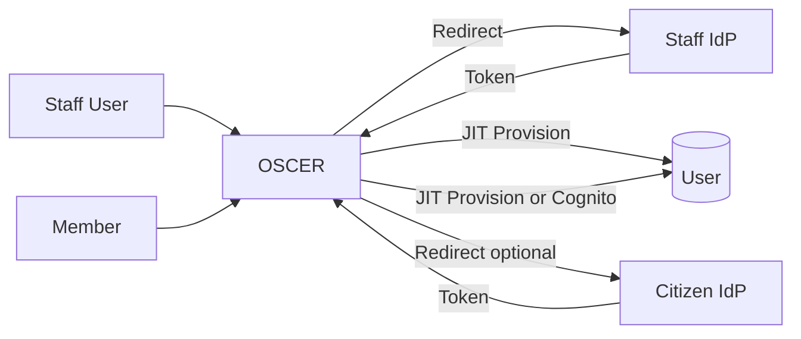
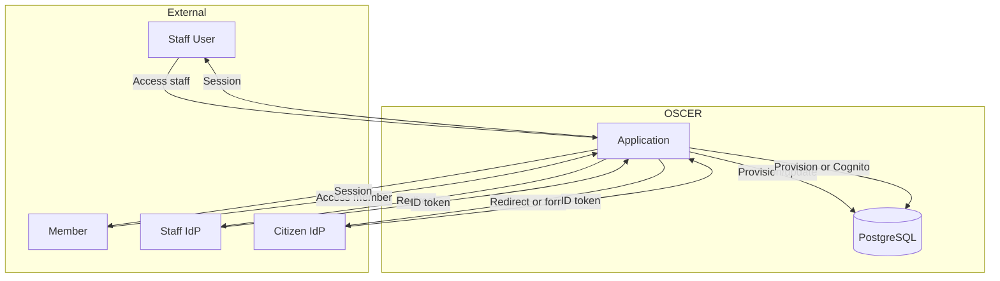
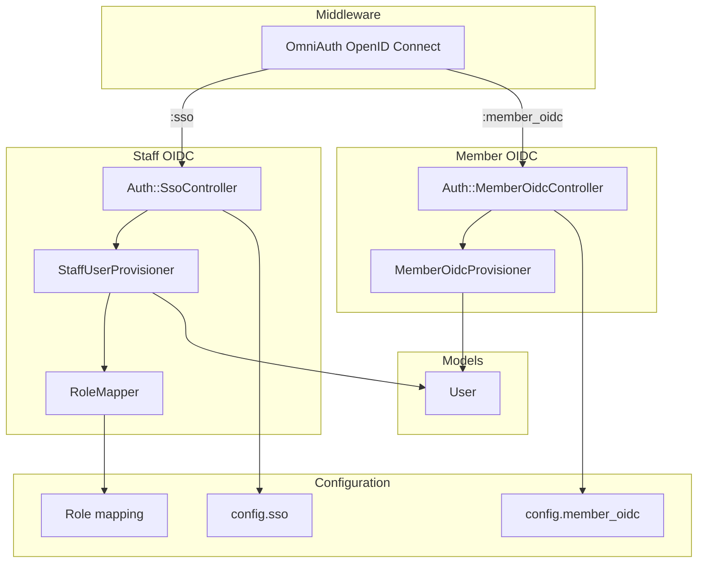
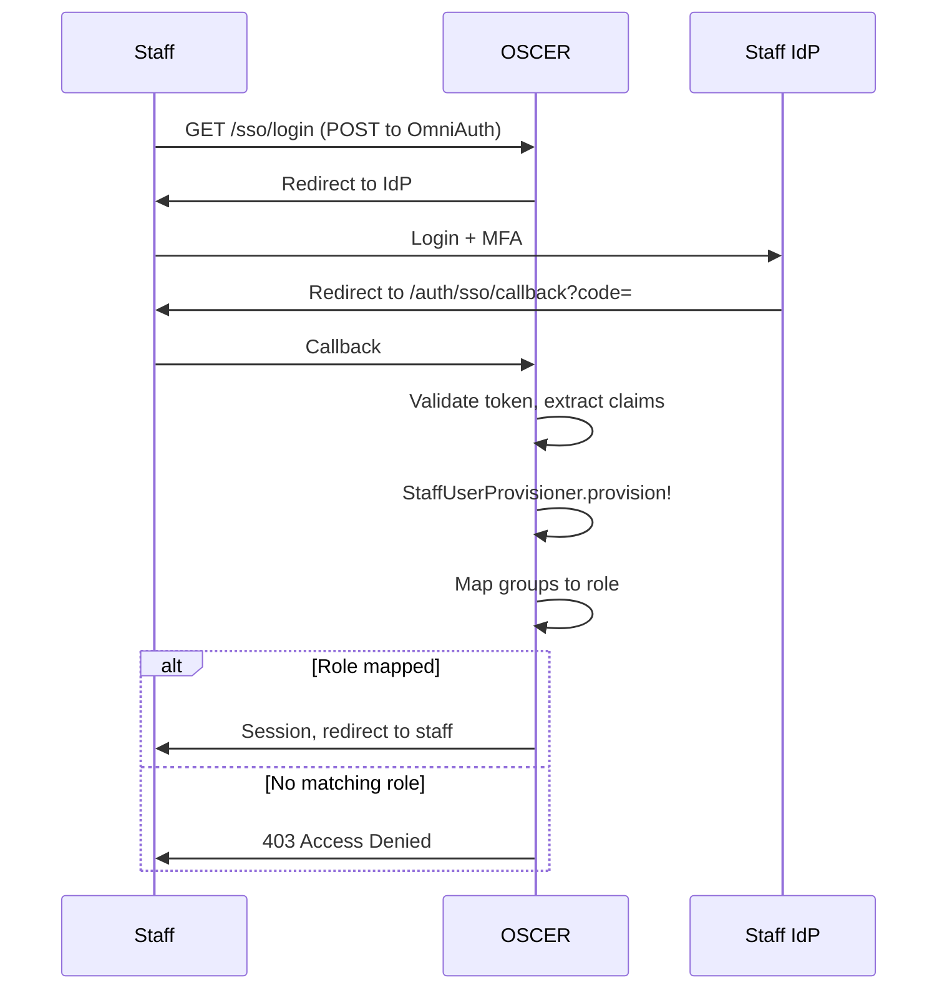

# OIDC Authentication (Staff and Member)

## Problem

Staff need to use existing state credentials instead of separate OSCER passwords. States have identity providers (IdPs) that handle authentication and MFA. Separately, members (citizens) may authenticate via a state citizen IdP or continue with app-managed credentials (e.g. Cognito). OSCER must support:

- **Staff**: OIDC redirect to state staff IdP; JIT provisioning and role mapping from IdP groups.
- **Member**: Optional OIDC redirect to state citizen IdP, parallel to existing credential-based member auth; no state-specific naming in code or config.

## Approach

1. **Two independent enable flags** — `SSO_ENABLED` controls staff OIDC; `MEMBER_OIDC_ENABLED` controls member OIDC. Each can be on or off, so staff can use state IdP or Cognito (or app-managed auth), and members can use citizen IdP or Cognito, in any combination.
2. **Two parallel OIDC flows** — Staff OIDC and Member OIDC use the same protocol and patterns (OmniAuth, redirect, callback, provisioner) but separate config, routes, and provisioners. No shared IdP.
3. **Configuration-driven** — Each flow uses its own env-driven config (`SSO_*` for staff, `MEMBER_OIDC_*` for member). No state names in repo.
4. **Staff**: JIT provisioning, role from IdP groups, attribute sync on login when staff SSO is enabled.
5. **Member**: Optional JIT provisioning from citizen IdP when member OIDC is enabled; find/create by UID, sync email/name; no role mapping. Otherwise members use Cognito only.


```mermaid
flowchart LR
    Staff[Staff User] --> OSCER[OSCER]
    OSCER -->|Redirect| StaffIdP[Staff IdP]
    StaffIdP -->|Token| OSCER
    OSCER -->|JIT Provision| DB[(User)]

    Member[Member] --> OSCER
    OSCER -->|Redirect optional| MemberIdP[Citizen IdP]
    MemberIdP -->|Token| OSCER
    OSCER -->|JIT Provision or Cognito| DB
```

---

## Feature flags: staff SSO vs member OIDC

Two separate enable flags control who can use OIDC vs standard (e.g. Cognito) login:

| Flag | Controls | When `true` | When `false` |
|------|----------|-------------|--------------|
| **SSO_ENABLED** | Staff authentication | Staff sign in via state staff IdP (OIDC) | Staff sign in via Cognito / app-managed auth |
| **MEMBER_OIDC_ENABLED** | Member authentication | Members can sign in via state citizen IdP (OIDC), optionally alongside Cognito | Members sign in via Cognito only |

**Configuration matrix:**

| SSO_ENABLED | MEMBER_OIDC_ENABLED | Staff login | Member login |
|-------------|---------------------|-------------|--------------|
| `true` | `true` | State staff IdP (OIDC) | Citizen IdP (OIDC) and/or Cognito |
| `true` | `false` | State staff IdP (OIDC) | Cognito only |
| `false` | `true` | Cognito / app-managed | Citizen IdP (OIDC) and/or Cognito |
| `false` | `false` | Cognito / app-managed | Cognito only |

Flags are independent. Deployments can enable one, both, or neither. No state or IdP names in code; each flag gates its own routes, UI, and OmniAuth provider.

**Member login screen when member OIDC is enabled:** When `MEMBER_OIDC_ENABLED` is true, the app can show the standard member login page with an additional "Sign in with your account" (OIDC) option alongside email/password, or—when member OIDC is the only auth method—redirect unauthenticated members directly to the OIDC flow so the email/password form is bypassed. See [Member OIDC — Login flow and MFA bypass](./member-sso.md#login-flow-and-mfa-bypass).

**MFA bypass for OIDC users:** Staff and member users who sign in via OIDC do not use the app’s own MFA (e.g. Cognito TOTP). The IdP handles MFA. Provisioners set `mfa_preference` to `opt_out` for OIDC users so the app skips the MFA preference page and any in-app MFA challenge after sign-in.

---

## C4 Context Diagram

> Level 1: System and external actors


```mermaid
flowchart TB
    subgraph External["External"]
        Staff[Staff User]
        Member[Member]
        StaffIdP[Staff IdP]
        MemberIdP[Citizen IdP]
    end

    subgraph OSCER["OSCER"]
        App[Application]
        DB[(PostgreSQL)]
    end

    Staff -->|Access staff| App
    App -->|Redirect| StaffIdP
    StaffIdP -->|ID token| App
    App -->|Provision/update| DB
    App -->|Session| Staff

    Member -->|Access member| App
    App -->|Redirect or form| MemberIdP
    MemberIdP -->|ID token| App
    App -->|Provision or Cognito| DB
    App -->|Session| Member
```

---

## C4 Component Diagram

> Level 3: Internal components


```mermaid
flowchart TB
    subgraph Middleware["Middleware"]
        OmniAuth[OmniAuth OpenID Connect]
    end

    subgraph StaffFlow["Staff OIDC"]
        SsoController[Auth::SsoController]
        StaffProvisioner[StaffUserProvisioner]
        RoleMapper[RoleMapper]
    end

    subgraph MemberFlow["Member OIDC"]
        MemberOidcController[Auth::MemberOidcController]
        MemberProvisioner[MemberOidcProvisioner]
    end

    subgraph Config["Configuration"]
        SsoConfig[config.sso]
        MemberOidcConfig[config.member_oidc]
        RoleMapping[Role mapping]
    end

    subgraph Models["Models"]
        User[User]
    end

    OmniAuth -->|":sso"| SsoController
    OmniAuth -->|":member_oidc"| MemberOidcController
    SsoController --> StaffProvisioner
    StaffProvisioner --> RoleMapper
    StaffProvisioner --> User
    RoleMapper --> RoleMapping
    SsoController --> SsoConfig
    MemberOidcController --> MemberProvisioner
    MemberOidcController --> MemberOidcConfig
    MemberProvisioner --> User
```

---

## Key Interfaces

### Staff SSO configuration

Redirect URI is built at runtime from `APP_HOST`, `APP_PORT`, and `DISABLE_HTTPS` (e.g. `build_sso_redirect_uri` → `https://host/auth/sso/callback`). Same helper pattern is reused for member OIDC with path `/auth/member_oidc/callback`.

OmniAuth is configured to allow only POST for the request phase (CVE-2015-9284); the login page renders a form that auto-submits via POST with Rails CSRF token. Callback and failure are GET (IdP redirects).

```ruby
# config/initializers/sso.rb
Rails.application.config.sso = {
  enabled: ENV.fetch("SSO_ENABLED", "false") == "true",
  claims: {
    email: ENV.fetch("SSO_CLAIM_EMAIL", "email"),
    name: ENV.fetch("SSO_CLAIM_NAME", "name"),
    groups: ENV.fetch("SSO_CLAIM_GROUPS", "groups"),
    unique_id: ENV.fetch("SSO_CLAIM_UID", "sub"),
    region: ENV.fetch("SSO_CLAIM_REGION", "custom:region")
  }
}.freeze
# OmniAuth provider :sso — SSO_ISSUER_URL, SSO_CLIENT_ID, SSO_CLIENT_SECRET, redirect_uri
```

### Member OIDC configuration

Generic naming only (no state names in code or config):

```ruby
# config (e.g. initializer)
Rails.application.config.member_oidc = {
  enabled: ENV.fetch("MEMBER_OIDC_ENABLED", "false") == "true",
  claims: {
    email: ENV.fetch("MEMBER_OIDC_CLAIM_EMAIL", "email"),
    name: ENV.fetch("MEMBER_OIDC_CLAIM_NAME", "name"),
    unique_id: ENV.fetch("MEMBER_OIDC_CLAIM_UID", "sub")
  }
}
# OmniAuth provider :member_oidc — MEMBER_OIDC_ISSUER_URL, MEMBER_OIDC_CLIENT_ID, etc.
# Redirect URI: same host, path /auth/member_oidc/callback
```

### StaffUserProvisioner

| Method             | Purpose                                       |
| ------------------ | --------------------------------------------- |
| `provision!(claims)` | Find or create user by UID, sync attributes, set role from groups |
| Role source        | RoleMapper maps IdP groups to OSCER role      |

### MemberOidcProvisioner

| Method             | Purpose                                       |
| ------------------ | --------------------------------------------- |
| `provision!(claims)` | Find or create user by UID, sync email/name; provider `"member_oidc"`; no staff role |

### RoleMapper (staff only)

| Method               | Purpose                          |
| -------------------- | -------------------------------- |
| `map_groups_to_role(groups)` | OSCER role from IdP groups |
| `deny_if_no_match?`  | Deny access when no role matches |

---

## Authentication Flows

### Staff OIDC


```mermaid
sequenceDiagram
    participant Staff
    participant OSCER
    participant IdP as Staff IdP

    Staff->>OSCER: GET /sso/login (POST to OmniAuth)
    OSCER->>Staff: Redirect to IdP
    Staff->>IdP: Login + MFA
    IdP->>Staff: Redirect to /auth/sso/callback?code=
    Staff->>OSCER: Callback
    OSCER->>OSCER: Validate token, extract claims
    OSCER->>OSCER: StaffUserProvisioner.provision!
    OSCER->>OSCER: Map groups to role
    alt Role mapped
        OSCER->>Staff: Session, redirect to staff
    else No matching role
        OSCER->>Staff: 403 Access Denied
    end
```

### Member OIDC (optional)

Same pattern as staff: redirect to IdP, callback, validate, provision. MemberOidcProvisioner finds/creates user by UID, sets `provider: "member_oidc"`, syncs email/name; no role mapping. Member login page can offer both "Sign in with your account" (OIDC) and email/password (Cognito) when both are configured.

---

## Decisions

### OIDC over SAML

Use OpenID Connect. OIDC is widely supported by state and citizen IdPs, JSON-based, and easier to implement. Tradeoff: legacy systems that only support SAML are out of scope for initial rollout.

### Two IdPs: staff and member

Staff and member authentication use separate OIDC configurations and flows. Same protocol and shared pieces (OmniAuth, Devise, User model); different provisioners, claim config, and routes. Enables staff IdP (e.g. state enterprise directory) and citizen IdP (e.g. state citizen portal) to be different. Tradeoff: two provider configs and two callback paths to maintain.

### Generic member OIDC naming

Member OIDC uses only generic names: `MEMBER_OIDC_*` env vars, `member_oidc` provider name, `Auth::MemberOidcController`, `MemberOidcProvisioner`. No state or IdP names in code or config. Tradeoff: deployment docs list which env to set for a given state's citizen IdP.

### Configuration-driven IdP settings

IdP-specific values (issuer, client id/secret, claim names) come from environment and config. Same codebase deploys to different states. Tradeoff: configuration and documentation must be clear per deployment.

### Just-In-Time user provisioning

Create user records on first successful OIDC login (staff or member). No pre-seeding. Tradeoff: match users by IdP UID; handle email changes via UID.

### Match users by IdP UID, not email

Use IdP unique identifier (`sub` or configured claim) as the stable key. Tradeoff: if IdP recreates a user with a new UID, OSCER treats them as a new user.

### Role sync on every login (staff)

Refresh staff role from IdP group claims on each login. Tradeoff: role changes apply after next login.

### Deny access for no matching role (staff)

Staff whose IdP groups do not map to any OSCER role are denied (403). Configurable to assign a default role. Tradeoff: group structure must align with state IT.

### Member auth: Cognito and/or Member OIDC

Member authentication can be Cognito-only, Member OIDC-only, or both (login page offers both options). Staff OIDC is independent. Tradeoff: two member auth paths when both are enabled.

### Keycloak for local development

Use Keycloak in Docker for local OIDC testing. Tradeoff: image size in exchange for a realistic, standards-compliant IdP.

---

## Local Development with Keycloak

Use Keycloak as mock IdP for staff (and optionally a second realm for member OIDC):

```yaml
# docker-compose.yml (conceptual)
services:
  keycloak:
    image: quay.io/keycloak/keycloak:23.0
    command: start-dev --import-realm
    environment:
      KEYCLOAK_ADMIN: admin
      KEYCLOAK_ADMIN_PASSWORD: admin
    ports:
      - "8080:8080"
    volumes:
      - ./keycloak/oscer-realm.json:/opt/keycloak/data/import/oscer-realm.json
```

### Local environment (staff)

```bash
SSO_ENABLED=true
SSO_ISSUER_URL=http://localhost:8080/realms/oscer
SSO_CLIENT_ID=oscer-staff
SSO_CLIENT_SECRET=oscer-secret
# Redirect URI: http://localhost:3000/auth/sso/callback
```

### Local environment (member OIDC, optional)

```bash
MEMBER_OIDC_ENABLED=true
MEMBER_OIDC_ISSUER_URL=http://localhost:8080/realms/citizen
MEMBER_OIDC_CLIENT_ID=oscer-member
MEMBER_OIDC_CLIENT_SECRET=oscer-member-secret
# Redirect URI: http://localhost:3000/auth/member_oidc/callback
```

---

## Logout Behavior

| Option        | Description                          | Default |
| ------------- | ------------------------------------ | ------- |
| Local logout  | End OSCER session only; IdP session persists | Yes (both flows) |
| Single logout | End OSCER session and trigger IdP logout | Optional, per IdP config |

---

## Error Handling

| Error           | Cause                    | User experience |
| --------------- | ------------------------- | ---------------- |
| InvalidToken    | Signature invalid/expired | "Authentication failed. Please try again." |
| InvalidState    | CSRF                      | "Session expired. Please try again." |
| NoMatchingRole  | No IdP groups map (staff)  | "Access denied. Contact your administrator." |
| MissingClaims   | Required claims missing   | "Login configuration error. Contact support." |

---

## Constraints

- OIDC only (no SAML in initial scope).
- One staff IdP and one member IdP per deployment (each flow has a single IdP).
- MFA and credential policy handled by IdPs.
- Staff role mapping is IdP group → OSCER role.

---

## Future Considerations

- SAML adapter for legacy IdPs.
- Multiple IdPs per flow (e.g. per region).
- Offline role cache when IdP is unavailable.
- Session refresh / silent re-auth.
- Audit logging for OIDC events.
- IdP-initiated login.

---

## Related Documents

- [Member OIDC (member-sso.md)](./member-sso.md) — Member-only architecture: citizen IdP flow, MemberOidcProvisioner, and config.
- **Infrastructure:** For deployment and IdP setup (e.g. redirect URIs, client registration), see `docs/infra/` (e.g. identity-provider.md, environment-variables-and-secrets.md) where applicable.
