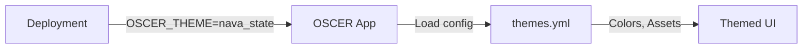
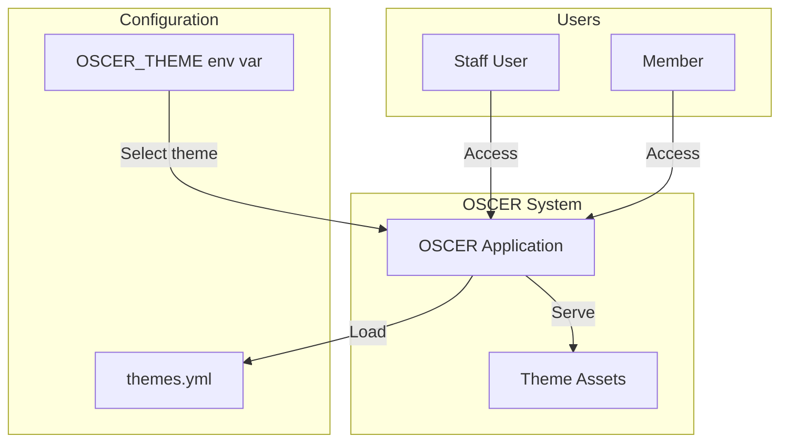
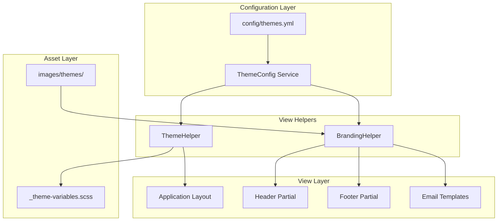

# State-Specific Theming

## Problem

OSCER is deployed to multiple state agencies, each requiring distinct visual branding (colors, logos, agency names, contact information). Currently, branding changes require code modifications and redeployment. States need their instance to reflect their agency identity while sharing a common codebase.

## Approach

1. **Configuration-Driven Themes** — Define themes in YAML config, select via environment variable at deployment time.
2. **CSS Custom Properties** — Use CSS variables for runtime theme switching, extending USWDS tokens for themeable values.
3. **Dynamic Asset Resolution** — Load logos, favicons, and imagery based on active theme without code changes.
4. **Theme-Aware Layouts** — Header, footer, and email templates pull content from theme configuration.



---

## C4 Context Diagram

> Level 1: System and external actors



### Deployment Model

| Deployment             | Environment Variable      | Theme Applied              |
| ---------------------- | ------------------------- | -------------------------- |
| Nava State Production  | `OSCER_THEME=nava_state`  | State of Nava PBC branding |
| Other State Production | `OSCER_THEME=other_state` | Other state branding       |
| Demo Environment       | `OSCER_THEME=default`     | OSCER default              |
| Local Development      | Not set (defaults)        | OSCER default              |

---

## C4 Component Diagram

> Level 3: Internal components within the Rails application



---

## Key Interfaces

### ThemeConfig Service

Loads and provides access to theme configuration:

```ruby
# app/services/theme_config.rb
class ThemeConfig
  def self.current
    @current ||= new(ENV.fetch("OSCER_THEME", "default"))
  end

  def name            # => "State of Nava PBC"
  def primary_color   # => "#2e8540"
  def secondary_color # => "#205030"
  def logo_path       # => "themes/nava_state/logo.svg"
  def favicon_path    # => "themes/nava_state/favicon.png"
  def agency_name     # => "State of Nava PBC - Department of Health Services"
  def contact_email   # => "support@state-a.gov"
end
```

### Theme Configuration Schema

```yaml
# config/themes.yml
default:
  name: "OSCER"
  agency_name: "OSCER Platform"
  primary_color: "#005ea2"
  secondary_color: "#1a4480"
  accent_color: "#e52207"
  background_color: "#f5f5f5"
  text_color: "#1a1a1a"
  logo: "oscer-logo.svg"
  favicon: "oscer-favicon.png"
  contact_email: "support@oscer.gov"
  footer_links:
    - label: "Privacy Policy"
      url: "/privacy"

nava_state:
  name: "State of Nava PBC"
  agency_name: "State of Nava PBC - Department of Health Services"
  primary_color: "#1a3d5c"
  secondary_color: "#2d5a7b"
  accent_color: "#f0c14b"
  background_color: "#f5f5f5"
  text_color: "#1a1a1a"
  logo: "nava-state-logo.svg"
  favicon: "nava-state-favicon.png"
  contact_email: "help@dhs.nava.gov"
  banner_text: "Official State of Nava PBC Government Website"
```

### ThemeHelper

Exposes theme values to views:

```ruby
# app/helpers/theme_helper.rb
module ThemeHelper
  def theme_config
    ThemeConfig.current
  end

  def theme_css_variables
    # Nava State example:
    # --theme-primary: #1a3d5c
    # --theme-secondary: #2d5a7b
    # --theme-accent: #f0c14b
    # --theme-background: #f5f5f5
    # --theme-text: #1a1a1a
    <<~CSS
      :root {
        --theme-primary: #{theme_config.primary_color};
        --theme-secondary: #{theme_config.secondary_color};
        --theme-accent: #{theme_config.accent_color};
        --theme-background: #{theme_config.background_color};
        --theme-text: #{theme_config.text_color};
      }
    CSS
  end
end
```

### BrandingHelper

Resolves theme-specific asset paths:

```ruby
# app/helpers/branding_helper.rb
module BrandingHelper
  def theme_logo_path
    "themes/#{ThemeConfig.current.theme_key}/#{ThemeConfig.current.logo}"
  end

  def theme_favicon_path
    "themes/#{ThemeConfig.current.theme_key}/#{ThemeConfig.current.favicon}"
  end
end
```

---

## Asset Structure

```
app/assets/
├── images/
│   └── themes/
│       ├── default/
│       │   ├── logo.svg
│       │   └── favicon.png
│       └── nava_state/
│           ├── logo.svg
│           └── favicon.png
└── stylesheets/
    ├── _uswds-theme.scss
    └── _theme-variables.scss    # CSS custom properties
```

---

## CSS Variable Integration

USWDS tokens extended with theme-aware CSS custom properties:

```scss
// _theme-variables.scss
:root {
  // Theme colors (set dynamically from config)
  --theme-primary: var(--uswds-primary, #005ea2);
  --theme-secondary: var(--uswds-secondary, #1a4480);
  --theme-accent: var(--uswds-accent, #e52207);
}

// Override USWDS components to use theme variables
.usa-button {
  background-color: var(--theme-primary);

  &:hover {
    background-color: var(--theme-secondary);
  }
}

.usa-header {
  background-color: var(--theme-primary);
}
```

---

## Decisions

### CSS Custom Properties over Build-Time Sass

Use CSS custom properties (variables) for themeable colors rather than generating separate Sass builds per theme. This allows theme values to be injected at runtime via inline styles or theme classes, eliminating the need for multiple CSS bundles. Tradeoff: some advanced USWDS Sass functions that require compile-time values won't be themeable (acceptable for color-focused theming).

### YAML Configuration over Database

Store theme definitions in `config/themes.yml` rather than a database table. Themes change infrequently and are tied to deployments, not runtime operations. YAML is version-controlled, auditable, and doesn't require database migrations. Tradeoff: adding a new theme requires a code deployment (acceptable given deployment cadence).

### Environment Variable Selection

Select active theme via `OSCER_THEME` environment variable rather than config files or database settings. This integrates naturally with container deployments and Terraform configuration, and clearly separates "which theme" from "theme definitions." Tradeoff: changing themes requires redeployment (intentional for production stability).

### Single Theme Per Deployment

Each OSCER deployment runs a single theme; no runtime switching for end users. Multi-tenant theming (different themes for different users in same deployment) is out of scope. This simplifies caching, asset serving, and testing. Tradeoff: demo environments that need multiple themes use query param override for previews only.

### Fallback to Default Theme

If `OSCER_THEME` is not set or references an unknown theme, fall back to the `default` theme rather than failing. This ensures local development works without configuration and provides graceful degradation. Log a warning when falling back so operators can detect misconfigurations.

### Asset Organization by Theme

Organize theme assets in subdirectories (`images/themes/{theme_key}/`) rather than prefixed filenames. This keeps theme boundaries clear, simplifies adding new themes, and allows themes to be packaged/extracted independently if needed. Tradeoff: slightly more complex asset helper logic.

---

## Constraints

- Single theme per deployment (no user-selectable themes)
- Theme assets must be present at build time (no runtime uploads)
- Color theming only; layout/component structure remains consistent
- USWDS components must remain accessible (no color-only information)
- Theme CSS must work within Cognito's 5KB limit for hosted UI theming
- Logos must be provided in SVG format for quality at all sizes

---

## Future Considerations

- **Theme asset CDN**: Serve theme assets from cloud storage for faster global delivery
- **Dark mode variants**: Add light/dark mode support per theme
- **Cognito theme sync**: Auto-generate Cognito hosted UI CSS from theme config
