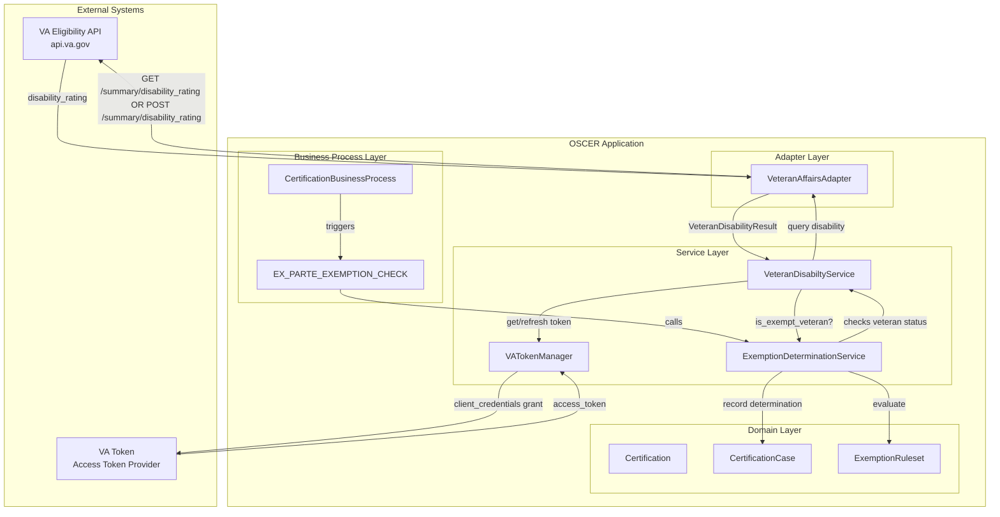
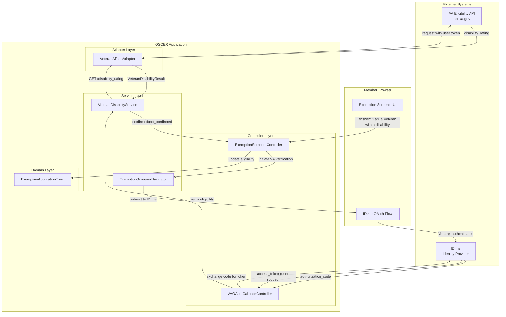

# VA Eligibility Integration (Veteran Service History & Eligibility API)

## Problem

Members who are Veterans with service-connected disabilities may qualify for exemptions from Medicaid work requirements. Integrating with the VA's Veteran Service History and Eligibility API would enable:

1. **Automated ex-parte exemption checks** — System automatically determines Veteran disability status during the `EX_PARTE_EXEMPTION_CHECK` step without member intervention
2. **User-initiated verification** — Members who self-identify as Veterans can have their status verified in real-time during the exemption screener flow

## Approach

Two integration patterns are required based on access level and use case:

| Use Case | OAuth Grant Type | User Interaction | Production Requirements |
|----------|------------------|------------------|------------------------|
| Automated ex-parte checks | Client Credentials Grant | None (machine-to-machine) | VA agreement required |
| Member-initiated verification | Authorization Code Grant | Veteran authenticates via ID.me | Standard production access |

### VA API Overview

The [Veteran Service History and Eligibility API](https://developer.va.gov/explore/api/veteran-service-history-and-eligibility/docs?version=current) provides:

- Disability rating information (percentage, service-connected status)

### Authentication Methods

| Method | Access Level | Approval Process |
|--------|--------------|------------------|
| Authorization Code (PKCE) | Veteran-authorized access to own data | Production demo required |
| Client Credentials | System-level access to Veteran data | VA agreement + production demo |

> **Note**: Client Credentials Grant access requires either VA employment or a specific VA agreement ([source](https://developer.va.gov/explore/api/community-care-eligibility/docs)). This is the primary blocker for implementing Option 1 (automated ex-parte checks).

## Unknowns

### Client Credentials Token Requirement for ICN

According to the [VA API documentation](https://developer.va.gov/explore/api/veteran-service-history-and-eligibility/client-credentials), the Client Credentials token endpoint for the Veteran Service History and Eligibility API requires a `launch` parameter containing a Base64 encoded Integrated Control Number (ICN).

It is currently unclear if we can successfully obtain an access token without an ICN (e.g., when we only have member demographic data). This poses a potential challenge for the automated ex-parte check flow, as we may need to retrieve the ICN using another method or endpoint before we can authenticate with the disability rating API.

## C4 Component Diagram

### Option 1: Client Credentials Grant (Automated Ex-Parte Checks)



### Option 2: Authorization Code Grant (User-Initiated Verification)



## Key Interfaces

### VA API Endpoints

| Endpoint | Method | Purpose | Auth Required |
|----------|--------|---------|---------------|
| `services/veteran_verification/v2/summary/disability_rating` | GET | Confirm disability rating | OAuth or with ICN |
| `services/veteran_verification/v2/summary/disability_rating` | POST | Confirm disability rating | Member Data Lookup |

### Request/Response Examples

**Disability Rating**
```json
// Response
{
  "data": {
    "id": "12303",
    "type": "disability-rating",
    "attributes": {
      "combined_disability_rating": 100,
      "combined_effective_date": "2018-03-27",
      "legal_effective_date": "2018-03-27",
      "individual_ratings": [
        {
          "decision": "Service Connected",
          "disability_rating_id": "1070379",
          "effective_date": "2018-03-27",
          "rating_end_date": "2022-08-27",
          "rating_percentage": 50,
          "static_ind": true
        }
      ]
    }
  }
}
```

### VeteranAffairsAdapter Service

| Method | Purpose |
|--------|---------|
| `get_disability_rating(access_token:)` | Get disability rating for authenticated Veteran |
| `get_disability_rating(ICN:)` | Get disability rating using VA ICN with server access token
| `post_disability_rating(attrs:)` POST disabilitity rating using member information (first, last, address...) with server access token

### VATokenManager Service (Client Credentials)

The `VATokenManager` service is responsible for obtaining and caching the OAuth 2.0 access token using the Client Credentials grant with `private_key_jwt` authentication.

#### Token Request Process

1. **Generate Client Assertion (JWT)**: Create a signed JWT to authenticate the application.
2. **Request Access Token**: POST the client assertion to the VA token endpoint.
3. **Cache Token**: Store the token until it expires to minimize redundant requests.

#### 1. JWT Generation (Client Assertion)

The JWT must be signed using the application's private key (RS256) and include the following claims:

| Claim | Value | Description |
|-------|-------|-------------|
| `iss` | `VA_CLIENT_ID_CCG` | The Client ID assigned by VA |
| `sub` | `VA_CLIENT_ID_CCG` | Same as `iss` for Client Credentials |
| `aud` | `VA_TOKEN_HOST` | The VA token endpoint URL |
| `jti` | Unique String | A unique identifier for this JWT (e.g., SecureRandom.uuid) |
| `exp` | Timestamp | Expiration time (typically 5 minutes from now) |
| `iat` | Timestamp | Issued at time |

#### 2. Token Request (POST)

The access token is retrieved by making a `POST` request to `VA_TOKEN_HOST` with `application/x-www-form-urlencoded` content:

| Parameter | Value | Description |
|-----------|-------|-------------|
| `grant_type` | `client_credentials` | Required OAuth grant type |
| `client_assertion_type` | `urn:ietf:params:oauth:client-assertion-type:jwt-bearer` | Indicates JWT authentication |
| `client_assertion` | `[SIGNED_JWT]` | The generated and signed JWT |
| `scope` | `veteran_verification.read` | The requested API scope |

#### Key Methods

| Method | Purpose |
|--------|---------|
| `get_access_token` | Returns valid token, refreshing if needed |
| `generate_client_assertion` | Internal: Creates and signs the JWT |
| `fetch_new_token` | Internal: Makes the POST request to VA |

### Integration with ExemptionDeterminationService

```ruby
# app/services/exemption_determination_service.rb (proposed changes)

def evaluate_exemption_eligibility(certification)
  ruleset = Rules::ExemptionRuleset.new
  engine = Strata::RulesEngine.new(ruleset)

  # Existing fact extraction
  evaluation_date = extract_evaluation_date(certification)
  date_of_birth = extract_date_of_birth(certification)
  pregnancy_status = extract_pregnancy_status(certification)
  race_ethnicity = extract_race_ethnicity(certification)
  
  # NEW: Check Veteran disability status via VA API
  veteran_disability_status = extract_veteran_disability_status(certification) # certification has member_data

  engine.set_facts(
    date_of_birth: date_of_birth,
    evaluated_on: evaluation_date,
    pregnancy_status: pregnancy_status,
    race_ethnicity: race_ethnicity,
    veteran_disability_exempt: veteran_disability_status  # NEW
  )

  engine.evaluate(:eligible_for_exemption)
end

private

def extract_veteran_disability_status(certification)
  return nil unless va_integration_enabled?

  # member data needed
  # ICN OR

  # First Name
  # Last Name
  # Date of Birth
  # Street Address
  # City
  # State
  # Country
  # Zipcode
  
  member = certification.member_data

  result = VeteranDisabilityService.check_disability_exemption(
    first_name: member.first_name,
    last_name: member.last_name,
    birth_date: member.date_of_birth,
    ...
  )
  
  result.exempt?
rescue StandardError => e
  Rails.logger.warn("VA API check failed: #{e.message}")
  nil  # Fail open - don't block certification on VA API issues
end
```

### Integration with ExemptionRuleset

```ruby
# app/models/rules/exemption_ruleset.rb (proposed changes)

def is_veteran_with_disability(veteran_disability_exempt)
  return if veteran_disability_exempt.nil?
  
  veteran_disability_exempt
end

def eligible_for_exemption(age_under_19, age_over_65, is_pregnant, 
                           is_american_indian_or_alaska_native,
                           is_veteran_with_disability)  # NEW
  facts = [age_under_19, age_over_65, is_pregnant, 
           is_american_indian_or_alaska_native, is_veteran_with_disability]
  return if facts.all?(&:nil?)

  facts.any?
end
```

### Integration with Exemption Screener (Option 2)

Add new exemption type for Veteran disability:

```ruby
# config/initializers/exemption_types.rb
{
  id: :veteran_disability,
  enabled: true,
  requires_va_verification: true  # NEW: triggers OAuth flow
}
```

```yaml
# config/locales/exemption_types.en.yml
# The following is an example, not pulled from any source of truth.
en:
  exemption_types:
    veteran_disability:
      title: "Veteran with Service-Connected Disability"
      description: "Veterans with a VA-rated service-connected disability"
      supporting_documents:
        - "VA disability rating letter"
        - "DD-214 discharge papers"
      question: "Are you a Veteran with a service-connected disability rated by the VA?"
      explanation: "If you served in the U.S. military and have a disability rating from the VA, you may qualify for an exemption. We can verify this automatically through the VA."
      yes_answer: "Yes, I am a Veteran with a VA disability rating"
      verification_prompt: "To verify your Veteran status, you'll be redirected to sign in with ID.me, which the VA uses for identity verification."
```

## Decisions

### Graceful Degradation on VA API Failures

**Decision**: Fail open when VA API is unavailable — treat as "unable to determine" rather than "not exempt"

**Rationale**:
- VA API availability SLA is 99.9% production, 99.0% sandbox ([source](https://developer.va.gov/production-access/working-with-va-apis))
- Rate limit of 60 requests/minute may cause temporary failures during batch processing
- Members should not be disadvantaged by external system issues
- Manual verification path remains available via exemption application form

**Tradeoff**: May result in some Veterans not receiving automatic exemption, requiring them to use the exemption screener or submit documentation.

### Restricted SSN-Based Search

**Decision**: Use non-SSN identification methods (such as ICN or member demographic data) for initial implementation.

**Rationale**:
- **Compliance**: The `disability_rating` API provides a restricted endpoint for SSN search, but it is only approved for organizations explicitly authorized by the VA.
- **Data Minimization**: Maintaining compliance and minimizing PII requirements by avoiding SSN usage where possible.

### Use of Summary Endpoint

**Decision**: Use the `/summary/disability_rating` endpoint rather than the regular `/disability_rating` endpoint. 

**Rationale**:
- **Data Minimization**: The summary endpoint returns the specific disability rating information required for eligibility determination while exposing less personal information than the full endpoint.
- **Purpose-Driven**: It provides exactly the data needed to confirm if a Veteran has a service-connected disability without retrieving extraneous health or service history details.
- **Privacy**: Aligns with best practices for handling Veteran data by only requesting the minimum necessary information.

## Production Access Requirements

### Demo Requirements

Per [VA production access documentation](https://developer.va.gov/production-access/prepare-for-and-complete-a-demo), the following must be demonstrated:

| Requirement | How We Address It |
|-------------|-------------------|
| Exemption Screener Flow | User Flow + Diagrams |
| Ex Parte Exemption Check | Data Flow + Diagrams |
| Proper error handling | Graceful degradation, user-friendly error messages |
| Rate limit handling | Exponential backoff, request queuing |
| Veteran data protection | PII handling per VA requirements, data minimization |

### Sandbox Testing

VA provides [test accounts](https://github.com/department-of-veterans-affairs/vets-api-clients/blob/master/test_accounts/confirmation_test_accounts.md) for sandbox development:

## Rate Limiting Considerations

| Header | Purpose |
|--------|---------|
| `ratelimit-limit` | Total requests allowed (60/min) |
| `ratelimit-remaining` | Requests remaining in window |
| `ratelimit-reset` | Seconds until limit resets |

### Implementation Strategy

```ruby
# app/adapters/veteran_affairs_adapter.rb

class VeteranAffairsAdapter
  RATE_LIMIT = 60  # requests per minute
  
  def with_rate_limiting(&block)
    response = yield
    
    remaining = response.headers['ratelimit-remaining'].to_i
    if remaining < 10
      Rails.logger.warn("VA API rate limit low: #{remaining} remaining")
    end
    
    response
  rescue Faraday::ClientError => e
    if e.response[:status] == 429
      reset_in = e.response.headers['ratelimit-reset'].to_i
      raise VARateLimitError.new("Rate limited. Reset in #{reset_in}s")
    end
    raise
  end
end
```

## Environment Configuration

### Required Environment Variables

| Variable | Purpose | Required For |
|----------|---------|--------------|
| `VA_API_HOST` | VA API base endpoint (sandbox/production) | Both options |
| `VA_CLIENT_ID_CCG` | OAuth client ID for Client Credentials | Option 1 only |
| `VA_PRIVATE_KEY` | Private key for JWT signing | Option 1 only |
| `VA_TOKEN_HOST` | OAuth token endpoint for Client Credentials | Option 1 only |
| `VA_AUTH_HOST` | OAuth authorization endpoint for Auth Code flow | Option 2 only |
| `VA_CLIENT_ID_AUTH_FLOW` | OAuth client ID for Auth Code flow | Option 2 only |
| `VA_CLIENT_SECRET` | OAuth client secret for Auth Code flow | Option 2 only |
| `VA_OAUTH_REDIRECT_URI` | Callback URL for Auth Code flow | Option 2 only |
| `VA_INTEGRATION_ENABLED` | Flag to enable/disable VA integration | Both options |

### Configuration Example

```ruby
# config/initializers/veteran_affairs.rb

Rails.application.config.veteran_affairs = {
  api_host: ENV.fetch('VA_API_HOST', 'https://sandbox-api.va.gov'),
  client_id_ccg: ENV.fetch('VA_CLIENT_ID_CCG'), # Client Credentials (Server-to-Server)
  private_key: ENV.fetch('VA_PRIVATE_KEY'), # Client Credentials (Server-to-Server)
  api_token_host: ENV.fetch('VA_TOKEN_HOST', 'https://deptva-eval.okta.com/oauth2/ausi3u00gw66b9Ojk2p7/v1/token'), # Client Credentials (Server-to-Server)
  auth_flow_auth_host: ENV.fetch('VA_AUTH_HOST', 'https://sandbox-api.va.gov/oauth2/veteran-verification/v1/authorization'), # Oauth Flow
  client_id_auth_flow: ENV.fetch('VA_CLIENT_ID_AUTH_FLOW'), # Oauth Flow
  client_secret: ENV['VA_CLIENT_SECRET'],  # Oauth Flow
  oauth_redirect_uri: ENV['VA_OAUTH_REDIRECT_URI'], # Oauth Flow
  enabled: ENV.fetch('VA_INTEGRATION_ENABLED', 'false') == 'true'
}
```

## Constraints

- **Rate limit**: 60 requests per minute per consumer
- **Client Credentials**: Requires VA agreement (not immediately available)
- **Authorization Code**: Requires member interaction with ID.me
- **PII handling**: Must comply with VA data protection requirements
- **Demo required**: Cannot go to production without completing VA demo
- **Sandbox limitations**: Test data only

## References

- [VA Developer Portal](https://developer.va.gov/)
- [Veteran Service History and Eligibility API](https://developer.va.gov/explore/api/veteran-service-history-and-eligibility/docs?version=current)
- [VA Production Access - Working with APIs](https://developer.va.gov/production-access/working-with-va-apis)
- [VA Production Access - Demo Requirements](https://developer.va.gov/production-access/prepare-for-and-complete-a-demo)
- [VA API Terms of Service](https://developer.va.gov/terms-of-service)
- [VA API Test Accounts (GitHub)](https://github.com/department-of-veterans-affairs/vets-api-clients)
