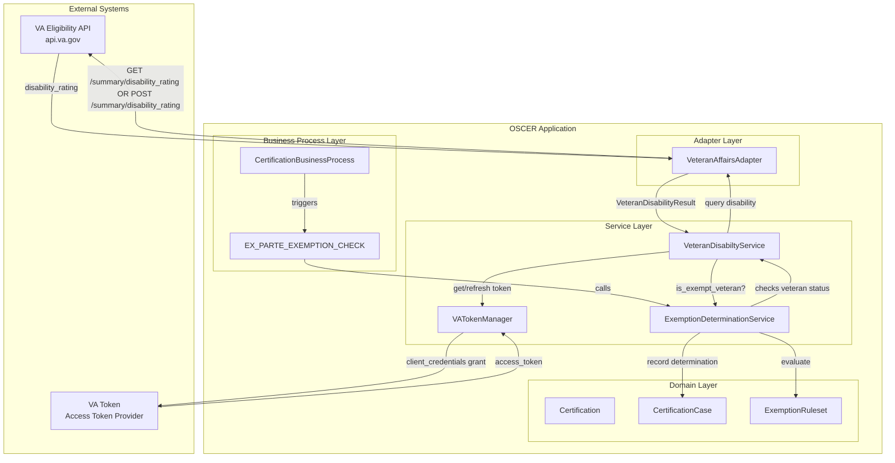
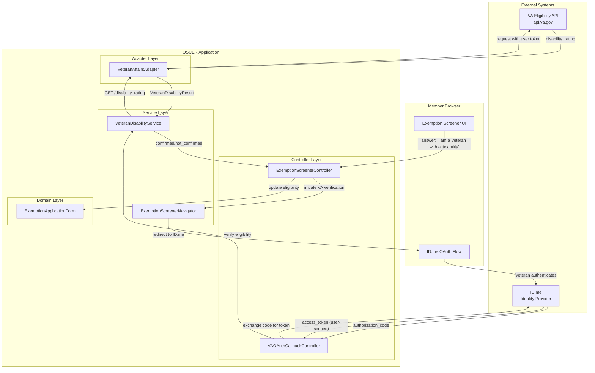
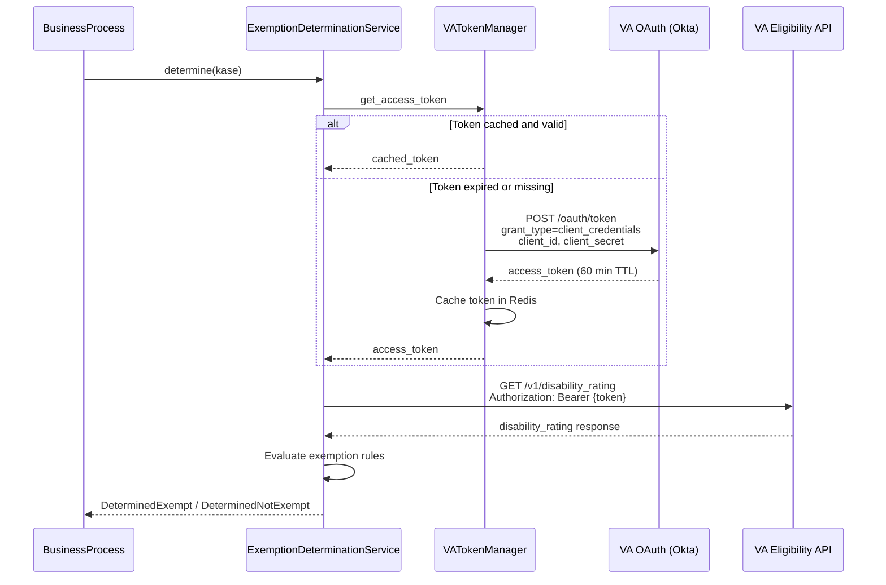
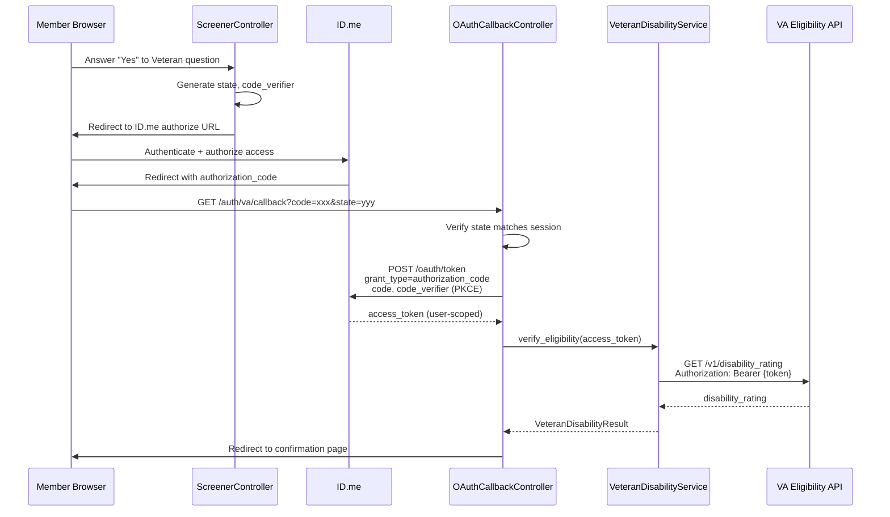

# VA Eligibility Integration (Veteran Service History & Eligibility API)

## Problem

Members who are Veterans with service-connected disabilities may qualify for exemptions from Medicaid work requirements. Integrating with the VA's Veteran Service History and Eligibility API would enable:

1. **Automated ex-parte exemption checks** — System automatically determines Veteran disability status during the `EX_PARTE_EXEMPTION_CHECK` step without member intervention
2. **User-initiated verification** — Members who self-identify as Veterans can have their status verified in real-time during the exemption screener flow

## Approach

Two integration patterns are required based on access level and use case:

| Use Case | OAuth Grant Type | User Interaction | Production Requirements |
|----------|------------------|------------------|------------------------|
| Automated ex-parte checks | Client Credentials Grant | None (machine-to-machine) | VA agreement required |
| Member-initiated verification | Authorization Code Grant | Veteran authenticates via ID.me | Standard production access |

### VA API Overview

The [Veteran Service History and Eligibility API](https://developer.va.gov/explore/api/veteran-service-history-and-eligibility/docs?version=current) provides:

- Service history records (active duty periods, branch, discharge status)
- Disability rating information (percentage, service-connected status)
- Eligibility determinations for VA benefits

**Important**: The API confirms whether a person qualifies as a [Title 38 Veteran](https://www.ecfr.gov/current/title-38) — someone who served in active military service and was discharged under conditions other than dishonorable.

### Authentication Methods

| Method | Access Level | Approval Process |
|--------|--------------|------------------|
| Authorization Code (PKCE) | Veteran-authorized access to own data | Production demo required |
| Client Credentials | System-level access to Veteran data | VA agreement + production demo |

> **Note**: Client Credentials Grant access requires either VA employment or a specific VA agreement ([source](https://developer.va.gov/explore/api/community-care-eligibility/docs)). This is the primary blocker for implementing Option 1 (automated ex-parte checks).

## C4 Component Diagram

### Option 1: Client Credentials Grant (Automated Ex-Parte Checks)



### Option 2: Authorization Code Grant (User-Initiated Verification)



## Key Interfaces

### VA API Endpoints

| Endpoint | Method | Purpose | Auth Required |
|----------|--------|---------|---------------|
| `/services/veteran_verification/v1/status` | POST | Confirm Veteran status | API Key or OAuth |
| `/services/veteran_verification/v1/service_history` | GET | Get service history | OAuth (user-scoped) |
| `/services/veteran_verification/v1/disability_rating` | GET | Get disability rating | OAuth (user-scoped) |

### Request/Response Examples

**Disability Rating (OAuth)**
```json
// GET /services/veteran_verification/v1/disability_rating
// Headers: Authorization: Bearer {access_token}

// Response
{
  "data": {
    "id": "...",
    "type": "disability_ratings",
    "attributes": {
      "combined_disability_rating": 70,
      "combined_effective_date": "2015-06-01",
      "individual_ratings": [
        {
          "decision": "Service Connected",
          "effective_date": "2015-06-01",
          "rating_percentage": 50
        }
      ]
    }
  }
}
```

### VeteranAffairsAdapter Service

| Method | Purpose |
|--------|---------|
| `get_disability_rating(access_token:)` | Get disability rating for authenticated Veteran |
| `get_disability_rating(ICN:)` | Get disability rating using VA ICN with server access token
| `post_disability_rating(attrs:)` POST disabilitity rating using member information (first, last, address...) with server access token

### VATokenManager Service (Client Credentials)

| Method | Purpose |
|--------|---------|
| `get_access_token` | Returns valid token, refreshing if needed |
| `refresh_token` | Forces token refresh |
| `token_valid?` | Checks if current token is still valid |

### Integration with ExemptionDeterminationService

```ruby
# app/services/exemption_determination_service.rb (proposed changes)

def evaluate_exemption_eligibility(certification)
  ruleset = Rules::ExemptionRuleset.new
  engine = Strata::RulesEngine.new(ruleset)

  # Existing fact extraction
  evaluation_date = extract_evaluation_date(certification)
  date_of_birth = extract_date_of_birth(certification)
  pregnancy_status = extract_pregnancy_status(certification)
  race_ethnicity = extract_race_ethnicity(certification)
  
  # NEW: Check Veteran disability status via VA API
  veteran_disability_status = extract_veteran_disability_status(certification) # certification has member_data

  engine.set_facts(
    date_of_birth: date_of_birth,
    evaluated_on: evaluation_date,
    pregnancy_status: pregnancy_status,
    race_ethnicity: race_ethnicity,
    veteran_disability_exempt: veteran_disability_status  # NEW
  )

  engine.evaluate(:eligible_for_exemption)
end

private

def extract_veteran_disability_status(certification)
  return nil unless va_integration_enabled?

  # member data needed
  # ICN OR

  # First Name
  # Last Name
  # Date of Birth
  # Street Address
  # City
  # State
  # Country
  # Zipcode
  
  member = certification.member_data

  result = VeteranDisabilityService.check_disability_exemption(
    first_name: member.first_name,
    last_name: member.last_name,
    birth_date: member.date_of_birth,
    ...
  )
  
  result.exempt?
rescue StandardError => e
  Rails.logger.warn("VA API check failed: #{e.message}")
  nil  # Fail open - don't block certification on VA API issues
end
```

### Integration with ExemptionRuleset

```ruby
# app/models/rules/exemption_ruleset.rb (proposed changes)

def is_veteran_with_disability(veteran_disability_exempt)
  return if veteran_disability_exempt.nil?
  
  veteran_disability_exempt
end

def eligible_for_exemption(age_under_19, age_over_65, is_pregnant, 
                           is_american_indian_or_alaska_native,
                           is_veteran_with_disability)  # NEW
  facts = [age_under_19, age_over_65, is_pregnant, 
           is_american_indian_or_alaska_native, is_veteran_with_disability]
  return if facts.all?(&:nil?)

  facts.any?
end
```

### Integration with Exemption Screener (Option 2)

Add new exemption type for Veteran disability:

```ruby
# config/initializers/exemption_types.rb
{
  id: :veteran_disability,
  enabled: true,
  requires_va_verification: true  # NEW: triggers OAuth flow
}
```

```yaml
# config/locales/exemption_types.en.yml
en:
  exemption_types:
    veteran_disability:
      title: "Veteran with Service-Connected Disability"
      description: "Veterans with a VA-rated service-connected disability"
      supporting_documents:
        - "VA disability rating letter"
        - "DD-214 discharge papers"
      question: "Are you a Veteran with a service-connected disability rated by the VA?"
      explanation: "If you served in the U.S. military and have a disability rating from the VA, you may qualify for an exemption. We can verify this automatically through the VA."
      yes_answer: "Yes, I am a Veteran with a VA disability rating"
      verification_prompt: "To verify your Veteran status, you'll be redirected to sign in with ID.me, which the VA uses for identity verification."
```

## Decisions

### Graceful Degradation on VA API Failures

**Decision**: Fail open when VA API is unavailable — treat as "unable to determine" rather than "not exempt"

**Rationale**:
- VA API availability SLA is 99.9% production, 99.0% sandbox ([source](https://developer.va.gov/production-access/working-with-va-apis))
- Rate limit of 60 requests/minute may cause temporary failures during batch processing
- Members should not be disadvantaged by external system issues
- Manual verification path remains available via exemption application form

**Tradeoff**: May result in some Veterans not receiving automatic exemption, requiring them to use the exemption screener or submit documentation.

### Client Credentials vs Authorization Code Priority

**Decision**: Implement Authorization Code Grant flow first, pursue Client Credentials Grant as enhancement

**Rationale**:
- Authorization Code Grant requires standard production access (achievable via demo)
- Client Credentials Grant requires VA agreement (longer procurement process)
- Authorization Code provides immediate value for member self-service
- Client Credentials can be added later for automated ex-parte checks

**Tradeoff**: Initial implementation requires member interaction; fully automated checks depend on VA agreement timeline.

### Token Caching Strategy

**Decision**: Cache OAuth tokens in Redis with TTL slightly less than token expiration

| Grant Type | Token TTL | Refresh Strategy |
|------------|-----------|------------------|
| Client Credentials | ~60 minutes | Refresh 5 minutes before expiry |
| Authorization Code | Session-scoped | Refresh on each request if needed |

**Rationale**: Minimizes API calls to VA OAuth provider; avoids expired token errors.

### VA API Response Caching

**Decision**: Cache Veteran eligibility results for 24 hours per member

**Rationale**:
- Disability ratings change infrequently
- Reduces load on VA API
- Certification periods are monthly; stale data risk is low

**Tradeoff**: If a Veteran's status changes, there may be up to 24-hour delay in reflecting new status.

## Authentication Flows

### Client Credentials Grant Flow (Option 1)



### Authorization Code Grant Flow (Option 2)



## Production Access Requirements

### Demo Requirements

Per [VA production access documentation](https://developer.va.gov/production-access/prepare-for-and-complete-a-demo), the following must be demonstrated:

| Requirement | How We Address It |
|-------------|-------------------|
| Exemption Screener Flow | User Flow + Diagrams |
| Ex Parte Exemption Check | Data Flow + Diagrams |
| Proper error handling | Graceful degradation, user-friendly error messages |
| Rate limit handling | Exponential backoff, request queuing |
| Veteran data protection | PII handling per VA requirements, data minimization |

### Sandbox Testing

VA provides [test accounts](https://github.com/department-of-veterans-affairs/vets-api-clients/blob/master/test_accounts/confirmation_test_accounts.md) for sandbox development:

## Rate Limiting Considerations

| Header | Purpose |
|--------|---------|
| `ratelimit-limit` | Total requests allowed (60/min) |
| `ratelimit-remaining` | Requests remaining in window |
| `ratelimit-reset` | Seconds until limit resets |

### Implementation Strategy

```ruby
# app/adapters/veteran_affairs_adapter.rb

class VeteranAffairsAdapter
  RATE_LIMIT = 60  # requests per minute
  
  def with_rate_limiting(&block)
    response = yield
    
    remaining = response.headers['ratelimit-remaining'].to_i
    if remaining < 10
      Rails.logger.warn("VA API rate limit low: #{remaining} remaining")
    end
    
    response
  rescue Faraday::ClientError => e
    if e.response[:status] == 429
      reset_in = e.response.headers['ratelimit-reset'].to_i
      raise VARateLimitError.new("Rate limited. Reset in #{reset_in}s")
    end
    raise
  end
end
```

## Environment Configuration

### Required Environment Variables

| Variable | Purpose | Required For |
|----------|---------|--------------|
| `VA_API_HOST` | API endpoint (sandbox/production) | Both options |
| `VA_CLIENT_ID` | OAuth client ID | Both options |
| `VA_CLIENT_SECRET` | OAuth client secret | Option 1 only |
| `VA_OAUTH_REDIRECT_URI` | Callback URL for auth code flow | Option 2 only |
| `VA_API_KEY` | API key for non-OAuth endpoints | Sandbox testing |

### Configuration Example

```ruby
# config/initializers/veteran_affairs.rb

Rails.application.config.veteran_affairs = {
  api_host: ENV.fetch('VA_API_HOST', 'https://sandbox-api.va.gov'),
  client_id: ENV.fetch('VA_CLIENT_ID'),
  client_secret: ENV['VA_CLIENT_SECRET'],  # Optional for Option 2
  oauth_redirect_uri: ENV['VA_OAUTH_REDIRECT_URI'],
  enabled: ENV.fetch('VA_INTEGRATION_ENABLED', 'false') == 'true'
}
```

## Constraints

- **Rate limit**: 60 requests per minute per consumer
- **Client Credentials**: Requires VA agreement (not immediately available)
- **Authorization Code**: Requires member interaction with ID.me
- **PII handling**: Must comply with VA data protection requirements
- **Demo required**: Cannot go to production without completing VA demo
- **Sandbox limitations**: Test data only

## References

- [VA Developer Portal](https://developer.va.gov/)
- [Veteran Service History and Eligibility API](https://developer.va.gov/explore/api/veteran-service-history-and-eligibility/docs?version=current)
- [VA Production Access - Working with APIs](https://developer.va.gov/production-access/working-with-va-apis)
- [VA Production Access - Demo Requirements](https://developer.va.gov/production-access/prepare-for-and-complete-a-demo)
- [VA API Terms of Service](https://developer.va.gov/terms-of-service)
- [VA API Test Accounts (GitHub)](https://github.com/department-of-veterans-affairs/vets-api-clients)
