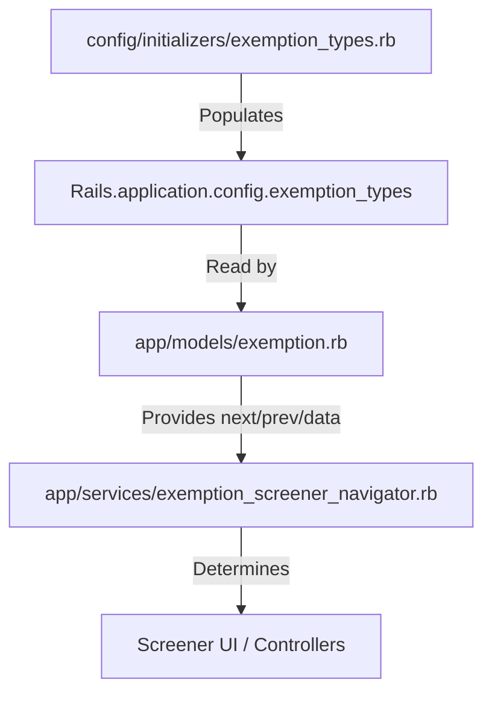

# Configuring the Exemption Screener

This guide explains how to configure and manage the exemption types that appear in the member exemption screener.

## Overview

The exemption screener is a dynamic multi-step form that helps members determine if they qualify for an exemption from work requirements. The system is driven by a configuration file, a domain model, and a navigation service.

| Component | Responsibility | Location |
|-----------|----------------|----------|
| **Configuration** | Source of truth for exemption data and questions | `config/initializers/exemption_types.rb` |
| **Domain Model** | Interface for accessing and filtering exemption data | `app/models/exemption.rb` |
| **Navigator** | Logic for moving between questions and determining outcomes | `app/services/exemption_screener_navigator.rb` |

---

## Step 1: Modifying Exemption Types

All exemption types are defined in `config/initializers/exemption_types.rb`. This file populates `Rails.application.config.exemption_types` at boot time.

### Configuration Fields

Each exemption entry in the array is a hash with the following fields:

- `id`: (Symbol) Unique identifier for the exemption type.
- `title`: (String) Display name used in the staff portal and summary pages.
- `description`: (String) Short explanation of the exemption.
- `supporting_documents`: (Array of Strings) List of documents a member might need to provide.
- `question`: (String) The actual question shown to the member in the screener.
- `explanation`: (String) Additional context/help text shown below the question.
- `yes_answer`: (String) The text for the "Yes" radio button option.
- `enabled`: (Boolean) Controls whether this type appears in the screener.

### Example Entry

```ruby
{
  id: :caregiver_child,
  title: "Parent or Caregiver of Dependent Age 13 or Younger",
  description: "Parent or legal guardian of a young child (≤13), living in the same household.",
  supporting_documents: [
    "Relationship and co-residence verified via Medicaid/SNAP case",
    "Child's birth certificate or custody paperwork"
  ],
  question: "Are you currently a caregiver for a child 13 years of age or under?",
  explanation: "You may be eligible for an exemption if you are a parent, guardian...",
  yes_answer: "I am a caregiver for a child under 13.",
  enabled: true
}
```

### Adding a New Exemption
1. Add a new hash to the array in `exemption_types.rb`.
2. Ensure the `id` is unique.
3. Set `enabled: true`.
4. **Note:** The order in the array determines the order in which questions are asked in the screener.

---

## Step 2: How the `Exemption` Model Works

The `Exemption` model (`app/models/exemption.rb`) provides a clean API for the rest of the application to interact with the configuration.

Key methods include:
- `Exemption.all`: Returns all configured types.
- `Exemption.enabled`: Returns only types where `enabled: true`.
- `Exemption.next_type(current_id)`: Finds the next enabled exemption in the list.
- `Exemption.previous_type(current_id)`: Finds the previous enabled exemption.
- `Exemption.question_data_for(id)`: Fetches the question, explanation, and yes_answer for a specific type.

This abstraction ensures that if we ever move the configuration to a database, the navigation logic won't need to change.

---

## Step 3: Navigation Logic

The `ExemptionScreenerNavigator` (`app/services/exemption_screener_navigator.rb`) uses the `Exemption` model to drive the member's experience.

### How it handles answers:

When a member answers a question in the screener:

1. **If the answer is "Yes"**: 
   - The navigator returns a `:may_qualify` action.
   - The member is directed to a page explaining they might qualify for that specific exemption.
2. **If the answer is "No"**:
   - The navigator calls `Exemption.next_type(current_type)`.
   - If a next type exists, it returns a `:question` action with the new location.
   - If no more types exist, it returns a `:complete` action (meaning the member likely doesn't qualify for any exemptions).

### Direct Dependency Chain



## Best Practices

1. **Keep IDs Consistent**: Changing an `id` in the config might break existing records in the database if they refer to that ID (e.g., if exemptions are saved with that type).
2. **Ordering Matters**: Place the most common or "easiest to verify" exemptions at the top of the list in `exemption_types.rb`. This affects the order of questions presented in the navigator.
3. **Disabling**: If you need to temporarily/permanently remove an exemption from the screener, set `enabled: false` rather than deleting it. This preserves the metadata for existing database records.
4. **I18n**: The `Exemption` model checks for translations in `config/locales/` using the key `exemption_types.{id}.{field}`. If a translation exists, it overrides the default text in the initializer.


## Future Considerations
1. In the future, `exemption_types.rb` will support additional exemption types that are not shown in the exemption screener UI. New exemption categories will be created to display these types, along with corresponding text for automated exemptions.
